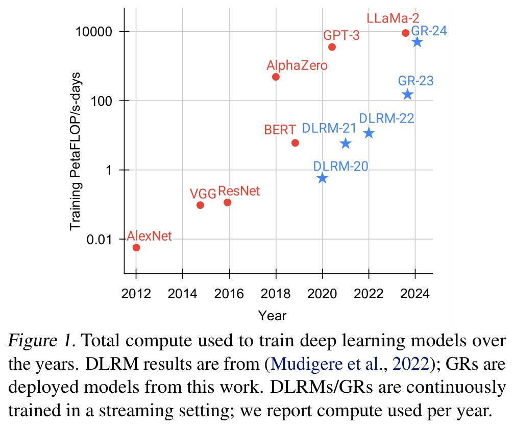
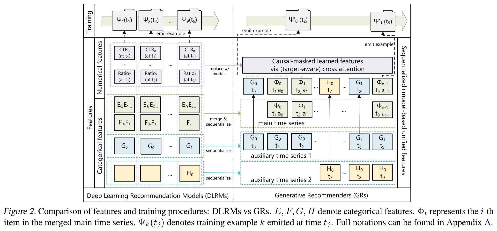
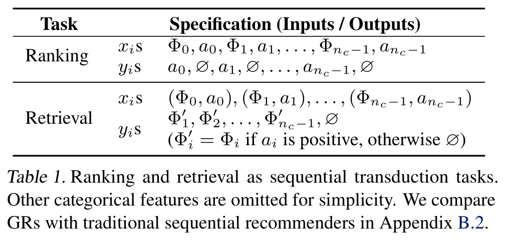
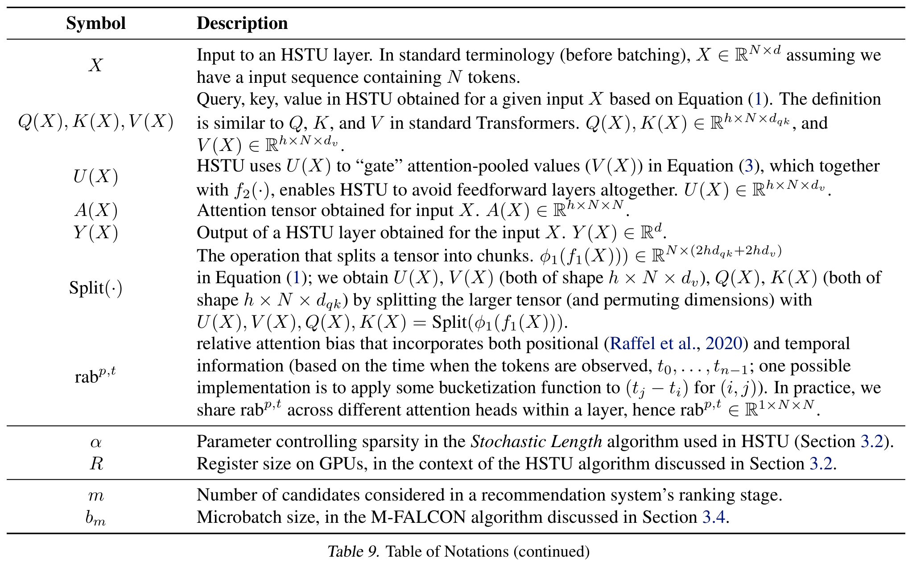
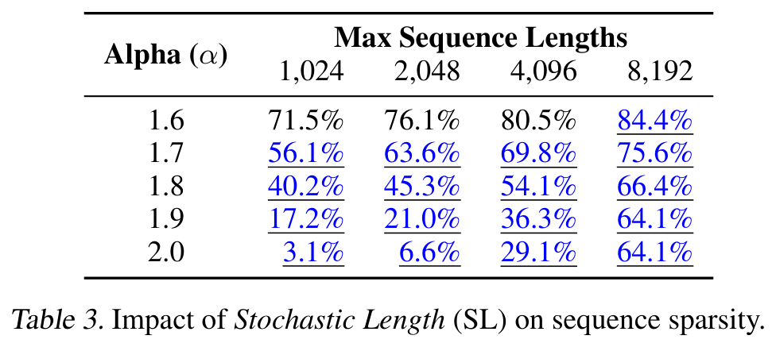
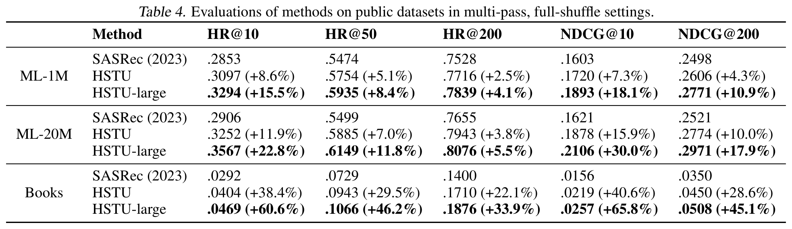
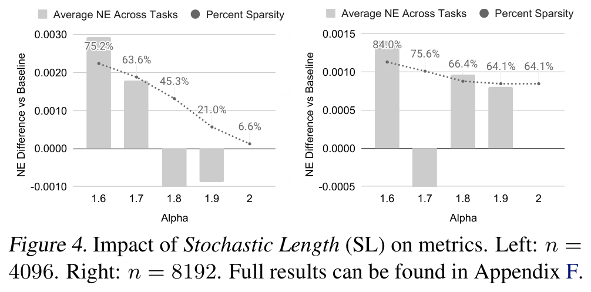
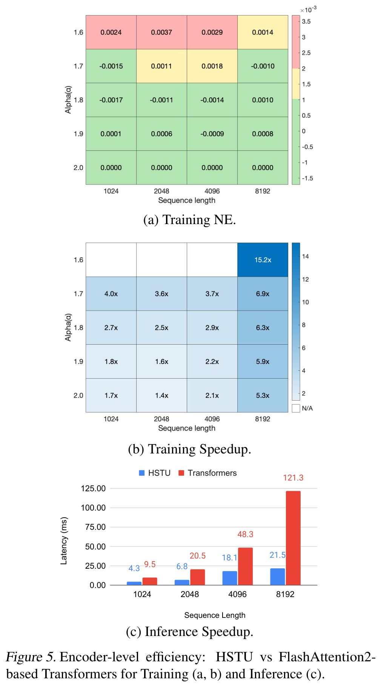
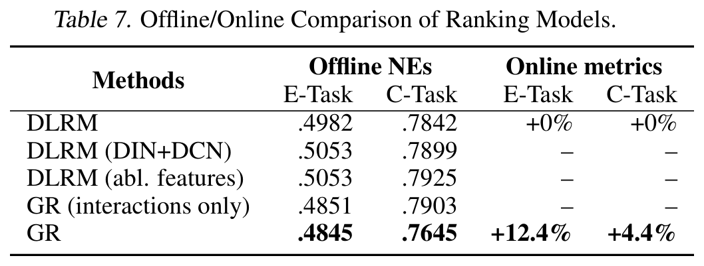

大型推荐系统的特点是依赖高基数、异构特征，并需要处理每天数百亿级别的用户行为。尽管工业界的大多数深度学习推荐模型（DLRMs）在包含数千个特征的海量数据上进行训练，但它们在计算扩展性方面表现不佳。受Transformers在语言和视觉领域取得成功的启发，该论文重新审视了推荐系统中的基本设计选择。作者将推荐问题重新表述为生成建模框架内的序列转换任务（“生成式推荐模型”），并提出了一种新的架构HSTU，专为高基数、非平稳流式推荐数据设计。HSTU在合成数据集和公开数据集上的表现优于基线模型，NDCG最高提升达65.8%，在8192长度序列上的推理速度比基于FlashAttention2的Transformers快5.3倍至15.2倍。基于HSTU的生成式推荐模型，参数量达1.5万亿，在线上A/B测试中指标提升12.4%，并已在拥有数十亿用户的大型互联网平台的多个场景中部署。更重要的是，生成式推荐模型的模型质量在训练计算量跨越三个数量级、直至GPT-3/LLaMa-2规模的范围内，均表现出幂律增长的可扩展性，这降低了未来模型开发所需的碳足迹，并为进一步构建推荐领域的首个基础模型铺平了道路。

# 1 引言

推荐系统在在线内容平台和电子商务领域至关重要，每天为数十亿用户个性化体验发挥着关键作用。近十年来，推荐领域的前沿方法主要基于深度学习推荐模型（DLRM）。DLRM的特点在于使用异构特征，例如数值特征——计数和比率、嵌入向量，以及类别特征如创作者ID、用户ID等。由于每分钟都在不断添加新内容和新产品，特征空间具有极高的基数，通常达到数十亿量级。为了利用成千上万的此类特征，DLRM采用多种神经网络来组合特征、转换中间表示，并生成最终输出。

尽管广泛采用了大量人工设计的特征集并在海量数据上进行训练，大多数工业级DLRM在计算资源上的扩展性仍然较差。这一局限性显著且尚未得到解答。受Transformer在语言和视觉领域成功应用的启发，该论文重新审视了现代推荐系统中的基本设计选择。研究发现，在十亿用户规模下，替代性建模方法需要克服三个挑战。首先，推荐系统中的特征缺乏显式的结构。尽管在小规模设置中已探索过序列化建模方法（详见**附录B**），

异构特征（包括高基数ID、交叉特征、计数、比率等）在工业级DLRM中仍起着关键作用。其次，推荐系统使用的是持续变化的十亿量级词表。与语言模型中约10万量级的静态词表相比，十亿规模的动态词表带来了训练上的挑战，并且由于需要以目标感知的方式考虑数万个候选对象，导致推理成本较高。最后，计算成本是实现大规模序列模型的主要瓶颈。GPT-3利用数千块GPU，耗时1至2个月训练了总计3000亿个token。这一规模看似巨大，但若与用户行为数据的规模相比则相形见绌。最大的互联网平台拥有数十亿日活跃用户，每天产生对数十亿帖子、图像和视频的交互行为。用户行为序列长度可达 $`10^5`$ 量级。因此，推荐系统每天需要处理的token数量比语言模型在1至2个月内处理的数量高出几个数量级。

在本研究中，作者将用户行为视为生成建模中的一种新模态。核心洞察包括：a）在适当的新特征空间下，工业级推荐系统中的核心排序与检索任务可被建模为生成式建模问题；b）该范式使得能够系统性地利用特征、训练和推理中的冗余性以提升效率。得益于这种新框架，所部署的模型在计算复杂度上比先前最先进的方法高出三个数量级，同时在核心指标上提升了12.4%，如**图1**所示。

 

该论文的贡献如下。首先，在**第2节**中提出了生成式推荐器（GRs），这是一种替代DLRM的新范式。通过将DLRM中的异构特征空间序列化并统一，随着序列长度趋于无穷，该方法可逼近完整的DLRM特征空间。这使得能够将推荐系统中的主要问题——排序与检索——重新构建成纯粹的序列转导任务。更重要的是，这也使得模型训练可以采用序列化、生成式的方式进行，从而在相同计算资源下训练数量级更大的数据。

接下来，该论文解决了训练和推理过程中的计算成本挑战。提出了一种新的序列转导架构——分层序列转导单元（Hierarchical Sequential Transduction Units, HSTU）。HSTU 修改了注意力机制以适应大规模、非平稳的词汇表，并利用推荐数据集的特点，在长度为8192的序列上相较于基于 FlashAttention2 的 Transformer 实现了 5.3倍到15.2倍的速度提升。此外，通过一种新的算法 M-FALCON（见 **第3.4节**），该论文通过微批处理（micro-batching）完全摊销了计算成本，能够在与传统 DLRM 相同的推理预算下服务高达 285 倍更复杂的 GR 模型，同时实现 1.50倍至2.99倍的加速。最后，所提出的各项技术在合成数据集、公开数据集以及一个拥有数十亿日活用户的大型互联网平台的多个业务场景中的部署上均得到了验证（见 **第4节**）。据作者所知，这是首次在大规模工业场景中表明，纯基于序列转导的架构（如 HSTU）在生成式推荐（GRs）任务中能够显著超越 DLRM。

值得注意的是，该论文不仅克服了传统 DLRM 中已知的扩展瓶颈，还进一步证明了缩放定律（scaling law）同样适用于推荐系统，这标志着推荐系统可能迎来类比 ChatGPT 的历史性突破时刻。

# 2 将推荐建模为序列转导任务：从 DLRM 到 GRs
## 2.1 统一 DLRM 中的异构特征空间

现代 DLRM 模型通常使用大量类别型（“稀疏”）和数值型（“密集”）特征进行训练。在 GRs 中，作者将这些特征整合并编码为单一的统一时间序列，如图2所示。

类别型（“稀疏”）特征。这类特征的示例包括用户点赞过的 item、用户关注的创作者（例如户外领域）、用户使用的语言、用户加入的社区、请求发起的城市等。作者对这些特征进行序列化的方式如下：首先选择最长的时间序列，通常是通过合并代表用户交互过的 item 的特征来构建主时间序列。其余特征通常是随时间缓慢变化的时间序列，例如人口统计信息或已关注的创作者。

作者通过对每个连续段保留最早的一条记录来压缩这些时间序列，然后将结果合并到主时间序列中。鉴于这些时间序列变化非常缓慢，该方法不会显著增加整体序列长度。

数值型（“密集”）特征。这类特征的示例包括加权衰减计数器、比率等。例如，一个特征可以表示用户在过去对某个主题匹配的 item 的点击率（CTR）。与类别型特征相比，这些特征变化频率高得多，可能在每次（用户，item）交互后都会更新。因此，从计算和存储的角度来看，完全将这类特征序列化是不可行的。然而，一个重要观察是：用于执行这些聚合操作的类别型特征（例如 item 的主题、位置）在 GRs 中已经被序列化并编码。因此，只要序列转导架构足够表达能力强，并结合目标感知的建模方式，随着 GRs 中整体序列长度和计算量的增加，数值型特征的信息可以被有效捕获，从而在 GRs 中省略显式的数值型特征。

## 2.2 将排序与检索重构为序列转导任务

给定一个按时间顺序排列的 $`n`$ 个 token 的序列 $`x_0, x_1, \ldots, x_{n-1}`$ （其中 $`x_i \in \mathbb{X}`$ ），这些 token 被观察到的时间为 $`t_0, t_1, \ldots, t_{n-1}`$ ，序列转导任务将该输入序列映射为输出 token 序列 $`y_0, y_1, \ldots, y_{n-1}`$ （其中 $`y_i \in \mathbb{X} \cup \{ \varnothing \}`$ ）， $`y_i = \varnothing`$ 表示 $`y_i`$ 未定义。该论文使用 $`\Phi_i \in \mathbb{X}_c`$ （ $`\mathbb{X}_c \subseteq \mathbb{X}`$ ）表示系统向用户提供的内容（例如图像或视频）。由于新内容不断产生， $`\mathbb{X}_c`$ 和 $`\mathbb{X}`$ 是非平稳的。用户可以对 $`\Phi_i`$ 做出某些行为响应 $`a_i`$ （例如点赞、跳过、视频播放完成+分享），其中 $`a_i \in \mathbb{X}`$ 。作者将用户交互过的内容总数记为 $`n_c`$ 。

在因果自回归设定下，标准的排序与检索任务可被定义为序列转导任务（见表1）。该论文作出如下观察：

检索。在推荐系统检索阶段，目标是学习一个条件分布 $`p(\Phi_{i+1}|u_i)`$ ，其中 $`\Phi_{i+1} \in \mathbb{X}_c`$ ， $`u_i`$ 表示用户在 token $`i`$ 处的表征。典型的优化目标是选择 $`arg\,max_{\Phi \in \mathbb{X}_c} p(\Phi|u_i)`$ 以最大化某种奖励。该设定与标准自回归模型有两个不同之处：第一， $`x_i`$ 对应的监督信号 $`y_i`$ 不一定是 $`\Phi_{i+1}`$ ，因为用户可能对 $`\Phi_{i+1}`$ 做出负面反馈；第二，当 $`x_{i+1}`$ 表示与用户交互无关的类别特征（如人口统计学特征）时， $`y_i`$ 为未定义。

排序。在生成式推荐系统（GRs）中，排序任务面临独特挑战，工业级推荐系统通常需要“目标感知（target-aware）”的建模方式。在此类设定中，目标项 $`\Phi_{i+1}`$ 与历史特征之间的“交互”需尽可能早地发生，而标准自回归架构中这种“交互”发生较晚（例如通过编码器输出后的 softmax 实现），因此难以满足需求。为解决该问题，作者在表1中采用将 item 与 action 交错排列的方式，从而将排序任务建模为 $`p(a_{i+1} | \Phi_0, a_0, \Phi_1, a_1, \ldots, \Phi_{i+1})`$ （在类别特征之前）。实际中，应用一个小的神经网络将 $`\Phi_{i+1}`$ 处的输出转化为多任务预测结果。重要的是，这种设计使得可以对全部 $`n_c`$ 次交互应用目标感知的交叉注意力机制，在一次前向过程中完成计算。

## 2.3 生成式训练

工业级推荐系统通常在流式设置下进行训练，即每个样本在可用时按顺序依次处理。在此设置下，基于自注意力机制的序列转换架构（如 Transformer）的总计算需求按 $`\sum_i n_i(n_i^2 d + n_i d_{ff} d)`$ 进行扩展，其中 $`n_i`$ 表示用户 $`i`$ 的 token 数量， $`d`$ 是嵌入维度。

括号中的第一部分来源于自注意力机制，由于大多数次二次算法在实际运行时间中存在质量权衡且性能低于二次算法，因此假设其具有 $`O(n^2)`$ 的缩放因子。第二部分来源于逐点 MLP 层，其隐藏层大小为 $`O(d_{ff})=O(d)`$ 。令 $`N = \max_i n_i`$ ，整体时间复杂度简化为 $`O(N^3d + N^2 d^2)`$ ，这在推荐场景中是计算成本过高的。

为应对在长序列上可扩展地训练序列转换模型的挑战，该论文从传统的曝光级别训练转向 生成式训练，在图 **figure 2** 顶部所示，通过此方法将计算复杂度降低了 $`O(N)`$ 因子。具体而言，当以速率 $`s_u(n_i)`$ 对第 $`i`$ 个用户进行采样时，总训练成本现在按 $`\sum_i s_u(n_i) n_i (n_i^2d + n_i d^2)`$ 缩放，通过将 $`s_u(n_i)`$ 设为 $`1/n_i`$ ，可将其降低至 $`O(N^2d + N d^2)`$ 。在工业级系统中实现这种采样的方法之一是在用户的请求或会话结束时生成训练样本，从而得到 $`\hat{s_u}(n_i) \propto 1/n_i`$ 。

# 3 用于生成式推荐的高性能自注意力编码器

为了将生成式推荐（GRs）扩展到具有大规模、非平稳词表的工业级推荐系统，该论文接下来提出一种新的编码器设计——分层序列转换单元（HSTU）。

HSTU 由多个相同的层堆叠而成，各层之间通过残差连接相连。

每一层包含三个子层：逐点投影（公式 **equation 1**）、空间聚合（公式 **equation 2**）和逐点变换（公式 **equation 3**）：

$$
\small U(X), V(X), Q(X), K(X) = \text{Split}(\phi_1(f_1(X)))
$$

$$
\small A(X)V(X) = \phi_2\left(Q(X)K(X)^T + \text{rab}^{p,t}\right)V(X)
$$

$$
\small Y(X) = f_2\left(\text{Norm}\left(A(X)V(X)\right) \odot U(X)\right)
$$

其中 $`f_i(X)`$ 表示一个多层感知机（MLP）；作者使用单个线性层 $`f_i(X) = W_i(X) + b_i`$ 来分别实现 $`f_1`$ 和 $`f_2`$ ，以降低计算复杂度，并进一步对查询 $`Q(X)`$ 、键 $`K(X)`$ 、值 $`V(X)`$ 和门控权重 $`U(X)`$ 使用融合核进行批量计算； $`\phi_1`$ 和 $`\phi_2`$ 表示非线性激活函数，文中均使用 $`\text{SiLU}`$ ； $`\text{Norm}`$ 为层归一化（layer norm）； $`\text{rab}^{p,t}`$ 表示相对注意力偏置，用于融合位置（ $`p`$ ）和时间（ $`t`$ ）信息。所有符号说明详见 **表9**。

HSTU 编码器设计允许使用一个模块化块替代 DLRM 中的异构模块。作者观察到，DLRM 实际上包含三个主要阶段：特征提取、特征交互和表示变换。特征提取阶段用于获取类别特征的池化嵌入表示。其最先进的形式可泛化为成对注意力和目标感知池化，这些均可通过 HSTU 层建模。

特征交互是 DLRM 中最关键的组成部分。常用方法包括因子分解机及其神经网络变体、高阶特征交互等。HSTU 通过 $`\text{Norm}\left(A(X)V(X)\right) \odot U(X)`$ 机制，使得经注意力池化的特征能够直接与其他特征“交互”，从而替代传统的特征交互模块。该设计动机源于使用 MLP 学习逼近点积的困难性。由于 SiLU 被应用于 $`U(X)`$ ，因此 $`\text{Norm}\left(A(X)V(X)\right) \odot U(X)`$ 也可被视为 SwiGLU 的一种变体。

表示变换通常通过专家混合（MoE）和路由机制实现，以处理多样且异构的用户群体。其核心思想是通过对不同用户分配专用的子网络来实现条件计算。HSTU 中的逐元素点积在本质上可近似实现 MoE 中使用的门控操作（仅差一个归一化因子）。

## 3.1 点对点聚合注意力

HSTU 采用了一种新的点对点聚合（{归一化}）注意力机制（相比之下，softmax 注意力在整个序列上计算归一化因子）。该设计基于两个动机。首先，与目标相关的先前数据点的数量作为一个强特征，能够反映用户偏好的强度，而这一信息在经过 softmax 归一化后难以保留。这一点至关重要，因为该论文需要同时预测交互的强度（例如，在某个 item 上花费的时间）以及 items 的相对排序（例如，预测一种排序以最大化 AUC）。其次，尽管 softmax 激活机制在构造上对噪声具有鲁棒性，但在处理流式场景中非平稳词汇表（non-stationary vocabularies）时表现不佳。

所提出的点对点聚合注意力机制如 **方程 2** 所示。

值得注意的是，在点对点池化后需要使用层归一化（layer norm）以稳定训练过程。

理解该设计的一种方式是通过遵循狄利克雷过程（Dirichlet Process）生成的合成数据，该数据模拟了在非平稳词汇表上的流式数据（详见附录 **appendix C**）。在此设定下，softmax 与点对点注意力机制之间的性能差距最大可达 44.7%，如 **表 2** 所示。

## 3.2 利用并算法性地增加稀疏性

在推荐系统中，用户历史序列的长度通常遵循偏态分布，导致输入序列稀疏，特别是在序列非常长的场景下。这种稀疏性可以被加以利用，以显著提高编码器的效率。为此，作者开发了一种适用于 GPU 的高效注意力内核，该内核以类似方式融合了连续的 GEMM 运算，但执行的是完全锯齿状（ragged）的注意力计算。这本质上将注意力计算转化为多种尺寸的分组 GEMM 运算（**附录 G**）。因此，HSTU 中的自注意力变为内存受限操作，其内存访问量的复杂度为 $`\Theta(\sum_i n_i^2 d_{qk}^2 R^{-1})`$ ，其中 $`n_i`$ 表示第 $`i`$ 个样本的序列长度， $`d_{qk}`$ 为注意力维度， $`R`$ 为寄存器大小。仅此方法本身即可带来 2–5 倍的吞吐量提升，如 **第 4.2 节** 所述。

作者进一步通过**随机长度（Stochastic Length, SL）**在算法上增加用户历史序列的稀疏性。推荐系统中用户历史序列的一个关键特征是用户行为具有时间上的重复性，即用户行为在其交互历史中以多种时间尺度反复出现。这提供了在不损害模型质量的前提下人工增加稀疏性的机会，从而显著降低与 $`\Theta(\sum_i n_i^2)`$ 成比例的编码器开销。可以将用户 $`j`$ 的历史表示为序列 $`(x_i)_{i=0}^{n_{c, j}}`$ ，其中 $`n_{c,j}`$ 是用户交互过的内容数量。令 $`N_c = \max_j {n_{c,j}}`$ 。令 $`(x_{i_k})_{k=0}^{L}`$ 是从原始序列 $`(x_i)_{i=0}^{n_{c,j}}`$ 构造出的长度为 $`L`$ 的子序列。SL 按如下方式选择输入序列：

$$
\small \begin{split} {(x_i)_{i=0}^{n_{c,j}}} & \text{ if } n_{c,j} \leq N_c^{\alpha/2} \\ {(x_{i_k})_{k=0}^{N_c^{\alpha/2}}} & \text{ if } n_{c,j} > N_c^{\alpha/2}, \text{w/ probability } 1 - N_c^\alpha / n_{c,j}^2 \\ {(x_i)_{i=0}^{n_{c,j}}} & \text{ if } n_{c,j} > N_c^{\alpha/2}, \text{w/ probability } N_c^\alpha / n_{c,j}^2 \end{split}
$$

这将注意力相关的复杂度降低至 $`O(N_c^\alpha d)=O(N^\alpha d)`$ ，其中 $`\alpha \in (1, 2]`$ 。关于子序列选择的更详细讨论见 **附录 F.1**。作者指出，将 SL 应用于训练可实现成本效益高的系统设计，因为训练通常比推理涉及高得多的计算成本。

**表3** 展示了在一种具有代表性的工业级配置（30 天用户历史）下，不同序列长度和 $`\alpha`$ 值的稀疏性（见 **附录 F**）。模型质量无明显退化的设置以下划线和蓝色高亮标出。标为“ $`\alpha=2.0`$ ”的行表示未应用 SL 的基础稀疏性情况。较低的 $`\alpha`$ 值适用于最长至 8,192 的长序列。

## 3.3 最小化激活内存使用

在推荐系统中，使用较大的批次大小对于训练吞吐量和模型质量都至关重要。因此，激活内存使用成为主要的扩展瓶颈，这与大语言模型形成对比，后者通常以较小的批次大小进行训练，且以内存占用为主的主要是参数内存。

与 Transformer 相比，HSTU 采用了一种简化且完全融合的设计，显著降低了激活内存使用。首先，HSTU 将注意力模块之外的线性层数量从六个减少到两个，这一设计与近期使用逐元素门控机制来减少 MLP 计算的工作一致。其次，HSTU 积极地将多个计算融合为单个算子，包括 **公式 1** 中的 $`\phi_1(f_1(\cdot))`$ ，以及 **公式 3** 中的层归一化（layer norm）、可选的 dropout 和输出 MLP。

这种简化设计将每层的激活内存使用减少至 bfloat16 下的 $`2 d + 2 d + 4hd_{qk} + 4hd_v + 2hd_v = 14d`$ 。

相比之下，Transformer 在注意力之后使用前馈层和 dropout（中间状态为 $`3 hd_v`$ ），随后是一个逐点前馈模块，包含层归一化、线性变换、激活函数、线性变换和 dropout，中间状态为 $`2d + 4d_{ff} + 2d + 1d = 4d + 4d_{ff}`$ 。此处采用标准假设： $`hd_v \geq d`$ 且 $`d_{ff} = 4 d`$ 。因此，在考虑输入和输入层归一化（ $`4d`$ ）以及 qkv 投影后，总的激活状态为 $`33 d`$ 。HSTU 的设计因此使得网络能够扩展到超过 2 倍的深度。

此外，大规模原子 id 用于表示词汇表时也带来显著的内存开销。当词汇量为 100 亿、嵌入维度为 512d、并使用 Adam 优化器时，仅以 fp32 存储嵌入和优化器状态就需要 60TB 的内存。为缓解内存压力，该论文采用行级 AdamW 优化器，并将优化器状态放置在 DRAM 上，从而将每个浮点数的 HBM 使用量从 12 字节减少到 2 字节。

## 3.4 通过成本摊销扩展推理规模

该论文解决的最后一个挑战是推荐系统在服务阶段需要处理大量候选项目。作者聚焦于排序阶段，因为在检索阶段，编码器成本完全可以摊销，且已有高效的算法可用于 MIPS 场景（利用量化、哈希或分区）以及非 MIPS 情况（通过束搜索或层次化检索）。对于排序阶段，候选项目数量可达数万个。

作者提出一种名为 M-FALCON（Microbatched-Fast Attention Leveraging Cacheable OperatioNs）的算法，用于对 $`m`$ 个候选项目执行推理，输入序列长度为 $`n`$ 。

在一次前向传播中，M-FALCON 通过修改注意力掩码和 $`\text{rab}^{p,t}`$ 偏置，使 $`b_m`$ 个候选项目的注意力操作完全相同，从而并行处理 $`b_m`$ 个候选项目。这将交叉注意力的计算代价从 $`O(b_m n^2d)`$ 降低至 $`O((n + b_m)^2d) = O(n^2d)`$ ，当 $`b_m`$ 相对于 $`n`$ 可视为较小常数时尤其有效。该算法可选地将总的 $`m`$ 个候选项目划分为 $`\lceil m / b_m\rceil`$ 个大小为 $`b_m`$ 的微批次，以利用编码器级别的 KV 缓存——既可在多次前向传播间减少计算成本，也可在跨请求间最小化尾延迟（更多细节见 **附录 H**）。

总体而言，M-FALCON 使得模型复杂度不再像传统 DLRM 排名阶段那样随候选项目数量线性增长；该论文成功在一个典型的排名配置（见 **第 4.3 节** 讨论）下，应用了复杂度高达 285 倍的目标感知交叉注意力模型，同时在恒定推理预算下实现了 1.5 倍至 3 倍的吞吐量提升。

# 4 实验
## 4.1 验证 HSTU 编码器的归纳假设

### 4.1.1 传统顺序设置

首先，该论文在两个流行的推荐数据集 MovieLens 和 Amazon Reviews 上评估 HSTU 的性能。作者遵循文献中已有的顺序推荐设置，包括全打乱（full shuffle）和多轮训练（multi-epoch training）。基线模型采用 SASRec，这是一种最先进的 Transformer 实现。在全量语料库上报告 Hit Rate@K 和 NDCG@K 指标，与近期研究保持一致。

结果如**表4**所示。“SASRec (2023)”表示文献中报告的最佳 SASRec 配置。标记为“HSTU”的行使用与 SASRec 相同的配置（相同的层数、头数等）。“HSTU-large”表示更大的 HSTU 编码器（层数为4倍，头数为2倍）。结果表明：a）HSTU 凭借专为推荐任务优化的设计，在相同配置下显著优于基线；b）HSTU 在放大规模后性能进一步提升。

 

需要指出的是，此处使用的评估方法与工业级大规模场景有显著差异，因为全打乱和多轮训练在工业界常用的流式场景中通常不具备可行性。

 

### 4.1.2 工业级流式设置

接下来，该论文在工业级数据集上的流式设置中比较 HSTU、消融版本的 HSTU 以及 Transformer 的性能。在本节其余部分，作者报告用于排序任务的归一化熵（Normalized Entropy, NE）。模型在 1000 亿样本（相当于 DLRM 规模）上进行训练，每个任务使用 64 到 256 块 H100 GPU。由于排序任务是在多任务设置下进行的，因此报告主互动事件（“E-Task”）和主消费事件（“C-Task”）。在该论文的上下文中，NE 降低 0.001 被视为显著改进，因为它通常能为数十亿用户带来约 0.5% 的核心业务指标提升。对于检索任务，由于设置类似于语言建模任务，因此报告对数困惑度（log perplexity）。编码器参数在较小规模设定下固定（排序任务： $`l=3`$ ， $`n=2048`$ ， $`d=512`$ ；检索任务： $`l=6`$ ， $`n=512`$ ， $`d=256`$ ），其他超参数因资源限制采用网格搜索方式确定。

结果如**表5**所示。首先，HSTU 显著优于 Transformer，尤其在排序任务上表现突出，这可能是由于采用了点对点注意力机制（pointwise attention）和改进的相对注意力偏置（relative attention biases）。其次，消融版本的 HSTU 与完整 HSTU 之间的性能差距验证了该论文所提出设计的有效性。Softmax-based HSTU 和 Transformer 的最优学习率比其他变体低约 10 倍，这是出于训练稳定性的考虑。即使使用较低的学习率和 pre-norm 残差连接，在排序任务中标准 Transformer 仍频繁出现损失爆炸（loss explosions）。最后，HSTU 还优于一种在 LLM 中广泛使用的 Transformer 变体——Transformer++，后者使用了 RoPE、SwiGLU 等技术。总体而言，在该小规模设定下，HSTU 在质量更优的同时，实现了 1.5 倍到 2 倍的更快实际运行速度，并减少了 50% 的 HBM 使用量。

## 4.2 编码器效率

随机长度。**图4** 和 **图5**(a) 展示了随机长度（SL）对模型指标的影响。在 $`\alpha=1.6`$ 时，长度为 $`4096`$ 的序列大多数情况下会被转换为长度为 $`776`$ 的序列，即移除了超过 80% 的 token。即使稀疏度比率增加到 64%-84%，该论文在主要任务上获得的归一化得分（NEs）下降也不超过 0.002（0.2%）。

 

 

这一证据表明，对于合适的 $`\alpha`$ 值，随机长度（SL）不会对模型质量产生负面影响，并且能够实现高稀疏度，从而降低训练成本。作者进一步在**附录 F.3** 中验证，SL 显著优于现有的长度外推技术。

编码器效率。**图5** 比较了 HSTU 与 Transformer 编码器在训练和推理场景下的效率。对于 Transformer，作者采用了最先进的 FlashAttention-2 实现。实验考虑了从 1,024 到 8,192 的序列长度，并在训练过程中应用随机长度（SL）。在评估中，HSTU 和 Transformer 使用相同的配置（ $`d=512`$ ， $`h=8`$ ， $`d_{qk}=64`$ ），并消融了相对注意力偏置（relative attention bias），因为如 **第4.1.2节** 所示，HSTU 在没有 $`\text{rab}^{p,t}`$ 的情况下仍优于 Transformer。作者在 NVIDIA H100 GPU 上以 bfloat16 精度比较了编码器级别的性能。总体而言，HSTU 在训练和推理阶段分别比 Transformer 高效最多 15.2 倍和 5.6 倍。

此外，如 **第3.3节** 所讨论的激活内存使用量的减少，使得作者能够构建比 Transformer 深超过 2 倍的网络。

## 4.3 生成式推荐器与DLRM在工业级流式场景下的对比

最后，该论文比较了生成式推荐器（GR）与当前最先进的DLRM基线模型在工业级流式场景下的端到端性能。该论文中GR的实现反映了生产环境中典型的配置，而DLRM的设置则体现了经过多年、数百人迭代优化的结果。鉴于在推荐系统的召回阶段通常会使用多个生成器，论文分别报告了新增GR作为信号源（“add source”）以及替换现有主DLRM信号源（“replace source”）的在线结果。**表6** 和 **表7** 显示，GR不仅在离线评估中显著优于DLRM，还在A/B测试中带来了12.4%的提升。

  

  

 如**第2节**所述，GR基于原始的类别型互动特征进行构建，而DLRM通常使用显著更多的特征，其中大多数特征是通过对原始信号进行人工构造得到的。

如果将GR所使用的相同特征集输入DLRM（记为“DLRM (abl. features)”），DLRM的性能显著下降，这表明GR能够通过其架构设计和统一的特征空间有效捕捉这些特征。

该论文进一步通过与仅考虑用户交互过item的传统序列推荐设置（记为“GR (interactions only)”）进行对比，验证了**第2.2节**中提出的GR建模方式。实验结果显示性能明显更差，其排序阶段变体在主要消费任务中的NE指标上比完整GR低2.6%。

考虑到基于内容的方法（包括语言模型LMs）的广泛使用，论文还引入了一个仅使用内容特征的GR基线（记为“GR (content-based)”）。基于内容的基线与DLRM/GR之间的显著性能差距，凸显了高基数用户行为特征的重要性。

最后，该论文在**图6**中比较了GR与生产级DLRM的推理效率。尽管GR模型在计算复杂度上高出285倍，但由于采用了HSTU结构以及**第3.4节**中提出的新型M-FALCON算法，在对1024/16384个候选item进行打分时，仍实现了1.50倍/2.99倍的更高QPS。

  

### 4.3.1 推荐系统的扩展定律

众所周知，在大规模工业场景中，DLRM在一定的计算量和参数规模下会达到质量饱和。

该论文比较了GR与DLRM的可扩展性，以更好地理解这一现象。由于特征交互层对DLRM的性能至关重要，作者在排序任务的DLRM基线上尝试了Transformer、DHEN以及一种在生产环境中使用的、带有残差连接的DCN变体来扩展模型规模。对于检索基线，由于其基线已采用残差结构，因此作者通过增大隐藏层尺寸、嵌入维度以及网络层数来实现模型扩展。对于基于HSTU的生成式推荐系统（GR），作者通过调整HSTU的超参数来扩展模型，包括残差层数、序列长度、嵌入维度、注意力头数等。此外，还调整了检索任务中的负样本数量。结果如图7所示。在低计算量区域，由于手工设计特征的存在，DLRM可能优于GR，这印证了传统DLRM中特征工程的重要性。然而，GR在FLOPs上的扩展性显著更好，而DLRM的性能则趋于饱和，这与先前的研究发现一致。作者还观察到，无论是在嵌入参数还是非嵌入参数方面，GR都表现出更好的扩展性，能够达到1.5万亿参数的模型规模，而DLRM在约2000亿参数时性能即趋于饱和。最后，所有主要指标，包括检索任务中的Hit Rate@100和Hit Rate@500，以及排序任务中的NE，都在适当超参数下随所用计算量呈幂律增长。该现象在三个数量级范围内均被观察到，直到作者所能测试的最大模型（8,192序列长度，1,024嵌入维度，24层HSTU）为止，此时所使用的总计算量（在365天标准流式训练设置下归一化）已接近GPT-3和LLaMa-2的总训练计算量，如图1所示。在合理范围内，具体模型超参数的作用相比总训练计算量而言相对次要。与语言建模不同，序列长度在GR中具有显著更重要的作用，因此必须将序列长度与其他参数协同扩展。这或许是该论文所提方法最重要的优势，因为作者首次证明了来自大语言模型的扩展定律也可能适用于大规模推荐系统。

# 5 相关工作

先前关于序列推荐器的研究将用户交互简化为在 item 上的单一同质序列。工业规模的序列方法应用主要将成对注意力或序列编码器作为 DLRM 的一部分。为了提高效率，已有研究探索了多阶段注意力以替代自注意力机制。在召回场景中，已有生成式方法将 ids 表示为 token 序列进行建模。该论文在**子附录 B.1** 中对先前工作进行了更广泛的讨论。由于自注意力机制具有 $`O(n^2)`$ 的时间复杂度，高效注意力已成为主要研究方向，代表性工作包括因子分解注意力、低秩近似等。最近，研究者开始探索序列转导任务中的替代性建模范式。其中，HSTU 的逐元素门控设计特别受到 FLASH 的启发。最近的硬件感知建模方法已被证明可显著减少内存使用，并在实际运行时间上取得显著改进。长度外推技术使在较短序列上训练的模型能够泛化到更长序列，尽管大多数相关工作集中在微调或改进偏置机制上。该论文则从深度维度的随机性研究中获得启发，在长度维度引入随机性。

随着对大语言模型（LLMs）的兴趣增长，已有研究尝试将各种推荐任务转化为上下文学习、指令微调或在预训练 LLM 基础上的迁移学习任务。LLM 中嵌入的世界知识可被迁移到下游任务中，并在零样本或少样本情形下提升推荐效果。对用户行为序列的文本化表示也在中等规模数据集上展现出良好的扩展性。

大多数关于 LLM 用于推荐的研究集中在低数据场景下；在大规模设置中，其性能尚未在 MovieLens 等数据集上超越协同过滤。

# 6 结论

该论文提出了生成式推荐器（GRs），这是一种新范式，将排序与召回任务建模为序列转导任务，从而能够以生成方式进行训练。这一目标通过新颖的 HSTU 编码器设计得以实现，该设计在长度为 8192 的序列上比当前最先进的 Transformer 快 5.3x–15.2x，并结合了 M-FALCON 等新型训练与推理算法。借助 GRs，所部署的模型复杂度提高了 285 倍，同时使用的推理计算资源更少。GRs 与 HSTU 在生产环境中带来了 12.4% 的指标提升，并在扩展性能上显著优于传统 DLRM。实验结果表明，用户行为动作是生成式建模中一个尚未被充分挖掘的模态——正如论文标题所言：“Actions speak louder than words”（行动胜于言语）。

该论文中特征表示的极大简化，为推荐、搜索和广告领域的首个基础模型铺平了道路，使得跨领域使用统一的特征空间成为可能。GRs 的全序列化架构还使推荐任务能够在端到端、生成式的框架下进行建模。这两种特性共同使推荐系统能够更全面地辅助用户。

### 影响声明

该论文认为其工作具有广泛的积极影响。减少推荐、搜索和广告系统对大量异构特征的依赖，可以使这些系统更加注重隐私保护，同时提升用户体验。通过全序列化建模，使推荐系统能够将用户的长期结果归因于短期决策，有助于减少网络中不符合用户长期目标的内容（包括标题党与虚假新闻）的传播，并更好地使平台激励机制与用户价值观保持一致。最后，基础模型与缩放定律的应用有望降低推荐、搜索及相关应用在模型研发过程中所产生的碳足迹。

# 致谢

本工作代表了数百人的共同努力，离不开以下贡献者（按字母顺序排列）的工作：Adnan Akhundov, Bugra Akyildiz, Shabab Ayub, Alex Bao, Renqin Cai, Jennifer Cao, Guoqiang Jerry Chen, Lei Chen, Sean Chen, Xianjie Chen, Huihui Cheng, Weiwei Chu, Ted Cui, Shiyan Deng, Nimit Desai, Fei Ding, Francois Fagan, Lu Fang, Liang Guo, Liz Guo, Jeevan Gyawali, Yuchen Hao, Daisy Shi He, Samuel Hsia, Jie Hua, Yanzun Huang, Hongyi Jia, Rui Jian, Jian Jin, Rahul Kindi, Changkyu Kim, Yejin Lee, Fu Li, Hong Li, Shen Li, Wei Li, Zhijing Li, Xueting Liao, Emma Lin, Hao Lin, Jingzhou Liu, Xingyu Liu, Kai Londenberg, Liang Luo, Linjian Ma, Matt Ma, Yun Mao, Bert Maher, Matthew Murphy, Satish Nadathur, Min Ni, Jongsoo Park, Jing Qian, Lijing Qin, Alex Singh, Timothy Shi, Dennis van der Staay, Xiao Sun, Colin Taylor, Shin-Yeh Tsai, Rohan Varma, Omkar Vichare, Alyssa Wang, Pengchao Wang, Shengzhi Wang, Wenting Wang, Xiaolong Wang, Zhiyong Wang, Wei Wei, Bin Wen, Carole-Jean Wu, Eric Xu, Bi Xue, Zheng Yan, Chao Yang, Junjie Yang, Zimeng Yang, Chunxing Yin, Daniel Yin, Yiling You, Keke Zhai, Yanli Zhao, Zhuoran Zhao, Hui Zhang, Jingjing Zhang, Lu Zhang, Lujia Zhang, Na Zhang, Rui Zhang, Xiong Zhang, Ying Zhang, Zhiyun Zhang, Charles Zheng, Erheng Zhong, Xin Zhuang。  
该论文感谢Shikha Kapoor, Rex Cheung, Lana Dam, Ram Ramanathan, Nipun Mathur, Bo Feng, Yanhong Wu, Zhaohui Guo, Hongjie Bai, Wen-Yun Yang, Zellux Wang, Arun Singh, Bruce Deng, Yisong Song, Haotian Wu, Meihong Wang在产品支持方面的贡献，以及Joseph Laria, Akshay Hegde, Abha Jain, Raj Ganapathy在项目管理方面的协助。  
最后，该论文感谢Ajit Mathews, Shilin Ding, Hong Yan, Lars Backstrom提供的领导支持，以及与Andrew Tulloch, Liang Xiong, Kaushik Veeraraghavan, Gaofeng Zhao的富有洞见的讨论。
