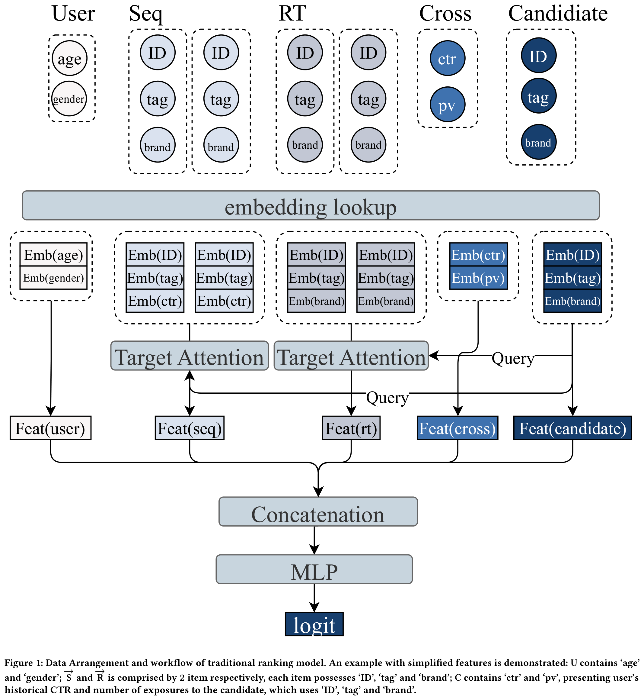
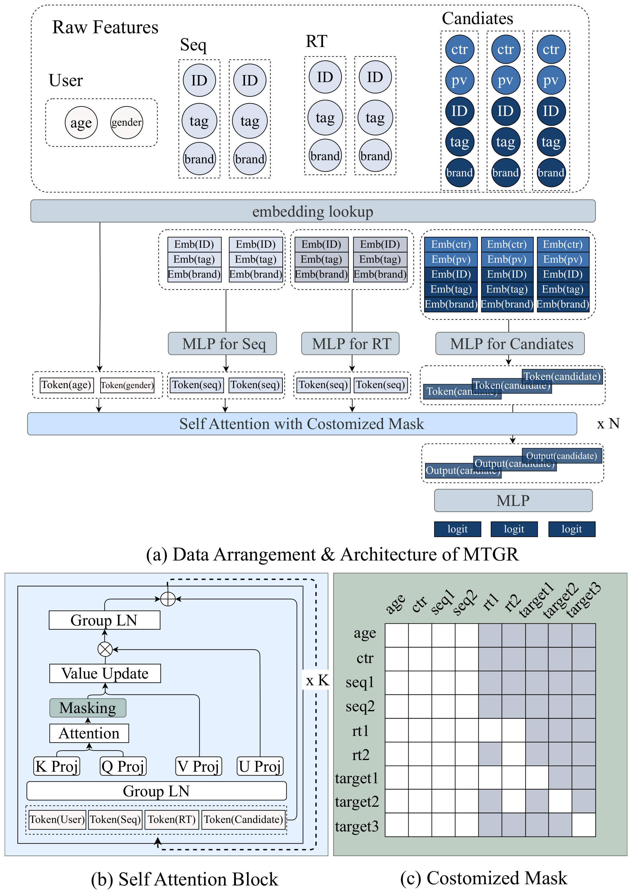
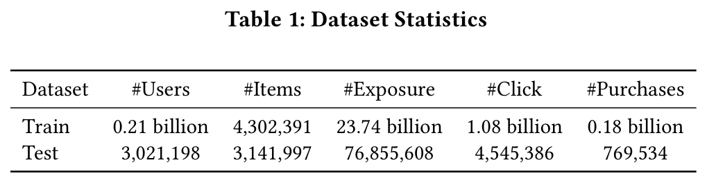
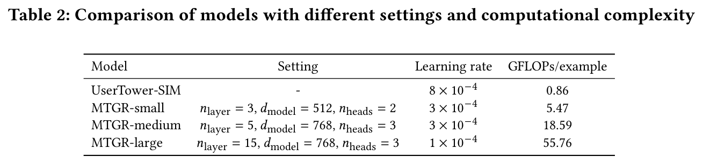
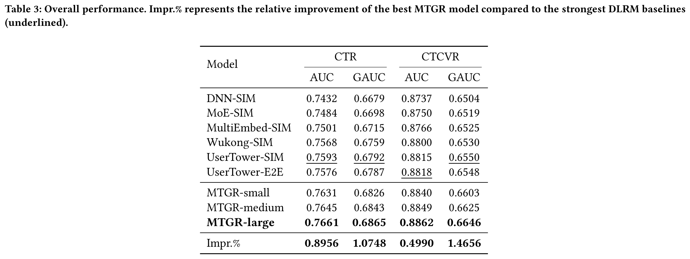
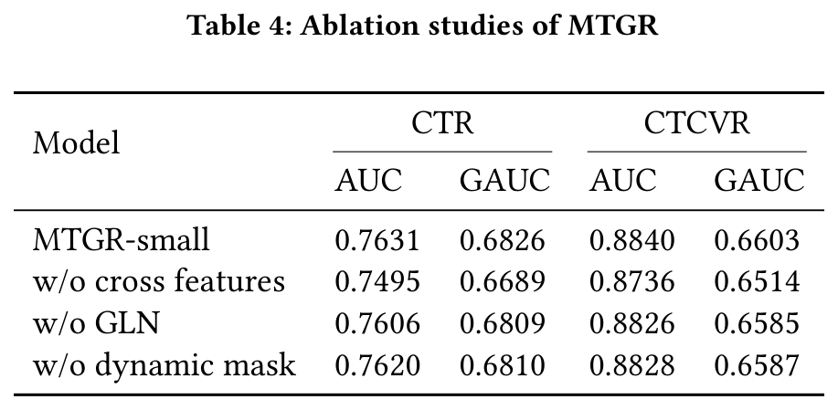
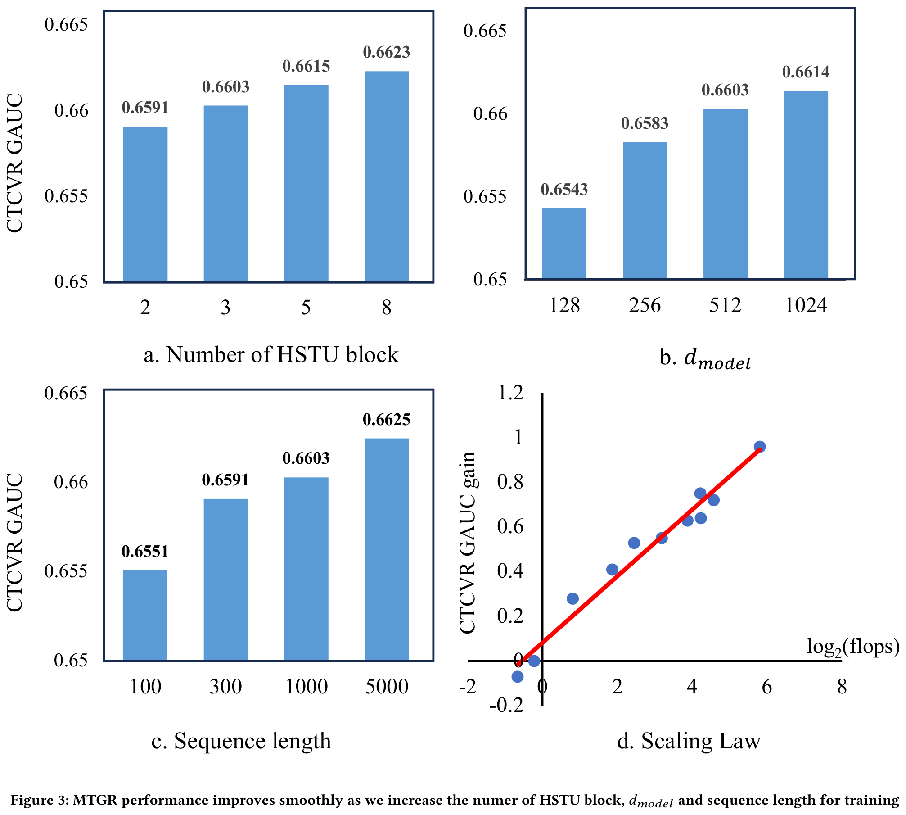
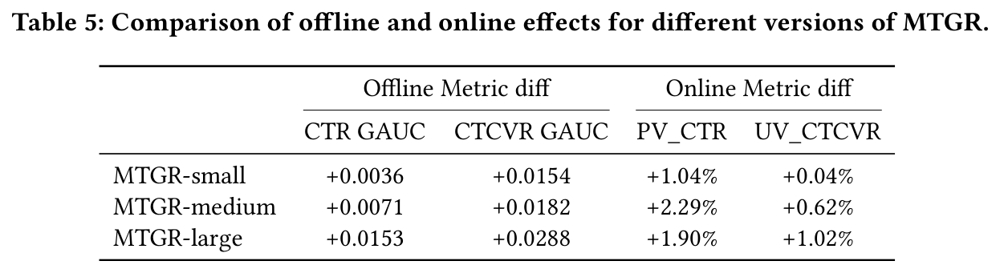

# MTGR：美团工业级生成式推荐框架

# 摘要

缩放定律（Scaling law）已在自然语言处理和计算机视觉等多个领域得到广泛验证。在推荐系统中，近期研究采用了生成式推荐以实现可扩展性，但这些生成式方法要求放弃传统推荐模型中精心设计的交叉特征（cross features）。该论文发现，这种方法会显著降低模型性能，且单纯扩大模型规模完全无法弥补该损失。为解决此问题，作者提出了 $`\text{MTGR}{}`$ （Meituan Generative Recommendation）。 $`\text{MTGR}{}`$ 基于 HSTU 架构进行建模，能够保留原始深度学习推荐模型（DLRM）的特征，包括交叉特征。此外，MTGR 通过用户级压缩实现训练和推理加速，以确保高效扩展。作者还提出了组层归一化（Group-Layer Normalization, GLN），以增强不同语义空间下的编码性能，并提出动态掩码策略以避免信息泄露。进一步地，该论文优化了训练框架，使得支持比 DLRM 模型高 10 到 100 倍计算复杂度的模型成为可能，且未带来显著成本增加。 $`\text{MTGR}{}`$ 在单样本前向推理中实现了相比 DLRM 模型 65 倍的 FLOPs 提升，取得了近两年来离线和在线指标的最大增益。该突破已成功部署于全球最大的外卖平台——美团，目前承担着主流量的推荐任务。

# 1 引言

scaling law 已被证明适用于大多数深度学习任务，包括语言模型、计算机视觉和信息检索。该论文的工作聚焦于在工业推荐系统中有效地扩展排序模型。

在工业推荐系统对高 QPS（每秒查询数）和低延迟的要求下，模型的扩展通常受限于训练成本和推理时间。目前，关于排序模型扩展的研究可分为两类：深度学习推荐模型（DLRM）和生成式推荐模型（GRM）。DLRM 对单个用户-物品对进行建模，以学习排序中的兴趣概率，并通过构建更复杂的映射来实现扩展。GRM 则像自然语言一样按 token 组织数据，并通过 transformer 架构进行下一个 token 的预测。

在工业推荐系统中，DLRM 已被使用了近十年，其输入通常包含大量精心设计的手工特征，例如交叉特征（cross features），以提升模型性能。然而，DLRM 在扩展方面存在两个显著缺点：1）随着用户行为呈指数级增长，传统的 DLRM 无法高效处理完整的用户行为序列，通常依赖行为序列检索或设计低复杂度模块进行学习，这限制了模型的学习能力；2）基于 DLRM 的扩展在训练和推理成本上随候选数量大致呈线性增长，导致开销变得难以承受。

对于 GRM，近期研究指出其具有出色的可扩展性。作者识别出两个关键因素：1）GRM 直接对完整的用户行为链进行建模，将同一用户下的多个曝光样本压缩为一个序列，显著减少了计算冗余，同时相比 DLRM 支持端到端地编码更长的序列；2）GRM 采用具有高效注意力计算的 transformer 架构，使模型的训练和推理能够满足工业推荐系统的要求。

然而，GRM 高度依赖下一个 token 预测来建模完整的用户行为序列，这要求移除用户与候选之间的交叉特征。研究发现，排除交叉特征会严重损害模型性能，而这种性能退化完全无法通过模型扩展来弥补。

如何构建一种既能利用交叉特征保证有效性，又具备 GRM 可扩展性的排序模型？为解决这一问题，作者提出了美团生成式推荐模型（ $`\text{MTGR}{}`$ ）。与传统的 DLRM 和 GRM 相比， $`\text{MTGR}{}`$ 吸收了二者的优势并规避其劣势。 $`\text{MTGR}{}`$ 保持了与传统 DLRM 一致的输入特征，包括交叉特征。特别地， $`\text{MTGR}{}`$ 通过将用户和候选特征转换为不同的 token 来重新组织特征，从而形成 token 序列以实现高效的模型扩展。随后， $`\text{MTGR}{}`$ 在候选 token 中融入交叉特征，并使用判别式损失（discriminative loss）进行学习。

MTGR 采用了与文献 中类似的 HSTU（Hierarchical Sequential Transduction Units）架构进行建模。在 HSTU 中，作者提出了组层归一化（Group-layer Normalization, GLN），用于对不同类型 token 分别进行归一化，从而更好地同时建模多种异构信息。此外，作者提出了一种动态掩码策略，通过全注意力、自回归以及仅对自身可见的机制，确保性能并避免信息泄漏。

与行业中常用的 TensorFlow 不同，MTGR 训练框架基于 TorchRec 构建，并针对计算效率进行了优化。具体而言，为了处理稀疏 embedding 条目的实时插入/删除，该论文采用动态哈希表替代静态表。为了提升效率，作者进行了动态序列平衡以解决 GPU 之间的计算负载不均衡问题，并结合 embedding ID 去重与自动表合并技术来加速 embedding 查找。此外，还引入了包括混合精度训练和算子融合在内的实现层面优化。相比 TorchRec，该优化框架将训练吞吐量提升了 $`1.6`$ x – $`2.4`$ x，在运行超过 $`100`$ 块 GPU 时仍具有良好的可扩展性。

作者在小规模数据集上验证了 $`\text{MTGR}{}`$ 的可扩展性。随后设计了三个不同规模的模型，使用过去六个月的数据进行训练，以验证离线和在线性能的缩放律（scaling law）。其中大型版本相比经过多年优化的 DLRM 基线，在前向计算中实现了每样本 $`65`$ x FLOPs，并在实际场景中使转化量提升了 $`1.22\%`$ ，CTR（点击率）提升了 $`1.31\%`$ 。同时，训练成本保持不变，推理成本降低了 12%。 $`\text{MTGR}{}`$ -large 已部署于美团外卖推荐系统，服务于数亿用户。

综上所述，该论文的贡献总结如下：

- $`\text{MTGR}{}`$ 融合了 DLRM 和 GRM 的优势，在保留 DLRM 所有特性（包括交叉特征）的同时，展现出与 GRM 相当的优秀可扩展性。

- 作者提出了组层归一化（Group-Layer Normalization）和动态掩码策略，以实现更优的性能。

- 对基于 TorchRec 构建的 $`\text{MTGR}{}`$ 训练框架进行了系统性优化，提升了训练效率。

- 通过离线与在线实验，验证了 MTGR 性能与计算复杂度之间的幂律关系，并证明其相比 DLRM 具有优越性。

# 2 相关工作
## 2.1 深度学习推荐模型

经典的 DLRM 结构通常包含多种输入，例如上下文信息（如时间、地理位置）、用户画像（如性别、年龄）、用户行为序列以及目标 item，且包含大量交叉特征。排序模型中两个特别关键的模块是行为序列处理和特征交互学习。行为序列模块通常采用目标注意力机制，用于捕捉用户历史行为与待评估 item 之间的相似性。特征交互模块则旨在捕获不同特征（包括用户与 item 特征）之间的相互作用，从而生成最终预测结果。

## 2.2 推荐模型的规模化扩展

基于 DLRM 中不同模块的扩展方式，存在两种不同的扩展路径。一种是扩展交叉模块（cross module），即扩大融合用户与 item 信息的特征交互模块。文献中引入了可堆叠的 Wukong 层来实现扩展。另有研究采用多 embedding 策略解决 embedding collapse 问题，从而增强模型的可扩展性。另一种方法是扩展用户模块（user module），仅对用户部分进行扩展，因此更具推理友好性。有工作通过仅扩展用户表征并缓存或广播至不同待评估 item 的方式降低在线推理开销。也有研究设计了用户表征的预训练方法，在下游任务中展示了良好的可扩展性。

DLRM 的对应方案是 GRM。有研究通过 HSTU 验证了缩放律，实现了万亿级参数的扩展。另有研究使用语义编码替代传统的 ID 表示，结合 DPO 优化与基于 Transformer 的框架，将级联学习框架替换为统一的生成式模型。

# 3 预备知识

## 3.1 数据排列

传统上，对于一个用户及其对应的 $`K`$ 个候选 item，用户与第 $`i`$ 个候选 pair 的第 $`i`$ 个样本可以表示为 $`\mathbb{D}_i = [{\mathbf{U}}{}, \overrightarrow{\mathbf{S}{}}, \overrightarrow{\mathbf{R}}{}, \mathbf{{C}}{}_i, \mathbf{{I}}{}_i]`$ 。具体而言， $`{\mathbf{U}}{} = [{\mathbf{U}}{}^1, ..., {\mathbf{U}}{}^{N_{{\mathbf{U}}{}}}]`$ 表示用户的画像特征（ $`{\mathbf{U}}{}^i`$ ），例如年龄、性别等。每个特征 $`{\mathbf{U}}{}^i`$ 是一个标量， $`N_{{\mathbf{U}}{}}`$ 表示所使用的特征数量。 $`\overrightarrow{\mathbf{S}{}} = [\mathbf{S}{}^1, ..., \mathbf{S}{}^{N_{\mathbf{S}{}}}]`$ 包含用户历史上交互过的 item 序列。其中每个元素 $`\mathbf{S}{}^i = [\mathbf{s}{}^1, ..., \mathbf{s}{}^{N_{\mathbf{s}{}}} ]`$ 表示一个 item，由选定的特征（ $`\mathbf{s}{}^i`$ ）组成，例如 item 的 ID、tag、item 的平均 CTR 等。与 $`\overrightarrow{\mathbf{S}{}}`$ 类似， $`\overrightarrow{\mathbf{R}}{}`$ 记录了在当前请求前几小时或一天内的最近交互行为。 $`\overrightarrow{\mathbf{R}}`$ 表示用户的实时行为和偏好。它与 $`\overrightarrow{\mathbf{S}}`$ 共享相同的特征。 $`\mathbf{{C}}{} = [\mathbf{{C}}{}^1,...,\mathbf{{C}}{}^{N_{\mathbf{{C}}{}}}]`$ 组成了用户与候选 item 之间的交叉特征。 $`\mathbf{{I}}{} = [\mathbf{{I}}{}^1,...,\mathbf{{I}}{}^{N_{\mathbf{{I}}{}}}]`$ 包含用于候选 item 的特征，例如 item 的 ID、tag 和品牌。 $`\mathbf{{I}}{}`$ 依赖于候选 item，但在不同用户之间是共享的。

## 3.2 推荐系统中的排序模型

对于输入样本 $`\mathbb{D}`$ ，传统的推荐系统独立地处理各个样本。具体而言，系统首先对 $`\mathbb{D}`$ 中的特征进行嵌入，并将其转换为稠密表示。形式上， $`{\mathbf{U}}{}`$ 、 $`\mathbf{{C}}{}`$ 、 $`\mathbf{{I}}{}`$ 中的特征分别被嵌入并拼接为 $`\mathbf{Emb}{}_{{\mathbf{U}}{}} \in \mathbb{R}^{K \times d_{{\mathbf{U}}{}}}`$ 、 $`\mathbf{Emb}{}_{\mathbf{{C}}{}} \in \mathbb{R}^{K \times d_{\mathbf{{C}}{}}}`$ 和 $`\mathbf{Emb}{}_{\mathbf{{I}}{}} \in \mathbb{R}^{K \times d_{\mathbf{{I}}{}}}`$ 。对于 $`\overrightarrow{\mathbf{S}{}}`$ 和 $`\overrightarrow{\mathbf{R}}{}`$ 中的特征，每个 item（ $`\mathbf{S}{}^i`$ ）的特征也被类似地嵌入并拼接为 $`\mathbf{Emb}_{\mathbf{S}{}^i} \in \mathbb{R}^{d_{\mathbf{s}{}}}`$ ， $`\overrightarrow{\mathbf{S}{}}`$ 中的所有 item 在另一个维度上进行拼接，得到 $`\mathbf{Emb}_{\overrightarrow{\mathbf{S}}} \in \mathbb{R}^{N_{\overrightarrow {\mathbf{S}}} \times d_{\mathbf{s}{}}}`$ 。

为了从历史交互 item 序列中提取用户对候选 item 的兴趣，通常使用目标注意力机制（target attention），其中目标 item 作为查询（query），序列特征作为键（key）和值（value）。形式上，

$$
\begin{align}\mathbf{Feat}{}_{\overrightarrow{\mathbf{S}}} = \text{Attention}(\mathbf{Emb}{}_{\mathbf{{I}}{}}, \mathbf{Emb}_{\overrightarrow{\mathbf{S}}}, \mathbf{Emb}_{\overrightarrow{\mathbf{S}}}) \in \mathbb{R}^{K \times d_{\mathbf{S}{}}}\end{align}
$$

Eq.  **Eq 1** 根据 $`\mathbf{{I}}{}`$ 对 $`\overrightarrow{\mathbf{S}}`$ 进行聚合。最终，来自 $`\mathbb{D}`$ 的嵌入后并经过处理的特征被拼接表示为：

$$
\begin{align}\mathbf{Feat}{}_{\mathbb{D}} = [\mathbf{Emb}{}_{{\mathbf{U}}{}}, \mathbf{Feat}{}_{\overrightarrow{\mathbf{S}}}, \mathbf{Feat}{}_{\overrightarrow{\mathbf{R}}{}}, \mathbf{Emb}{}_{\mathbf{{C}}{}}, \mathbf{Emb}_{\mathbf{s}{}}] \in \mathbb{R}^{K \times (d_{{\mathbf{U}}{}} + d_{\mathbf{S}{}} + d_{\mathbf{{C}}{}} + d_{\mathbf{{I}}{}})}\end{align}
$$

 $`\mathbf{Feat}{}_{\mathbb{D}}`$ 随后被输入到一个多层感知机（MLP）中，为每个样本输出一个 logit。该 logit 在训练时用于模型学习，在推理阶段用于排序。

图 **figure 1** 展示了传统排序模型下简化的数据组织结构和工作流程。

 

这些特征首先被嵌入，随后主导的嵌入向量通过不同方法进行处理。

最后，处理后的特征被拼接，并由 MLP 进行特征交互。最终为每个候选 item 生成 logit。

## 3.3 推荐系统中的扩展困境

模型扩展一直是提升排序性能的常用方法。通常，模型扩展旨在扩大用户模块和交叉模块中的参数。用户模块处理用户特征（包括序列特征），并生成用户相关的表示。扩展用户模块能够带来更优的用户表示。此外，由于用户模块在所有候选 item 上是共享的，且仅需推理一次，因此用户模块中的高推理开销并不会导致系统负载过重。然而，仅扩展用户模块并不能直接促进用户与 item 之间的特征交互。

相反，另一类方法的趋势是扩展交叉模块，即在特征拼接之后的特征交互 MLP。这类方法通过更加关注用户与候选 item 之间的交互来增强排序能力。然而，由于交叉模块需要对每个候选 item 单独进行推理，计算量会随着候选 item 数量线性增长。因此，交叉模块的扩展会带来不可接受的系统延迟。

传统推荐系统中的这种扩展困境，迫切需要一种新的扩展方法，能够在实现用户与候选 item 之间高效特征交互的同时，使推理开销相对于候选 item 数量呈亚线性增长。MTGR 通过数据重排和相应的架构优化，创新性地提出了推荐系统中的新型扩展方法。

# 4 MTGR 的数据重排与架构设计

## 4.1 用户样本聚合以提升训练与推理效率

与第 **section 3.1** 节中的特征分类相比，对于候选集中的第 $`i`$ 个样本，MTGR 将特征组织为 $`\mathbb{D}_i = [{\mathbf{U}}{}, \overrightarrow{\mathbf{S}}, \overrightarrow{\mathbf{R}}{}, [\mathbf{{C}}{}_i, \mathbf{{I}}{}_i]]`$ 。特别地，交叉特征 $`\mathbf{{C}}{}`$ 被安排为候选 item 的 item 特征的一部分。在 MTGR 中，候选样本在训练阶段按用户在特定窗口内进行聚合，在推理阶段则按请求进行聚合。

由于聚合操作是基于同一用户的，因此聚合后的样本可以复用相同的用户表征（ $`{\mathbf{U}}{}`$ 、 $`\overrightarrow{\mathbf{S}}`$ 、 $`\overrightarrow{\mathbf{R}}{}`$ ）。具体而言， $`\overrightarrow{\mathbf{R}}{}`$ 按交互时间的先后顺序排列了该用户在另一个特定时间窗口内的所有实时交互 item。

图 **figure 2** (a) 展示了该聚合过程：与图 **figure 1** 中仅对一个候选进行预测不同，图 **figure 2** (a) 将三个 item 聚合在一个样本中，并复用相同的用户表征。形式上，它为同一用户构建了如下特征表示：

 

$$
\begin{align}\mathbb{D} = [{\mathbf{U}}{}, \overrightarrow{\mathbf{S}}, \overrightarrow{\mathbf{R}}{}, [\mathbf{{C}}{}, \mathbf{{I}}{}]_1, ..., [\mathbf{{C}}{}, \mathbf{{I}}{}]_K]\end{align}
$$

通过将候选聚合到一个样本中，MTGR 仅需执行一次计算即可为所有候选生成预测分数，从而大幅减少资源消耗。

特别地，用户聚合过程将训练样本的数量从所有候选的规模减少到了所有用户的规模。在推理阶段，请求中的候选按照上述方式被分组，MTGR 只需执行一次推理即可完成全部候选的排序，而无需对每个候选单独推理。这种聚合方式规避了推理成本对候选数量的依赖，为模型的扩展留下了可能性与潜力。

Eq. **Eq 3** 是标量特征与序列特征的组合。为了统一输入格式，MTGR 将特征和序列转换为 token。特别地，对于 $`{\mathbf{U}}{}`$ 中的标量特征，每个特征自然地转换为一个独立的 token，其维度为 $`\mathbf{Feat}{}_{{\mathbf{U}}{}} \in \mathbb{R}^{N_{{\mathbf{U}}{}} \times d_{\text{model}{}}}`$ 。 $`d_{\text{model}{}}`$ 是所有 token 的统一维度。对于序列特征 $`\overrightarrow{\mathbf{S}}`$ 和 $`\overrightarrow{\mathbf{R}}{}`$ ，序列中的每个 item $`\mathbf{S}{}`$ 被视为一个 token。 $`\mathbf{S}{}`$ 中的特征首先进行 embedding 并拼接，再通过一个 MLP 模块实现维度统一。形式上， $`\mathbf{Feat}{}_{\mathbf{S}{}_i} = \text{MLP}(\text{Concat}(\mathbf{Emb}{}_{\mathbf{s}{}})) \in \mathbb{R}^{d_{\text{model}{}}}`$ 。

序列中 $`\mathbf{S}{}`$ 的特征在另一维度上进行拼接，得到 $`\mathbf{Feat}{}_{\overrightarrow{\mathbf{S}}} \in \mathbb{R}^{N_{\overrightarrow{\mathbf{S}}} \times d_{\text{model}{}}}`$ 。

类似地，候选中的每个 item $`\mathbf{{I}}{}`$ 也被视为一个 token。候选中的特征先进行 embedding 并拼接，再通过另一个 MLP 转换为统一维度。候选被拼接为一系列 token： $`\mathbf{Feat}{}_{\mathbf{{I}}{}} = \text{Concat}(\text{MLP}(\text{Concat}(\mathbf{Emb}{}_{\mathbf{{C}}{}_i},\mathbf{Emb}{}_{\mathbf{{I}}{}_i}))) \in \mathbb{R}^{N_{\mathbf{{I}}{}}}`$ 。最后，来自 $`{\mathbf{U}}{}`$ 、 $`\overrightarrow{\mathbf{S}}`$ 、 $`[\mathbf{{C}}{}, \mathbf{s}{}]`$ 的构造 token 被拼接，形成一个长 token 序列：

$$
\begin{align}\mathbf{Feat}{}_{\mathbb{D}} & = &\text{Concat}([\mathbf{Feat}{}_{{\mathbf{U}}{}}, \mathbf{Feat}{}_{\overrightarrow{\mathbf{S}}}, \mathbf{Feat}{}_{\overrightarrow{\mathbf{R}}{}}, \mathbf{Feat}{}_{\mathbf{{I}}{}}]) \\ \nonumber & \in & \mathbb{R}^{(N_{{\mathbf{U}}{}} + N_{\overrightarrow{\mathbf{S}}} + N_{\overrightarrow{\mathbf{R}}{}} + N_{\mathbf{{I}}{}}) \times d_{\text{model}{}}}\end{align}
$$

## 4.2 统一的HSTU编码器

用户的样本被聚合为一个token序列，这种结构天然适合使用自注意力机制进行处理。受HSTU的启发，MTGR采用堆叠的自注意力层和仅编码器架构来进行建模。

与大语言模型（LLM）类似，输入token序列按层进行处理。如图2所示，在自注意力模块中，输入序列 $`\mathbf{X}`$ 首先通过组层归一化（group layer norm）进行归一化。来自同一域的特征（例如， $`{\mathbf{U}}{}`$ ）构成一个组。组层归一化确保来自不同域的token在自注意力计算前具有相似的分布，并对齐不同域的语义空间： $`\tilde{X} = \text{GroupLN}(\mathbf{X})`$ 。

归一化后的输入被投影到4种不同的表示： $`\mathbf{K}, \mathbf{Q}, \mathbf{V}, \mathbf{U} = \text{MLP}_{\mathbf{K}/\mathbf{Q}/\mathbf{V}/\mathbf{U}}(\tilde{\mathbf{X}})`$ 。

 $`\mathbf{Q}`$ 和 $`\mathbf{K}`$ 用于多头注意力计算，并使用silu非线性激活函数。主导注意力除以输入特征的总长度作为平均因子。随后，在注意力得分上施加一个自定义掩码（ $`\mathbf{M}`$ ），并使用投影后的 $`\mathbf{V}`$ 进行值更新：

$$
\begin{align}\tilde{\mathbf{V}} & = & \frac{\text{silu}(\mathbf{K}^T \mathbf{Q})}{(N_{{\mathbf{U}}{}} + N_{\overrightarrow{\mathbf{S}}} + N_{\overrightarrow{\mathbf{R}}{}} + N_{\mathbf{{I}}{}})} \mathbf{M} \mathbf{V}\end{align}
$$

投影得到的 $`\mathbf{U}`$ 与更新后的 $`\tilde{\mathbf{V}}`$ 进行点积操作。然后应用另一个组层归一化。最后，添加一个残差模块，并在其上方放置另一个MLP：

$$
\begin{align}\mathbf{X} & = & \text{MLP}(\text{GroupLN}(\tilde{\mathbf{V}} \odot \mathbf{U})) + \mathbf{X}\end{align}
$$

动态掩码利用因果掩码进行序列建模。然而，该论文指出，这种实现方式在MTGR中并未带来显著的性能提升。

此外，由于 $`\overrightarrow{\mathbf{R}}{}`$ 记录了用户最近的交互行为，其时间戳可能与样本聚合窗口重叠。在MTGR中使用简单的因果掩码可能导致信息泄露。例如，傍晚的交互行为不应暴露给下午的候选item，但这些信息可能被聚合到同一样本中。这一困境要求一种灵活且高效的掩码机制。

在MTGR中， $`{\mathbf{U}}{}`$ 和 $`\overrightarrow{\mathbf{S}}`$ 被视为静态信息（下文中称 $`{\mathbf{U}}{}`$ 和 $`\overrightarrow{\mathbf{S}}`$ 为“静态序列”），因为它们的信息来源于聚合窗口之前，因此不会引起因果性错误。 $`\overrightarrow{\mathbf{R}}{}`$ 是动态的，因为它实时地逐步包含用户的交互行为（将 $`\overrightarrow{\mathbf{S}}`$ 记为“动态序列”）。MTGR对静态序列应用全注意力，对 $`\overrightarrow{\mathbf{R}}{}`$ 应用带有动态掩码的自回归注意力，并对候选item之间使用对角掩码。具体而言，MTGR的掩码设置了以下三条规则：

- 静态序列对所有token可见。

- 动态序列的可见性遵循因果性，即每个token仅对在其之后出现的token（包括候选token）可见。

- 候选token（ $`\mathbf{{C}}{}`$ 、 $`\mathbf{{I}}{}`$ ）仅对自己可见。

图2(c)展示了动态掩码的一个示例：“age”、“ctr”表示来自 $`{\mathbf{U}}{}`$ 的特征token；“seq1”、“seq2”表示 $`\overrightarrow{\mathbf{S}}`$ ；“rt1”、“rt2”表示 $`\overrightarrow{\mathbf{R}}{}`$ ；“target1”至“target3”表示候选item。行中的白色块表示该token可以利用其他token的信息，而列中的白色块表示该token对其他token可见。

Full attention is utilized for   $`{\mathbf{U}}{}`$ and   $`\mathbf{S}{}`$ , leading to a white square from 'age' to 'seq2'.  
对   $`{\mathbf{U}}{}`$ 和   $`\mathbf{S}{}`$ 采用全局注意力机制，导致从 'age' 到 'seq2' 形成一个白色方块。

For 'rt1' to 'rt2', we assume that 'rt1' appear latter than 'rt2', Therefore, a tiny square from 'rt1' to 'rt2' is constructed with white blocks in upper triangle, meaning that 'rt1' is able to use information from 'rt2' while 'rt1' is not visible to 'rt2'.  
对于 'rt1' 到 'rt2'，该论文假设 'rt1' 出现在 'rt2' 之后，因此构建了一个从 'rt1' 到 'rt2' 的小方块，其右上三角区域为白色块，表示 'rt1' 可以使用来自 'rt2' 的信息，而 'rt2' 无法看到 'rt1'。

Besides, 'target2' and 'target3' is assumed to appear earlier than 'rt1', leading to 'rt1' is not visible to them.  
此外，假设 'target2' 和 'target3' 出现在 'rt1' 之前，导致 'rt1' 对它们不可见。

'rt2' appear earlier than all 'target1' and 'target2' while latter than 'target3'.  
'rt2' 出现在所有 'target1' 和 'target2' 之前，但晚于 'target3'。

Therefore, 'rt2' is not visible to 'target3', which appears earlier than all 'rt's, leading to its unable to use information from 'rt's.  
因此，'rt2' 对 'target3' 不可见，而 'target3' 出现在所有 'rt' 之前，导致其无法使用来自 'rt's 的信息。

# 5 训练系统

为了便于 MTGR ~model 结构的设计与开发，并方便地融合快速发展的 LLM 社区中的更多特性，该论文决定不再沿用此前基于 TensorFlow 的训练框架，而是选择在 PyTorch 生态体系内重建训练框架。具体而言，作者在 TorchRec 的功能基础上进行了扩展与优化，并针对 MTGR ~model 的特性进行了专门增强，最终实现了 MTGR ~model 的高效训练。相比 TorchRec，优化后的框架在训练吞吐量上提升了 1.6x – 2.4x，同时在运行超过 100 块 GPU 时仍表现出良好的可扩展性。相比 DLRM 基线，该方法在前向计算中实现了每样本 65x 的 FLOPs，而训练成本基本保持不变。作者提供了一些关键工作的细节如下。

动态哈希表。TorchRec 使用固定大小的表来处理稀疏 embedding，这在大规模工业级流式训练场景中并不适用。首先，一旦静态表达到预设容量，新用户和 item 的额外 embedding 就无法实时分配。其次，静态 embedding 表通常需要预留比实际更多的空间以避免 ID 溢出，导致内存资源利用效率低下。为解决这些问题，作者开发了一种基于哈希技术的高性能 embedding 表，支持在训练过程中动态分配空间以容纳稀疏 ID。该设计采用解耦的哈希表架构，将 key 存储和 value 存储分离为两个独立实体。key 存储提供一个轻量级的映射系统，将 key 映射到指向 embedding 向量的指针；而 value 存储则包含 embedding 向量以及用于驱逐策略的额外元数据（如计数器和时间戳）。这一两部分系统实现了两个主要目标：（1）通过仅复制 key 存储而非庞大的 embedding 来实现容量的动态扩展；（2）通过以紧凑格式排列 key 来提升 key 扫描的效率。

embedding 查找。embedding 查找过程采用 All-to-all 通信实现跨设备 embedding 交换。为了最小化设备之间重复 ID 的传输，作者实现了一个两步过程，确保在通信前后 ID 均保持唯一。

负载均衡。在推荐系统中，用户行为序列通常呈现长尾分布，即只有少数用户具有较长序列，而大多数用户序列较短。这在使用固定 batch size（简称 BS）训练时会导致显著的计算负载不均衡。一种常见解决方案是使用序列打包（sequence packing）技术，将多个短序列合并为一个更长的序列。然而，这种方法需要仔细调整 mask，以防止在 attention 计算过程中不同序列相互干扰，实现成本较高。作者的简单解决方案是引入动态 BS。每个 GPU 的局部 BS 根据输入数据的实际序列长度进行调整，以确保计算负载相近。此外，作者还调整了梯度聚合策略，根据每个 GPU 的 BS 对其梯度进行加权，从而在计算逻辑上保持与固定 BS 的一致性。

其他优化。为进一步提升训练效率，该论文采用了流水线技术，利用三个不同的流：copy、dispatch 和 compute。copy 流负责将输入数据从 CPU 传输到 GPU，dispatch 流使用 ID 执行表查找，compute 流则处理前向计算和反向更新。例如，当 compute 流对 batch $`\mathbf{T}`$ 进行前向和反向传播时，copy 流同时加载 batch $`\mathbf{T}+1`$ ，从而最小化 I/O 延迟。一旦 batch $`\mathbf{T}`$ 的反向更新完成，dispatch 流便立即开始对 batch $`\mathbf{T}+1`$ 进行表查找和通信。此外，该论文采用了 bf16 混合精度训练，并基于 cutlass 设计了一个专用的 attention kernel 以加速训练进程。

# 6 实验

## 6.1 实验设置

数据集。公共数据集通常使用独立的 ID 和属性特征，较少引入交叉特征。然而，交叉特征在实际应用中展现出重要性，是该论文场景中的一类重要特征。这些特征通常经过精心手工构建，包括用户-物品、用户与高层级类目、物品与时空信息等交互特征。为了弥补公共数据集中交叉特征的缺失，作者基于美团工业级推荐系统的日志构建了一个训练数据集。与公共数据集不同，该论文的实证数据集包含更丰富的交叉特征以及更长的用户行为序列。使用工业级数据进行实验能更好地凸显这些交叉特征对真实推荐系统的重要影响。

此外，该数据集规模较大，使得复杂模型在训练过程中能够实现更充分的收敛。在离线实验中，作者收集了为期 $`10`$ 天的数据。数据集的统计信息如表1所示。在在线实验中，为了与已训练超过 $`2`$ 年的 DLRM 基线进行比较，作者构建了一个长期数据集，使用跨度超过 $`6`$ 个月的数据。

 

基线方法。对于 DLRM，作者在序列建模方面比较了两种方法：基于序列检索的 SIM 以及对原始长序列进行端到端建模的方法（E2E）。在模型规模方面，作者比较了 DNN、MoE、Wukong、MultiEmbed 和 UserTower。

MoE 使用 $`4`$ 个专家，每个专家的网络复杂度与基础 DNN 相同。Wukong 和 MultiEmbed 被配置为与 MoE 相同的计算复杂度。UserTower 使用一组可学习的查询，并在用户行为序列上插入一个 qFormer 层，同时搭配另一个包含 16 个专家的 MoE 模块。UserTower 的计算复杂度是 MoE 方法的三倍，但在推理阶段，对于同一用户预测多个 item 时可以共享这部分计算，从而降低推理成本。该方法在该论文的场景中取得了良好效果。

 $`\text{MTGR}{}`$ 采用 E2E 方式处理所有序列信息。此外，如表2所示，作者设置了三种不同规模的配置，以验证 $`\text{MTGR}{}`$ 的可扩展性。

 

评估指标。在离线评估中，主要关注两个任务的学习效果：CTR 和 CTCVR（点击转化率），并使用 AUC 和 GAUC（分组 AUC）作为评价指标。GAUC 是在用户粒度上对 AUC 进行平均。相比 AUC，GAUC 更关注模型在同一个用户内的排序能力。在在线评估中，重点关注两个指标：PV_CTR（每页面浏览的点击率）和 UV_CTCVR（每用户浏览的转化率），其中 UV_CTCVR 是评估业务增长最关键的指标。

参数设置。该模型使用 Adam 优化器进行训练。对于 DLRM，每块 GPU 处理的 batch size 为 2400，共使用 8 块 NVIDIA A100 GPU 进行训练。对于 $`\text{MTGR}{}`$ ，batch size 设置为 96，使用 16 块 NVIDIA A100 GPU 进行训练。如表2所示，随着模型复杂度的增加，学习率逐步降低。此外，随着计算复杂度的增长，通过配置不同的 embedding 维度，按比例扩大稀疏参数的规模。假设一个 token 由 $`k`$ 个特征组成，每个特征的 embedding 维度通常设置为接近 $`d_{\text{model}{}}/k`$ 的整数。值得注意的是，为了防止因稀疏参数过度扩展而导致的开销过大，主要增加低基数稀疏特征的维度，而保持极高稀疏性特征的维度不变。最后， $`\overrightarrow{\mathbf{S}{}}`$ 的最大长度设置为 $`1000`$ ， $`\overrightarrow{\mathbf{R}}{}`$ 设置为 $`100`$ 。

## 6.2 整体性能对比

该论文使用10天的数据集评估了MTGR与其他基线方法的性能。表 **table 3** 展示了不同模型的表现。各类模型在不同离线指标上的差异较为一致。根据以往经验，离线指标提升 $`0.001`$ 即被视为显著。在各种版本的DLRM中，Wukong-SIM和MultiEmbed-SIM的表现优于MoE-SIM。UserTower-SIM表现最佳，而UserTower-E2E相比UserTower-SIM性能略有下降。作者推测，在DLRM范式下，模型复杂度不足以建模全部序列信息，导致欠拟合。

  

该论文提出的 $`\text{MTGR}{}`$ 即使是最小版本，也超过了最强的DLRM模型。此外，三种不同规模的模型展现出良好的可扩展性，其性能随模型复杂度增加而平稳提升。

 

## 6.3 消融实验

作者在MTGR-small基础上对MTGR的两个组件进行了消融研究：Dynamic Masking 和基于组的层归一化（GLN）。消融结果如 **table 4** 所示。从MTGR中移除任一组件都会导致性能显著下降，下降程度可与MTGR-small到MTGR-medium的性能提升相比较。这表明Dynamic Masking和GLN对MTGR至关重要。此外，作者还额外进行了关于交叉特征重要性的实验。在移除交叉特征后，性能指标显著下降，甚至消除了 $`\text{MTGR}{}`$ -large相对于DLRM的性能增益，凸显了交叉特征在实际推荐系统中的关键作用。

 

## 6.4 可扩展性

图 **figure 3** 展示了MTGR的可扩展性。作者基于MTGR-small测试了三个不同超参数：HSTU块的数量、 $`d_{\text{model}{}}`$ 以及输入序列长度。可以看出，MTGR在不同超参数下均表现出良好的可扩展性。此外，图 **figure 3** (d) 展示了性能与计算复杂度之间的幂律关系。纵轴表示CTCVR GAUC指标相对于最强DLRM模型UserTower-SIM的增益，横轴表示相对于UserTower-SIM的计算复杂度的对数倍数。

 

## 6.5 在线实验

为进一步验证 $`\text{MTGR}{}`$ 的有效性，该论文将 $`\text{MTGR}{}`$ 部署在美团外卖平台，使用 $`2\%`$ 的流量进行 AB 测试。

实验流量规模达到每日数百万次曝光，体现了实验的置信度。对比基线为当前最先进的在线 DLRM 模型（UserTower-SIM），该模型已持续学习两年。作者使用过去 6 个月的数据训练 $`\text{MTGR}{}`$ 模型，随后将其部署上线进行对比。

尽管训练数据量显著低于 DLRM 模型的对应数据量，但离线与在线指标仍大幅超越 DLRM 基线。如表 **表5** 所示，离线与在线指标均展现出可扩展性。研究还发现，随着训练 token 数量的增加，相较于 DLRM 的优势持续放大。最终，在 CTCVR GAUC 指标上，该论文提出的大版本模型甚至超过了过去一年所有优化措施的累计提升。

 

该模型已在实际场景中全面部署，训练成本与 DLRM 相当，推理成本降低了 $`12\%`$ 。对于 DLRM 而言，其推理成本大致与候选 item 数量呈线性关系。然而， $`\text{MTGR}{}`$ 在一次请求中对所有候选 item 采用用户特征聚合机制，从而实现推理成本随候选数量呈亚线性增长。这有助于降低在线推理的开销。

 

# 7 结论

该论文提出了 MTGR，一种基于 HSTU 的新型排序框架，用于探索推荐系统中的扩展规律。MTGR 融合了 DLRM 与 GRM 的优势，既能利用交叉特征保证模型性能，又具备与 GRM 相同的可扩展性。MTGR 已在实际场景中部署并取得了显著收益。未来，作者将进一步探索如何将 MTGR 扩展至多场景建模，类比大语言模型，构建具备广泛知识的推荐基础模型。
