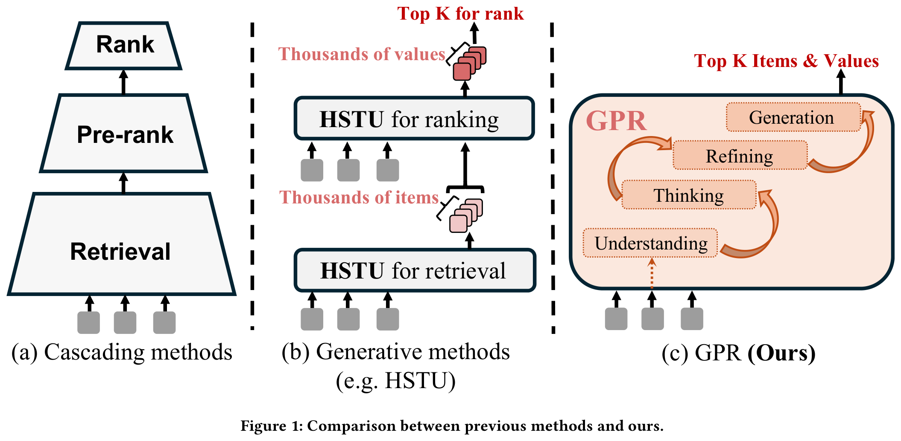
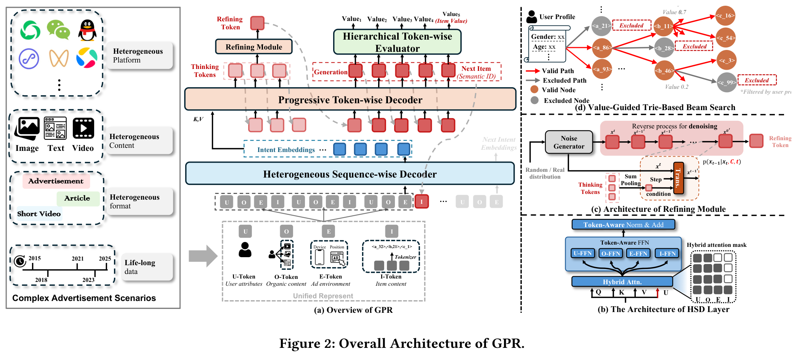
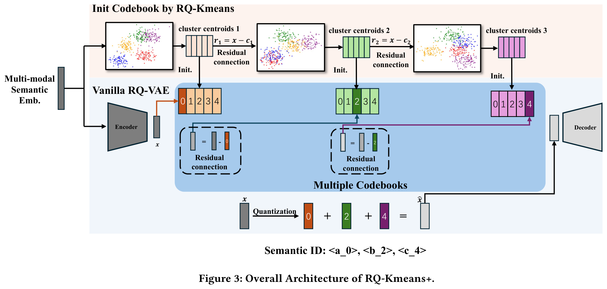
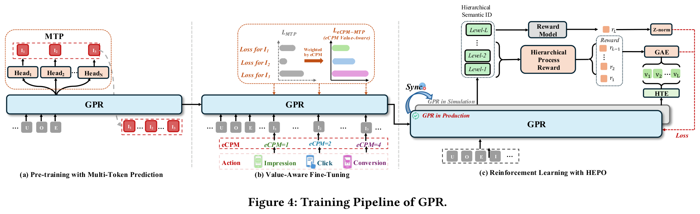
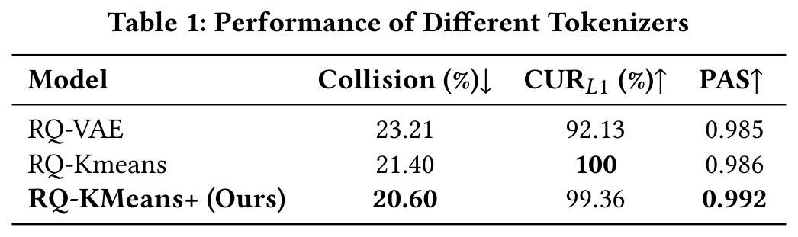
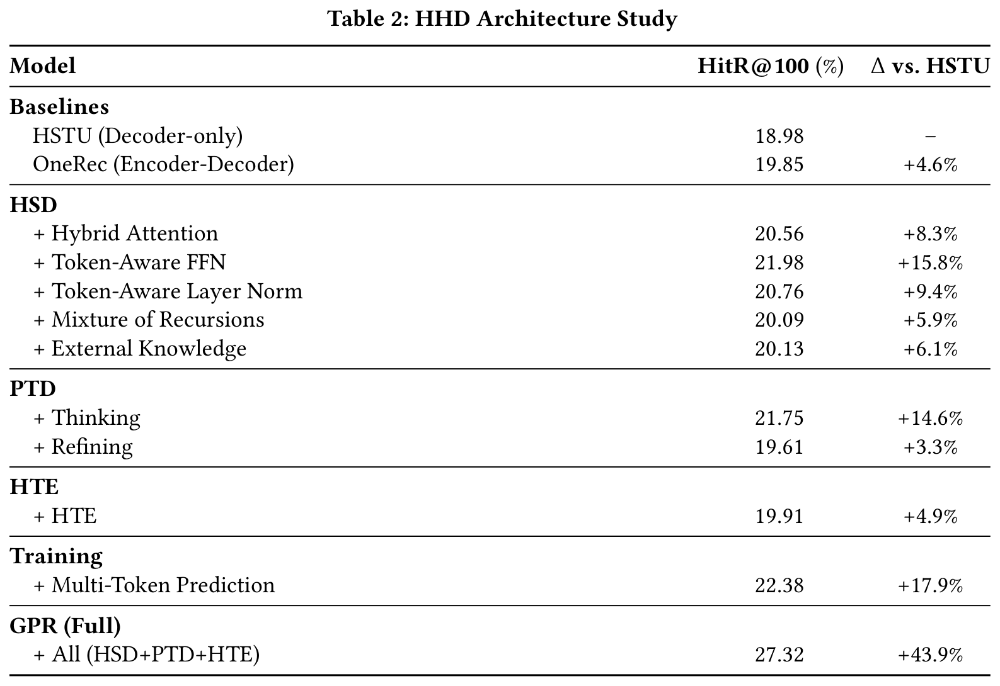
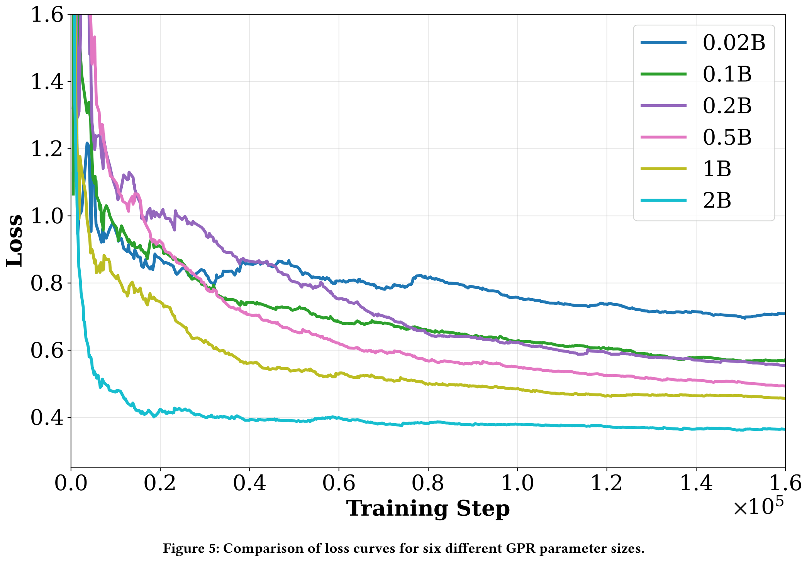
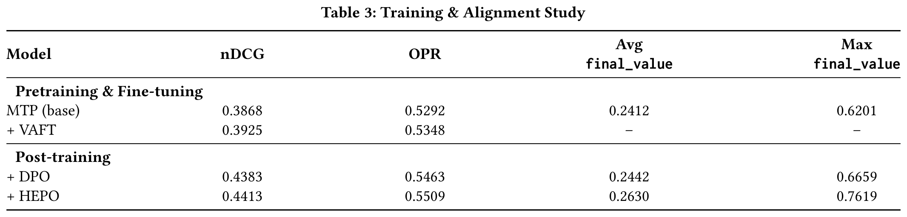
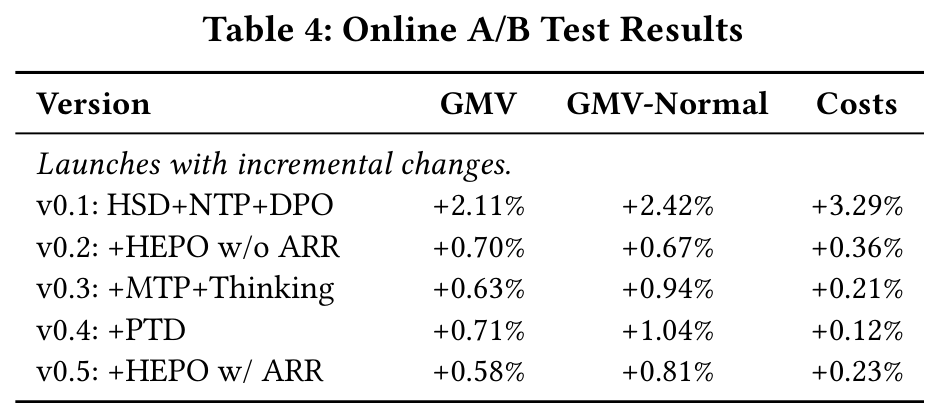
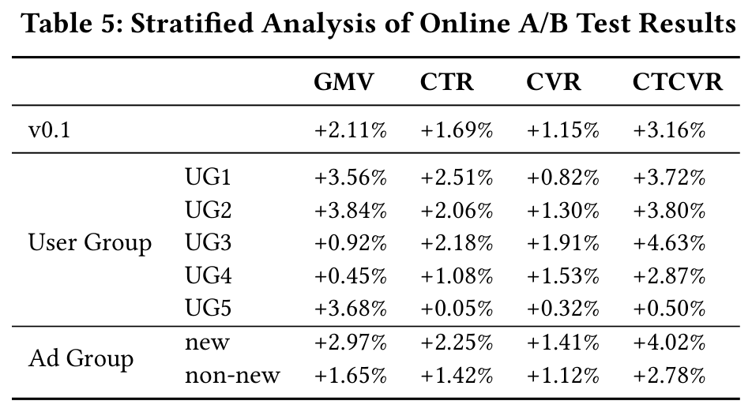

# GPR：迈向大规模广告推荐的生成式预训练统一模型范式
# 摘要

作为连接用户与商业内容的智能基础设施，广告推荐系统在数字经济中的信息流动与价值创造中发挥着核心作用。然而，现有的多阶段广告推荐系统存在目标不一致和误差传播的问题，难以实现全局最优；而现有的统一生成式推荐模型仍难以满足实际工业应用场景的需求。为解决这些问题，该论文提出了 GPR（Generative Pre-trained Recommender）——首个将广告推荐重新定义为端到端生成任务的统一模型框架，用一种统一的生成式方法取代传统的级联式范式。为实现 GPR，作者提出了三项关键创新，涵盖统一表示、网络架构和训练策略。首先，设计了一种面向广告场景的统一输入模式与分词方法，将广告和自然内容映射到共享的多层次语义 ID 空间中，从而增强异构数据之间的语义对齐与建模一致性。其次，提出了异构层级解码器（Heterogeneous Hierarchical Decoder, HHD），这是一种双解码器架构，将用户意图建模与广告生成解耦，在保持强大建模能力的同时实现了训练效率与推理灵活性之间的平衡。最后，提出了一种多阶段联合训练策略，整合了多 token 预测（Multi-Token Prediction, MTP）、价值感知微调（Value-Aware Fine-Tuning）以及层级增强策略优化算法（Hierarchy Enhanced Policy Optimization, HEPO），构建了一个完整的生成式推荐流程，统一了兴趣建模、价值对齐与策略优化。GPR 已在腾讯微信视频号广告系统中全面部署，显著提升了商品交易总额（Gross Merchandise Volume, GMV）和 CTCVR 等关键业务指标，清晰表明 GPR 在面对一个高度优化且成熟的级联系统时仍具备强大的竞争力。

# 1 引言

在线广告推荐是数字经济的核心组成部分，其核心任务是基于用户的历史行为，精准地将合适的广告匹配给合适的用户。此类系统必须在严格的实时性与低延迟要求下运行，服务于数亿用户和数千万动态变化的广告。因此，系统性能的时效性与稳定性直接决定了一个价值数十亿美元生态系统的运行效果。在用户体验、广告主投资回报率（ROI）和平台收入之间实现动态平衡，已成为该领域的关键挑战。

传统的广告推荐系统通常采用“检索–粗排–精排”的多阶段级联流水线架构，如图1（a）所示。然而，此类流水线存在各阶段优化目标不一致的问题：检索阶段侧重于覆盖率优化，而最终的精排阶段则聚焦于业务目标预测。这种目标错位导致系统难以实现全局最优。此外，早期检索模型的表征能力有限，往往过早地过滤掉潜在的高质量候选广告，限制了后续排序模型对深层特征交互的充分挖掘，从而造成信息瓶颈。同时，这种级联架构依赖高度复杂的工程实现，需要投入大量资源来维护跨阶段的一致性，进而阻碍了算法的快速迭代和系统的可扩展性。

 

近年来，随着大语言模型（LLMs）的快速发展，特别是其在生成能力方面的突破，推荐系统的研究范式持续演进。HSTU 将生成建模引入传统级联架构，如图1（b）所示，进一步推动了从多阶段流水线向统一的生成式推荐框架的转变。此类模型能够基于对用户兴趣和语义上下文的整体理解，直接生成最优推荐结果，从而确保优化目标的一致性。然而，由于广告推荐任务本身固有的复杂性，现有生成模型在实际工业应用中仍面临多重挑战：

1. 数据与行为的极端异质性：广告通常与短视频、社交动态、新闻文章等原生内容交错呈现，导致在序列层面和 item 层面均存在高度异质性，以及多样化的用户行为。系统必须同时处理用户对广告和非广告内容的交互行为（例如点击、转化、浏览和阅读），导致数据分布高度噪声化且复杂。这种极端异质性极大增加了用户兴趣建模和语义对齐的难度，对模型的统一表征能力和多模态建模能力提出了严苛要求。

2. 效率与灵活性的权衡：在工业级规模的广告推荐中，模型不仅需要支持大规模数据更新下的高效训练，还需具备灵活的解码能力，以实时处理超长用户行为序列，并在多种约束条件（例如定向、出价、预算）下完成广告匹配。Decoder-only 架构支持高效的用户级训练，但在解码灵活性方面存在局限；而 encoder–decoder 架构虽支持灵活推理，但由于采用 pointwise 损失目标，训练成本极高，难以适用于实时广告系统。因此，如何在高效训练与灵活推理之间取得平衡，仍是该领域的一项关键挑战。

3. 收入与多利益相关方价值优化：广告推荐系统必须在多个利益相关方之间最大化整个生态系统的价值——平衡用户体验、广告主投资回报率（ROI）和平台收入。现有的预训练方法主要依赖于优化简化的单一目标（例如，最大化预测点击率或转化率），彼此孤立地进行优化。这种孤立的优化方式导致了内在的目标不一致和局部最优，因而无法实现期望的全局业务价值优化。

为解决上述挑战，该论文提出了 GPR（Generative Pre-trained Recommender）。通过在统一分词、解码器架构和训练策略方面的系统性创新，GPR 能够有效整合异构数据，在系统效率与解码灵活性之间取得平衡，同时精确捕捉业务价值并优化全局多利益相关方目标。据作者所知，GPR 是首个成功部署于大规模真实广告系统中的端到端生成式广告推荐框架，如图1(c)所示。该工作的主要贡献总结如下：

  $`\bullet`$ 作者提出了一种统一的输入模式和分词方法，通过四种类型的 token 表示用户的整个行为旅程，并引入一种新颖的 RQ-Kmeans+ 量化模型，将内容和广告映射到共享语义空间中，从而实现对异构且超长序列数据的高效建模。

  $`\bullet`$ 作者提出了一种基于双解码器的生成式架构，称为异构分层解码器（Heterogeneous Hierarchical Decoder, HHD），该架构分层建模用户理解与推荐 item 的生成过程，实现更精细的兴趣表征和更准确的推荐。在解码过程中，HHD 集成了 trie 约束、价值引导以及高效的多阶段剪枝策略，显著提升了生成的准确性和可靠性。

  $`\bullet`$ 作者提出了一种多阶段联合训练策略，整合了多 token 预测（Multi-Token Prediction, MTP）、价值感知微调（Value-Aware Fine-Tuning, VAFT）以及分层增强策略优化算法（Hierarchy Enhanced Policy Optimization, HEPO），从而构建了一个完整的生成式推荐训练流程，无缝融合了兴趣建模、价值对齐与策略优化。

  $`\bullet`$ GPR 已在腾讯微信视频号广告系统中全面部署。大规模在线 A/B 测试结果表明，其在关键业务指标（如商品交易总额 GMV 和 CTCVR）上实现了显著提升，明确展示了 GPR 相较于高度优化且成熟的级联系统的强大竞争力。

# 2 生成式预训练推荐系统

本节介绍了 GPR——一种能够在单一生成模型内同时生成推荐 item 和拍卖价值的统一框架。为应对用户行为数据中存在的噪声大、高度异构以及超长序列等特点，作者首先提出了一种新颖的输入模式（Input Schema），将用户的长期行为表示为统一且连续的 token 序列。基于该表示，设计了一种新的量化器 RQ-Kmeans+，其显著提升了码本（codebook）的利用效率，有效缓解了常见的码本坍塌问题，同时保持了潜在空间的灵活性。随后，构建了一种基于双解码器的生成框架，称为异构分层解码器（Heterogeneous Hierarchical Decoder, HHD），该框架能够深入理解复杂的用户行为模式，并准确预测目标 item 及其对应的业务价值。最后，设计了一种基于 trie 的带价值引导的束搜索（beam search）算法，以提升推理效率与性能。整体架构如图2所示。

## 2.1 输入模式与处理

GPR 模型需要处理噪声多、异构性强且超长的用户信息，因为现实世界的广告平台通常涵盖多种不同的场景，例如微信视频号、朋友圈和公众号。此外，这些平台中用户的行为序列可能跨越很长的时间周期，并累积成异常悠久的历史记录，进一步增加了模型需要处理和理解的信息复杂性。因此，该论文提出了一种统一的输入模式（input schema）用于 GPR，以表征用户的完整行为旅程，该模式由 User Token（U-Token）、Organic Token（O-Token）、Environment Token（E-Token）和 Item Token（I-Token）构成。具体而言，U-Token 表示用户的属性和偏好；O-Token 封装了用户的原生内容，例如短视频和文章；E-Token 编码了广告请求发生时的即时上下文环境；而 I-Token 则表示用户曾与之交互的 ad item。

此外，正如先前的 GR 模型所表明，将 item 的 embedding 量化为语义 ID 可以提取 item 中的关键信息，同时生成离散的 item 表示，从而更好地契合生成式模型的范式。因此，作者将 O-Token 中的所有内容以及 I-Token 中的 item 均转换为离散的语义 ID。RQ-VAE 和 RQ-Kmeans 是两种常用的方法。然而，这两种方法均存在诸如“码本崩溃（codebook collapse）”和“潜在空间鲁棒性不足”的问题，导致语义空间的利用率较低且表示能力受限。为解决这些问题，该论文提出了一种新的量化模型，命名为 RQ-Kmeans+，其结构包括一个编码器（encoder）、残差码本（residual codebooks）和一个解码器（decoder）。

作者认为，码本崩溃的主要原因在于随机初始化：在训练过程中，某些向量很少被激活，最终成为“死向量”，从而导致码本利用效率低下。为解决此问题，如图 **图 3** 所示，RQ-Kmeans+ 首先采用 RQ-Kmeans 生成一个高质量的码本，并将其作为初始化权重；随后使用与 RQ-VAE 相同的损失函数对码本进行更新，使其能够适应当前可学习的潜在空间。此外，作者在编码器侧引入了残差连接，以确保在训练初期输出分布尽可能接近输入分布，从而加速收敛并稳定潜在空间的对齐。最终，RQ-Kmeans+ 在保持潜在空间灵活性的同时，显著提升了码本的利用率，有效解决了码本崩溃问题。

## 2.2 异构分层解码器（Heterogeneous Hierarchical Decoder）

该论文提出了一种仅包含解码器的生成式架构，命名为异构分层解码器（Heterogeneous Hierarchical Decoder, HHD），其由异构序列级解码器（HSD）模块、渐进式令牌级解码器（PTD）模块和分层令牌级评估器（HTE）模块组成，如图 **figure 2** (a) 所示。这种分层结构将用户行为理解与下一项目预测解耦，从而实现对用户偏好的更细粒度理解，进而提升下一项目预测的准确性。具体而言，HSD 模块采用混合注意力机制，并结合令牌感知归一化（Token-Aware Normalization）和前馈网络（FFN），以深入理解用户行为并生成高质量的意图嵌入。此外，采用了混合递归（Mixture-of-Recursions, MoR）策略以降低内存消耗并增强模型的推理深度。在生成的意图嵌入引导下，PTD 模块遵循“思考-精炼-生成”范式进行下一项目的预测，通过思考令牌和精炼令牌实现更准确的预测结果。在生成过程中，HTE 模块为每个语义码及最终 item 输出估计值，以支持剪枝和竞价机制。

**异构序列级解码器（HSD）**：HSD 模块是一个主解码器，由堆叠的 HSTU 块构成，接收统一的 token 序列作为输入，用于理解用户行为并生成意图嵌入。在基础 HSTU 块的基础上，作者引入了若干关键改进以构建 HSD 中所使用的 block，包括混合注意力机制、令牌感知归一化以及改进的前馈网络（FFN），如图 **figure 2** (b) 所示。

与标准注意力机制不同，HSD 的注意力机制引入了一个额外的嵌入 $`U`$ ，用于自适应地调制注意力权重 $`W`$ 。这种调制机制使 HSD 能更有效地关注相关的用户行为，同时主动抑制信息量较少的交互。此外，考虑到在该论文的输入模式中，U-Token、O-Token 和 E-Token 共同充当 item 预测的提示（prompt），在该提示区域内使用传统的因果掩码会带来不必要的限制。为解决这一问题，作者提出了混合注意力掩码 $`M^{hybrid}`$ 。在前缀 block 内，tokens 之间通过双向注意力自由可见。该设计使得模型能够充分挖掘提示 tokens 之间的上下文交互，从而在做出预测前构建更全面的上下文。混合注意力可表示为：

$$
\begin{aligned} &\mathtt{HybridAttn}(\cdot) = Softmax\left( \frac{QK^\top}{\sqrt{d}}+ M^{\text{hybrid}} \right) V \odot U \\[1.5ex] \end{aligned}
$$

$$
\begin{aligned} &M_{ij}^{\text{hybrid}} = \begin{cases} 0, & \text{if } i < j \text{ or } X_i, X_j \in \{\text{U/O/E-Token}\} \\ -\infty, & \text{if } j > i \end{cases} \end{aligned}
$$

此外，考虑到不同类型的 token 具有不同的特性，HSD 模块为每种 token 类型分配独立的归一化层和前馈网络（FFNs），将其投影到各自的语义子空间中，以充分捕捉异构序列的语义多样性。同时，作者引入了混合递归（Mixture-of-Recursions, MoR）机制，在不增加额外参数的情况下提升模型深度和推理能力。为进一步增强推理能力，模型还融合了来自一个经过微调的大语言模型（LLM）的外部知识，其中 LLM 生成关于用户潜在兴趣的文本形式“思维过程”，该过程被 token 化后整合进意图嵌入中，以加强语义理解和推理能力。

**Progressive Token-wise Decoder (PTD)** : 给定由HSD生成的intent embeddings，PTD模块作为二级解码器，采用传统的Transformer解码器架构来生成目标item。尽管intent embeddings封装了用户行为的全面表征，但其中可能包含冗余信息，这可能对item预测的准确性产生不利影响。为解决此问题，PTD模块提出了一种新颖的“Thinking-Refining-Generation”范式，用于预测下一item的semantic ID。具体而言，PTD模块采用了交叉注意力机制，其中intent embeddings同时作为keys和values。基于这些intent embeddings，该论文首先促使PTD模块生成 $`K`$ 个thinking tokens，这些tokens旨在从intent embedding中提炼关键信息并过滤无关成分。

此外，受近期关于大语言模型（LLM）推理研究的启发，作者将PTD进一步扩展，集成一个refining module以增强其认知能力和生成能力。如图**figure 2**(c)所示，refining module基于diffusion范式设计，包含一个noise generator和一个建模为马尔可夫链的逆向过程。在逆向过程中，通过一个基于Transformer架构的条件去噪模块逐步去除噪声。前缀的thinking tokens通过Sum_Pooling进行聚合，并作为去噪模块的条件输入。因此，refining module对初始推理结果进行精炼，并将结果传递给下游模块。

最后，PTD利用thinking tokens和refining token共同生成表示下一item的一系列semantic codes。在推理阶段，进一步采用Trie-Constrained Value-Guided Beam Search技术，以高效地解码出准确结果。该论文将在第**section 2.3**节详细介绍相关内容。

**Hierarchical Token-wise Evaluator (HTE)** : 与传统的推荐系统不同，在线广告系统必须联合优化用户参与度和平台收益。这要求对每个候选广告预测多个业务指标，包括点击率（CTR）、转化率（CVR）以及每千次展示有效成本（eCPM）。为了实现端到端优化，这些多维度的预测需要被聚合为一个统一的标量目标，以平衡用户体验与商业目标。该论文将此聚合指标称为final_value，它在整个系统中作为主要优化目标。final_value及其组成部分的具体公式定义见强化学习部分的Eq **Eq 5**。为实现真正端到端的广告生成方案，作者基于分层GPR模型构建了一个集成化的估值模块（HTE），将生成过程与价值估计相结合。该模块首先生成候选广告，随后估计其final_value。这种集成式的端到端方法相较传统多阶段系统具有显著优势：它提升了表征层面和目标层面的一致性，从而缓解了检索与排序阶段之间的冲突。此外，该方法还提高了广告系统的整体计算效率，如下文所述。除了在推理阶段用于价值预测外，HTE在强化学习的后续训练中还充当critic模型，支持基于价值的优势估计，用于策略优化。

## 2.3 基于价值引导的Trie树束搜索

PTD预测的目标item的语义code在广告场景中可能是无效或次优的，例如映射到实际上不存在的item、其地理定向限制排除当前用户的item、预算已耗尽的item，或价值较低的item。尽管传统的束搜索结合后过滤和后排序可以去除无效结果并根据价值对剩余结果进行排序，但这会带来高昂的计算成本和延迟。因此，该论文提出了基于价值引导的Trie树束搜索（Value-Guided Trie-Based Beam Search），将由用户画像生成的Trie约束和价值估计直接集成到解码过程中，以实现对前缀的早期评估。具体而言，给定HTE对每个语义code预测出的价值，该方法动态调整束宽，价值越高则对应下一个语义code的束宽越宽，从而提升潜在收入。随后，通过由当前用户画像生成的Trie树对搜索空间进行剪枝。该Trie树是通过在广告系统中应用用户定向策略，根据年龄、性别等属性对候选进行筛选而构建的，因此仅包含与用户属性一致的候选，从而实现用户层级的早期定向过滤。

# 3 多阶段训练

GPR模型采用三阶段训练策略，专为广告推荐场景中稀疏信号、多业务目标和动态item空间设计。第一阶段为预训练，使用多token预测（MTP）来捕捉全局的、多兴趣的用户模式。第二阶段为对齐阶段，引入价值感知的MTP损失（value-aware MTP loss），通过对高价值item的更新进行重加权，使优化过程与业务优先级保持一致。第三阶段采用在模拟环境中基于HEPO的强化学习，实现对日志曝光之外的探索，并在分布偏移下挖掘服务不足但高价值的候选。整个流程的概览如图 **图4** 所示。

## 3.1 使用多Token预测进行预训练

预训练阶段将广告场景知识注入GPR模型中，以应对稀疏交互信号（与密集的自然流量不同），并致力于全局、多兴趣的用户建模。用户通常会并行追求多个意图线索，该阶段的目标是联合且一致地表示这些意图线索。该论文使用了来自腾讯广告平台的大规模工业级语料库，涵盖一年时间、数亿匿名用户，包含广告交互行为（展示、点击、转化）以及自然互动行为。对于每位用户，基于统一的四token模式（U/O/E/I-Token，见第**section 2.1**节）构建其时间顺序序列。

Item（广告）被编码为通过残差向量量化（residual vector quantization）获得的 $`L`$ 层由粗到细的语义码，该表示方式提供了一种分层且紧凑的Item语义表达。作为基线方法，下一项token预测（NTP）基于用户历史和上下文来预测下一个语义码。尽管在单一路径动态建模上有效，NTP隐式假设存在一条主导的兴趣轨迹，倾向于对并行兴趣进行平均化处理，从而限制了在广告场景下的覆盖能力。为了捕捉多个并发兴趣，如图 **figure 4** (a) 所示，该论文采用MTP方法，通过引入 $`N`$ 个并行的解码头（默认 $`N=4`$ ）。每个头独立预测一个完整的 $`L`$ 层级语义码路径，以表示一个兴趣维度，共享主干网络的状态但使用独立的投影层。该设计实现了并发建模中的相互无干扰，并通过在每个头上进行掩码解码来保证层级上的合法性。

预训练目标函数通过单纯形约束的头权重 $`\omega_j`$ （ $`\sum_j \omega_j=1`$ ）聚合每个头、每个层级的似然，权重可自适应调整以优先关注高质量的兴趣线索：

$$
L_{\text{MTP}} = -\sum_{j=1}^{N} \sum_{t=1}^{T} \sum_{\ell=1}^{L} \omega_j^H \cdot \log P_j\left(I_{j,t,\ell} \mid S, C, I_{j,t,1:\ell-1}\right),
$$

其中 $`I_{j,t,\ell}`$ 表示第 $`j`$ 个头在位置 $`t`$ 输出的第 $`\ell`$ 个语义码； $`P_j(\cdot)`$ 为该层级合法集合上的掩码条件概率； $`S`$ 和 $`C`$ 分别表示序列历史和上下文特征。权重 $`\omega_j`$ 初始化为 $`1/N`$ ，后续阶段可通过下游监督信号调整各头的实际关注程度。该目标函数使主干网络能够编码广泛且解耦的兴趣结构，为后续业务对齐和强化学习提供稳定的基础。

## 3.2 价值感知微调（VAFT）

该阶段通过在 MTP 框架中注入行为价值（action value）和 eCPM 感知能力，连接多兴趣预训练与商业化目标，使模型在保持相关性的同时优先关注高价值广告。尽管 vanilla MTP 在捕捉多兴趣方面有效，但其与广告业务目标存在错位：（i）它对经济价值差异显著的广告赋予相同的损失权重，导致低 eCPM 长尾 item 在梯度更新中占据主导；（ii）它将不同行为类型（展示、点击、转化）等同对待，忽略了它们在商业价值上的层级关系（转化 > 点击 > 展示）。

作者提出一种按 head、按 position 的权重 $`\omega_{j,t}^{V}`$ ，通过结合行为类型和广告的 eCPM 来编码商业价值，如图 **figure 4** (b) 所示。该权重根据行为价值层级（转化 > 点击 > 展示）对行为进行区分，并通过归一化的 eCPM 进行缩放，以避免量级失真和伪梯度。此权重项与预训练阶段得到的 head 级重要性 $`\omega_j^{H}`$ 相结合，后者用于优先保留高质量的兴趣轨迹。价值对齐的 MTP 损失将 head 重要性与行为/eCPM 权重相乘：

$$
L_{\text{eCPM-MTP}} = -\sum_{j=1}^{N}\sum_{t=1}^{T}\sum_{\ell=1}^{L} \big(\omega_j^{H}\,\omega_{j,t}^{V}\big)\, \log P_j\!\big(I_{j,t,\ell}\mid S, C, I_{j,t,1:\ell-1}\big),
$$

其中复合权重 $`\omega_j^{H}\omega_{j,t}^{V}`$ 融合了 head 级别的兴趣质量与 position 级别的商业价值，使模型更新偏向高 eCPM 行为，同时保留多兴趣覆盖能力。其余符号沿用 Eq **Eq 3** 中的定义。实践中， $`\omega_{j,t}^{V}`$ 使用经校准或归一化的 eCPM，并采用单调变换，可选截断机制以缓解异常值影响，同时使用固定的行为类型系数来确保价值层级的执行。该设计带来稳定的梯度，避免对罕见峰值过度加权，并提升与收入目标的一致性。分母设置旨在使 $`\omega_{j,t}^V`$ 与广告业务价值对齐（转化 > 点击 > 展示），具体如下：

展示（ $`i=1`$ ）：分母 = 1 → $`\omega_{j,t}^V \propto \text{eCPM}`$ （基本收入贡献）；

点击（ $`i=2`$ ）：分母 = $`\text{pCTR}`$ → $`\omega_{j,t}^V \propto \frac{\text{eCPM}}{\text{pCTR}}`$ （奖励点击质量高的广告）；

转化（ $`i=3`$ ）：分母 = $`\text{pCTR} \times \text{pCVR}`$ → $`\omega_{j,t}^V \propto \frac{\text{eCPM}}{\text{pCTR} \times \text{pCVR}}`$ （优先选择能带来实际转化的广告）。

## 3.3 使用HEPO进行后训练

监督式预训练通过学习历史曝光和互动日志建立了一个坚实的基础，但仅依赖似然的训练存在一个固有的局限性：日志数据提供的动作覆盖范围有限。模型仅能观察到由历史策略生成的序列，导致许多可能的高价值替代方案未被探索。缺乏反事实评估，策略只能受限于模仿过去决策，而无法发现更优策略。强化学习通过构建一个高保真的仿真环境来解决这一限制，该环境支持对策略生成的序列进行反事实评估，将动作空间扩展到历史分布之外，使模型能够在部署前探索新的候选广告。

在生成式推荐的设定中，状态 $`s`$ 包括用户的交互历史、设备、时间和场景等上下文信号、已生成的多级code以及每层对应的合法mask。动作 $`a`$ 是由一个 $`L`$ 层解码器（粗到细）产生的分层决策：在每一层，策略从该层的合法候选集中选择一个量化code，最终层则确定具体的曝光广告。奖励被分配给决定曝光的最终解码步骤，并可选择在前序层级施加轻量级奖励塑形（相同信号的小比例分摊），以保持粗粒度层级的意图一致性。一个episode对应一次请求或会话，在单次曝光场景下，episode在最终层级决策后立即结束。

GPR模型包含一个异构序列级解码器（HSD），用于从用户上下文 $`s`$ 中生成意图嵌入 $`h=\mathrm{HSD}_\theta(s)`$ 。渐进式逐token解码器（PTD）执行分层解码，生成每一层 $`\ell`$ 上语义token $`z_\ell`$ 的动作概率 $`\pi_\theta(z_\ell)`$ ，其中 $`\theta`$ 包含HSD和PTD的参数。用于eCPM估计的分层塔（HTE）在RL训练中充当价值函数 $`V_\phi`$ ，计算期望回报 $`v_\ell = V_\phi(s, z_{1:\ell-1})`$ ，其中 $`z_{1:\ell-1} = \{z_1, \ldots, z_{\ell-1}\}`$ 表示前序层级已选择的token。价值函数作用于 $`\mathrm{stopgrad}(h)`$ ，确保价值梯度不会更新主干网络，从而保障训练稳定性。

**使用仿真环境生成奖励**：强化学习要求对策略生成的每个候选序列都提供奖励信号，但在实时场景中使用线上排序模型对所有候选进行评估在计算上是不可行的，并会引入不可接受的服务延迟。为此，该论文构建了一个高保真的仿真环境，用于离线奖励评估，复现了线上服务系统。仿真环境基于带有轻微延迟的线上快照构建，保留了完整的基础设施，包括检索索引、特征处理流水线和业务约束规则。该环境集成了两种更新频率不同的模型：pCTR/pCVR排序模型直接复制自线上环境，以保证奖励的真实性；而GPR策略模型则周期性地从训练流水线推送，用于评估演进中的策略。

对于每个用户请求上下文 $`s`$ ，仿真器使用已部署的GPR模型执行束搜索，生成 $`K`$ 个候选广告（通常 $`K=40`$ ），其中每个候选通过 $`L`$ 层语义ID的分层解码获得。每个候选由排序模型评估以获取其预测奖励：

$$
\begin{aligned} R &= final\_value(s, \{z_\ell\}_{\ell=1}^L) \\ &=\mathrm{eCPM}(s, \{z_\ell\}_{\ell=1}^L) + \,\frac{1}{N}\sum_{i=1}^{N}\alpha_i\,\mathrm{target}_i(s, \{z_\ell\}_{\ell=1}^L), \end{aligned}
$$

其中 $`\{z_\ell\}_{\ell=1}^L`$ 表示唯一标识该候选对象的 token 序列， $`\mathrm{eCPM}`$ 是预测的有效千次展示成本， $`\mathrm{target}_i`$ 是诸如 pCTR 和 pCVR 等辅助目标，对应权重为 $`\alpha_i`$ 。仿真环境记录了在每一解码层级上的生成概率 $`\pi_{\theta_{\text{old}}}(z_\ell)`$ ，这些概率作为行为策略概率用于离策略校正。

**Hierarchical Process Rewards**：当奖励仅在最终曝光层级分配时，中间的层级决策无法获得直接的反馈信号。这导致了信用分配问题：高层级的粗粒度选择只能依赖引导值估计来评估其对最终结果的贡献，从而在上层产生较弱且方差较高的学习信号。例如，某用户对智能手机感兴趣，但拒绝了推荐项“手机 → 品牌A → 商品X”。若无中间奖励，负面的终止信号会均匀影响所有层级，错误地降低“手机”类别的概率，尽管该用户确实对此类别感兴趣——问题出在品牌层级而非类别层级。为解决此问题，该论文提出了 HEPO（Hierarchical Enhanced Policy Optimization），通过构建过程奖励，利用用户特定的偏好模式，为每一层级提供直接的监督信号。

对于每一层级 $`\ell`$ ，作者从用户成功的历史交互中推导出每个 token 的流行度分数 $`P_\ell(t) \in [0,1]`$ ，表示 token $`t`$ 在导致正向结果的推荐中出现的频率。对于在第 $`\ell`$ 层选择的 token $`z_{\ell}`$ ，通过将其流行度与所有合法候选集合 $`\mathcal{S}_{\ell}`$ 的平均流行度进行比较，计算出一个偏好信号：

$$
\Delta_{\ell} = P_\ell(z_{\ell}) - \frac{1}{|\mathcal{S}_{\ell}|} \sum_{t \in \mathcal{S}_{\ell}} P_\ell(t).
$$

基线减法确保当所有候选流行度相同时信号均值为零，避免系统性偏差。每一层级的步进奖励定义为：

$$
r_{\ell} = \begin{cases} \alpha_\ell \max(0, \Delta_{\ell}), & \ell < L,\\ R, & \ell = L, \end{cases}
$$

其中 $`R`$ 是仿真器返回的奖励，定义见公式 **Eq 5**， $`\alpha_\ell`$ 是较小的缩放因子，确保过程奖励能够引导学习而不压倒最终奖励。

**Advantage and loss**：在中间层级，过程奖励必须通过学习到的价值函数与长期业务目标关联，以实现跨层级的正确信用分配。在最终曝光层级，终端奖励在不同请求间具有高方差，导致基于 critic 的价值估计不稳定。由于曝光决策直接决定了展示的广告，需要稳定的优化，因此作者采用请求内的 z-score 归一化方法。对于每个请求，仿真环境生成 $`K`$ 个候选，其相对优势通过对该组候选的奖励进行归一化来评估。

对于粗粒度层级 $`\ell < L`$ ，作者使用公式 **Eq 7** 中的过程奖励，通过广义优势估计（GAE）计算优势。累积回报定义为 $`G_\ell = \sum_{k=0}^{L-\ell} \gamma^k r_{\ell+k}`$ ，时序差分误差为 $`\delta_\ell = r_\ell + \gamma V_\phi(s, z_{1:\ell}) - V_\phi(s, z_{1:\ell-1})`$ ，其中 $`V_\phi(\cdot)`$ 为价值函数， $`\gamma`$ 为折扣因子。对于最终层级，则在 $`K`$ 个候选上应用 z-score 归一化。各层级的优势定义如下：

$$
A_{\ell} = \begin{cases} \sum_{l=0}^{L-\ell-1} (\gamma\lambda)^l \delta_{\ell+l}, & \ell < L,\\[8pt] \frac{R - \mu_K}{\sigma_K + \epsilon}, & \ell = L, \end{cases}
$$

其中 $`\lambda`$ 控制 GAE 的偏差-方差权衡， $`R`$ 为公式 **Eq 5** 中的终端奖励， $`\mu_K`$ 和 $`\sigma_K`$ 为在候选集合上计算出的均值和标准差。

策略模型的参数 $`\theta`$ 通过最小化以下损失函数进行更新：

$$
\begin{aligned} \mathcal{L}_{\theta} = \mathbb{E}\Bigg[&\sum_{\ell=1}^{L} c_\ell \min\Big(\rho_{\ell} A_{\ell}, \text{clip}(\rho_{\ell}, 1-\epsilon, 1+\epsilon) A_{\ell}\Big)\Bigg], \\ \end{aligned}
$$

其中 $`\rho_{\ell} = \pi_\theta(z_\ell) / \pi_{\theta_{\text{old}}}(z_\ell)`$ 为重要性比率， $`\pi_{\theta_{old}}`$ 是在仿真中用于采样的行为策略。价值函数则通过在所有层级上使用均方误差进行训练：

$$
\mathcal{L}_{\phi} = \mathbb{E}\left[\sum_{\ell=1}^{L}( V_\phi(s, z_{1:\ell-1}) - G_\ell)^2\right].
$$

**前瞻性请求演练（Anticipatory Request Rehearsal, ARR）**：广告生态系统高度动态：用户兴趣不断演变，优质创意资源每日变化。仅基于历史数据训练的模型容易陷入被动响应而非主动预判。为实现前瞻性适应，该论文提出了前瞻性请求演练（ARR），通过生成近似用户未来请求状态的合成训练样本，提升模型预判能力。

ARR 不依赖过时的历史上下文，而是基于每个用户的当前状态构建合成请求，以更准确地逼近其下一次实际交互。采样频率根据用户活动模式自适应调整：对于高频用户，在请求密集的高峰期每2小时生成一次合成样本，非高峰期每4小时一次；对于低频用户，则根据其请求频率按比例调整采样间隔。每个合成请求基于用户的当前状态构建如下：Organic token 使用用户最近浏览的有机内容（包括短视频和文章）进行重构，以反映其兴趣的演化；User token 对高频用户直接复用上一次请求中的对应信息，因其在短期内用户画像特征相对稳定；Environment token 包含预测的广告位、展示位置类型和隐私设置，通过实时查询获取以捕捉最新的系统状态。这些合成样本在仿真环境中与真实观测样本一样被处理：部署的 GPR 模型生成候选结果，排序模型对其进行评估，并按标准流程计算优势值。

# 4 实验

该论文通过四个步骤对 GPR 进行验证。首先，评估所提出的 RQ-KMeans+ tokenizer 在真实和有机广告数据上的表现，表明其能够学习到紧凑且语义一致的编码，支持统一的表示空间。其次，研究所提出的 HHD 架构是否在建模长时序、长序列异构用户行为方面优于强基线模型（HSTU、OneRec）。第三，检验所提出的价值对齐训练策略（eCPM-aware MTP 和 HEPO）在面向变现的目标上是否优于 NTP 和 DPO 基线。最后，在大规模在线 A/B 测试中将端到端的 GPR 系统与成熟的级联流水线进行对比，验证其在生产环境中的实际经济效益和鲁棒泛化能力。

## 4.1 多模态分词性能

实验设置。该论文从腾讯广告平台构建了一个大规模语料库，涵盖广告内容和有机媒体（短视频、社交动态、新闻）。该语料库包含异构的多模态信号——文本元数据（标题、标签、描述）和视觉内容（缩略图及采样帧）——在 item 和 session 级别上对齐。为减少冗余，过滤了近似重复样本，并对类别分布进行平衡以限制采样偏差。语料库按 80% 训练集和 20% 测试集划分。RQ-KMeans+ 与两种现有分词器进行对比：RQ-VAE（标准离散分词器，易出现死码问题）和 RQ-KMeans（仅使用 K-means 初始化，无 VAE 风格优化）。作者引入三项指标评估码本质量。具体而言，Collision Rate（碰撞率）衡量被映射到相同 code 的 item 所占比例，数值越低越好。Level-1 的 Code Usage Rate（CUR $`_{\mathrm{L1}}`$ ）衡量活跃 code 的比例，数值越高越好。Path Average Similarity（PAS）衡量共享同一 code 的 item 之间的平均嵌入相似度，更高的 PAS 表示碰撞更具语义一致性。

结果与分析。表1 显示，RQ-KMeans+ 实现了最优的整体码本质量。其碰撞率最低（20.60%），相较于 RQ-VAE（23.21%）相对降低 11.2%，相较于 RQ-KMeans（21.40%）相对降低 3.7%。Level-1 的码本使用率接近饱和（99.36%，接近 RQ-KMeans 的 100%，比 RQ-VAE 高 7.2 个百分点），表明碰撞率的降低并非通过闲置码本实现。更重要的是，PAS 达到 0.992（对比 0.985/0.986），说明剩余的碰撞将语义更一致的 item 聚合在一起。这些结果表明，由 RQ-KMeans+ 将相同语义 ID 聚合的 item 更可能属于同一类别且具有更高的相似性，从而产生更合理的 code 碰撞。

## 4.2 用户行为建模性能

实验设置。作者使用了一个大规模的腾讯广告数据集（用户与广告及自然内容的交互数据）。训练数据包含一年的匿名化用户交互记录，验证数据使用接下来一个自然日的数据。历史交互序列按照严格时间顺序进行序列化，并采用统一的四类token模式（U/O/E/I）。所有模型共享相同的tokenizer（RQ-KMeans+）和特征处理流程。基线模型为HSTU（decoder-only）和OneRec（encoder–decoder）。任务目标是预测用户下一个交互的item，每个模型需从包含数百万item的全量商品快照中生成top 100结果。HitRate@100采用以下检索协议定义：若真实广告出现在top-100候选结果中，则记为一次命中。该指标避免了过于严格的code完全匹配要求，转而评估所生成的语义code是否在embedding空间中准确定位到正确item。

结果与分析。表 **表2** 报告了主要实验结果。完整的GPR模型结合HHD机制在HitR@100上达到27.32%，相较HSTU有+43.9%的相对提升，相较OneRec有+37.6%的提升。OneRec本身优于HSTU，原因在于其能够处理非纯序列化输入，并聚合更丰富的特征视角，从而提供比严格自回归decoder更强的条件信息。其权衡在于推理阶段的通用性较弱，因为对预定义字段和候选schema的依赖降低了灵活性，相比之下，decoder结构可基于任意序列化历史进行条件建模。

 

消融实验将性能提升归因于三个核心组件。HSD模块增强了对长且异构历史中的用户意图编码能力。混合注意力机制（Hybrid Attention）在非生成性前缀部分放松了因果掩码，带来了+8.3%的增益。Token-Aware FFN/LN减少了不同类型token之间的干扰，分别带来+15.8%和+9.4%的相对提升。递归混合结构（Mixture of Recursions）通过共享参数增加了有效模型深度，贡献了+5.9%的增益。从LLM注入“思考过程”token进一步丰富了意图表征，带来+6.1%的提升。PTD机制改善了生成质量和多样性。隐式思维（Implicit thinking）强制执行多步潜在状态 refine 过程，实现了+14.6%的增益。Refining 模块可带来3.3%的性能提升。HTE机制将HitR@100提升至19.91%，表明显式值预测能更好地理清候选排序，并为下游竞价系统做好更充分准备。多token预测（Multi-Token Prediction）在单次前向传播中捕捉并行兴趣，带来最大的+17.9%增益，支持了多线程兴趣假设。

扩展性分析。作者探讨了GPR模型在六个密集参数规模下的扩展特性：0.02B、0.1B、0.2B、0.5B、1B 和 2B。值得注意的是，与典型的大型语言模型不同，GPR的总参数量主要由稀疏参数主导，总计约80B。图 **图5** 展示了这六种模型变体的训练损失演变过程。结果明确展示了稳健的扩展规律：随着训练推进，参数量更大的模型 consistently 实现更低的损失值。这一实证观察验证了通过扩大模型规模获得显著性能提升的巨大潜力。

 

## 4.3 商业目标对齐性能

实验设置。该论文评估了联合训练策略——MTP预训练、eCPM感知微调和HEPO——是否能够提升变现目标的对齐能力。数据集设置遵循第**section 4.2**节：使用一年数据进行训练，随后的一天数据用于验证。除了序列信号外，标签还包括eCPM和行为类型（曝光、点击、转化），以反映价值层级。对比的方法包括：MTP，一种仅基于似然函数、在均匀头/位置权重下训练的基线多token预测模型；MTP+VAFT，一种商业目标对齐的变体，通过价值感知因子对MTP在每个位置的损失进行重加权；MTP+DPO，一种基于偏好的微调方法，从基于预测奖励构建的成对排序中学习；以及MTP+HEPO。评估指标采用nDCG（归一化折损累计增益），该指标衡量排序列表的质量，对前列位置赋予更高权重；以及OPR（有序对比例），衡量正确排序的项目对所占的比例。两个指标均基于eCPM导向的排序进行计算。

同时报告在固定日历日的仿真环境中根据**Eq 5**计算得到的平均和最大final_value。对于每个请求，仿真器生成 $`K`$ 个候选。作者收集所有候选和所有请求对应的final_value得分，并对该完整集合进行最小-最大归一化，因为final_value可能为正也可能为负。出于保密考虑，仅报告归一化后的值，而非原始尺度下的数值。随后，使用归一化后的值计算每个请求的平均final_value（在 $`K`$ 个候选上取均值）和最大final_value（在 $`K`$ 个候选中取最大值），并在所有评估请求上聚合这些统计量。需要注意的是，仿真得到的final_value提升并不能直接转化为线上收入增长。

结果与分析。商业目标对齐性能的结果如表**table 3**所示。相较于MTP，MTP+VAFT通过结合行为类型和归一化eCPM对损失进行重加权，将nDCG从0.3868提升至0.3925，OPR从0.5292提升至0.5348，使得模型在保持相关性的同时更关注高价值曝光。强化学习通过在仿真环境中评估策略生成的序列，使监督信号与序列级奖励对齐，并支持安全的反事实探索。DPO优化了在相同上下文中偏好更高价值项目的成对排序，细化局部排序结构，将nDCG提升至0.4383，归一化后的平均final_value从0.2412提升至0.2442，最大final_value从0.6201提升至0.6659。HEPO进一步超越DPO，达到nDCG 0.4413、OPR 0.5509、平均final_value 0.2630和最大final_value 0.7619。

## 4.4 在线性能

实验设置。该论文在微信视频号这一拥有数亿活跃用户和数千万动态广告的生产级广告平台上评估并部署了GPR。对比基线是一个成熟的多阶段级联系统，包含多种召回方法和定制化策略。主要的在线指标包括GMV、Costs和CTCVR，其中以GMV作为核心KPI，因为它直接反映业务回报。作者对GPR栈进行了五次顺序进行的线上A/B评估。每次迭代均经过严格验证，并在核心KPI上相对于前一版本产生稳定且具有统计显著性的增量提升。

- v0.1：HSD + NTP + DPO（GPR首次部署）。

- v0.2：HEPO w/o ARR（Anticipatory Request Rehearsal）。

- v0.3：增加MTP（multi-token prediction）和Thinking。

- v0.4：引入PTD（progressive token-wise decoder）。

- v0.5：HEPO w/ ARR（Anticipatory Request Rehearsal）。

结果与分析。表 **table 4** 总结了五次评估中的在线效果。首次全量上线（HSD+NTP+DPO）建立了基线提升，带来+2.11% GMV和+3.29% Costs。第二次重大上线将DPO替换为HEPO（不含请求预演机制ARR），进一步带来+0.70% GMV和+0.36% Costs。后续的大规模实验确认了持续稳定的增量收益：引入MTP+Thinking贡献了+0.63% GMV，加入PTD贡献了+0.58% GMV，而应用带ARR机制的HEPO则贡献了+0.58% GMV。在所有轮次中，GMV与GMV-Normal（针对点击或转化优化的广告，占总GMV的绝大部分）均保持一致增长，表明在延迟和系统稳定性约束不变的前提下，变现能力得到了增强。

 

基于首次上线（v0.1）的分层分析如表 **table 5** 所示，显示在用户和广告细分群体中增益具有一致性。UG1和UG2为低活跃度用户，表现出显著提升，例如UG1达到GMV +3.56%、CTR +2.51%、CVR +0.82%、CTCVR +3.72%。中等活跃度用户组UG3和UG4在互动率与转化效率方面也均有改善，其中UG3的CTCVR提升最大，达到+4.63%。UG5代表高活跃度用户，CTR与CVR变化较小，但仍实现GMV +3.68%，表明即使对重度用户，系统也能更好地将流量分配给高价值广告。在广告侧，新上线广告（ $`\leq`$ 3天）相比已上线较久的广告（>3天）表现更优，GMV分别提升+2.97% vs. +1.65%，CTCVR提升+4.02% vs. +2.78%。这一趋势表明系统在冷启动处理上更强，同时保留了对成熟广告的收益提升能力。

 

# 5 相关工作

本节回顾了与GPR相关的四个核心领域的先前研究：将LLM用作生成式排序器、生成式推荐模型、端到端推荐框架，以及强化学习（RL）的应用。

LLMs as Generative Rankers. 在过去两年中，研究人员开始探索将LLM应用于推荐系统，主要利用其生成下一个推荐item的能力。在这些研究中，用户行为序列通常被转换为文本序列，LLM则被要求基于该文本输入生成下一个item。然而，这种方法的一个核心限制是LLM的固定词汇表，这阻碍了其在现代广告推荐场景中对动态变化且规模庞大的item集合进行有效适配的能力。

Generative Recommendation Models. 最近，受LLM成功应用的推动，推荐领域显著转向生成式推荐。TIGER是一种生成式推荐模型，采用语义id，使用序列到序列框架生成用于推荐的语义id。HLLM利用LLM的预训练能力，通过两层结构分别建模item表示和用户兴趣。HSTU采用仅解码器架构来处理超长用户历史并生成item推荐。这些工作展示了生成式模型在统一不同推荐任务和处理长用户序列方面的潜力。MTGR在保留HSTU架构的同时，集成了原有的深度学习推荐模型（DLRM）特征。COBRA通过级联过程融合稀疏语义ID和稠密向量。GPR延续了这一生成式趋势，但引入了一种新颖的HHD架构。与以往将用户表示与item生成耦合的方法不同，GPR通过分层结构将这两个任务解耦，并提出了“理解-思考-精炼-生成”的新范式。

End-to-End Recommendation Frameworks. 最近的研究尝试构建更加统一的端到端推荐系统，例如OneRec。OneRec在视频推荐系统中通过编码器-解码器架构和偏好对齐算法（如DPO）统一了检索与排序。相比之下，GPR是首个成功部署于大规模广告系统中的端到端生成式解决方案，该系统面临行为异构性与稀疏性、多目标优化、精确价值预测等独特挑战。

RL在推荐系统中的应用。在传统推荐系统中，强化学习（RL）被用于优化slate/page决策和长视界价值，而不仅仅是下一item的准确性。Seq2Slate将重排序建模为自回归slate生成过程，并通过策略梯度进行训练，使模型能够对整个slate分配信用（而非独立处理每个item），并捕捉点积损失函数所忽略的跨位置效应。SlateQ表明，在温和的用户选择假设下，slate的长期价值可以分解为逐item的项——从而使时序差分学习/Q-learning可用于页面级优化，并支持大规模生产环境实验。在超大规模场景下，YouTube的系统引入了Top-K离线策略修正方法，从记录的隐式反馈中学习推荐策略，同时结合对行为策略的建模以调整数据偏差。广告混合信息流进一步凸显了强化学习的必要性，因为系统必须在slate层面联合平衡平台收入、广告主ROI和用户体验：DEAR将广告插入视为联合决策（是否插入广告、插入哪个广告、插入位置），使用DQN在典型的广告延迟/混合奖励条件下优化长期价值。为了降低在线风险，团队通常从离线强化学习开始；一种常见选择是保守Q学习（Conservative Q-Learning, CQL），该方法通过惩罚分布外动作，防止所学的价值函数在未见过的选择上产生过高估计，从而为后续的在线微调提供保障。

生成式推荐中的强化学习。在生成式推荐中，强化学习被用于将序列生成策略与用户和业务偏好对齐。GeMS学习一个slate的变分隐空间，使强化学习智能体（如SAC）能在该连续空间中进行决策，再通过解码器生成完整列表——从而规避组合动作空间的问题，同时仍能优化序列级奖励。当手工设计的奖励函数脆弱不可靠时，PrefRec首先从人类或轨迹偏好中学习一个奖励模型，然后优化策略以最大化该模型定义的目标，从而提升长期用户参与度。Direct Preference Optimization（DPO）类目标将这一思想推广到序列模型中（如Softmax-DPO；DPO4Rec），将成对偏好转化为稳定的训练损失，可在后训练阶段替代或补充强化学习（例如用于使生成策略与用户偏好对齐）。近期工业级系统将这些组件端到端整合：OneRec-V1将检索与排序统一，通过生成器和迭代偏好对齐（使用DPO）实现协同优化，报告在线观看时长提升+1.6%；OneRec-V2转向懒惰解码器-only架构，并在真实用户反馈基础上引入强化学习（结合时长感知奖励塑形和自适应比例裁剪）以优化长期用户参与。

# 6 结论

在该论文中，作者提出了 GPR（Generative Pre-trained Recommender）——首个将广告推荐建模为端到端生成任务的单模型框架，用统一的生成范式取代了传统的多阶段级联流水线。与传统系统因各阶段目标不一致和误差累积而受限不同，GPR 在单一整体模型内实现了全局优化与长期价值对齐。该框架在三个关键方面提出了系统性创新：统一表征、架构设计和训练策略。这些进展有效解决了工业级推荐系统中长期存在的挑战，包括异构数据建模、训推效率权衡以及长期奖励优化不足等问题。

大规模离线实验与真实在线 A/B 测试结果充分验证了 GPR 的优越性，在 GMV 和 CTCVR 指标上均取得了显著提升。其完全生成式与统一化的架构设计进一步推动广告推荐系统从分阶段优化向端到端智能决策演进，使系统能够以更统一和自适应的方式理解用户意图，优化长期价值，并持续驱动数字经济生态的智能化演进。
