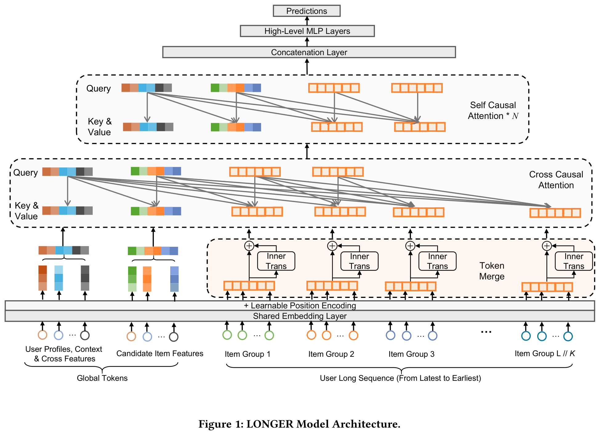
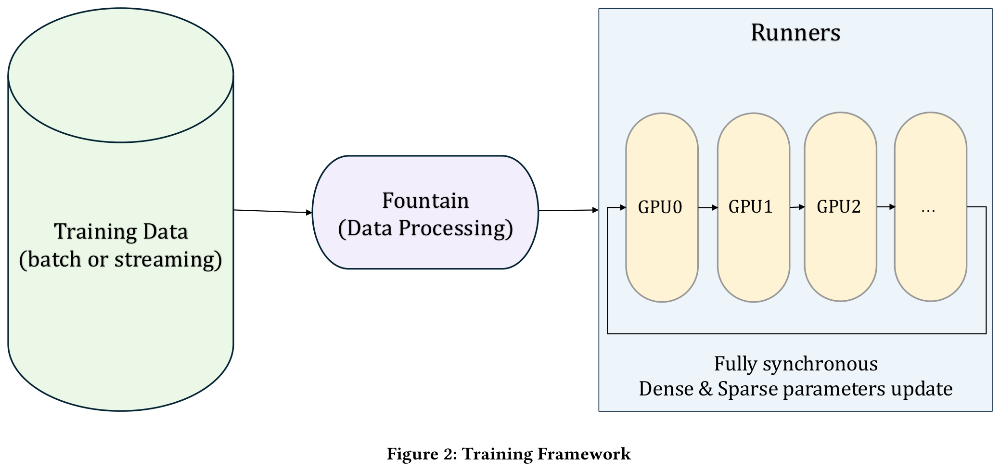
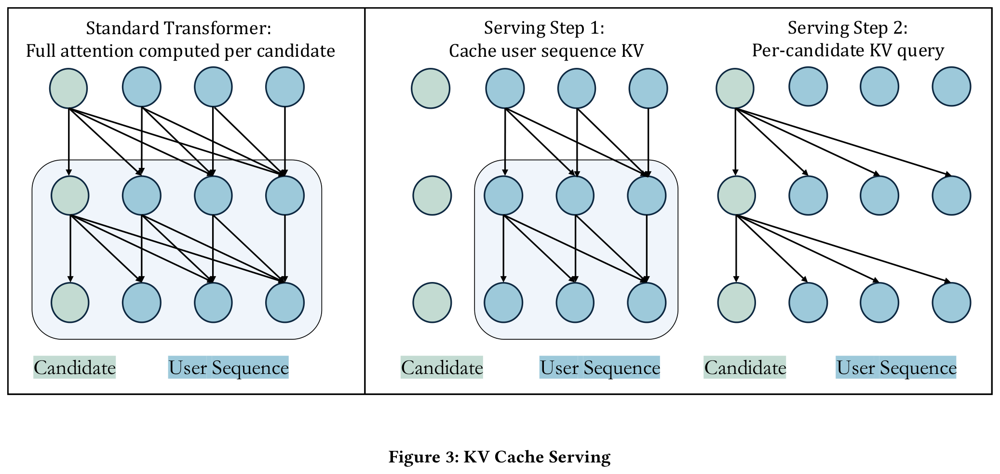
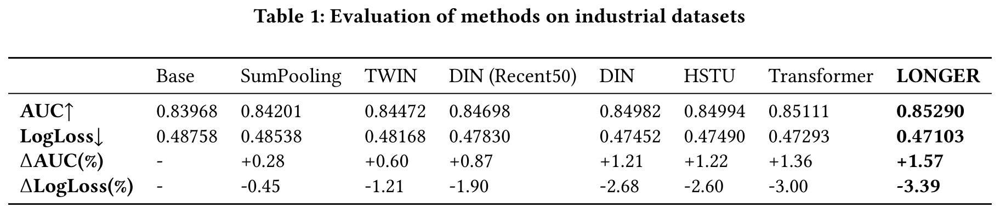
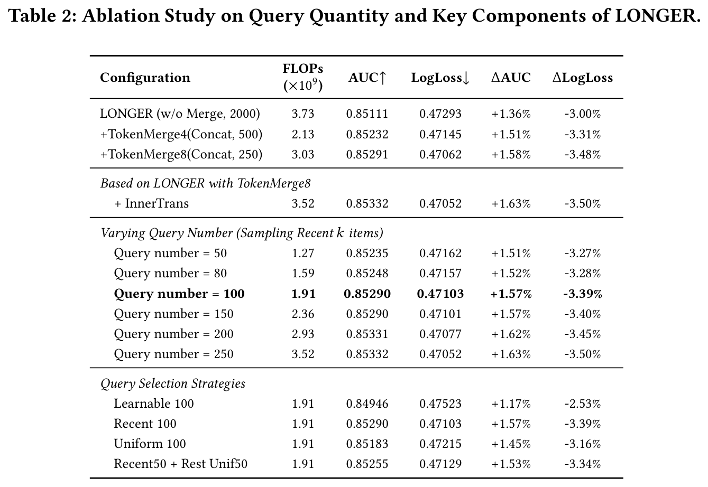
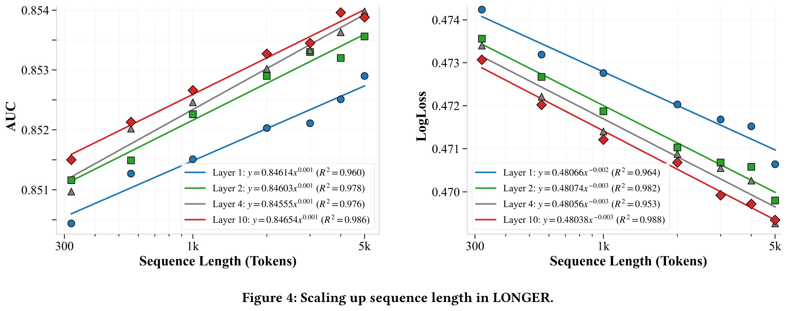
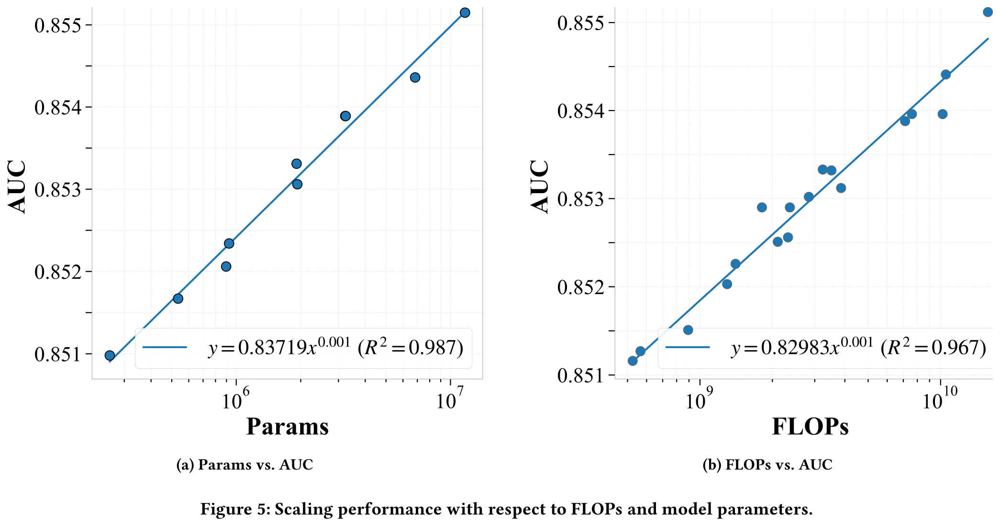
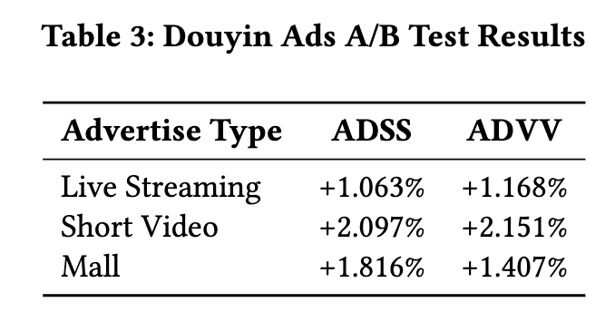
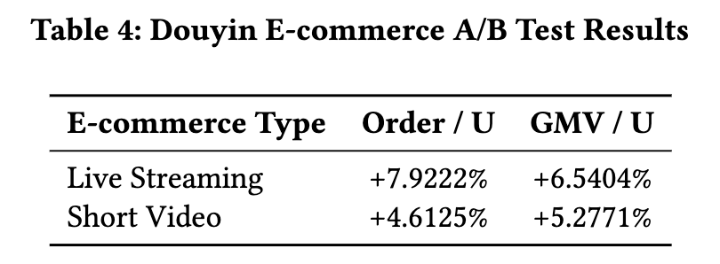

# LONGER：在工业推荐系统中扩展长序列建模

# 摘要
建模超长用户行为序列对于在工业级推荐系统中捕捉用户的长期和短期偏好至关重要。现有方法通常依赖两阶段检索或间接建模范式，导致上下游不一致以及计算效率低下。该论文提出了 LONGER，一种面向GPU高效的长序列优化Transformer（Long-sequence Optimized traNsformer for GPU-Efficient Recommenders）。LONGER 包含（i）一种全局 token 机制，用于在长上下文中稳定 attention；（ii）一种带有轻量级 InnerTransformer 和混合 attention 策略的 token merge 模块，以降低 quadratic complexity；以及（iii）一系列工程优化，包括使用混合精度训练和激活重计算、KV cache serving，以及用于统一GPU上稠密与稀疏参数更新的全同步模型训练与服务框架。LONGER 在字节跳动的广告和电商服务中，无论是离线指标还是在线 A/B 测试，均持续优于强基线模型，验证了其一致的有效性与工业级扩展规律。目前，LONGER 已在字节跳动数十个真实世界的重要场景中完成验证并全面部署，服务数十亿用户。

# 1 引言
在推荐系统中，超长的用户历史行为序列全面地涵盖了用户的长期和短期偏好。尽管早期的序列建模架构在学术界和工业界都得到了广泛研究和应用，但其应用仍主要局限于短序列场景（序列长度为 $`10^2 - 10^3`$ ）。对长序列（长度 > $`10^3`$ ）进行完整建模在推荐准确性和多样性方面具有显著优势，并有助于缓解信息茧房现象。然而，由于计算资源的限制，当前工业界的 $`de\ facto`$ 实践在长序列建模中主要采用以下策略：

 

- 两阶段检索。从原始的超长序列中选择与当前候选 item 最相关的 top- $`k`$ 个 item（通常 $`k`$ 为 $`10^2`$ 量级），随后进行端到端的短序列建模。最具代表性的工作包括 SIM 和 TWIN。

 

- 预训练用户嵌入（Pre-trained User Embeddings）。在工业界，常见的做法是在源模型中对整个超长序列进行预训练，并生成一个紧凑的用户嵌入（UE），然后将其迁移到下游推荐模型中。借助高性能的先进 GPU，该方法支持对长度达 $`10^3`$ 的序列以及多层 Transformer 进行预训练。

 

- 增强记忆模型（Memory-augmented Models）。多通道用户兴趣记忆网络（MIMN）提出了一种基于神经图灵机和记忆归纳单元的结构用于用户序列记忆；大记忆网络（LMN）则提出了一种基于乘积量化分解的轻量级结构；记忆增强推荐模型（MARM）提出了一种计算与记忆权衡的范式，通过缓存计算密集模块的中间结果来提升效率。

尽管这些策略显著提升了计算效率，但由于存在上下游不一致或对原始超长序列的间接感知，不可避免地牺牲了原始完整序列的信息，因此这些方法本质上仍属于向端到端长序列建模演进过程中的中间阶段。

最近，以 GPT 为代表的大语言模型的快速发展确立了“缩放定律”（scaling laws）——即模型性能随模型规模、数据量和计算量增大而提升的经验性规律。这些缩放定律近年来已指导了推荐系统领域的创新。例如，HSTU 采用由残差连接串联的多个相同自注意力层堆叠结构来建模长序列，其性能优于传统的 Transformer 架构。Wukong 提出了一种基于堆叠因子分解机和线性压缩块的交互架构，并在推荐系统中验证了缩放定律的有效性。

与此同时，随着计算基础设施的快速进步（如 GPU 的 FLOPs/内存、大规模计算平台与框架的工程化发展），令人振奋的是，我们已能够在工业级推荐系统中率先实现端到端的超长序列建模范式。因此，推进对超长序列的端到端建模，并持续扩展序列长度、优化长序列建模范式下的架构，已成为下一代序列建模框架的关键任务。

为此，该论文提出了面向 GPU 高效推荐器的长序列优化 Transformer 模型，即 LONGER（Long-sequence Optimized traNsformer for GPU-Efficient Recommenders）。在该框架中，作者将序列输入组织为全局 token 和原始序列，并在此基础上设计了一种基于 inner-transformer 的 token 合并方法，以有效降低计算开销。此外，由于用户超长序列中通常存在大量噪声，作者采用了一种高效的混合注意力策略，在提升计算效率的同时保持模型性能。同时，为在亿级用户规模下全面部署 LONGER，该论文还提出了一系列工程优化措施，包括支持混合精度和激活重计算的全同步训练与服务框架，以及 KV cache 服务策略。总体而言，该论文的主要贡献总结如下：

 

- 提出了 LONGER，一种面向 GPU 高效推荐器的长序列优化 Transformer 结构。该结构从工业级 GPU 效率视角出发，优化了 Transformer 架构，并在工业场景中以端到端方式将用户序列建模长度扩展至 10,000。

 

- LONGER 通过 token 合并和混合注意力策略显著提升了计算效率，减少了 50% 的 FLOPs，并被验证在性能上几乎无损。此外，设计了一个完全优化的工业级训练与服务框架，进一步提升了 GPU 计算效率和线上部署能力。

 

- 开展了全面的实验验证其有效性。在十亿级工业数据集上进行了离线实验，并在抖音的两个重要业务场景中进行了线上 A/B 测试以验证其性能。目前，LONGER 已在字节跳动数十个场景中广泛部署，影响数十亿用户。

# 2 相关工作

## 2.1 传统短序列建模
迄今为止，工业推荐系统主要遵循序列建模与特征交互相结合的建模范式。在此框架中，序列建模长期以来在刻画用户偏好方面发挥着关键作用。在大量研究中，DIN 的出现是一个重要的里程碑。随后的研究提出了 DIEN 、CAN  等方法。此外，针对用户偏好建模的不同方面，多领域 、多兴趣 以及序列去噪方法也被广泛探索。需要注意的是，大多数此类精心设计的结构均为短序列建模而开发，而长序列建模方法则较晚引起越来越多的研究关注。

## 2.2 长序列建模
如引言部分所述，长序列建模方法通常可分为两阶段检索、预训练用户嵌入以及基于记忆增强的模型。总体而言，基于检索和预训练的方法属于两阶段策略，而记忆增强模型通常需要较长的训练周期以在记忆槽中积累命中率。最近，一些研究尝试直接对长序列进行建模  。然而，在大规模工业推荐系统中，如何实现 GPU 高效的长序列建模仍处于探索阶段。

# 3 方法论

## 3.1 问题定义
令 $`\mathcal{U}`$ 和 $`\mathcal{I}`$ 分别表示用户集合和 item 集合。给定用户 $`u \in \mathcal{U}`$ 的原始行为序列 $`S_u = [i^{(u)}_1, ..., i^{(u)}_L]`$ ，其中 $`i^{(u)}_t \in \mathcal{I}`$ ，用户基础特征 $`u_d`$ （包括用户画像、上下文特征和交叉特征），以及目标 item $`v \in \mathcal{I}`$ ，推荐任务的目标是预测点击或转化概率：

$$
P(y=1 \mid S_u, u_d, v) \in [0,1]
$$

其中 $`y \in \{0,1\}`$ 表示用户 $`u`$ 是否会与 $`v`$ 发生交互。该模型通过历史交互数据 $`\mathcal{D} = \{(S_u, u_d, v, y)\}`$ 学习这一映射关系，并通过优化二元交叉熵损失函数进行训练：

$$
\mathcal{L} = -\frac{1}{|\mathcal{D}|} \sum_{(S_u, u_d, v, y) \in \mathcal{D}} \left[ y \log \hat{y} + (1-y) \log (1-\hat{y}) \right]
$$

其中 $`\hat{y} = f_\theta(S_u, v)`$ 表示推荐模型预测的概率。

## 3.2 整体框架
该论文提出的框架旨在应对推荐系统中建模长且复杂的用户行为序列的挑战，同时在工业规模下保持训练和推理的高效性。图1展示了所提出模型 LONGER 的整体架构。该框架集成了输入生成、Token Merge、混合注意力机制以及训练-服务一体化优化，以实现高效且可扩展的长序列建模。

首先，作者通过引入 Global Tokens 来增强模型输入结构，这些 Global Tokens 作为聚合的锚点表示（例如目标 item 表示、用户ID（UID）嵌入），用于促进全局信息融合并稳定注意力分布。接着，应用 Token Merge 对长行为序列进行压缩，在保留关键局部模式的同时降低计算复杂度。为进一步保持组内依赖关系，作者引入了 InnerTrans，这是一种轻量级的内部 Transformer，应用于合并后的 token 段内部。核心模型架构在“LONGER 模型结构”部分进行了描述，采用一种混合注意力设计，结合了交叉因果注意力（用于突出序列中的显著部分）和堆叠的自回归因果注意力层（用于捕获序列中的高阶依赖关系）。

为确保可扩展性和部署可行性，该框架融入了多项工程系统级优化。该框架在超大规模 GPU 集群上提供完全同步的训练与服务，并统一存储稠密和稀疏参数。通过采用混合精度训练（Mixed Precision Training）和重计算（Recompute）进一步提升内存和计算效率，实现激活内存的减少和自定义数值精度的支持。最后，在推理阶段，部署了一种 KV Cache Serving 策略，缓存用户序列表示并在候选 item 打分过程中重复使用，显著减少冗余计算。

上述各组件共同构成一个紧密协作的系统，支持兼具高表达能力和高效率的长序列建模，可直接部署于大规模真实推荐场景中。

## 3.3 Global Tokens
该论文引入 Global Tokens 作为附加到输入序列中的辅助表示，以促进全局信息提取和锚定。这些 token 可包括目标 item 表示 token、可学习的 CLS token、UID 嵌入，以及高阶压缩的用户-物品交互特征。在设计上，Global Tokens 拥有完整的注意力感受野，使其能够从整个序列中聚合上下文信号，同时也影响所有其他序列 token。

这种架构增强具有两个主要目的。首先，Global Tokens 作为中心化的信息锚点，增强用户历史、上下文属性与候选 item 之间的特征交互。其次，它们在长序列中稳定注意力动态，特别是在稀疏注意力配置下。如 StreamLLM 中所示，引入少量 Global Tokens 可缓解“注意力汇聚”（attention sink）效应，即深层注意力过度关注序列前端 token 的现象。这些 token 作为锚点，维持注意力多样性，并保留对长距离依赖关系的建模能力。

## 3.4 Token Merge
设 $`L`$ 为序列长度， $`d`$ 为嵌入维度。使用标准Transformer处理长行为序列（通常 $`L \geq 2000`$ ）会带来难以承受的计算开销，这是由于注意力机制的二次复杂度 $`O(L^2 d)`$ 所致，尤其在 $`L \gg d`$ 的情况下更为明显（在工业推荐系统中，通常 $`L = 2000`$ ， $`d = 32`$ ）。传统的解决方案如序列截断会导致长程依赖关系的丢失。为了解决该问题，该论文提出了一种 Token Merge 策略，该策略通过将相邻的 token 进行分组，并将其压缩为更短的序列，从而在模型效率与表征保真度之间实现权衡。该策略将序列长度压缩 $`K`$ 倍，实现空间上的压缩。分组后的 token 表征可以通过简单的拼接方式形成，也可以通过引入轻量级的 InnerTrans 模块增强组内交互来进一步优化。这种设计在效率与表达能力之间提供了灵活的权衡，在保留局部语义的同时，支持在更短序列上进行全局建模。

对于标准结构的 Transformer 编码层，其浮点运算量（FLOPs）和参数量可表示为：

$$
\begin{align}&\text{FLOPs}_{\text{vanilla trans}} = 24Ld^2 + 4L^2d  \\ &\text{Params}_{\text{vanilla trans}} = 12d^2 + 13d\end{align}
$$

计算复杂度。进行 token merge 前后的注意力复杂度比值为：

$$
\begin{align}\frac{\text{FLOPs}_{\text{Merge Token}}}{\text{FLOPs}_{\text{vanilla}}} = \frac{24Ld^2K + \frac{4L^2d}{K}}{24Ld^2 + 4L^2d} = \frac{6dK + \frac{L}{K}}{6d + L}\notag\end{align}
$$

在典型的 $`L=2048`$ ， $`d=32`$ 场景下：

- 标准 Transformer： $`\text{FLOPs} \approx 587 \text{M}`$ 

- Token 合并（ $`K=4`$ ）： $`\text{FLOPs} \approx 336 \text{M}`$ （降低 42.8%）

参数扩展 Token merge 通过缩短序列长度来降低计算复杂度，同时引入额外的参数 $`\Theta_{\text{merge}}`$ ，从而在提升效率的同时增强模型的表达能力，有利于整体模型性能的提升。

$$
\Theta_{\text{merge}} = 12K^2d^2 + 13Kd
$$

InnerTrans。为了将多个相邻的 token 合并为一个，若仅采用组内 token 的简单拼接，可能导致 token 之间的交互不足，从而可能丢失细粒度信息。为解决此问题，作者引入了 InnerTrans，即在每个 token 组内应用一个 Transformer 结构，以实现局部交互。该方法确保了组内交互能够被有效捕捉，避免了直接拼接通常会导致的信息丢失。由于 InnerTrans 处理的维度和序列长度都非常小，其计算开销在实际中非常有限。

$$
\mathbf{M}_i = \text{TransformerBlock}\left([\mathbf{e}_{i}^1,...,\mathbf{e}_{i}^K]\right)
$$

其中 $`\mathbf{M}_i`$ 表示第 $`i`$ 个组的表征， $`\mathbf{e}_{i}^k`$ 表示第 $`i`$ 个组中第 $`k`$ 个 item 的嵌入。

## 3.5 LONGER 模型结构
在该论文的模型架构中，采用了一种混合注意力机制，结合了交叉注意力（cross-attention）和自注意力（self-attention）层，以高效地处理输入序列。

### 3.5.1 输入生成

模型的输入由两个主要部分组成：全局token（global tokens）和序列token（sequence tokens）。如第3.3节所述，全局token表示上下文信息（例如目标item的特征和用户标识符），并与序列token拼接形成模型输入。

为了更好地捕捉用户行为序列中的时间动态特性，作者在序列token中引入了额外的位置辅助信息。具体而言，采用了两种位置编码方式：（1）一种绝对时间差特征，用于量化每个用户交互与目标item之间的时间距离，作为辅助信息与每个item embedding拼接；（2）一种可学习的绝对位置编码，用于编码每个token在序列中的位置，并加到item embedding上。

在完成位置编码后，得到的token将通过一个多层感知机（MLP）生成其输入表征 $`\mathbf{R} \in \mathbb{R}^{(m+L) \times d} = [\mathbf{G} \in \mathbb{R}^{m \times d}; \mathbf{H} \in \mathbb{R}^{L \times d}]`$ ，其中 $`\mathbf{G}`$ 和 $`\mathbf{H}`$ 分别表示全局token和序列token的表征。随后，查询矩阵 $`\mathbf{O}`$ 通过拼接 $`m`$ 个全局token $`\mathbf{G} \in \mathbb{R}^{m \times d}`$ 与从完整序列token $`\mathbf{H}`$ 中根据预定义采样策略选取的 $`k`$ 个采样序列token $`\mathbf{H}_\mathbf{S} \in \mathbb{R}^{k \times d}`$ 构成。类似的查询压缩思想也在其他研究领域被探索过，例如Perceiver和Q-Former，它们采用可学习token策略进行压缩。在实验中，该论文全面比较了多种策略，包括选取最近的 $`k`$ 个token、均匀采样token，或初始化 $`k`$ 个可学习token，发现使用最近 $`k`$ 个token效果最好。这种混合注意力设计也受到如下观察的启发：模型性能相对于序列token数量呈现出显著的边际效应——仅采样完整序列40%的token即可保留超过95%的性能提升，同时减少约50%的FLOPs（见第4节）。最终的复合查询构造如下：

$$
\mathbf{O} = [\mathbf{G}; \mathbf{H}_\mathbf{S}]
$$

这种混合设计使注意力聚焦于关键的局部行为和全局上下文信号，使模型能够高效地捕捉特定的序列依赖关系以及更广泛的上下文信息。

### 3.5.2 交叉因果注意力（第一层）

在第一层注意力中，使用前一步生成的查询矩阵 $`\mathbf{O}`$ 和输入token $`\mathbf{R} \in \mathbb{R}^{(m+L) \times d}`$ 进行交叉因果注意力计算。交叉注意力机制的计算方式如下：

$$
\mathbf{Q} = \mathbf{O} \mathbf{W}_\mathbf{Q}, \quad \mathbf{K} = \mathbf{R} \mathbf{W}_\mathbf{K}, \quad \mathbf{V} = \mathbf{R} \mathbf{W}_\mathbf{V}
$$

$$
\text{Attention}(\mathbf{Q}, \mathbf{K}, \mathbf{V}) = \text{Softmax}\left(\frac{\mathbf{Q} \mathbf{K}^T}{\sqrt{d}} + \mathbf{M}\right)\mathbf{V}
$$

其中 $`\mathbf{W}_\mathbf{Q}`$ 、 $`\mathbf{W}_\mathbf{K}`$ 和 $`\mathbf{W}_\mathbf{V}`$ 分别为查询、键和值的投影矩阵，形状为 $`\mathbb{R}^{d \times d}`$ ，掩码矩阵 $`\mathbf{M}`$ 定义为：

$$
\mathbf{M}_{i,j} = \begin{cases}
0, & \text{if } j \geq i,\ \text{where} \{i, j\} \in [1, m+L] \\ -\infty, & \text{otherwise} \end{cases}
$$

因果掩码设计一方面保持了序列项之间的时间相关性，另一方面确保了从序列无法“看到”候选item，从而支持KV Cache Serving机制（见第3.6.3节）。计算注意力后，结果将通过一个前馈网络（FFN）进行进一步处理。

### 3.5.3 自回归注意力（后续层）
在交叉自回归注意力层之后，后续层由多个自回归注意力块组成。这些层专注于学习采样后token序列内部的关系，使模型能够捕捉行为序列内部token之间的依赖关系和模式。每个自回归注意力层后都跟随一个FFN（前馈网络），以进一步处理注意力机制所学到的信息。自回归注意力机制的计算采用类似的公式：

$$
\text{SelfAttention}(\mathbf{Q}, \mathbf{K}, \mathbf{V}) = \text{softmax}\left(\frac{\mathbf{Q}\mathbf{K}^T}{\sqrt{d}} + \mathbf{M} \right)\mathbf{V}
$$

其中，查询（query）、键（key）和值（value）是通过对前一层输出分别应用独立的线性投影矩阵 $`\mathbf{W}_\mathbf{Q}`$ 、 $`\mathbf{W}_\mathbf{K}`$ 、 $`\mathbf{W}_\mathbf{V}`$ 得到的。

### 3.5.4 堆叠与压缩
自回归注意力层被堆叠 $`N`$ 次，以迭代地优化输入序列的表示。经过这些层的处理后，模型生成一个压缩后的输出，代表注意力机制的最终输出。该输出随后用于下游的预测任务。

$$
\underbrace{\text{CrossAttn}(\mathbf{O}, \mathbf{R})}_{\mathclap{\text{compress long sequence}}} \longrightarrow \underbrace{\text{SelfAttn}(\cdot)\times N}_{\mathclap{\text{high-order interactions}}}
$$

通过在第一层使用交叉注意力、在后续层使用自注意力的组合方式，该论文提出的方法能够高效处理长序列，同时利用全局上下文信息和序列内部的依赖关系。

## 3.6 训练与部署优化

### 3.6.1 训练框架
  
该论文提出的训练框架是一个面向大规模稀疏模型的完全同步系统，专为充分利用现代高性能 GPU 的能力而设计。该框架基于硬件–软件协同设计的理念，旨在最大化分布式训练中的计算吞吐量和内存效率。训练流程从批量或流式形式的数据摄入开始，随后通过 Fountain 模块进行预处理。处理后的训练数据被分发到多个 GPU 执行单元，在其中同步更新稠密和稀疏参数。这种统一的设计有助于在设备和节点之间有效扩展，为在生产环境中训练大规模参数模型提供了坚实基础。

该框架的一个显著特点是其统一的参数存储与训练架构。稠密和稀疏参数均存储并在 GPU 设备上同步更新，无需依赖外部的参数服务器（Parameter Server）组件。为了更好地适应推荐系统中特征分布的特性，框架采用了分层内存系统来管理稀疏 embedding，从而高效支持大规模 embedding 表。在此设计中，高频特征存储在高带宽 GPU 内存（HBM）中，中频特征存放在 CPU 主存（MEM）中，低频特征则卸载至本地固态硬盘（SSD）。这种分层存储结构针对推荐数据的访问特性进行了优化，在延迟、吞吐量和容量之间实现了实际可用的权衡。其核心创新在于将计算与参数存储完全共置于 GPU 设备上，从而减少了通信开销和内存传输延迟。这带来了更高的训练吞吐量、更低的参数延迟（staleness）以及更强的收敛稳定性。

### 3.6.2 混合精度训练与重计算
为了缓解训练过程中GPU内存的压力，该论文采用重计算策略并结合混合精度训练。在梯度计算方面，使用反向模式自动微分，相较于前向模式虽更高效，但需在前向传播过程中保存所有中间激活值。这些激活值可能成为主要的内存瓶颈。为解决此问题，作者支持在模型定义层级声明重计算机制，允许在前向传播过程中丢弃部分选定的激活值，并在反向传播时重新计算。该方法以额外计算代价换取内存节省。由于原生TensorFlow并未提供官方的重计算支持，因此该论文基于 custom_gradient 机制实现该功能，通过代码级注解实现细粒度控制。

此外，为了减少密集模型扩展带来的计算开销，该论文采用基于BF16/FP16的混合精度训练。用户可在模型层级配置精度，对关键组件使用更高精度，其余部分使用较低精度。该方法在实际生产工作负载中展现出显著优势，平均实现+18%的吞吐量提升、-16%的训练时间减少和-18%的内存占用降低，在密集层中内存减少最高可达-28%。

### 3.6.3 KV缓存推理
为提升在对多个候选进行打分时的推理效率，受M-FALCON启发，作者引入KV缓存机制，将用户行为token与候选相关的全局token之间的注意力计算进行解耦。由于用户序列在不同候选间保持不变，其内部表示只需计算一次并可重复使用。

具体而言，注意力输入被划分为两部分：(1) 用户序列token，(2) 与候选item相关联的全局token。用户序列的键（key）和值（value）投影被预先计算并缓存。对于每个候选，仅需计算其全局token与缓存中用户序列之间的注意力。这形成了一个两阶段的推理流程：

- 预计算并缓存用户序列的键-值（key-value）张量。

- 计算每个候选的全局token与缓存中用户序列之间的注意力。

如图 **figure 3** 所示，该优化避免了冗余计算，显著降低了服务延迟。在实际应用中，该方法提升了在线服务效率，使吞吐量下降幅度从最高达 $`-40\%`$ 降低至仅 $`-6.8\%`$ 。

# 4 实验

## 4.1 实验设置
该论文在抖音广告系统中的转化率（CVR）预测任务上评估所提出模型，这是一个真实场景下的大规模工业级广告推荐场景。数据集构建自2024年10月16日至2025年2月23日之间收集的部分在线用户交互日志，包含连续130天内的52亿个样本。每个样本包括用户人口统计特征，如用户ID（UID）、性别、超长用户行为序列以及一个候选广告item，用户行为序列中包含多种交互类型，如页面浏览、点击和转化，而item侧特征则涵盖广告内容、展示上下文及相关元数据。实验采用时间一致的数据划分策略：前123天的数据用于训练，剩余7天用于离线评估。该设置与实际部署实践保持一致，并有效防止了模型开发过程中未来数据的泄露。

为进行对比，该论文将所提模型与多个强基线模型进行比较，这些基线模型根据其建模用户短期或长期行为的能力进行分类。短序列方法包括TWIN 和 DIN (Recent50)，它们仅依赖最近50次交互。长序列方法则包括SumPooling、DIN、HSTU 和 Transformer，这些方法可处理更长的行为历史，但在工业环境中通常面临可扩展性和效率问题。所有模型均使用相同的预处理流程和超参数调优方法，实验在48块A100 GPU构成的集群上进行。

## 4.2 整体性能

### 4.2.1 现有方法的比较
该论文在离线评估集上使用推荐系统中二分类任务的两个标准指标报告模型性能：AUC（ROC曲线下面积）和LogLoss。表 1 总结了多个基线模型与所提模型的结果。根据该表，该论文提出的模型在所有基线模型中表现最优，达到了0.85290的AUC和0.47103的LogLoss，相比基础模型AUC相对提升了1.57%，相比最具竞争力的模型Transformer，AUC提升了0.21%。需指出的是，在工业场景中，0.1%的提升通常被视为显著改进，足以影响在线A/B测试的表现。此外，所提模型相较于原始Transformer在效率方面也显著更高（详见第4.2.2节）。该提升表明该方法在捕获长距离行为依赖的同时，仍保持了较高的计算效率。

### 4.2.2 消融实验  
表 **table 2** 展示了对 LONGER 中关键组件以及与 query 相关配置的消融研究。首先，作者考察了 TokenMerge 模块和 InnerTrans 组件的影响。与不进行 token 合并的基础模型相比，引入 TokenMerge（Concat, 250）将 FLOPs 从 $`3.73 \times 10^9`$ 降低至 $`3.03 \times 10^9`$ ，同时 AUC 提升了 1.58%，LogLoss 下降了 3.48%。进一步加入 InnerTrans 带来了额外收益，达到了最优的 LogLoss 值 0.47052，并实现 1.63% 的 AUC 提升。

  

接下来，作者改变了用于总结用户近期行为的 query 数量（ $`k`$ ）。结果显示，增加 $`k`$ 通常能提升模型性能，但也带来了更高的计算开销。值得注意的是，使用 100 个 query 能取得良好的权衡：AUC 达到 0.85290，LogLoss 为 0.47103，性能接近使用全部 query（ $`k=250`$ ）的情形，但 FLOPs 仅为后者的 54%。该设置在表 **table 2** 中以加粗标出，体现了其在实际部署中的实用性，尤其是在计算资源受限的场景下。

最后，作者比较了不同的 query 选择策略。这些策略可视为 query 集的不同初始化方式。其中，使用可学习 query（随机初始化）的表现最差（AUC = 0.84946）。相比之下，直接选取最近的 100 个用户行为（Recent 100）取得了最佳的整体性能。其他策略，如均匀采样或结合最近与均匀采样项目，AUC 稍低且 LogLoss 更高。这些结果表明，使用具有信息量的行为（尤其是近期行为）来初始化 query，对于在长序列建模中有效捕捉用户意图至关重要。

总体而言，该论文的消融实验验证了架构改进（如 TokenMerge、InnerTrans）和与 query 相关的策略（如 query 数量和选择方法）在平衡准确率和效率方面均起到关键作用。研究结果表明，通过精心设计关键组件和行为建模流程，LONGER 能够在降低计算成本的同时实现优异性能。这种配置使该方法非常适用于大规模工业部署，其中低延迟推理和系统吞吐量至关重要。

## 4.3 扩展性分析  
本节中，作者展示了模型性能随序列长度、FLOPs 和参数量变化的扩展性分析。这些因素的扩展行为遵循如下通用形式：

$$
y = \alpha x^\beta + \gamma
$$

其中 $`y`$ 表示性能指标（AUC 和 LogLoss）， $`x`$ 表示扩展因子（序列长度、FLOPs 或参数量）， $`\alpha`$ 和 $`\beta`$ 是常数， $`\gamma`$ 表示常数偏移项。

### 4.3.1 序列长度  
作者分析了不同模型深度下性能随输入序列长度的变化情况。如图 **figure 4** 所示，随着 token 数量的增加，AUC 持续提升，LogLoss 持续下降，符合幂律趋势。更深的模型从更长序列中获益更多，但随着深度增加，AUC 提升速度减缓，表明存在收益递减现象。最优深度应在模型容量与计算约束之间取得平衡。

  

总体来看，更长的序列有助于提升性能，特别是当与适当选择的深度相结合时。超过一定深度后，进一步提升的效果趋于边际。

 
 

### 4.3.2 参数量
作者通过在固定层数为2、输入序列长度为2000的条件下缩放隐藏层维度大小来评估模型容量。如图 **figure 5** (a) 所示，AUC 随着参数量的增加而稳步上升，呈现出强烈的幂律趋势（ $`R^2 = 0.987`$ ）。这些结果表明，在固定架构下，增加模型宽度能有效提升性能，在当前参数范围内未见饱和迹象。

### 4.3.3 FLOPs
该论文通过在固定模型维度为32的条件下改变层数和序列长度来分析模型性能。如图 **figure 5** (b) 所示，AUC 随 FLOPs 的增加而稳步提升，同样遵循强烈的幂律趋势（ $`R^2 = 0.967`$ ）。这表明，即使在模型宽度固定的情况下，增加计算资源仍能使模型处理更长或更复杂的用户行为序列，从而捕捉更高阶的依赖关系并提升预测准确性。

这些结果表明，增加计算资源是提升模型性能的有效方式，但效率增益需与实际系统中常见的计算和内存限制之间进行权衡。

## 4.4 在线 A/B 测试
本节展示了在线 A/B 测试的结果，用于评估所提出的模型在抖音广告和抖音电商平台真实场景中的有效性，这两个平台均为极具影响力的商业化平台，拥有数十亿用户。这些场景中的基线模型已相当强大，因此观测到的改进更具意义。双领域测试使作者能够评估该模型在广告和电商环境中的泛化能力，而这正是平台生态系统的关键组成部分。

### 4.4.1 抖音广告平台
本节展示了抖音广告平台的 A/B 测试结果，该论文使用两个关键指标 ADSS（Advertiser Score）和 ADVV（Advertiser Value）来评估模型性能，这两个指标是工业级广告系统中最重要的指标。测试覆盖了三种广告形式：直播、短视频和商城。在直播形式下，模型在 ADSS 上提升了 1.063%，在 ADVV 上提升了 1.168%。在短视频形式中，ADSS 提升了 2.097%，ADVV 提升了 2.151%。在商城形式下，ADSS 提升了 1.816%，ADVV 提升了 1.407%。这些结果验证了该模型在所有广告形式下均能有效提升性能，并保持一致的增益。
 

### 4.4.2 抖音电商业务
对于抖音电商的 A/B 测试，作者使用两个关键指标来评估不同内容形式的有效性：Order/U（每用户订单数）和 GMV/U（每用户商品交易总额）。这些指标有助于理解模型不仅对总销售额的影响，也对用户层级的参与度和价值生成的影响。结果表明，两个指标均有显著提升。在直播内容中，Order/U 提升了 7.9222%，GMV/U 提升了 6.5404%，表明直播内容对每用户的订单数和交易额均有显著正向作用。在短视频内容中，Order/U 提升了 4.6125%，GMV/U 提升了 5.2771%，显示出短视频内容在提升人均销售方面同样有效。这些结果突显了两种内容形式的显著影响，其中直播在 Order/U 和 GMV/U 上均表现出更大的提升幅度。
 

5 结论  
在该论文中，作者提出了 LONGER，一种基于 Transformer 的框架，旨在工业级推荐系统中高效且可扩展地建模超长用户行为序列。通过引入一系列架构设计，包括全局 token、结合 InnerTrans 的 token 合并、混合因果注意力机制，以及系统级优化措施如 GPU 同步框架、混合精度与重计算训练、以及 KV cache 服务，LONGER 实现了在真实工业约束下的端到端超长序列建模。在工业级十亿规模数据集上的大量实验以及在广告和电商领域开展的在线 A/B 测试，验证了该方法在十亿用户规模工业场景下的鲁棒性与泛化能力。值得注意的是，LONGER 在取得具有竞争力的准确性的同时，显著降低了计算开销，因此非常适合部署于对延迟敏感的生产环境。未来的工作将包括探索更高效的序列建模技术，并改进工业场景下的跨域行为建模。
