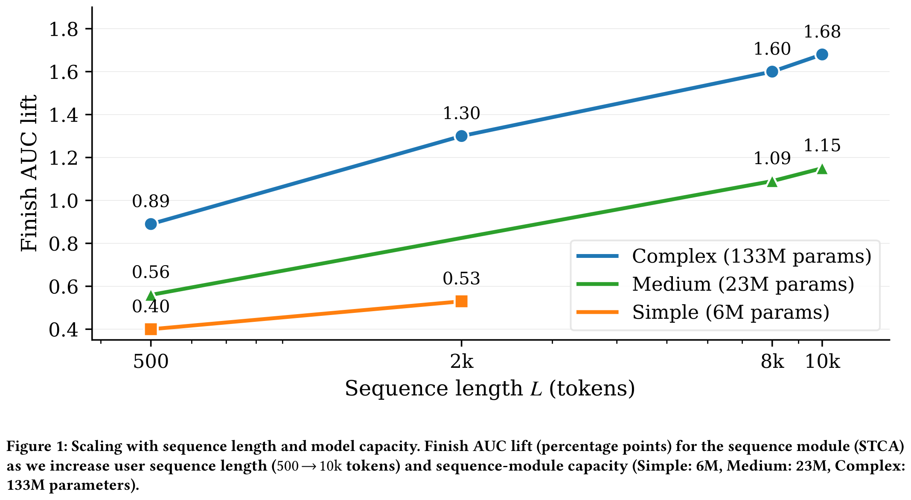
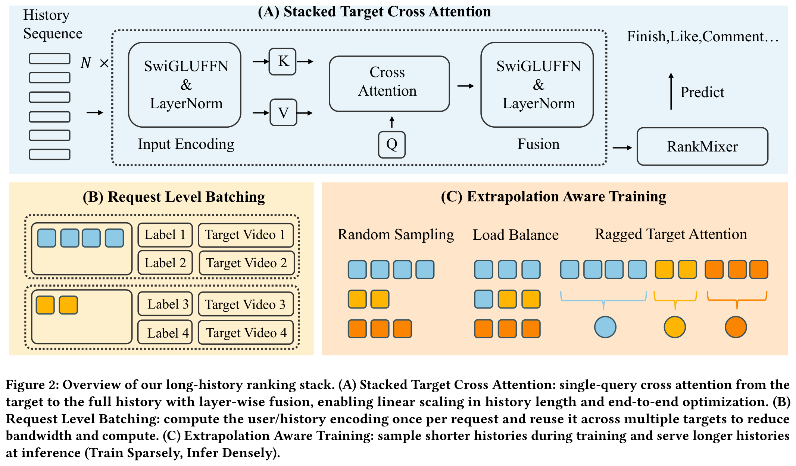
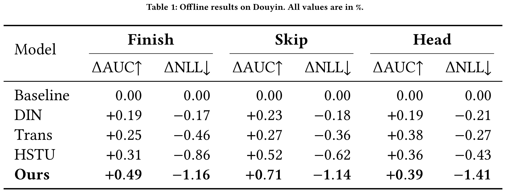
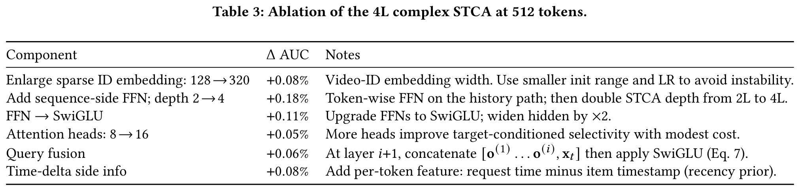
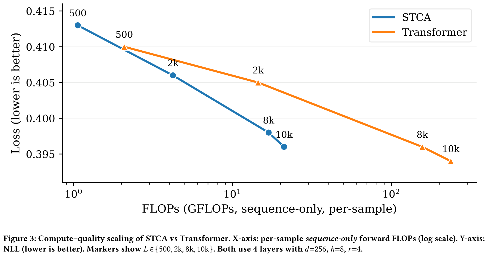
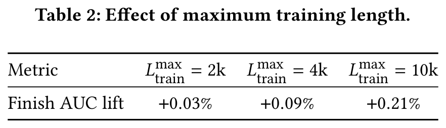
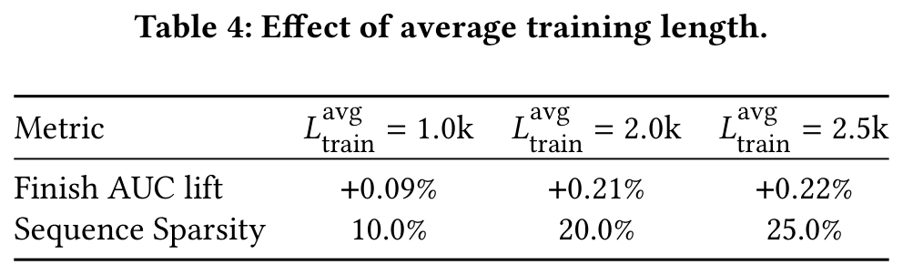
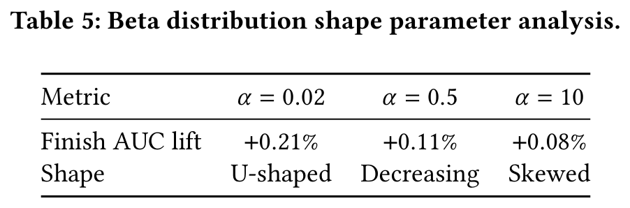
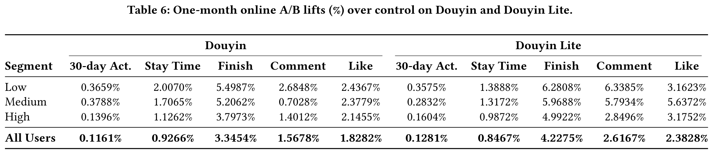

# 让它变长，同时保持快速：抖音上十亿规模的端到端10k序列建模
# 摘要

短视频推荐系统（如抖音）必须在不突破延迟和成本预算的前提下，充分利用极长的用户历史。该论文提出了一套端到端系统，实现了在生产环境中对长达 10k 的用户历史进行建模。首先，作者引入了 Stacked Target-to-History Cross Attention (STCA)，该机制用从目标到历史的堆叠交叉注意力替代历史的自注意力，将计算复杂度从序列长度的二次级降低为线性级，从而实现了高效的端到端训练。其次，作者提出了 Request Level Batching (RLB)，一种以用户为中心的批处理策略，通过聚合同一用户/请求的多个目标，共享用户侧的编码结果，显著降低了与序列相关的存储、通信和计算开销，同时不改变学习目标。第三，作者设计了一种长度可外推的训练策略——在较短的历史窗口上训练，在长得多的序列上推理，从而使模型能够在不增加训练成本的情况下泛化到 10k 长度的历史序列。通过离线和在线实验，随着历史长度和模型容量的增加，观察到指标呈现可预测且单调的增长趋势，与大语言模型中观察到的 scaling law 行为相似。该系统已在抖音全量流量上线部署，在满足生产延迟要求的同时，显著提升了关键互动指标，展示了通往端到端、10k 级长序列推荐建模的实用路径。

# 1 引言

深度神经网络已成为现代推荐系统的核心，广泛应用于电子商务、新闻推送和短视频平台。其关键原因在于能够利用用户行为序列，因为历史交互为推断用户偏好提供了重要信号。在抖音等短视频推荐场景中，用户历史行为序列往往长达数千个视频。如果能有效利用这些长序列，将显著提升排序性能。

对建模更长序列的重视源于深度学习的缩放定律（scaling law）：性能通常随着数据量、参数量和计算资源的增加而可预测地提升。与自然语言处理（NLP）和计算机视觉（CV）领域通常通过扩大数据集实现缩放不同，推荐系统受限于用户生成的数据。一种自然的方式是使用更长的历史记录以暴露更多信息。然而，大多数系统采用两阶段范式：先检索出与目标相似的小集合，再将截断后的序列输入排序模型。虽然这种方式效率较高，但打破了端到端优化，并丢弃了有价值的交互信息。该论文的实证结果（图 **figure 1**）表明，当架构和系统支持真正的长序列训练与推理时，模型质量会随着序列长度和序列模块容量的增加而平稳提升，这与其它模态中的缩放定律行为相呼应。为了真正释放大规模推荐模型的缩放潜力，必须在严格的在线延迟和成本预算下实现端到端的长序列训练。系统设计需有选择性地分配计算资源，而更长的历史记录会在分布式训练中放大存储、通信和计算开销。为此，作者结合了以下三点：（i）一种以目标为中心的单查询交叉注意力模型（STCA），其每层计算成本在序列长度上线性增长；（ii）请求级批处理（Request Level Batching, RLB），可在单个请求内跨多个目标摊销用户侧编码，并可进一步扩展至同一用户/会话的多个请求之间共享，带来更高的效率增益；（iii）“训练稀疏、推理密集”的训练范式：在平均约 2k token 的序列上进行训练，但在服务阶段外推至 10k token，从而在不增加训练计算开销的前提下保持端到端建模。这些组件共同实现了随序列长度和模型容量增长的可预测性能提升，符合缩放定律行为（图 **figure 1**）。

 

**该论文的贡献**：作者在实现实际可用的端到端长序列推荐方面提出了三项贡献：

- **高效的序列建模架构**：提出堆叠式目标到历史交叉注意力结构（Stacked Target-to-History Cross Attention, STCA），优先建模目标 item 与历史行为之间的交叉注意力，省去历史序列内部的自注意力，从而将复杂度从 $`O(L^2)`$ 降低至 $`O(L)`$ （ $`L`$ 为序列长度）。通过堆叠多层结构，可在目标条件驱动下融合信息，捕捉高阶依赖关系。

- **基于用户中心的可扩展训练方法**：提出请求级批处理（Request Level Batching, RLB），聚合来自同一用户的样本，共享一个用户侧编码以处理多个目标。该方法可自然扩展至同一用户/会话下的多个请求间共享，在内存、通信和计算方面带来显著节省（实验报告在请求级共享下最多可减少 $`8\times`$ 开销），同时仍是经验风险的无偏估计。

- **训练稀疏、推理密集**：采用一种长度外推的训练策略，在平均约 2k 长度的序列上进行训练，但在推理时扩展至最长 10k 的序列，将训练成本与部署时的上下文长度解耦，在不增加训练计算量的前提下实现长序列带来的收益。

上述创新为在生产约束下沿序列维度进行可扩展建模提供了实用框架。该方法已在大规模短视频平台上部署，显著提升了多个业务指标的在线效果。

# 2 背景与符号

**符号说明。** ：本文全程使用以下符号。用户交互历史为 $`\mathcal{H}=\{(v_i,a_i)\}_{i=1}^L`$ ，长度为 $`L`$ ，其中 $`v_j`$ 表示第 $`j`$ 个历史视频的特征向量， $`a_j`$ 表示其交互类型； $`t`$ 表示待排序的候选（目标）视频。 $`(v_j,a_j)`$ 的嵌入表示为 $`\mathbf{x}_j`$ ， $`t`$ 的嵌入表示为 $`\mathbf{x}_t`$ 。令 $`d`$ 为嵌入维度， $`r`$ 为 SwiGLU FFN 中的扩展比例， $`h`$ 为注意力头数， $`M`$ 为堆叠的交叉注意力层数。模型输出 $`\hat{y}\in[0,1]`$ ，表示目标视频 $`t`$ 的预测完播概率， $`y\in\{0,1\}`$ 为完播标签的真值。

该论文考虑大规模短视频推荐场景（例如抖音 / TikTok），系统需对一组候选视频进行排序。实际中，最终得分可能融合多个目标（完播、点击等）；为清晰起见，本文聚焦于完播率的预测。

用户信号主要由交互历史决定。设

$$
\mathcal{H}=\{(v_1,a_1),\ldots,(v_L,a_L)\},
$$

其中 $`v_j`$ 为第 $`j`$ 个历史视频的特征向量， $`a_j`$ 编码交互类型。待排序的候选视频为 $`t`$ 。各类特征（ID、多模态内容、创作者属性等）被嵌入为 $`(v_j,a_j)`$ 对应的 $`\mathbf{x}_j`$ 和 $`t`$ 对应的 $`\mathbf{x}_t`$ 。

给定输入 $`(\mathcal{H},t)`$ ，排序模型输出一个标量 $`\hat{y}\in[0,1]`$ ，表示在给定历史 $`\mathcal{H}`$ 的条件下用户完整观看视频 $`t`$ 的估计概率。该符号表示将在后文介绍模型结构与训练策略时沿用。

# 3 方法

该论文提出一种面向短视频排序中长序列建模的端到端框架，该框架结合了序列高效的架构设计、以用户为中心的批处理策略以及支持长度外推的训练机制，如图 **图2** 所示。

## 3.1 堆叠目标交叉注意力（STCA）

在排序任务中，预测用户对候选视频 $`t`$ 的响应，主要信号来源于 $`t`$ 与用户历史行为之间的直接交互，而历史项目之间的二阶关系相对而言信息量较小。然而，对序列 $`[t;\mathcal{H}]`$ 采用 Transformer 风格的自注意力机制会带来 $`O(L^2)`$ 的计算复杂度（相对于历史长度 $`L`$ ），从而限制了 $`L`$ 的取值。

该论文做出明确的容量–成本权衡：弱化显式的历史–历史交互建模，转而采用单查询的目标到历史交叉注意力（STCA）。通过仅以目标视频作为唯一查询，每层的计算复杂度降为关于 $`L`$ 的线性级别（ $`O(Ldh)`$ ），避免了长度为 $`L`$ 的键/值中间变量的存储，同时将计算资源精确聚焦于目标与历史的相关性建模。这种显著降低的 FLOPs 和内存开销，使得在相同计算预算下能够训练和部署使用超长历史序列（例如上万级别）的模型，从而实现更好的规模扩展性：在计算量相同的情况下，STCA 可处理更长的上下文，并且相比必须在较短 $`L`$ 下运行的 $`O(L^2)`$ 自注意力机制，能够实现更高的准确性。

### 3.1.1 输入编码

每个历史元素 $`(v_j,a_j)`$ 被嵌入为 $`\mathbf{x}_j\!\in\!\mathbb{R}^d`$ （视频、动作类型、位置融合），且 $`X=[\mathbf{x}_1,\ldots,\mathbf{x}_L]\!\in\!\mathbb{R}^{L\times d}`$ 。目标视频被嵌入为 $`\mathbf{x}_t\!\in\!\mathbb{R}^d`$ 。作者采用一个保持维度的 SwiGLUFFN 模块（SwiGLU + 线性投影），后接 LayerNorm：

$$
\mathrm{SwiGLUFFN}(\mathbf{x}) \;=\; \Big((\mathbf{x}W_u)\odot\big(\mathbf{x}W_v\odot\mathrm{sigmoid}(\mathbf{x}W_v)\big)\Big)\,W_o,
$$

其中 $`W_u,W_v\!\in\!\mathbb{R}^{d\times rd}`$ ， $`W_o\!\in\!\mathbb{R}^{rd\times d}`$ ， $`r\!\ge\!1`$ ，且 $`\odot`$ 表示逐元素乘积（偏置项省略）。该模块被逐行应用于矩阵，然后进行归一化：

$$
\begin{align}\widetilde{X}^{(i)} \;&=\; \mathrm{LN}\!\big(\mathrm{SwiGLUFFN}^{(i)}(X)\big)\ \in\ \mathbb{R}^{L\times d},\\ \mathbf{q}^{(1)} \;&=\; \mathrm{LN}\!\big(\mathrm{SwiGLUFFN}^{(1)}(\mathbf{x}_t)\big)\ \in\ \mathbb{R}^{d},\end{align}
$$

其中 $`\mathrm{LN}(\cdot)`$ 表示 LayerNorm。

**多头目标到历史的交叉注意力。** 在第 $`i`$ 层，给定 $`\mathbf{q}^{(i)}`$ 和 $`\widetilde{X}^{(i)}`$ ，计算 $`h`$ 头交叉注意力。令 $`d_h{=}d/h`$ ，且

$$
W_Q^{(i,r)},W_K^{(i,r)},W_V^{(i,r)}\in\mathbb{R}^{d\times d_h},\quad W_O^{(i)}\in\mathbb{R}^{d\times d}.
$$

对于第 $`r\!\in\!\{1,\ldots,h\}`$ 个头，

$$
\alpha^{(i,r)} \;=\; softmax\!\left(\frac{\mathbf{q}^{(i)}W_Q^{(i,r)}\big(\widetilde{X}^{(i)}W_K^{(i,r)}\big)^\top}{\sqrt{d_h}}\right)\in\mathbb{R}^{1\times L},
$$

$$
\mathbf{o}^{(i,r)} \;=\; \alpha^{(i,r)} \big(\widetilde{X}^{(i)}W_V^{(i,r)}\big)\in\mathbb{R}^{1\times d_h}.
$$

将各头拼接并投影：

$$
\mathbf{o}^{(i)} \;=\; \Big[\mathbf{o}^{(i,1)}\parallel\cdots\parallel\mathbf{o}^{(i,h)}\Big]\,W_O^{(i)} \in \mathbb{R}^{d}.
$$

每层对单个目标查询的计算开销为 $`O(Ldh)`$ ，关于 $`L`$ 是线性的，而对 $`[t;\mathcal{H}]`$ 上的自注意力则为 $`O(L^2dh)`$ 。

### 3.1.2 堆叠与目标条件融合

该论文堆叠 $`M`$ 层交叉注意力，并通过目标条件融合来更新查询。为保持维度一致（输入维度为 $`d`$ ），使用可学习的投影对不断增长的拼接向量进行压缩：

$$
\mathbf{q}^{(i+1)} \;=\; \mathrm{SwiGLUFFN}^{(i+1)}\!\Big(\big[\mathbf{o}^{(1)}\parallel\cdots\parallel\mathbf{o}^{(i)}\parallel\mathbf{x}_t\big]\,W_C^{(i+1)}\Big),
$$

其中 $`W_C^{(i+1)}\in\mathbb{R}^{(i+1)d\times d}`$ 。在经过 $`M`$ 层后，作者收集所有层的摘要表示为

$$
\mathbf{Z}_\mathcal{H} \;=\; \begin{bmatrix} \mathbf{o}^{(1)}\\[-2pt]\vdots\\[-2pt]\mathbf{o}^{(M)} \end{bmatrix}\in\mathbb{R}^{M\times d}.
$$

### 3.1.3 预测头与目标函数

作者通过将所有层的摘要与目标融合来构建最终的目标感知 token：

$$
\mathbf{z}\;=\;\mathrm{SwiGLUFFN}\!\Big(\big[\mathbf{o}^{(1)}\parallel\cdots\parallel\mathbf{o}^{(M)}\parallel\mathbf{x}_t\big]\,W_Z\Big), \quad W_Z\in\mathbb{R}^{(M+1)d\times d}.
$$

令

$$
\mathcal{X}_{\mathrm{mix}} = \mathrm{concat}\!\Big(\mathbf{z},\{\mathbf{u}_k\}_{k=1}^{K},\{\mathbf{c}_\ell\}_{\ell=1}^{C}\Big),
$$

其中 $`\{\mathbf{u}_k\}`$ 是辅助的用户侧 token（例如，用户画像/上下文特征）， $`\{\mathbf{c}_\ell\}`$ 是与同一目标 $`t`$ 关联的候选侧 token（例如，内容/创作者模态）。然后 $`\mathrm{RankMixer}`$ 生成

$$
\mathbf{h} = \mathrm{RankMixer}\!\big(\mathcal{X}_{\mathrm{mix}};\Theta\big),\qquad \hat{y} = \mathrm{sigmoid}\!\big(\mathbf{w}^\top\mathbf{h}+b\big).
$$

作者优化二元交叉熵损失：

$$
\mathcal{L}_{\mathrm{BCE}} = -y\log \hat{y} - (1{-}y)\log (1{-}\hat{y}).
$$

### 3.1.4 单查询交叉注意力的计算优化

当每层恰好有一个查询时，令 $`X\!\in\!\mathbb{R}^{L\times d}`$ ， $`q\!\in\!\mathbb{R}^{1\times d}`$ ，且 $`d_h{=}d/h`$ 。标准形式为  

$$
\mathrm{Attn}(q,X) \;=\; softmax\!\Big(\tfrac{(qW_Q)(XW_K)^\top}{\sqrt{d_h}}\Big)\cdot(XW_V),
$$

该形式会对所有 $`L`$ 个 token 进行两次投影。通过重排序可消除长度为 $`L`$ 的投影操作：  

$$
u \,=\, (qW_Q)W_K^\top \in \mathbb{R}^{1\times d},\quad \alpha \,=\, softmax\!\Big(\tfrac{u\,X^\top}{\sqrt{d_h}}\Big)\in\mathbb{R}^{1\times L},
$$

其中 $`o \,=\, (\alpha X)\,W_V \in \mathbb{R}^{1\times d_h}`$ ， $`W_Q,W_K,W_V\!\in\!\mathbb{R}^{d\times d_h}`$ 。等价地，  

$$
\mathrm{Attn}(q,X) \;=\; \Big(\underbrace{softmax\!\big(\tfrac{((qW_Q)W_K^\top)X^\top}{\sqrt{d_h}}\big)}_{\alpha\in\mathbb{R}^{1\times L}}\,X\Big)W_V \;=\;(\alpha X)W_V .
$$

每个注意力头的计算代价为 $`O(d\,d_h)+O(Ld)+O(d\,d_h)`$ ；在 $`h`$ 个头上总计为 $`O(Ldh + d^2)`$ ，同时避免了任何 $`L{\times}d_h`$ 的中间张量。

朴素方法在 $`(XW_K,\,XW_V)`$ 上消耗约 $`4Ldd_h`$ 次浮点运算（FLOPs），并且每个头都会产生两个 $`L{\times}d_h`$ 的张量；而该论文提出的重排序方法将其替换为一次代价为 $`2Ld`$ FLOPs 的加权归约操作 $`\alpha X`$ ，且不产生 $`L{\times}d_h`$ 的中间结果。因此，与序列长度相关的 FLOPs 减少了约 $`2d_h{=}\,2d/h`$ 倍；例如，当 $`d{=}256,\,h{=}8`$ （即 $`d_h{=}32`$ ）时，这带来了约 $`64\times`$ 的 $`L`$ 相关 FLOPs 下降。

## 3.2 请求级批处理（RLB）

STCA 使得每个目标序列的计算代价在历史长度上呈线性增长（ $`O(L)`$ ），从而支持长上下文。然而，在实际日志中，每个用户通常在同一请求/会话内产生多个目标。如果仍然独立地训练三元组 $`(u,v,y)`$ ，则相同的历史序列 $`\mathcal{H}`$ 将被多次序列化、传输（从 CPU 到 GPU）并重复编码，导致随着 $`L`$ 增大，存储和带宽成为瓶颈，而非计算量（FLOPs）。因此，RLB 是 STCA 在系统层面的补充：它消除了用户侧的冗余计算，使得线性于 $`L`$ 的编码器能够在生产预算下扩展至数千长度的序列。

### 3.2.1 基本思想与无偏性

RLB 将来自同一用户的 $`m`$ 个样本聚合为一个用户微批次 $`\mathcal{B}_u=\{(u,v_k,y_k)\}_{k=1}^m`$ 。令 $`\Phi_{\text{user}}(\mathcal{H})`$ 表示用户/历史路径（在多个目标间共享）。采用 RLB 后， $`\Phi_{\text{user}}(\mathcal{H})`$ 仅计算一次，并被所有 $`\{v_k\}_{k=1}^m`$ 复用。每个用户的损失以及整体目标函数为  

$$
\begin{align}\mathcal{L}_u &= \frac{1}{m}\sum_{k=1}^{m}\mathcal{L}_{\mathrm{BCE}}\big(\hat{y}(u,v_k),y_k\big),\qquad \mathcal{L} \;=\; \frac{1}{|\mathcal{U}|}\sum_{u\in\mathcal{U}}\mathcal{L}_u.\end{align}
$$

无偏性。将传统目标函数写成以用户为单位的实例平均值的平均形式可知，将内部平均替换为 $`m`$ 个目标上的无放回平均后，期望值保持不变（由期望的线性性决定）。因此，公式 **Eq 14** 是经验风险的无偏估计；RLB 仅改变了计算布局，而未改变学习目标。

### 3.2.2 系统视角

RLB 将重复的用户侧计算转化为“计算一次、复用 $`m`$ 次”的模式，在 IO – 内存 – 内核 – 分布式训练栈上带来切实的收益：

- 主机 $`\leftrightarrow`$ 设备 I/O。设每次请求的有效载荷分为用户/历史字节 $`U`$ 和每个目标字节 $`T`$ 。三元组批处理传输 $`m(U{+}T)`$ ，而 RLB 传输 $`U{+}mT`$ ，节省约 $`\;\approx (1-\tfrac{1}{m})U`$ 字节。当 $`m{=}8`$ 时，理想情况下的用户载荷节省为 $`87.5\%`$ ，而该论文的端到端测量结果（包含非序列特征）显示带宽减少了 $`77`$ – $`84\%`$ 。

- 峰值内存与激活值。历史编码器的中间状态（来自 $`\widetilde{X}^{(i)}`$ 的类似“ $`K/V`$ ”张量）在 $`m`$ 个目标之间共享而非复制，使得每个目标的内存占用从 $`O(L)`$ 缩减至 $`O(L/m)`$ 。这降低了峰值激活内存，并在相同的 GPU RAM 下支持更长的 $`L`$ ；实证表明，在固定硬件条件下，最大可训练长度提升了约 $`8`$ 倍。

- 内核效率。复用用户编码使得目标侧的矩阵乘法可以合并为更大的 GEMM 运算，提高计算单元利用率，减少内核启动次数。结合非规则/压缩序列处理，该方法减少了填充，提升了计算密度（arithmetic intensity），并提高了每秒处理样本数（samples/s）；实验观察到单 GPU 吞吐量提升了 $`2.2\times`$ 。

- 分布式训练。每步中不同用户编码的数量减少，从而降低了梯度聚合和参数服务器（PS）/allreduce 的通信开销。实践中，参数服务器的 CPU 使用率和模块间带宽均下降了 $`\mathbf{50\%}`$ ，同时保持了模型精度。

总体而言，RLB 消除了 $`\mathcal{H}`$ 的冗余传输与重复计算，使得线性依赖于 $`L`$ 的 STCA 编码器成为主导且可摊销的计算部分，从而使长序列训练在生产规模下变得可行。

## 3.3 外推：训练稀疏化，推理密集化

STCA 使得每个目标的序列成本对 $`L`$ 呈线性关系，而 RLB 在 $`m`$ 个目标间摊销了用户路径的开销，二者结合使得在严格的延迟和带宽预算下实现长上下文服务成为可能。然而，若在训练时始终使用均匀的长历史序列，每批次处理的 token 数量仍会随 $`L`$ 线性增长，当 $`L`$ 增大时会迅速耗尽内存和吞吐能力。为了将训练成本与部署时的上下文长度解耦，该论文引入一种长度外推策略，即“训练稀疏化”（低平均 batch token 数）但“推理密集化”（在测试时使用长历史）。本节中设定部署目标为 $`L_{\text{infer}}= \mathbf{10\mathrm{k}}`$ ，训练平均长度为 $`L_{\text{train}}^{\text{avg}}=\mathbf{2\mathrm{k}}`$ ，得到外推比 $`\rho_{\text{extra}}=\frac{L_{\text{infer}}}{L_{\text{train}}^{\text{avg}}}=\mathbf{5}`$ 。

因此，在训练过程中采用“随机长度”（Stochastic Length, SL）训练范式：每个输入序列被随机截断至长度 $`L_{\text{train}} \in [L_{\text{train}}^{\min}, L_{\text{train}}^{\max}]`$ ，其中 $`L_{\text{train}}^{\max} \leq L_{\text{infer}}`$ ，而 $`L_{\text{infer}}`$ 是推理时使用的最大序列长度。通过“序列稀疏度”（sequence sparsity, SS）来量化该策略带来的效率提升，定义为：

$$
\text{SS} = \frac{\mathbb{E}[L_{\text{train}}]}{L_{\text{train}}^{\max}} = \frac{L_{\text{train}}^{\text{avg}}}{L_{\text{train}}^{\max}},
$$

该指标反映了平均计算开销相对于最大训练长度的比例。

在 Stack Cross-Attention（STCA）架构下，这种随机训练策略引发两个关键挑战：

- 批次级负载均衡：变长序列导致 GPU 工作负载不均衡，因为批处理时间由最长序列决定，从而削弱了潜在的 FLOPs 节省。

- 子序列选择：必须设计有效的选择策略，在不降低模型精度的前提下尽可能缩短训练序列长度（即最大化 SS）。

### 3.3.1 子序列选择策略

子序列选择过程包含两个步骤：(1) 对随机训练长度 $`L_{\text{train}}`$ 进行采样，以及 (2) 从完整历史记录中选择保留哪些元素。

**随机长度采样**：作者从 Beta 分布中采样一个归一化的长度比例 $`s`$ ，选择该分布的原因在于其具有有界支撑且灵活可调。具体地，

$$
s \sim \text{Beta}(\alpha, \beta), \quad s \in (0, 1),
$$

并计算原始训练长度为

$$
L_{\text{train}}^{\text{raw}} = L_{\text{train}}^{\min} + s \cdot (L_{\text{train}}^{\max} - L_{\text{train}}^{\min}).
$$

为了满足硬件加速需求（例如 tensor core 对齐），将 $`L_{\text{train}}^{\text{raw}}`$ 四舍五入到最接近的 8 的倍数，得到最终的 $`L_{\text{train}}`$ 。

给定目标平均训练长度 $`L_{\text{train}}^{\text{avg}}`$ ，期望约束

$$
\mathbb{E}[L_{\text{train}}^{\text{raw}}] = L_{\text{train}}^{\min} + (L_{\text{train}}^{\max} - L_{\text{train}}^{\min}) \cdot \frac{\alpha}{\alpha + \beta} = L_{\text{train}}^{\text{avg}}
$$

意味着

$$
\beta = \alpha \cdot \frac{L_{\text{train}}^{\max} - L_{\text{train}}^{\text{avg}}}{L_{\text{train}}^{\text{avg}} - L_{\text{train}}^{\min}}.
$$

因此， $`s`$ 从如下分布中采样：

$$
s \sim \text{Beta}\!\left(\alpha,\; \alpha \cdot \frac{L_{\text{train}}^{\max} - L_{\text{train}}^{\text{avg}}}{L_{\text{train}}^{\text{avg}} - L_{\text{train}}^{\min}}\right).
$$

平均长度 $`L_{\text{train}}^{\text{avg}}`$ 通过 $`\text{SS} = L_{\text{train}}^{\text{avg}} / L_{\text{train}}^{\max}`$ 直接控制序列稀疏性。实验结果表明，调整形状参数 $`\alpha > 0`$ 使得 Beta 分布尽可能接近 U 形分布时，模型性能更优。

**元素选择策略**：在给定 $`L_{\text{train}}`$ 后，从用户完整历史记录中（在推理阶段截断至 $`L_{\text{infer}}`$ ）选择相应数量的 item。实证结果表明，保留最近的 $`L_{\text{train}}`$ 次交互——即时间上的后缀部分——始终能带来最优的准确性。

### 3.3.2 批次级负载均衡

为了缓解由于变长序列引起的 GPU 负载不平衡问题，该论文引入了一种批次级负载均衡算子，其在每个批次中维持固定的总 token 预算 $`B \cdot L_{\text{train}}^{\text{avg}}`$ （其中批次大小为 $`B`$ ），同时保留原有的随机训练分布。该算子分两个阶段工作：

- **全局长度分配**：对序列进行随机截断，使得整个批次中的总序列长度保持接近 $`B \cdot L_{\text{train}}^{\text{avg}}`$ 。这确保了 GPU 利用率的均衡，并允许计算图基于平均序列长度（而非最大长度）构建。

- **序列压缩**：将序列压缩为每条恰好长度为 $`L_{\text{train}}^{\text{avg}}`$ 。来自较长序列的多余 token 被重新分配给较短序列，从而消除 padding，减少内存和 I/O 开销（见图 **figure 2**）。

为了高效处理这些压缩后的变长序列，作者设计了一种 **Ragged Target Attention** 机制，并由高度优化的 GEMM kernel 提供支持。与标准的交叉注意力不同，该方法通过使用一个标记段边界的辅助 index 张量，避免了 padding 的使用。键（ $`K`$ ）和值（ $`V`$ ）被展平为二维矩阵，每个查询（ $`Q`$ ）仅关注其在 $`K`$ 和 $`V`$ 中对应的段。

## 3.4 总结

STCA 提供了一种以目标为中心、可堆叠的交叉注意力机制，其计算复杂度随序列长度线性增长；RLB 通过在多个目标之间共享用户计算来降低 I/O 和计算开销；而外推训练策略则主要在短序列上进行训练，却能在推理时获得长序列的增益。这三个组件共同构成了在严格延迟预算下处理长序列排序任务的端到端解决方案。

# 4 实验  
## 4.1 抖音平台上的离线对比

### 4.1.1 Setup.

该论文在抖音离线数据集上评估序列编码器，针对三个目标——finish（完成播放）、skip（快速划过）和 head（创作者主页点击）——报告 AUC（越高越好）和 NLL（越低越好）。为保持比较的保守性，所有基线方法均增强了 TWIN(10k)（一种基于 10k 长度行为搜索构建的检索式模块），而该论文提出的方法则移除了 TWIN(10k)，完全依赖端到端的长历史建模。重要的是，所有方法在大致匹配的计算量下进行比较：各样本序列的 FLOPs 和步长时间保持一致。对于具有平方复杂度的编码器（如 Transformer、HSTU），通过降低其深度/宽度，使其总计算量与 STCA 相当，以确保公平比较。

该论文将 Single-layer target attention、DIN、Transformer（自注意力）和 HSTU 与作者提出的 STCA（堆叠的 target → history 交叉注意力）结合 RLB 和 Train Sparsely / Infer Densely（“Ext”）进行比较。表中各项数值报告的是相对于线上生产基线的百分比变化：RankMixer + Single-layer Target Attention + TWIN(10k)；正的 $`\Delta`$ AUC 和负的 $`\Delta`$ NLL 表示性能更优。

### 4.1.2 Results and discussion.

在 表1 中，STCA+RLB+Ext 在未使用 TWIN(10k) 的情况下，在所有任务上均取得了最显著的提升：+0.49 / -1.16（finish）、+0.71 / -1.14（skip）和 +0.39 / -1.41（head）。基线方法在匹配计算量的设置下也有所提升——DIN 最高达 +0.23 / -0.21，Transformer 最高达 +0.38 / -0.46，HSTU 最高达 +0.52 / -0.86——但该论文提出的方法始终带来最大的增益，尤其在 NLL 上表现突出（例如 head 任务达到 -1.41）。

这些增益与该论文的设计理念一致：检索特征会预筛选并丢失信息，且缺乏端到端的梯度传递；STCA 对完整历史执行精确的 softmax 注意力，每 target 成本为 $`O(L)`$ ；RLB 消除了跨 targets 的冗余用户编码；而 Train Sparsely / Infer Densely 则在推理时暴露长尾上下文，使模型能在无需全长度训练的情况下支持数千 token 的长序列推理。

**结论**：在非序列特征相同且计算量匹配的前提下，STCA+RLB+Ext 在提升排序性能的同时改善了模型校准能力，并简化了模型结构（无需 TWIN(10k)），为在抖音平台上实现准确且可部署的长序列建模提供了可行路径。

## 4.2 消融实验：准确率与模型复杂度

**实验设置与指标**：该论文评估了端到端的堆叠结构 STCA $`\rightarrow`$ RankMixer，其中使用 RLB（ $`m{=}8`$ ）和单查询交叉注意力（第 **section 3** 节）。除非另有说明，训练和评估均使用 $`L{=}512`$ ；报告的是相对于一个强 RankMixer-only 基线的完成 AUC 提升（%），该基线使用相同的非序列特征和优化方式进行训练。

**增益来源分析**：表 **table 2** 中的消融实验表明，在序列路径上添加逐 token 的 FFN，并将 STCA 从 2 层加深至 4 层，带来了最大的单次提升（ $`+0.18\%`$ ）。将 FFN 升级为 SwiGLU 进一步提升了 $`+0.11\%`$ 。扩大稀疏 ID embedding 规模（ $`+0.08\%`$ ）和引入时间差侧边信息（ $`+0.08\%`$ ）均有显著贡献。将注意力头数从 $`8\!\to\!16`$ 带来了适度但正面的增益（ $`+0.05\%`$ ）。最后，查询融合机制（Eq. **Eq 7**）通过将低层摘要重新注入高层以实现目标条件推理，额外提升了 $`+0.06\%`$ 。

 

**计算量–质量扩展性**：图 **figure 3** 将计算量（FLOPs）与质量（NLL）在相同深度/宽度条件下进行关联。两点尤为突出：

 

- $`L`$ 上的线性 vs. 二次增长：STCA 在序列侧的 FLOPs 呈线性增长，而 Transformer 呈二次增长。当 $`L`$ 从 $`500\!\to\!10`$ k 时，STCA 的 FLOPs 从 $`1.06\!\to\!21.06`$ GFLOPs（约 $`19.9{\times}`$ ），而 Transformer 从 $`2.08\!\to\!236.26`$ GFLOPs（约 $`113.6{\times}`$ ）。

- 在长序列 $`L`$ 下更优的前沿表现：在相似的 NLL（ $`\approx\!0.396`$ ）下，STCA 可在 $`L{=}10`$ k 和 $`21.06`$ GFLOPs 下运行，而 Transformer 需要 $`L{=}8`$ k 和 $`156.24`$ GFLOPs（约 $`7.4{\times}`$ 更高）。

这些结果与该论文的整体发现一致：STCA 移除了历史序列的自注意力，将计算资源集中在目标与历史的相关性建模上（接近线性扩展）；RLB 对用户路径进行摊销（并跨请求/会话扩展）；“训练稀疏、推理密集”策略在约 $`2`$ k 长度训练但可服务至 $`10`$ k。综上，它们提供了一条可行的扩展路径：STCA 能在相似或更低 FLOPs 下支持更长上下文，同时保持甚至提升排序质量。

## 4.3 请求级批处理（RLB）

**设置。** ：RLB 在请求边界上实现以用户为中心的批处理：对于每个包含一个用户历史和多个目标项的请求，该论文仅传输并编码一次共享的用户/上下文负载，随后在所有目标项之间复用该表示，并在请求级别上聚合梯度后再进行同步。除非另有说明，该论文采用的架构栈为 STCA $`\rightarrow`$ RankMixer 并启用 RLB（见第 **section 3** 节），训练所用数据、优化器和批量大小均与点对点基线保持一致。报告的带宽数据包含所有非序列特征（如用户画像/上下文、内容、创作者等），即端到端的有效载荷。

**带宽占用。** ：RLB 通过将 $`O(L)`$ 复杂度的用户/历史负载在多个目标之间分摊，显著减少了模块间的通信流量：在历史长度 $`L{=}512`$ 时实测减少 77%，在 $`L{=}2\mathrm{k}`$ 时减少 84%（均包含所有现有特征）。更长的历史长度带来更大的节省，这直接源于避免了对相同历史信息的逐目标重复传输。

**吞吐量与可扩展性。** ：相对于逐样本处理的基线（ $`1\times`$ ），RLB 实现了 2.2 $`\times`$ 的端到端训练吞吐量提升。结合进一步的内核优化——包括针对重排序后的单查询注意力设计的专用批处理矩阵乘法、高吞吐量的 SwiGLU 实现以及优化的 LayerNorm——加速比可达 5.1 $`\times`$ 。在相同基础设施下，由于对每目标激活值和负载进行了分摊，最大可训练序列长度也提升了约 8 $`\times`$ （原本在长度 $`L`$ 下受限于内存或 I/O 的工作负载，现可在约 $`8L`$ 长度下训练）。

**参数服务器与模块间通信开销。** ：在同步和特征服务边界处，RLB 进一步降低了系统开销：训练过程中参数服务器（PS）的 CPU 使用量减少了 50%，数据模块与训练模块间的双向通信带宽减少了 50%；训练侧的参数服务器 CPU 负载同样下降了 50%。

**讨论。** ：这些优势补充了 STCA 的架构效率。STCA 利用单查询交叉注意力消除了历史长度上的二次复杂度依赖（达到 $`O(L)`$ ），而 RLB 则避免了相同用户/历史在不同目标间的重复传输与重新编码。二者结合显著提升了每秒处理的样本数，降低了参数服务器的竞争压力，并大幅扩展了可行的序列长度，使得在固定延迟和硬件预算下训练长上下文模型成为可能。

## 4.4 外推：训练稀疏，推理密集

**实验设置。**：该论文使用 STCA 编码器结合单查询优化来评估所提出的外推框架。用户 token $`\mathbf{z}`$ 被输入到 RankMixer（第 **section 3** 节）中，并采用 RLT 训练（ $`m{=}8`$ ）。训练过程中，历史长度 $`L_{\text{train}}`$ 按照第 **section 3.3.1** 节的方法进行随机化。所有结果均报告相对于固定 2k token 基线的完成 AUC 提升。除非另有说明，推理时使用 $`L_{\text{infer}}=\mathbf{10\mathrm{k}}`$ 。

 
  
**最大长度的影响（表 **：将 $`L_{\text{train}}^{\max}`$ 从 $`2\mathrm{k}`$ 逐步增加到 $`10\mathrm{k}`$ ，对应的 AUC 提升从微弱的 $`+0.03\%`$ 上升到更显著的 $`+0.21\%`$ 。这些结果证实，为了确保模型对长上下文具有鲁棒的泛化能力，训练阶段必须暴露于与推理时相近或类似的序列长度。

 **序列稀疏性优化。**：表 **table 4** 展示了效率与准确性的权衡。将 $`L_{\text{train}}^{\text{avg}}`$ 从 $`1.0\mathrm{k}`$ 增加到 $`2.5\mathrm{k}`$ ，AUC 提升从 $`+0.09\%`$ 提高到 $`+0.22\%`$ ，同时将序列稀疏度从 10% 降低到 25%。当 $`\bar{L}>2.0\mathrm{k}`$ 时提升趋于饱和，表明 $`\text{SS} \approx 20\%`$ 提供了最优平衡。与 HSTU 中的 SL 方法（SS=57.6%）相比，该方法实现了更高的计算效率。

  

 **子序列选择策略验证。**：保留最近的交互行为（贪心策略）取得了 $`+0.21\%`$ 的 AUC 提升，而随机采样则未带来增益，强烈支持了时间局部性的重要性。

 **Beta 分布形状分析。**：表 **table 5** 验证了所设计分布的有效性：U 形分布（ $`\alpha=0.02`$ ）取得了优于递减分布（ $`+0.11\%`$ ）和偏斜分布（ $`+0.08\%`$ ）的性能（ $`+0.21\%`$ ），表明双峰采样可优化训练课程。

  

 **效率-准确性权衡。**：该方法在 $`10\mathrm{k}`$ 推理长度下实现了 $`+0.23\%`$ 的离线 AUC 提升，以三分之一的计算成本捕获了全量 $`10\mathrm{k}`$ 训练增益（ $`+0.30\%`$ ）的大约 80%。在线 A/B 测试验证了其在生产环境中的可行性（ $`+0.17\%`$ 完成 AUC）。

 **讨论。**：实验结果全面验证了该论文的方法论：（1）基于 U 形 Beta 分布的随机训练能有效实现外推；（2）时间后缀选择保留了序列模式；（3）负载均衡保障了训练效率。在默认设置 $`L_{\text{train}}^{\text{avg}}=\mathbf{2\mathrm{k}}`$ 、 $`L_{\text{train}}^{\max}=\mathbf{10\mathrm{k}}`$ 和 $`L_{\text{infer}}=\mathbf{10\mathrm{k}}`$ （ $`\rho_{\text{extra}}=\mathbf{5}`$ ）下，相比 HSTU 的 SL 方法（SS=57.6%），该方法将 SS 降低至 20% 同时保持了准确性，展现出更优的计算效率。

## 4.5 在线 A/B 实验结果

**设置**：该论文在抖音和抖音极速版上部署了 STCA + RLB + 外推方法（见第 **section 3** 节），用单查询目标 $`\!\to`$ 历史编码器替代了 TWIN(10k) 增强的检索特征，其余组件保持不变，持续运行一个月。报告了相对于对照组在 30 天活跃度（30-day Activeness）、App 停留时长（App Stay Time）、完播率（Finish）、评论（Comment）和点赞（Like）等指标上的百分比提升，整体及按用户活跃度分段的结果见表 **table 6**。  

**发现**：该方法在两个产品及所有用户分段中均带来一致且显著的在线提升。总体来看，完播率与 App 停留时长同步提升，互动信号（评论、点赞）明显上升。低/中活跃用户上的增益最强，表明在近期行为稀疏或噪声较多的情况下实现了更好的个性化推荐效果，同时 30 天活跃度也实现了 modest yet consistent 的小幅但持续提升。这些改进来源于三个方面：（i）STCA 将计算资源集中在目标 $`\!\to`$ 历史的精确交互建模上，适用于长上下文；（ii）RLB 通过摊销用户编码过程，将服务开销控制在预算范围内；（iii）训练稀疏/推理稠密（Train Sparsely/Infer Densely）策略在训练过程中暴露出经过校准的长序列尾部样本。上述机制共同实现了在大规模场景下既准确又可部署的端到端长历史建模。

 

# 5 相关工作与讨论
## 5.1 用户行为序列建模

早期系统使用非深度方法建模序列，如 item-to-item 协同过滤（CF）和马尔可夫转移模型。随后，深度学习带来了基于会话的 RNN 模型以及工业级两阶段架构（例如 YouTube）。注意力机制/Transformer 模型逐渐成为主流：DIN/DIEN 通过对候选项目条件化历史行为来强调目标感知的选择；SASRec/BERT4Rec 提供了强大的自注意力基准模型，通过双向或单向注意力建模时间依赖性；BST 进一步展示了在工业信息流排序场景中的在线部署能力。与此同时，多兴趣建模显式捕捉用户的多样化意图，已在大规模平台中广泛应用。

近期的工业落地工作更关注长历史建模与系统兼容性：用户表征方法（如 PinnerFormer）将长期行为压缩为紧凑的记忆向量；实时/批量融合方法（如 TransAct）将流式信号与预计算特征合并，以支持低延迟的服务推理。为了进一步扩展，两阶段范式通常先检索出与目标相关的子序列再进行精细建模（如 SIM、UBR4CTR），或设计稀疏记忆/分层结构（如 SAMN、TWIN/TWIN-V2）以限制处理极长行为日志的计算成本。这些设计通常通过截断、检索或摘要等方式牺牲对完整序列的端到端梯度传播，以换取效率。相比之下，该论文提出的 STCA 在完整序列上实现单查询目标 $`\to`$ 历史的交叉注意力端到端建模，复杂度为序列长度 $`L`$ 的线性级别，并避免了检索或截断操作。这为在生产环境中实际应用极长历史建模提供了一条可行路径，同时保持所有观测交互过程的可微性。

## 5.2 组织训练样本

经典的训练范式包括逐点/成对学习（例如 BPR）、大批量 CTR 流水线（DLRM、生产系统）以及用于序列的会话并行批量处理。在工业规模下，训练通常受限于 I/O 或内存，而非计算量（FLOP），这促使研究者采用截断或先检索后构建的工程手段来应对超长上下文场景。现代技术栈（例如 TorchRec）通过不规则张量（jagged tensors）和分片（sharding）机制，更好地利用硬件并管理稀疏性；生产系统则混合实时与批量信号，以平衡数据新鲜度与训练稳定性。在此背景下，该论文提出的请求级批量处理（Request Level Batching, RLB）以用户/请求为粒度重新组织数据：每个请求中仅计算一次用户/历史编码器，并在 $`m`$ 个目标之间复用，将每个目标的用户路径开销从 $`O(L)`$ 降低至约 $`O(L/m)`$ ，同时保持经验风险目标无偏。与截断或检索不同，RLB 保留完整历史记录，并摊销数据移动和重复计算，直接应对大规模下的主要瓶颈——I/O 和激活开销。RLB 与检索、内核级加速以及分片（例如不规则张量）正交，且与生产中的请求级分组一致，在不改变损失函数的前提下提升带宽利用率、降低峰值内存并提高内核效率。

## 5.3 长度外推

大语言模型（LLMs）表明，通过位置编码设计（如 ALiBi、RoPE）以及记忆/注意力模式（如 Transformer-XL、Longformer、BigBird），可以实现“训练稀疏、推理密集”的可行性，从而在超出训练窗口的情况下仍具备泛化能力。该论文借鉴此思路应用于推荐系统：（i）用精确的单查询交叉注意力（STCA）替代历史序列上的二次自注意力；（ii）通过 RLB 重新组织训练过程以摊销用户编码成本。与检索型流水线不同，该方法在整个历史序列上保持端到端梯度；与内核或稀疏性方法不同，它直接建模目标与历史之间的交互，同时契合生产约束。

具体而言，训练阶段采用随机长度采样策略，在保持平均序列长度较短的同时，引入经过校准的较长上下文尾部；推理阶段则使用长得多的历史序列。该训练策略利用 STCA 的线性计算复杂度（关于 $`L`$ ）以及 RLB 的摊销机制，使得长度外推在生产环境中变得切实可行，无需截断或引入代理记忆结构。

# 6 结论

该论文提出了一种端到端的长序列推荐方案，该方案在架构、系统和训练方面均具备高效性。在架构层面，STCA 将历史自注意力机制替换为单查询的 target → history 交叉注意力，从而在序列长度上实现了线性（ $`O(L)`$ ）复杂度。在系统层面，RLB 在请求级别重用用户侧编码，消除了冗余的数据传输与计算。在训练层面，“稀疏训练 / 密集推理”策略使得在较长历史序列上进行密集推理的同时，仅需较低的训练成本。离线和在线实验表明，随着序列长度和序列模块容量的增长，该方法展现出稳定且显著的增益，呈现出类似缩放定律的性能提升趋势。关键发现包括：单查询注意力在短视频排序任务中已足够有效，同时保持了 $`O(L)`$ 的计算开销；采用小 $`\alpha`$ 的 Beta 分布进行随机长度采样，可在约三分之一的训练成本下，获得接近 10k 窗口长度所带来的约 80% 的收益；模型参数预算应优先投入到序列路径中，通过 SwiGLU、跨层查询融合和时间差特征实现更优性能——这些组件的作用在更长上下文场景中更为显著；而系统级优化对实际部署至关重要——在 $`L{=}2\mathrm{k}`$ 时，RLB 可将端到端带宽减少约 84%，PS CPU 使用量降低一半，吞吐量提升约 2.2 $`\times`$ ，并使最大可训练序列长度提升约 8 $`\times`$ 。

在实际应用中，一个强效的运行配置将 4 层 STCA（配备 SwiGLU 和查询融合）、时间差特征、RLB 以及随机长度训练（小 $`\alpha`$ ，训练均值 $`\approx 2\mathrm{k}`$ ）相结合，并在推理时使用 10 $`\mathrm{k}`$ 的序列长度（即 $`5\times`$ 的外推比例）。该配置在序列长度和序列模块容量增加时均能带来单调的性能提升，同时保持训练和推理开销在预算范围内，为实现高精度的长序列推荐提供了可投入生产的可行路径。
