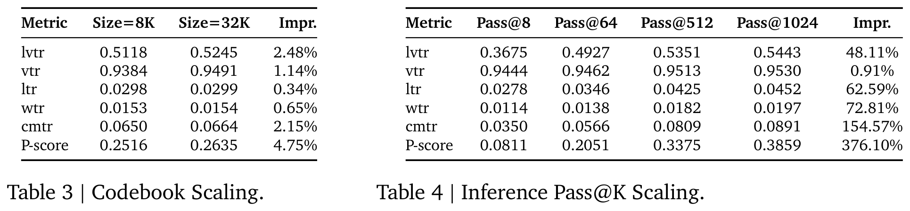
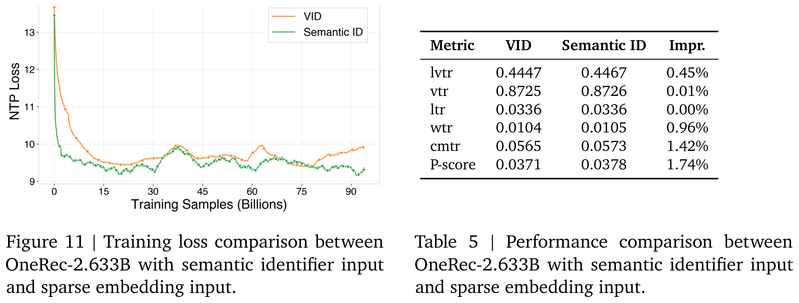
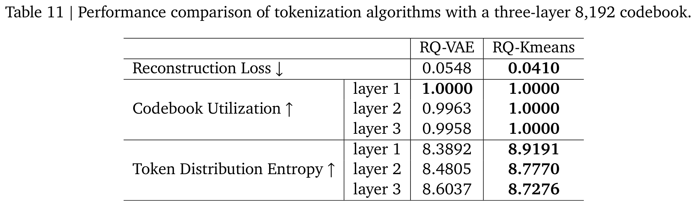
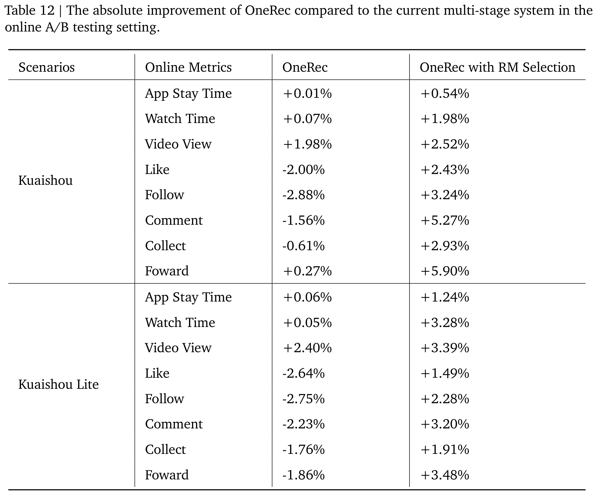

# OneRec技术报告

# 摘要
推荐系统多年来已广泛应用于各类大规模用户导向的平台。过去十年间，推荐技术从传统的基于启发式规则发展到深度学习模型，显著提升了推荐准确性。然而相较于AI领域的快速变革与发展，推荐系统近年来尚未取得突破性进展。例如当前仍采用多阶段级联架构而非端到端方案，导致计算碎片化与优化不一致性问题。此外，这种级联结构阻碍了AI领域关键突破技术在推荐场景中的有效应用。

为解决这些问题，该论文提出OneRec，通过端到端生成式方法重塑推荐系统。在新架构下取得了以下成果：首先，将现有推荐模型的计算FLOPs提升10 $`\times`$ ，并在一定边界内确立了推荐系统的scaling laws；其次，原先难以应用于推荐优化的强化学习（RL）技术在该框架中展现出显著潜力；最后通过基础设施优化，在训练和推理阶段分别达到23.7%和28.8%的MFU（Model FLOPs Utilization），与LLM社区水平相当。该架构显著降低了通信与存储开销，运营成本（OPEX）仅为传统推荐管道的10.6%。在快手/快手极速版APP的部署中承接了25%的总QPS，整体App停留时长分别提升0.54%和1.24%。此外还观察到7日生命周期（LT7）等推荐体验核心指标的显著提升。该论文同时提供了在开发、优化和维护具有重大实际影响的生产级推荐系统过程中得出的实践经验与洞见。

# 1 引言
随着在线服务的快速发展，推荐系统（RS）已成为缓解信息过载和实现大规模个性化内容分发的关键基础设施。过去几十年间，推荐系统已实现多项突破性进展——从早期的因子分解机（Factorization Machines）到现代深度学习架构。尽管推荐系统研究领域取得了重大进步，传统推荐模型仍依赖于多阶段级联架构（如图**figure 2**顶部所示），而非端到端方法，这种架构存在若干限制其性能优化的固有缺陷：

**计算碎片化**。级联架构存在计算效率低下的问题。以快手为案例进行的资源分布综合分析表明，系统服务过程中超过50%的资源被分配给通信和存储任务，而非高精度计算。这种对非计算任务的资源倾斜暴露出当前架构的根本性低效问题。此外，分配给计算任务的资源（特别是计算密集的排序模型部分）呈现出显著低利用率特征：在旗舰级GPU上，模型训练和推理的MFU（Model Flops Utilization）分别仅为4.6%和11.2%，远低于大语言模型（LLMs）约40%的H100利用率水平。这种差异凸显了推荐系统在计算任务资源利用方面的低效性。加之系统需要满足高QPS（大于40万次/秒）和低延迟（小于500毫秒）需求，推荐模型通常被迫在低计算强度的小规模状态下运行，这进一步限制了高精度计算的实现可能，从而影响系统的整体性能和可扩展性。

**目标冲突**。推荐场景中"优质结果"的优化目标缺乏明确定义，导致以下矛盾：

1) **多目标冲突**：除点击率和观看时长等常见指标外，系统还需兼顾用户、内容创作者和平台生态的数百个竞争性目标（快手场景中达上百个）。这些目标在不同系统阶段进行干预，逐步削弱系统一致性，同时增加复杂性和运营成本。

2) **跨阶段模型冲突**：即使针对相似目标建模，不同阶段的模型结构和规模差异也会引发冲突。例如召回阶段效果可能受限于排序模型的缺陷，而排序模型性能又可能受上游次优结果影响。这凸显了推荐系统需要统一优化目标和模型结构来确保协同效应。

**滞后于AI发展**。尽管LLM和视觉语言模型（VLM）领域已取得显著突破（如scaling laws、强化学习），现有级联推荐框架存在根本性架构障碍，难以适配这些已验证的技术方案。这种结构性失配导致推荐系统与AI前沿进展间的差距日益扩大，限制其从尖端技术中获取性能增益的可能。

为解决传统级联推荐架构的固有缺陷，该论文提出**OneRec**（如图**figure 2**底部所示），通过将召回与排序过程整合至基于编码器-解码器的单阶段生成框架，构建新型推荐系统。该方案具备以下特征：

 $`\vdash`$ **端到端优化**：系统设计兼顾端到端特性和足够简洁性，支持对最终目标进行直接优化。

 $`\vdash`$ **计算高效性**：聚焦计算密集型任务，在训练和推理阶段严格优化计算资源利用效率，充分释放算力进步带来的红利。

该框架产生多项重要发现：

- 通过基础设施优化，在旗舰GPU上实现训练23.7%和推理28.8%的MFU——相较原排序模型提升5.2 $`\times`$ 和2.6 $`\times`$ ——显著缩小了与LLM社区的效率差距。更重要的是，这种端到端架构大幅减少冗余通信和存储开销，**使运营成本降至传统复杂推荐管线的10.6%**。当前在快手/快手极速版APP主场景的部署已承载约25%的总QPS，带来APP停留时长0.54%和1.24%的提升，同时在用户参与度、视频冷启动和分发平衡等所有核心指标上均实现增益。

- 将当前推荐模型的计算FLOPs提升10 $`\times`$ 。在此过程中发现了推荐系统的缩放定律（scaling laws），为模型规模和计算资源配置提供了优化依据。

- 强化学习（RL）技术在传统架构中收效有限，但在该框架下展现出显著潜力。通过线上线下对比实验，该研究形成适合工业迭代需求的实践方案，使系统能有效利用RL提升自适应能力。

论文后续结构如下：第二节详述OneRec架构，包括短视频tokenization流程、用户兴趣建模与压缩的编码器设计、精准输出的可扩展解码器优化，以及推荐优化的RL框架；第三节介绍预训练与后训练流程；第四节阐述评估框架；最后总结局限性与未来方向（第五节）。

# 2 架构
本节介绍OneRec的架构（如图**figure 2**下半部分所示）。该架构首先采用tokenizer（第**2.1节**）将视频转化为语义ID，作为模型的预测目标。在训练阶段，编码器-解码器结构（第**2.2节**和第**2.3节**）通过下一token预测机制来预测目标物品，同时通过奖励系统（第**2.4节**）进行强化学习对齐。在推理阶段，模型先生成语义ID，随后将这些token映射回视频推荐结果，并可选择通过基于奖励的筛选步骤进一步优化推荐内容。

## 2.1 Tokenizer
OneRec是快手提出的生成式推荐系统，其亿级规模且持续增长的物品空间导致生成原子标识符面临计算与架构层面的限制。为解决这一问题，该论文采用固定规模的缩减词汇表，将物品分级token化为粗细粒度结合的语义ID，从而实现相似物品间的知识迁移，并提升对新物品的泛化能力。然而现有方案仅基于上下文特征生成语义ID，忽视了协同信号，导致重构质量欠佳（如第**4.4节**所示）。因此，该方案融合协同信号与多模态特征，并采用RQ-Kmeans方法生成更高质量的层次化语义ID。

### 2.1.1 对齐协同感知的多模态表征
该研究通过对齐协作相似物品对的多模态表征，实现了多模态内容与协同信号的融合，如图**figure 3**（左）所示。为此需要准备多模态表征、物品对以及对齐策略：

 

- **多模态表征**：为每个视频融合多模态输入信息，包括caption（描述文本）、tag（标签）、ASR（语音转文本）、OCR（图像转文本）、封面图像以及5帧均匀采样的视频帧。这些输入通过miniCPM-V-8B处理，生成 $`N_M=1280`$ 个token向量 $`\mathbf{M}\in\mathbb{R}^{N_M\times d_{t}}`$ （ $`d_{t}=512`$ ）。随后通过带有 $`N_{\tilde{M}}=4`$ 个可学习查询token $`\mathbf{Q}^{(1)}\in\mathbb{R}^{N_{\tilde{M}}\times d_{t}}`$ 的Querying Transformer（QFormer）进行压缩：
  
$$
\begin{align}\mathbf{Q}^{(i+1)} &= \text{CrossAttn}\left(\mathbf{Q}^{(i)}, \mathbf{M},\mathbf{M}\right), \\ \mathbf{Q}^{(i+1)} &= \text{FFN}(\text{RMSNorm}(\mathbf{Q}^{(i+1)}), \quad \text{for } i \in \{1, 2,\ldots, N_{c}\},\end{align}
$$

其中 $`\tilde{\mathbf{M}}=\mathbf{Q}^{(N_{c}+1)}\in\mathbb{R}^{N_{\tilde{M}}\times d_{t}}`$ 表示 $`\mathbf{M}`$ 的压缩版本， $`N_{c}=4`$ 为QFormer层数。

- **物品对构建**：通过两种方式构建高质量物品对数据集 $`\mathcal{D}_{pair}`$ ：1）用户-物品检索：针对每个用户，将正点击的目标物品与其最近历史正点击记录中协同最相似的物品配对；2）物品-物品检索：将具有高相似度分数（如Swing相似度）的物品配对。

- **物品对损失与描述生成损失**：采用双重训练目标：1）物品对对比损失 $`\mathcal{L}_{I2I}`$ 对齐协作相似视频对 $`(i, j)\in\mathcal{D}_{pair}`$ 的表征以捕捉行为模式；2）描述生成损失 $`\mathcal{L}_{caption\_gen}`$ 通过LLaMA3解码器执行caption的下一token预测以防止幻觉，保持内容理解能力：

$$
\mathcal{L}_{I2I} = -\frac{1}{\left|\mathcal{D}_{pair}\right|} \sum_{(i,j)\in\mathcal{D}_{pair}} \log \frac{ \exp \left( \text{sim}\left( \tilde{\mathbf{M}}_i, \tilde{\mathbf{M}}_j \right)/\tau \right) } { \sum_{(i',j')\in\mathcal{D}_{pair}} \exp \left( \text{sim}\left( \tilde{\mathbf{M}}_{i'}, \tilde{\mathbf{M}}_{j'} \right)/\tau \right) },
$$

$$
\mathcal{L}_{caption\_gen} = -\sum^{}_{k} \log P\left(t^{k+1}|\left[t^1, t^2, \cdots, t^k\right]\right),
$$

式中 $`\tau`$ 为温度系数， $`\text{sim}(\cdot, \cdot)`$ 为相似度函数， $`t^k`$ 表示第 $`k`$ 个caption token。

### 2.1.2 令牌化（Tokenization）
该研究采用RQ-Kmeans算法进行令牌化处理，该方法通过残差量化（residual quantization）以由粗到精（coarse-to-fine）的方式生成语义ID。其核心是直接在残差上应用K-means聚类来构建码本，具体流程如图**figure 3**（右）所示。

形式化定义中，第 $`l=1`$ 层的初始残差为：

$$
\mathcal{R}^{(1)} = \{ \tilde{\mathbf{M}}_i \in \mathbb{R}^{N_{\tilde{M}} \times d_{t}} \mid \forall \text{ video }i \}.
$$

对于每一层 $`l`$ ，码本 $`\mathcal{C}^{(l)}`$ 通过K-means对 $`\mathcal{R}^{(l)}`$ 聚类得到：

$$
\mathcal{C}^{(l)} = \text{K-means}\left( \mathcal{R}^{(l)}, N_t \right),
$$
其中 $`\mathcal{C}^{(l)} = \{ \boldsymbol{c}^{(l)}_k \in \mathbb{R}^{N_{\tilde{M}}\times d_{t}} \mid k = 1, \dots, N_t \}`$ ， $`N_t`$ 表示码本大小。第 $`i`$ 项的最近邻质心索引通过下式计算：

$$
s^{l}_i = \arg\min_{k} \left\| \mathcal{R}^{(l)}_i - \boldsymbol{c}^{(l)}_k \right\|,
$$

此处 $`\| \cdot \|`$ 表示欧几里得范数。视频 $`i`$ 在第 $`l+1`$ 层的残差更新为：

$$
\mathcal{R}^{(l+1)}_i = \mathcal{R}^{(l)}_i - \boldsymbol{c}^{(l)}_{s^{l}_i}.
$$
上述量化过程在 $`L_t=3`$ 层中迭代执行。

如第**section 4.4**节所示，相较于广泛使用的RQ-VAE方法，RQ-Kmeans在重建质量、码本利用率及平衡性方面表现更优。此时，每个视频 $`m`$ 可由 $`L_t`$ 个由粗到精的语义标识符表示： $`\{s^{1}_m, s^{2}_m, \ldots, s^{L_t}_m\}`$ ，这些标识符将作为OneRec推荐系统的输出，支持渐进式（progressive）物品生成。

## 2.2 编码器（Encoder）

### 2.2.1 多尺度特征工程  
本节介绍OneRec的特征工程组件。该模型通过四条 specialized embedding pathways 处理用户行为数据，每条路径分别捕获不同时间跨度的用户交互模式：user static pathway（静态特征路径）、short-term pathway（短期行为路径）、positive-feedback pathway（正向反馈路径）和 lifelong pathway（终身行为路径）。

**静态特征路径**：该路径生成用户核心特征的 compact representation，包含用户标识符（uid）、年龄（age）、性别（gender）等，随后将其转换至模型隐空间维度：

$$
\begin{align}\mathbf{f}_u &= [\mathbf{e}_{\text{uid}}; \mathbf{e}_{\text{gender}}; \mathbf{e}_{\text{age}};\cdots], \\ \mathbf{h}_u &= \text{Dense}(\text{LeakyReLU}(\text{Dense}(\mathbf{f}_u))).\end{align}
$$

其中 $`\mathbf{e}_{\text{uid}},\mathbf{e}_{\text{gender}}, \mathbf{e}_{\text{age}} \in \mathbb{R}^{64}`$ ， $`\mathbf{h}_{u} \in \mathbb{R}^{1 \times d_{\text{model}}}`$ 。

**短期行为路径**：该路径处理最近 $`L_{s}=20`$ 次用户交互，包含视频标识符（可表示为vid或2.1.2节所述的语义标识符sid，具体表示方法将在4.2.2小节讨论）、作者标识符（aid）、标签（tag）、时间戳（ts）、播放时长（playtime）、视频总时长（dur）、行为标签（label，包括点赞、关注、转发、 dislike、评论、进入主页等）。该路径生成的表征能捕获即时用户偏好和影响当前行为的上下文因素：

$$
\begin{align}\mathbf{f}_s &= [\mathbf{e}_{\text{vid}}^s; \mathbf{e}_{\text{aid}}^s; \mathbf{e}_{\text{tag}}^s; \mathbf{e}_{\text{ts}}^s; \mathbf{e}_{\text{playtime}}^s;\mathbf{e}_{\text{dur}}^s; \mathbf{e}_{\text{label}}^s], \\ \mathbf{h}_s &= \text{Dense}(\text{LeakyReLU}(\text{Dense}(\mathbf{f}_s))),\end{align}
$$

特征维度配置如下：视频嵌入 $`\mathbf{e}_{\text{vid}}^s`$ 与模型维度 $`d_{\text{model}}`$ 对齐，作者嵌入 $`\mathbf{e}_{\text{aid}}^s`$ 为512维，其余特征均为128维。所有特征跨越 $`L_s`$ 个序列位置，最终表征 $`\mathbf{h}_{s} \in \mathbb{R}^{L_s \times d_{\text{model}}}`$ 。

**正向反馈路径**：该路径处理高engagement交互序列（ $`L_p = 256`$ 次），维持与前文相同的维度结构：

$$
\begin{align}\mathbf{f}_p &= [\mathbf{e}_{\text{vid}}^p; \mathbf{e}_{\text{aid}}^p; \mathbf{e}_{\text{tag}}^p; \mathbf{e}_{\text{ts}}^p; \mathbf{e}_{\text{playtime}}^p;\mathbf{e}_{\text{dur}}^p; \mathbf{e}_{\text{label}}^p], \\ \mathbf{h}_p &= \text{Dense}(\text{LeakyReLU}(\text{Dense}(\mathbf{f}_p))).\end{align}
$$

所有特征跨越 $`L_p`$ 个序列位置，最终表征 $`\mathbf{h}_{p} \in \mathbb{R}^{L_p \times d_{\text{model}}}`$ 。

**终身行为路径**：该路径设计用于处理超长用户历史交互序列（最高10万条视频）。直接对全序列应用注意力机制存在计算瓶颈，因此采用作者团队先前研究中的 hierarchical compression strategy（分层压缩策略）。

*行为压缩*：基于2.1.1节所述 multimodal content representations，对每个用户交互序列执行 hierarchical K-means clustering。为平衡计算效率与模型效果，动态调整聚类数量：每步聚类数设置为 $`\lfloor\sqrt[3]{|D|} \rfloor`$ （ $`|D|`$ 为当前数据物品数，该设置为经验值）。当当前簇内物品数不超过预设阈值 $`M`$ 时终止聚类过程，最终选取各簇中心最近的视频作为簇代表。

*特征聚合*：对每个簇，离散特征（vid、aid、label等）直接继承代表视频的特征；连续特征（tag、ts、playtime、duration等）则计算簇内均值以捕获群体行为模式。对用户长期历史序列（ $`L_l = 2000`$ ），每个视频被替换为其所属簇代表的特征：

$$
\begin{align}\mathbf{f}_l &= [\mathbf{e}_{\text{vid}}^l; \mathbf{e}_{\text{aid}}^l; \mathbf{e}_{\text{tag}}^l; \mathbf{e}_{\text{ts}}^l; \mathbf{e}_{\text{playtime}}^l;\mathbf{e}_{\text{dur}}^l; \mathbf{e}_{\text{label}}^l], \\ \mathbf{v}_l &= \text{Dense}(\text{LeakyReLU}(\text{Dense}(\mathbf{f}_l))).\end{align}
$$

最终表征 $`\mathbf{v}_{l} \in \mathbb{R}^{L_l \times d_{\text{model}}}`$ 。通过QFormer进行序列压缩：learnable query向量 $`\mathbf{h}_l^{(0)} \in \mathbb{R}^{N_q \times d_{\text{model}}}`$ （ $`N_q=128`$ ）对历史特征进行注意力计算：

$$
\begin{align}\mathbf{h}_l^{(i+1)} &= \text{CrossAttn}(\mathbf{h}_l^{(i)}, \mathbf{v}_l, \mathbf{v}_l), \\ \mathbf{h}_l^{(i+1)} &= \text{FFN}(\text{RMSNorm}(\mathbf{h}_l^{(i+1)})).\end{align}
$$

经过 $`N_l = 2`$ 个block迭代后，得到压缩后的终身特征表征 $`\mathbf{h}_l = \mathbf{h}_l^{(N_l)} \in \mathbb{R}^{N_q \times d_{\text{model}}}`$ 。

### 2.2.2 编码器架构
如图**figure 4**所示，OneRec的编码器架构通过统一的基于transformer的框架整合了多尺度用户行为表征。该编码器将四个多尺度路径的输出拼接形成综合输入序列：

$$
\mathbf{z}^{(1)} = [\mathbf{h}_{u}; \mathbf{h}_s; \mathbf{h}_p; \mathbf{h}_l] + \mathbf{e}_{\text{pos}}
$$

其中 $`\mathbf{e}_{\text{pos}} \in \mathbb{R}^{(1 + L_s + L_p + N_q) \times d_{\text{model}}}`$ 表示可学习的位置嵌入。通过 $`L_{\text{enc}}`$ 个transformer编码层处理整合后的表征，每层包含全可见自注意力机制和RMS归一化的前馈网络：

$$
\begin{align}\mathbf{z}^{(i+1)} &= \mathbf{z}^{(i)} + \text{SelfAttn}(\text{RMSNorm}(\mathbf{z}^{(i)})),\\ \mathbf{z}^{(i+1)} &= \mathbf{z}^{(i+1)} + \text{FFN}(\text{RMSNorm}(\mathbf{z}^{(i+1)})).\end{align}
$$

最终编码器输出 $`\mathbf{z}_{\text{enc}}=\mathbf{z}^{(L_{enc}+1)} \in \mathbb{R}^{(1 + L_s + L_p + N_q) \times d_{\text{model}}}`$ 提供了全面的多尺度用户行为表征，作为后续推荐生成的基础。

## 2.3 解码器
OneRec在解码阶段采用逐点生成范式。对于每个目标视频 $`m`$ ，解码器输入序列通过拼接可学习序列起始符与视频语义标识符构建：

$$
\begin{align}\mathcal{S}_m &= \{s_{[\mathrm{BOS}]}, s^1_m, s^2_m, \cdots, s^{L_t}_m\}, \\ \mathbf{d}^{(0)}_m &= \text{Emb lookup}(\mathcal{S}_m).\end{align}
$$

解码器通过 $`L_{\text{dec}}`$ 个transformer层处理该序列，每层执行以下顺序操作：

$$
\begin{align}\mathbf{d}^{(i+1)}_m &= \mathbf{d}^{(i)}_m + \text{CausalSelfAttn}(\mathbf{d}^{(i)}_m), \\ \mathbf{d}^{(i+1)}_m &= \mathbf{d}^{(i+1)}_m + \text{CrossAttn}(\mathbf{d}^{(i+1)}_m, \mathbf{Z}_{\text{enc}}, \mathbf{Z}_{\text{enc}}), \\ \mathbf{d}^{(i+1)}_m &= \mathbf{d}^{(i+1)}_m + \text{MoE}(\text{RMSNorm}(\mathbf{d}^{(i+1)}_m)).\end{align}
$$

每个解码层包含混合专家(MoE)前馈网络以增强模型容量，同时保持计算效率。MoE层采用 $`N_{\text{experts}}`$ 个专家网络与top- $`k`$ 路由策略：

$$
\begin{align}\text{MoE}(\mathbf{x}) = \sum_{j=1}^{k} \text{Gate}_j(\mathbf{x}) \cdot \text{Expert}_j(\mathbf{x}),\end{align}
$$

其中 $`\text{Gate}_j(\mathbf{x})`$ 表示由路由机制确定的门控权重， $`\text{Expert}_j(\mathbf{x})`$ 表示第 $`j`$ 个选定专家网络的输出。为实现专家负载均衡且避免引入干扰梯度，该论文采用无损失负载均衡策略。

模型通过目标视频 $`m`$ 语义标识符的下一令牌预测交叉熵损失进行训练：

$$
\mathcal{L}_{\mathrm{NTP}}=- \sum_{j=1}^{L_t-1} \log P\left(s_m^{j+1} \mid\left[s_{[\mathrm{BOS}]}, s^1_m, s^2_m, \cdots, s^j_m \right] \right)
$$

## 2.4 奖励系统
预训练模型仅通过下一令牌预测拟合曝光物品空间的分布，而曝光物品来自过去传统推荐系统获取的结果。这导致模型无法突破传统推荐的天花板。为解决该问题，该论文引入基于奖励系统的偏好对齐机制，使用在线强化学习在生成物品空间训练模型。通过奖励机制，模型能感知更细粒度的偏好信息。研究团队设计了偏好奖励以对齐用户偏好，格式奖励确保生成格式合法，以及特定的工业奖励以适配特殊工业场景需求。

### 2.4.1 用户偏好对齐
在推荐系统中，"好的推荐"的定义比数学解的正确性判定更具挑战性。传统方法通常定义多个目标（如点击、点赞、评论、观看时长等），然后通过各目标预测值( $`xtr`$ )的加权融合生成综合得分。然而，手动调整这些融合权重不仅缺乏准确性，也缺乏个性化，且常导致目标间的优化冲突。

为解决这些局限，该论文提出使用神经网络学习个性化融合分数，称为P-Score（Preference Score）。如**图5**（中）所示，该模型整体框架基于搜索兴趣模型（Search-based Interest Model, SIM），包含多个目标学习专用塔结构。训练时各塔使用对应目标标签作为辅助任务计算二元交叉熵损失（BCE）。各塔的隐藏状态与用户/物品表征共同输入最终层的多层感知机（MLP），随后通过单塔输出P-Score，该模块使用所有目标标签计算二元交叉熵损失。

该方法使模型能接收特定用户信息并调节该用户的偏好分数，同时不影响其他用户体验。相比此前无差别加权求和的方式，该方法更易实现帕累托优化，因此将所得P-Score作为偏好对齐的奖励信号。

**早期截断GRPO**：本部分阐述如何利用偏好分数实现用户偏好对齐。采用ECPO（Early Clipped GRPO）进行优化，具体而言：对用户 $`u`$ ，通过旧策略模型生成 $`G`$ 个物品，每个物品与用户共同输入偏好奖励模型获得P-Score作为奖励 $`r_i`$ 。优化目标如下：

$$
\mathcal{J}_{ECPO}(\theta) = \mathbb{E}_{u\sim P(U),\{o_i\}_{i=1}^G\sim\pi_{\theta_{old}}}\left[\frac1G\sum_{i=1}^G\text{min}\left(\frac{\pi_{\theta}(o_i|u)}{\pi_{\theta_{old}}'(o_i|u)}A_i,\text{clip}\left(\frac{\pi_{\theta}(o_i|u)}{\pi_{\theta_{old}}'(o_i|u)},1-\epsilon,1+\epsilon\right)A_i\right)\right],
$$

$$
A_i = \frac{r_i-\text{mean}(\{r_1,r_2,...,r_G\})}{\text{std}(\{r_1,r_2,...,r_G\})},
$$

$$
\pi_{\theta_{old}}'(o_i|u)=\text{max}\left(\frac{\text{sg}(\pi_\theta(o_i|u))}{1+\epsilon+\delta},\pi_{\theta_{old}}(o_i|u)\right), \quad\delta>0,
$$

其中sg表示梯度截断操作， $`\delta`$ 为大于0的超参数。

该论文对GRPO（Group Policy Relative Optimization）进行了改进以提升训练稳定性，如**图6**所示。原始GRPO允许负优势值时存在较大策略比率( $`\pi_{\theta}/\pi_{\theta_{old}}`$ )，易导致梯度爆炸。因此改进方案会预先截断大比率策略，在保证训练稳定性的同时仍使相应负优势值生效。 $`\delta`$ 值越大，可容忍的策略比率范围越大，对应梯度幅度也越大，可根据实际需求设定。在OneRec中设置 $`\delta=0.1`$ ，意味着允许负优势值策略比率略微超过 $`1+\epsilon`$ 。由于强化学习（RL）与监督微调（SFT）在OneRec中联合训练，SFT损失可确保模型稳定性，故移除了KL散度损失项。

### 2.4.2 生成格式正则化  
在生成式推荐中，合法性比率（legality ratio）指生成的语义ID序列能映射到真实物品ID的比例。该指标对评估生成的稳定性至关重要。实践中，语义ID序列的基数 $`N_t^{L_t}`$ 远大于视频物品的基数，这确保了所有物品都能被覆盖，且更大的词汇量能引入更多参数从而提升性能。然而这可能导致推理时生成无对应物品ID的语义ID序列，即非法生成（illegal generation）。  

引入强化学习与ECPO会显著增加非法输出的生成。近期研究表明，这种现象由负优势值（negative advantages）引发的挤压效应（squeezing effect）导致。如**图7**所示，预训练模型已学会生成大多数合法token，加入RL后，仅对 $`A > 0`$ 的物品微调概率分布。当应用 $`A < 0`$ 的物品时，模型将大部分概率质量压缩至当前最优输出 $`o^*`$ ，导致部分合法token的概率被挤压至与非法token相当的水平，使模型难以区分合法token。  

  

为解决该问题，该论文提出在强化学习中引入格式奖励（format reward）以促进合法生成。具体而言，从 $`G`$ 个样本中随机选取 $`K`$ 个进行合法性强化学习：对合法样本设优势值为1，非法样本直接丢弃以避免挤压效应。  

$$
A_i = \begin{cases} 1 & \text{if } o_i\in I_\text{legal} \\ 0 & \text{if } o_i\notin I_\text{legal} \end{cases}
$$
 

优化目标与ECPO公式（公式**29**）一致，直接使用 $`A_i`$ 作为优势值。  

### 2.4.3 工业场景对齐  
工业场景中，推荐系统不仅需考虑用户偏好，还需兼顾视频社区生态、商业化需求以及冷启动与长尾视频分发等多重因素。传统推荐系统试图通过在推荐流水线的某一阶段应用算法或策略解决问题，但由于各阶段不一致性，容易导致意外问题交替出现的循环。工程师被迫通过补丁不断调整，长期积累导致系统臃肿、迭代受阻。在OneRec框架中，仅需将优化目标纳入奖励体系并采用强化学习进行针对性优化，该方法不仅便捷，还能实现端到端部署以保持系统一致性。具体优化实践案例将在**4.3.3节**展示。  

# 3 训练框架  

## 3.1 训练基础设施
本节描述支持OneRec大规模预训练的硬件基础设施，并介绍多项提升训练效率的优化措施。

计算资源。该研究采用90台服务器进行训练，每台配备8块旗舰级GPU和2块CPU，通过400Gbps NVLink实现高速节点内互联。

网络架构。节点内通信由高效NVLink网络管理，节点间通信采用400Gbps RDMA处理训练流量，100Gbps TCP负责训练数据和embedding预取操作。

存储方案。每台服务器配置4块NVMe SSD以加速检查点写入，支持将大规模embedding参数和稠密参数存储于HDFS，实现故障容错的同时最大限度减少停机时间。

训练加速。核心加速优化措施包括：

1) Embedding加速：为处理超出CPU负载的大规模embedding运算，采用Kuaishou的SKAI框架构建基于GPU的参数服务器。该框架通过跨GPU统一embedding表、GPU缓存范式及预取流水线，显著提升训练效率并降低管理开销。

2) 训练并行策略：组合使用数据并行、ZERO1及梯度累积进行模型训练。选择ZERO1的原因是当前模型的稠密参数可装入单块GPU，在交错处理多个宏批次时能最小化数据并行组的同步开销。

3) 混合精度训练：部分MLP网络采用BFloat16计算格式以优化性能。

4) 编译优化：对attention网络实施编译优化以降低计算开销。

得益于高度优化的训练基础设施，该模型训练MFU提升至23.7%，大幅缩小了与LLM训练效率的差距。

## 3.2 预训练
**预训练数据**：如**2.2.1节**所示，该模型以多尺度用户行为表征作为输入。预训练目标为预测用户的目标物品序列。每个训练样本包含一个被token化为3个语义标识符的目标物品，该tokenization方案使得每个训练样本生成3个目标token用于生成式模型的next-token预测任务。训练管道每日处理约180亿样本，生成540亿token的日均吞吐量。如**表1**所述，OneRec-0.935B模型在训练约1000亿样本（对应预训练期间3000亿token的总曝光量）后达到收敛。

**关键超参数**：OneRec系列包含四款推荐任务模型（两种稠密模型和两种MoE变体）。如表**表1**所示的关键架构超参数包括层数、隐藏维度和attention头数等。这些模型的编码器与解码器具有相同层数。对于稠密变体，标准前馈网络(FFN)通常将隐藏维度 $`d_{\text{ff}}`$ 扩展至 $`2 \times d_{\text{model}}`$ 。MoE变体则在指定区块用MoE层替换标准FFN，并采用SwiGLU FFN作为专家。与开源MoE LLM设置一致，每个SwiGLU专家的隐藏维度计算为 $`\frac{2}{3} \times 4 \times d_{\text{model}}`$ ，确保其为128的倍数。

各模型收敛曲线详见**4.2.1节**。

## 3.3 训练后阶段
在训练后阶段，该研究通过实时数据流进行在线训练。研究者同步执行拒绝采样微调（Reject Sampling Fine-Tuning，RSFT）和强化学习（Reinforcement Learning，RL）。对于RSFT，首先基于播放时长过滤掉曝光会话中表现最差的50%数据。训练损失函数与预训练阶段的 $`\mathcal{L}_{\rm NTP}`$ 相同，但采用退火策略：稀疏参数的学习率降至 $`1 \times 10^{-4}`$ ，稠密参数的学习率降至 $`8 \times 10^{-5}`$ 。对于RL环节，从RSFT数据中随机抽取1%的用户生成RL样本。

为最大化计算资源利用率，研究通过外部推理服务将RL样本生成与训练过程解耦。在训练过程中，1%的用户访问外部服务生成512个候选项目，通过奖励模型获取每个项目的奖励值，再将数据返回训练任务。训练任务通过消息队列（MQ）每隔1000步将更新后的参数推送给外部推理服务。完整的训练后流程如图**figure 8**所示。

# 4 评估

## 4.1 评估指标
通过以下指标评估模型性能：

- 交叉熵损失：下一token预测损失 $`\mathcal{L}_{\mathrm{NTP}}`$ 曲线

- P-Score（偏好分数）：如**章节2.4.1**所述的综合评估指标

- xtr指标：来自当前已部署预训练排序模型的用户参与度指标集，包括：
  - lvtr（长观看率）：视频显著观看的预测概率
  - vtr（观看率）：视频观看的预测概率
  - ltr（点赞率）：视频点赞的预测概率
  - wtr（关注率）：创作者关注的预测概率
  - cmtr（评论率）：视频评论的预测概率

对于P-Score和xtr奖励指标，评估系统基于流式数据运行，不同时间段数值可能波动。因此相同指标在不同实验中可能因数据流时间差异而呈现不同绝对值。但研究者通过同期对比实验和足够长的观测窗口平均结果，确保了评估结论的统计可靠性。

## 4.2 扩展性

### 4.2.1 训练扩展
**参数扩展**：OneRec系列包含不同规模的模型：OneRec-0.015B、OneRec-0.121B、OneRec-0.935B和OneRec-2.633B，具体如**表1**所示。该研究探讨了模型参数量对性能的影响。**图9**展示了这些模型的损失曲线，呈现明显的扩展趋势——随着训练进行，更大规模的模型能够实现更低的损失值。这表明通过增加模型规模可显著提升性能表现。

  

关于训练数据规模的影响，实验表明模型性能在大约100亿样本量内快速收敛。虽然此后改进速率显著降低，但性能并未完全停滞，继续从更多数据（即超过1000亿样本）中获得缓慢提升。这说明早期训练可获得实质性收益，而更大规模数据集能带来更为渐进式的优化。随着模型参数规模扩大，专家之间的负载均衡成为关键问题。不均衡的专家利用率会导致训练效率低下和次优性能。该研究采用DeepSeek的无损失负载均衡策略，在不引入额外损失项的情况下保持专家利用率平衡。应用该策略后观察到0.2的损失下降，证明其能有效提升扩展后OneRec模型的收敛性。

除参数扩展外，研究还基于0.935B模型开展额外实验，验证其他关键维度的扩展有效性。这些实验包括特征扩展（考察全面特征工程的影响）、码本扩展（研究词汇表规模扩大的效果）以及推理扩展（分析beam search参数的影响）。每个维度都展现出独特的扩展特性，为未来模型优化提供了重要参考。

**特征扩展**：为研究特征工程对模型性能的影响，该研究比较了两种输入配置：基线模型仅使用256个正向反馈项目的item ID vid嵌入，增强版则整合了方法论中描述的完整特征集。如**图10**和**表2**所示，采用附加特征的增强模型实现了更低的训练损失，并在推荐质量的多个维度上取得实质性提升。

  

**码本扩展**：为探究码本规模对模型性能的影响，实验将码本从8,192扩展到32,768。需注意的是，参数扩展实验中定义的NTP损失在此不宜直接比较，因为码本扩大会自然增加交叉熵损失计算的候选集规模，导致直接损失对比产生误导。因此研究采用基于奖励的指标进行评估。如**表3**所示，码本扩大在播放时长指标上产生显著提升，在交互指标上带来小幅增益。

  

**推理扩展**：研究探讨了推理阶段生成物品数量（Pass@K）对模型性能的影响。如**表4**详述，将K值从8增至512可在所有评估指标上获得持续改进。但K值从512继续增至1,024仅产生边际收益。综合考虑性能提升与计算资源消耗的平衡，最终选择K=512作为生产环境部署标准。

### 4.2.2 语义标识符输入表示

随着模型规模扩展至数十亿参数，该论文研究了一种替代性的输入表示策略，通过利用视频语义标识符（semantic identifiers）来表示用户交互历史，而非为视频标识符（vid）构建独立的稀疏嵌入表示。这种语义标识符输入方法在保持与传统稀疏嵌入方法相当性能的同时，在参数效率、通信开销和序列处理能力方面展现出显著优势，对于进一步规模化探索具有重要前景。

**规模化性能分析**：如图**figure 11**所示，实证分析表明在2.6B参数规模下，语义标识符输入方法的性能可媲美甚至超越传统稀疏嵌入方法。

**优势与未来扩展性**：语义标识符方法相比传统稀疏嵌入方法具有以下关键优势，尤其适合进一步规模化探索：

- 参数效率：通过共享输入与输出之间的嵌入表示，该方法消除了为vid构建独立稀疏嵌入表的需求。这大幅降低了总参数量，对于拥有数十亿物品的快手（Kuaishou）平台尤为显著。

- 通信效率：在分布式训练环境中，稀疏嵌入操作需要参数服务器进行大量的嵌入查找和梯度更新通信。语义标识符方法通过密集操作和共享词表降低了通信开销，从而提升训练吞吐量并缓解通信瓶颈。

- 扩展序列容量：消除大型稀疏嵌入表使得计算资源可分配给更长的用户交互序列处理。该方法有望将序列长度从数千次交互扩展至数万次，从而捕获更全面的用户偏好演化模式。

- 表示一致性：输入输出共享相同语义空间确保了表示一致性，使模型能学习更连贯的item-to-item关系。这种统一表示有助于提升不同推荐场景间的泛化能力。

基于上述显著优势及在2.6B参数规模下展示的竞争力性能，该论文团队正积极推动语义标识符输入表示的进一步规模化探索。该方法有望在保持计算效率与架构简洁性的同时，为大规模推荐系统开辟新的可能性。

## 4.3 强化学习

### 4.3.1 用户偏好对齐
定义什么是"好"的推荐一直以来都是具有挑战性的任务。

为严格验证强化学习的影响，该论文采用单目标vtr（观看完成率）作为奖励信号，对应线上Watch Time（观看时长）和App Stay Time（应用停留时长）等指标。报告的线上结果是相对于快手传统推荐系统（称为整体基线）的相对改进。表格中的Relative Impr.（相对提升率）表示后组相较前组的相对增强。

值得注意的是，虽然使用vtr作为奖励能显著提升时长类指标，但未必代表高质量推荐，因为其他指标如Video View（视频观看量）可能出现显著下降。研究团队主要关注Watch Time和App Stay Time以寻找最优RL配置，并最终用于验证P-Score奖励的收益。

**采样效率**：强化学习通过优化采样物料的概率分布，提高高奖励物料的选中概率，从而显著提升采样效率。为量化这一效果，作者团队在pass@32、pass@128和pass@512三个采样点进行多点实验，结果总结于**表2**。将未使用RL的模型作为基线，定义应用停留时长的提升为采样效率差距。值得注意的是，RL在pass@32时表现出最大的提升差距，这表明排名靠前物料的准确性得到显著增强。这一提升对于降低采样开销至关重要，因为在小批量采样时仍能保证高精度。推荐系统中成本与收益的平衡十分关键，在较小采样数 $`K`$ 时实现更高精度，为这种平衡提供了坚实基础。

**搜索空间**：在ECPO训练中，扩大动作搜索空间会增加发现最大奖励最优物料的概率，但同时带来更高计算成本。为研究这一权衡，该论文探索了搜索空间大小（即组规模）对性能的影响。pass@128的实验结果总结于**表3**。从表中可观察到，当组规模从128增至512时性能显著提升，这清晰证明了扩大搜索空间的积极作用。略有遗憾的是，将搜索空间扩大至2048并未带来更多收益，这可能源于当前参考模型的多样性不足以致无法发现更多优质物料。不过这一发现仍具积极意义，根据实证经验，作者建议将ECPO训练的组规模设置为推理输出量的四倍左右以获得最佳效果。

**搜索策略**：大语言模型的强化学习通常采用top- $`k`$ 和top- $`p`$ 采样进行样本生成。在OneRec中还探索了beam search替代策略。**表4**对比了两种策略效果，结果显示在OneRec的强化学习框架下，beam search显著优于top- $`k`$ 和top- $`p`$ 采样。这种提升源于语义ID结构固有的规律性——其遵循前缀树编码方案，因此与beam search的系统性探索特性高度契合。

**参考模型**：本节比较ECPO中用于策略生成的两种参考模型：（1）预训练模型（离线策略）；（2）当前策略模型（在线策略）。实验结果总结于**表5**。从表中可明显看出，使用当前策略模型效果更优，尤其在离线奖励评估方面。这表明在线策略方法能让模型持续自我学习，突破参考模型的限制达到更高上限。但就线上表现而言，在线策略的改进并不显著，这归因于奖励定义的次优性导致了轻微的奖励破解现象。该问题将被列为未来工作的重点方向。

**P-Score奖励**：本节观测使用P-Score作为奖励时，通过强化学习实现的综合性提升。基于上述消融实验结论，研究团队选择最优RL配置——采用beam search进行RL样本生成，并使用当前策略模型作为参考模型。在快手主站和快手极速版两个场景中验证RL效果，结果总结于表1。从表中可得结论：在两个场景中，P-Score在显著提升App Stay Time和Watch Time的同时，也增加了Video View，表明整体用户推荐体验得到提升。

### 4.3.2 生成格式正则化
本小节通过实验验证格式奖励的有效性。如**第2.4.2节**所述，在预训练模型中引入强化学习后，由于挤压效应，模型输出的合法性显著下降至50%以下。这意味着超过一半的生成语义ID未对应真实视频ID，这对推荐系统的稳定性与推理可扩展性造成不利影响。为评估格式奖励的作用，该论文比较了两种计算格式损失的样本选择方法：（1）从128个生成候选样本中选取概率最高的top-5样本；（2）随机选取5个样本。

图**figure 13**展示了它们对输出合法性的影响。左图显示所有128个生成样本的合法率，右图则聚焦于被选中的样本。未引入格式奖励时，基线合法性始终低于50%。Top-k选择方法呈现有趣模式：虽然整体合法性先升后降，但被选样本迅速达到100%合法性，表明模型仅学会在排名靠前的子集中生成合法输出。相比之下，随机选择提供了更具挑战性的学习目标，但仍推动合法性稳步提升——最终达到95%且未出现下降趋势。

值得注意的是，格式奖励的集成还带来合法性之外的收益。在线指标显示显著提升：APP停留时长增长0.13%，观看时长提升0.30%。该实验案例不仅验证了格式奖励机制，更凸显了强化学习系统中奖励设计的关键作用。

### 4.3.3 工业场景对齐
本小节展示利用强化学习解决工业挑战的实际案例。在快手平台上，病毒营销号占据内容创作者的重要比重，主要生产二次剪辑视频且质量参差不齐。尽管OneRec在多项业务指标上优于传统推荐系统，但作者发现若无合适的后过滤策略，病毒内容曝光比率会显著增加，可能对平台生态产生负面影响。

病毒内容视频的最优占比可设定为 $`f`$ 。当比例超过 $`f`$ 时，系统通过降低其P-score奖励进行抑制，同时保持对该类内容质量的感知：

$$
r_i' = \begin{cases} r_i & \text{if } o_i\notin I_\text{viral} \\ \alpha r_i & \text{if } o_i\in I_\text{viral} \end{cases},
$$

其中 $`\alpha \in (0,1)`$ 为抑制因子。

该方法被命名为特定工业奖励（SIR）。实验结果表明，SIR成功将病毒内容曝光降低9.59%，同时核心指标（观看时长与APP停留时长）保持稳定。该实验凸显了OneRec的关键优势：通过强化学习的奖励塑造能力实现精准一致的优化，这一特性在传统推荐系统中难以实现。

## 4.4 Tokenizer  
该研究采用三项指标综合评估分词方法，涵盖准确性、资源利用率和分布均匀性三个维度：

- **重构损失（Reconstruction Loss）**：该指标用于评估离散token对原始输入的重构精度，反映模型在保留输入数据保真度方面的表现。  

- **码本利用率（Codebook Utilization）**：该指标评估码本中向量使用的效率，体现模型利用可用资源进行数据表征的有效性。  

- **Token分布熵（Token Distribution Entropy）**：基于香农熵计算，该指标量化token分布的均匀性，揭示模型在token分配上的多样性与平衡性。  

如表**table 7**所示，相比RQ-VAE，RQ-Kmeans的重构损失降低了25.18%，表明其在保留输入信息方面具有更高准确性。同时，RQ-Kmeans在所有三层均实现完美利用率（1.0000），体现了码本资源的最优利用效率，而RQ-VAE在第2层和第3层的利用率略低。此外，RQ-Kmeans在三层中的熵值均高于RQ-VAE，分别显著提升6.31%、3.50%和1.44%，这表明RQ-Kmeans生成的token分布更均匀平衡，有助于提升模型稳定性和泛化能力。综合结果表明，RQ-Kmeans在三项评估指标上均优于RQ-VAE，是更高效的分词方案。  

  

关于项目表征和分词质量的定性分析详见附录**appendix C**。  

## 4.5 在线A/B测试  
该研究在快手两大短视频场景（主站信息流和极速版信息流）部署了OneRec系统，这两个场景是平台流量最高的场景，日活跃用户达4亿。通过5%流量的实验组为期一周的观测，核心指标为APP停留时长（反映用户总使用时长）和LT7（7日生命周期）。设立了两个实验组：一组采用纯生成模型（OneRec），另一组在生成输出基础上增加了基于奖励模型的选择机制（OneRec with RM Selection）。如表**table 8**所示，基于强化学习用户偏好对齐的纯生成模型表现已与完整复杂推荐系统相当，而叠加奖励模型选择后，在这两个场景中分别实现了APP停留时长+0.54%/+1.24%和LT7 +0.05%/+0.08%的统计显著提升。值得注意的是，在快手平台上，APP停留时长0.1%和LT7 0.01%的提升即被认为具有统计显著性。此外，OneRec在所有交互指标（点赞、关注、评论等）均呈现显著增益，表明其能将多任务系统收敛至更均衡状态而不会产生跷跷板效应。验证后，该系统已扩展部署至约25%的总QPS，实现细节见附录**Appendix B**。  

  

除短视频推荐场景外，该研究还在快手重要业务场景——本地生活服务中进行了验证。结果表明，OneRec实现了GMV 21.01%的增长、订单量17.89%的提升、买家数18.58%的增加以及新客获取23.02%的上升。因此该系统目前已接管该业务场景100%的QPS。全量部署后，所有指标较实验初期均呈现更强增长趋势，证实了OneRec在不同业务场景下提升推荐效果的泛化能力。  

### 基础设施与效率  
研究采用NVIDIA L20 GPU进行推理，每台服务器配备4块GPU和2个CPU，通过PCIe连接。线上流量依托快手预测平台UniPredict支撑。推理服务与embedding服务部署在200Gb RDMA数据中心，利用RoCE网络架构，最大跨机通信带宽达800Gb。为提升效率，通过TensorRT编译优化模型计算图，配合自定义插件实现cross-attention、MoE等操作的高性能实现。结合批处理与MPS技术，最终实现5 $`\\times`$ 吞吐量提升，MFU达到28.8%。  

# 5 结论、局限性与未来方向  

该论文提出了OneRec——一种新颖的端到端生成式推荐架构。作为编码器-解码器模型，其通过编码器压缩用户终身行为序列以提取用户兴趣，同时利用混合专家系统（Mixture-of-Experts, MoE）大规模扩展解码器参数，从而实现精准的短视频推荐解码。在后训练阶段，作者设计了定制化强化学习（RL）框架，通过将模型输出与奖励函数对齐来优化推荐结果。得益于精细的工程优化，OneRec在训练和推理阶段分别实现了23.7%和28.6%的模型浮点运算利用率（MFU），较原先个位数的基线值显著提升，缩小了与主流AI社区的差距。值得注意的是，这一计算密集型设计仅需传统推荐系统10.6%的运营支出（OPEX）。全面评估表明，OneRec在效果和效率上均超越了现有推荐系统。  

在肯定其强大性能与高性价比的同时，作者也认识到OneRec存在若干局限性，并计划在以下方向进行战略投入：  

- **推理阶段扩展性**：当前推理阶段的逐步扩展（step scaling）表现尚不明显，表明OneRec尚未具备强大的推理能力。  

- **多模态融合**：OneRec尚未与LLM（大语言模型）和VLM（视觉语言模型）集成。用户行为本身也是一种模态，未来计划设计解决方案，使行为模态像视觉和音频对齐那样成为原生多模态模型的组成部分。  

- **奖励系统设计**：现有奖励系统设计仍处于初级阶段，但具有重要潜力。传统推荐系统并非端到端架构，导致难以定义和迭代优质推荐结果的标准。在OneRec架构下，奖励系统同时影响线上结果和离线训练。作者认为该架构将很快推动推荐奖励系统的技术突破。  

OneRec建立了一套全新架构，为技术演进、商业价值优化和团队协作引入了变革性框架。尽管目前尚未覆盖快手全部流量场景，该论文已将其作为基础方法，旨在系统性推进算法创新的同时完善团队协作机制，从而构建可支撑大规模流量增长的基础设施。
