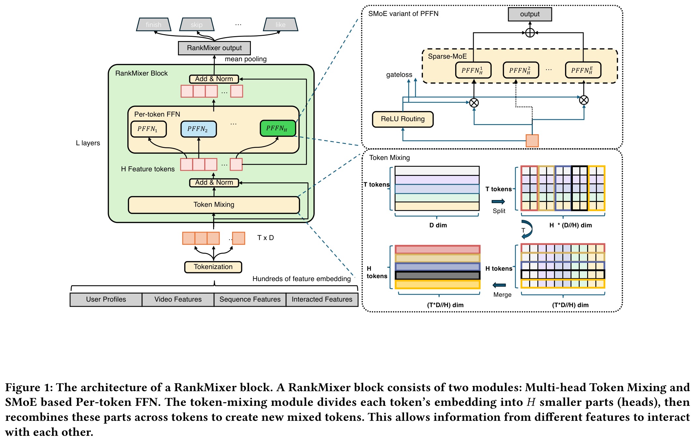
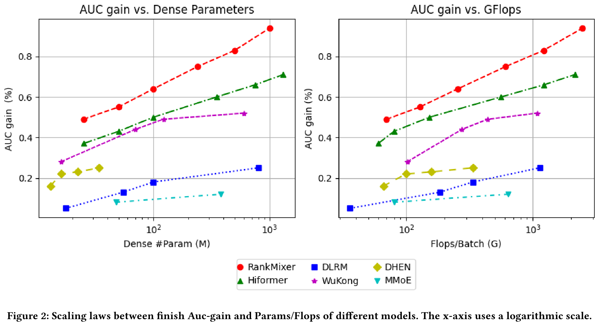
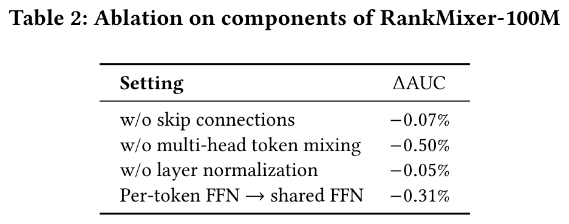
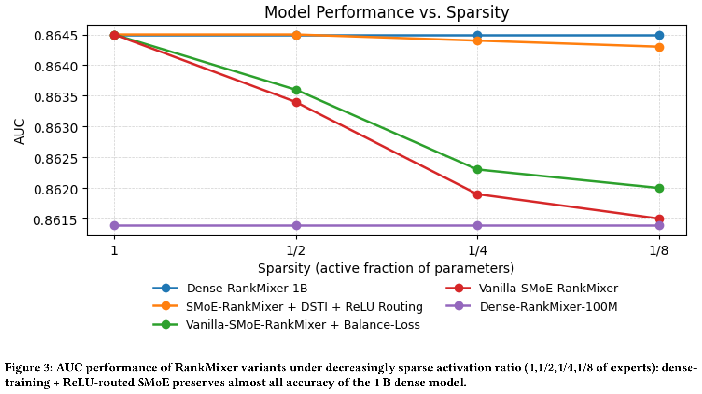
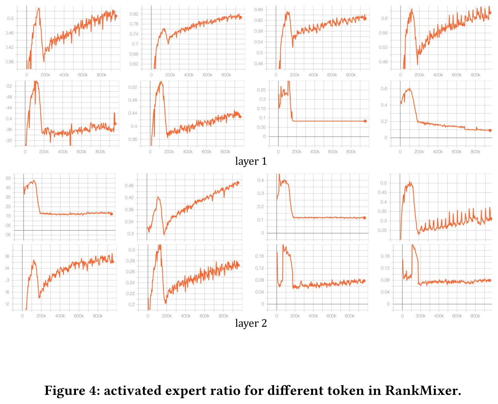

# RankMixer：工业级推荐系统中排序模型的规模化扩展

## 摘要  
尽管大语言模型(LLMs)的进展推动了推荐系统的规模化探索，但工业级推荐系统仍面临两大实际障碍。首先，训练和推理成本必须满足严格的延迟限制与高QPS要求。其次，现有排序模型中大多数人工设计的特征交叉模块源自CPU时代，无法充分利用现代GPU优势，导致模型浮点运算利用率(MFU)低下且扩展性差。  

该论文提出RankMixer——一种面向硬件优化的特征交互统一架构设计。该方法在保持transformer高度并行性的同时，采用多头token混合模块替代二次复杂度的自注意力机制以实现更高效率。此外，通过Per-token FFN结构同时保留特征子空间独立建模与跨特征空间交互能力。为提升投资回报率(ROI)，进一步扩展出十亿参数的稀疏混合专家(Sparse-MoE)变体，并采用动态路由策略解决专家训练不足与负载不均衡问题。  

在万亿级工业数据集上的实验表明RankMixer具备卓越的扩展能力。通过替代原先多样化的低MFU手工模块，该方案将模型MFU从4.5%提升至45%，在保持推理延迟基本不变的前提下实现参数规模两个数量级的增长。基于推荐和广告两个核心场景的在线A/B测试验证了该框架的普适性。最终，十亿级稠密参数的RankMixer模型实现全流量服务部署且未增加推理成本，带来用户活跃天数提升0.3%、应用内使用时长达1.08%的增长。

# 1 引言  
推荐系统（Recommender System, RS）在信息分发过程中至关重要。作为一种重要的机器学习场景，RS基于海量多域特征数据预测用户对物品（item）的行为，这些数据包括多样化的数值特征（如各类统计指标）、类别特征（如用户与物品ID）、用户行为特征以及内容特征。当前最先进的推荐方法基于深度学习推荐模型（Deep Learning Recommendation Models, DLRMs），其通过神经网络在特征输入嵌入层之上构建密集交互层，灵活捕捉特征交互。DLRM中的密集交互层对推荐系统性能至关重要，目前已涌现多种不同的模型结构。

随着大语言模型（Large Language Models, LLMs）因参数增长而性能提升的启示，扩大DLRM规模以充分发挥数据量的优势成为迫切需求。早期研究仅通过拓宽或堆叠特征交互层而未修改结构，这种方式带来的性能提升有限甚至为负。后续研究如DHEN和Wukong转而专注于设计创新的DNN结构以提升扩展性能。然而，推荐系统中利用模型规模提升性能面临独特的实践挑战。与NLP或视觉任务不同，工业级推荐系统必须严格遵守严格的延迟约束并支持极高的QPS（每秒查询量）。因此，核心挑战在于找到模型效果与计算效率之间的平衡点。

历史上，推荐排序模型的架构受CPU时代设计原则影响。这类模型通常结合异构的手工交叉特征模块来提取特征交互，但其核心算子在现代GPU上多为内存受限型而非计算受限型，导致GPU并行性差且MFU（模型浮点运算利用率）极低，往往仅为个位数百分比。此外，由于CPU时代模型的计算成本与参数数量近似成正比，实践中难以实现扩展定律所建议的激进扩展带来的投资回报率（ROI）。

综上，DLRM扩展定律的研究需解决以下问题：  
- 架构需与硬件对齐，在现代GPU上实现MFU和计算吞吐量的最大化。  
- 模型设计需利用推荐数据特性，例如异构特征空间及数百个字段间的个性化交叉特征交互。  

针对这些挑战，该论文提出一种硬件感知的模型设计方法RankMixer。其核心设计基于两个可扩展组件：1. 多头令牌混合（Multi-head token mixing）仅通过无参数算子实现跨令牌（token）特征交互，其性能与计算效率优于自注意力机制；2. 单令牌前馈网络（Per-token FFNs）大幅扩展模型容量，并通过为不同特征子空间分配独立参数解决特征空间间主导问题。这些FFNs与推荐数据模式高度契合，展现出更优的扩展特性。为进一步提升大规模模型的ROI，作者将单令牌FFN模块扩展为稀疏混合专家（Sparse Mixture-of-Experts, MoE）结构，通过动态激活不同数据的专家子集，以最小计算成本显著提升模型容量。RankMixer采用与Transformer高度并行的架构，同时克服了基于自注意力的特征交互的关键缺陷：训练效率低、跨空间ID相似性建模的组合爆炸问题，以及注意力权重矩阵导致的内存受限。此外，在相同Flops下，RankMixer相比Vanilla Transformer具备更高的模型容量与学习能力。

在抖音推荐系统的生产部署中，实验表明RankMixer能将模型参数量扩展100倍以上，同时保持比基线更低的推理延迟。这得益于其架构通过高MFU与工程优化，实现了参数增长与FLOPs的解耦，以及FLOPs增长与实际成本解耦。

主要贡献可总结如下：  
- 提出名为RankMixer的新型硬件感知架构，设计多头令牌混合与单令牌FFN策略以高效捕捉异构特征交互，并通过动态路由策略优化SparseMoE的扩展性。  
- 依托高MFU与性能优化手段，在推理成本不变的情况下将模型参数量扩展70倍，包括MFU提升与量化技术应用。  
- 在万亿级工业推荐数据集上进行大量离线与在线实验并探究模型扩展规律。RankMixer已成功部署于抖音Feed推荐排序系统并全量上线，活跃天数和App使用时长分别提升0.3%与1.08%。

# 2 相关工作  
现代推荐系统基于深度推荐模型（DLRMs），如何有效建模特征交互是DLRMs的关键因素。Wide&Deep是最早的尝试之一，该模型结合了逻辑回归（wide部分）和DNN（deep部分），分别捕捉低阶和高阶特征交互。DeepFM是另一项成果，整合了因子分解机（FM）与DNN。此外，DeepCross是残差网络的扩展，旨在隐式学习自动特征交互。但单纯依赖DNN学习高阶特征交互被证明极具挑战性。显式交叉方法设计了不同算子来显式捕捉高阶特征交互，例如PNN、DCN及其后继版本DCNv2、xDeepFM、FGCNN和FiGNN。AutoInt和Hiformer采用带有残差连接的注意力机制学习复杂交互。DHEN提出组合多种交互算子。尽管提升了精度，这些新架构增加了模型延迟和内存消耗，且模型规模相对较小。

缩放定律已成为深度学习的基本主题，并推动了过去十年在自然语言处理（NLP）、计算机视觉（CV）和多模态建模领域的多项突破，其描述了模型性能与模型规模、数据量和计算能力等缩放因子之间的幂律关系。近期，推荐系统中的缩放定律引起广泛关注。研究探索了预训练用户行为序列的缩放策略、通用用户表征和在线检索。Wukong通过堆叠FM和LCB学习特征交互。另一项工作将序列推荐模型参数规模扩展至0.8B。HSTU增强了生成式推荐系统（GRs）的缩放效果，这类模型更关注序列部分。

# 3 方法论  

## 3.1 整体架构  
RankMixer的整体架构包含T个输入token，这些token经过L个连续的RankMixer块处理后，进入输出池化操作。每个RankMixer块包含两个主要组件：(1) 多头Token混合层（Multi-Head Token Mixing），以及(2) 单token前馈网络层（PFFN），如图**figure 1**所示。首先，输入向量 $`\mathbf{e}_{\text{input}}`$ 被切分为T个特征token $`\mathbf{x}_1, \mathbf{x}_2, ..., \mathbf{x}_T`$ ，每个token表示一个连贯的特征向量。

   

RankMixer块通过L层迭代优化token表征：  

$$
\begin{split} \mathbf{S}_{n-1} &= {\rm LN}\left({\rm TokenMixing} \left( \mathbf{X}_{n-1} \right) + \mathbf{X}_{n-1}\right),\\ \mathbf{X}_{n} &= {\rm LN} \left({\rm PFFN} \left( \mathbf{S}_{n-1} \right) +\mathbf{S}_{n-1} \right), \end{split}
$$
 

其中 $`{\rm LN}(\cdot)`$ 表示层归一化函数， $`{\rm TokenMixing}(\cdot)`$ 和 $`{\rm PFFN}(\cdot)`$ 分别为多头Token混合模块和单token前馈网络模块， $`\mathbf{X}_{n} \in \mathbb{R}^{T \times D}`$ 是第n个RankMixer块的输出， $`\mathbf{X}_{0} \in \mathbb{R}^{T \times D}`$ 由 $`\mathbf{x}_1, \mathbf{x}_2, ..., \mathbf{x}_T`$ 堆叠而成，D是模型的隐藏维度。最终输出表征 $`\mathbf{o}_{\text{output}}`$ 通过对最后一层表征 $`\mathbf{X}_{L}`$ 进行均值池化得到，用于计算不同任务的预测结果。

## 3.2 输入层与特征Token化  
构建大规模推荐模型的首要步骤是准备信息丰富的输入特征，包括：用户特征（如用户ID及其他用户信息）、候选特征（如视频ID、作者ID等）、经过序列模块处理的时序兴趣特征（输出表示为 $`\mathbf{e}_s`$ ）以及用户与候选对象的交叉特征。这些特征将被转换为不同维度的嵌入向量。  

为了实现后续阶段的高效并行计算，不同维度的嵌入需被统一转换为维度对齐的向量，称为特征token（feature-tokens）。该论文将此嵌入对齐过程称为token化。最简单的策略是为每个特征分配一个嵌入，但在通常存在数百个特征的情况下，这种策略会带来挑战：大量token会使得每个token分配的参数量和计算量碎片化，导致重要特征建模不充分且GPU核心利用率不足。相反，过少的token（例如单个token）会使模型退化为简单的深度神经网络（DNN），无法区分不同特征空间的表达，并可能导致关键特征主导其他特征。  

为解决上述问题，该论文提出基于语义的token化方法：利用领域知识将特征分组为若干语义连贯的簇，将这些分组的特征按序拼接为单一嵌入向量 $`e_{\text{input}} \;=\; [\,e_{1}; e_{2}; \dots; e_{N}\,]`$ ，再将其分割为固定维度的适量token。每个特征token $`x_i \in \mathbb{R}^{D}`$ 捕获一组表示相似语义特征的嵌入。  

$$
\newline \text{x}_{i} \;=\; {\rm Proj}(e_{\text{input}}\bigl[d\cdot(i-1) : d\cdot i\bigr]), \quad i = 1,\dots,T,
$$
 

其中 $`e_{\text{input}}`$ 为拼接后的嵌入向量， $`d`$ 为每个token的固定维度， $`N`$ 为特征组数量， $`T`$ 为最终token数量， $`{\rm Proj}`$ 函数将分割后的嵌入映射到 $`D`$ 维空间。  

## 3.3 RankMixer模块  

### 3.3.1 多头Token混合模块  
为促进token间有效的信息交互（这对特征交叉和全局信息建模至关重要），该论文提出多头Token混合模块。每个token被均匀划分为 $`H`$ 个头，其中token $`\mathbf{x}_t`$ 的第 $`h`$ 个头记为 $`x_t^h`$ ：  

$$
\Bigl[\, \mathbf{x}_t^{(1)} \;\Vert\; \mathbf{x}_t^{(2)} \;\Vert\;\dots\;\Vert\; \mathbf{x}_t^{(H)} \Bigr] = {\rm SplitHead} \left( \mathbf{x}_t \right).
$$
 

这些头可视为将token $`\mathbf{x}_t`$ 投影到低维特征子空间，因为推荐任务需要考虑不同视角的特征。  

Token混合模块用于融合这些子空间向量以实现全局特征交互。形式上，经过多头Token混合后第 $`h`$ 个头的token $`\mathbf{s}^{h}`$ 由如下方式构建：  

$$
\mathbf{s}^{h} = {\rm Concat}\left( \mathbf{x}_1^{h}, \mathbf{x}_2^{h}, ..., \mathbf{x}_T^{h} \right).
$$
 

多头Token混合模块的输出 $`\mathbf{S} \in \mathbb{R}^{H \times \frac{TD}{H}}`$ 由所有重排后的token $`\mathbf{s}_{1}, \mathbf{s}_{2}, ..., \mathbf{s}_{H}`$ 堆叠而成。该工作中设置 $`H=T`$ 以保持Token混合后的token数量不变，便于残差连接。  

经过残差连接和归一化模块后生成：  

$$
\mathbf{s}_1, \mathbf{s}_2, ..., \mathbf{s}_T = {\rm LN}\left({\rm TokenMixing} \left( \mathbf{x}_1, \mathbf{x}_2, ..., \mathbf{x}_T \right) + \left( \mathbf{x}_1, \mathbf{x}_2, ..., \mathbf{x}_T \right)\right),
$$
 

尽管自注意力机制在大语言模型中效果显著，但该论文发现其对于推荐系统并非最优解。  

在自注意力中，注意力权重通过token的内积计算。这种方法适用于所有token共享统一嵌入空间的NLP任务。然而推荐任务中的特征空间本质上是异构的，计算两个异构语义空间的内积相似度极具挑战性——尤其当用户侧和item侧的ID空间包含数亿量级元素时。因此，将自注意力应用于此类异构输入的效果未能超越无需参数的多头Token混合方法，且会消耗更多计算资源、内存IO操作和GPU显存。

### 3.3.2 基于token的FFN（Per-token FFN）
以往DLRM和DHEN模型倾向于在单一交互模块中混合来自多个异构语义空间的特征，这可能导致高频特征域占据主导地位，淹没低频或长尾特征信号，最终损害整体推荐质量。该研究提出了一种参数隔离的Feed-Forward Network架构，称为基于token的FFN。在传统设计中，FFN的参数由所有token共享，但该方案通过专用变换处理每个token，从而实现参数隔离。对于第 $`t`$ 个token $`\mathbf{s}_t`$ ，基于token的FFN可表示为：

$$
\mathbf{v}_t = f_{\text{pffn}}^{t,2} \left({\rm Gelu} \left(f_{\text{pffn}}^{t,1} \left(\mathbf{s}_t \right) \right) \right),
$$

其中

$$
f_{\text{pffn}}^{t,i}(\mathbf{x})=\mathbf{x}\mathbf{W}_{\text{pffn}}^{t, i} + \mathbf{b}_{\text{pffn}}^{t, i}
$$

是基于token的FFN第 $`i`$ 层MLP，

 $`\mathbf{W}_{\text{pffn}}^{t, 1} \in \mathbb{R}^{D \times kD}`$ ， $`\mathbf{b}_{\text{pffn}}^{t, 1} \in \mathbb{R}^{kD}`$ ， $`\mathbf{W}_{\text{pffn}}^{t, 2} \in \mathbb{R}^{kD \times D}`$ ， $`\mathbf{b}_{\text{pffn}}^{t, 2} \in \mathbb{R}^{D}`$ ， $`k`$ 是用于调节基于token的FFN隐藏层维度的超参数， $`{\rm Gelu(\cdot)}`$ 是Gelu激活函数， $`\mathbf{s}_t \in \mathbb{R}^{D}`$ 是第 $`t`$ 个token。

基于token的FFN模块的整体运算可概括为：

$$
\mathbf{v}_1, \mathbf{v}_2, ..., \mathbf{v}_T = {\rm PFFN}\left( \mathbf{s}_1, \mathbf{s}_2, ..., \mathbf{s}_T \right),
$$

其中

$$
{\rm PFFN}\left( \mathbf{s}_1, \mathbf{s}_2, ..., \mathbf{s}_T \right) = f_{\text{pffn}}^{t,2} \left({\rm Gelu} \left(f_{\text{pffn}}^{t,1} \left(\mathbf{s}_1, \mathbf{s}_2, ..., \mathbf{s}_T \right) \right) \right).
$$

与参数全共享的FFN相比，基于token的FFN通过引入更多参数增强了模型能力，同时保持了计算复杂度不变。

需要特别指出的是，基于token的FFN与MMoE专家模块存在本质差异：每个基于token的FFN处理不同的token输入，而MMoE中所有专家共享相同输入。不同于MMoE中多个专家处理相同输入，也不同于Transformer中不同输入共享单一FFN，RankMixer通过同时分割输入和参数的方式，更有利于学习不同特征子空间的多样性。

## 3.4 RankMixer中的稀疏MoE
为提升扩展投资回报率，该论文将每个token的稠密前馈网络(FFN)替换为稀疏混合专家(Sparse Mixture-of-Experts, MoE)模块，使得模型容量增长的同时计算成本基本保持不变。然而传统稀疏MoE在RankMixer中会导致性能下降，原因包括：(i) 均匀分配的 $`k`$ 专家路由机制。Top- $`k`$ 选择平等对待所有特征token，将计算预算浪费在低信息量token上，导致高信息量token资源不足，阻碍模型捕捉token间差异的能力；(ii) 专家训练不足问题。基于token的FFN已使参数量与token数量成正比，非共享专家的引入进一步激增专家数量，导致路由失衡和专家训练效果不佳。

针对上述问题，作者结合两种互补的训练策略：

**ReLU路由机制**：为赋予token灵活的专家数量并保持可微性，该论文采用ReLU门控配合自适应 $`\ell_1`$ 正则项替代常见的 $`\text{Top}k {+} {\rm softmax}`$ 。给定token $`s_i\!\in\!\mathbb{R}^{d_h}`$ 的第 $`j`$ 个专家 $`e_{i,j}(\cdot)`$ 和路由函数 $`h(\cdot)`$ ：

$$
G_{i, j} = {\rm ReLU} \bigl(h(\mathbf{s}_i)\bigr), \quad \mathbf{v}_i = \sum_{j=1}^{N_e} G_{i, j}\, e_{i, j}(\mathbf{s}_i),
$$

其中 $`N_e`$ 表示每个token对应的专家数， $`N_t`$ 为token总数。该机制会让高信息量token激活更多专家，提升参数效率。稀疏度通过带有系数 $`\lambda`$ 的正则项 $`\mathcal{L}_{\mathrm{reg}}`$ 控制，使活跃专家比例接近预算值：

$$
\mathcal{L}= \mathcal{L}_{\text{task}} +\lambda\,\mathcal{L}_{\mathrm{reg}}, \quad \mathcal{L}_{\mathrm{reg}} =\sum_{i=1}^{N_t}\sum_{j=1}^{N_e} G_{i,j}.
$$

**训练稠密/推理稀疏模式(DTSI-MoE)**：受相关研究启发，采用 $`h_{\text{train}}`$ 和 $`h_{\text{infer}}`$ 两个路由函数，正则项 $`\mathcal{L}_{\mathrm{reg}}`$ 仅作用于 $`h_{\text{infer}}`$ 。训练时同步更新两个路由函数，推理时仅使用 $`h_{\text{infer}}`$ 。实践证明该模式既能避免专家训练不足，又能降低推理成本。

## 3.5 扩展方向
RankMixer本质上具备高度并行性和可扩展性，其参数量和计算成本可沿四个正交维度扩展：Token数量 $`T`$ 、模型宽度 $`D`$ 、网络层数 $`L`$ 以及专家数量 $`E`$ 。全稠密激活版本的参数量和单样本前向FLOPs可表示为：

$$
\text{Param}_{} \;\approx\; 2\,k\,L\,T\,D^{2}, \qquad \text{FLOPs}_{} \;\approx\; 4\,k\,L\,T\,D^{2},
$$

其中 $`k`$ 为调整FFN隐藏层维度的比例系数。在稀疏MoE版本中，通过稀疏率 $`s=\frac{\text{Activated\_Param}}{ \text{Total\_Param}}`$ 可进一步缩放每个token的实际参数量与计算量。

# 4 实验

## 4.1 实验设置

### 4.1.1 数据集与实验环境
离线实验采用抖音推荐系统的训练数据，这些数据来源于抖音线上日志和用户反馈标签。训练数据集包含300多个特征，包括数值特征、ID特征、交叉特征和序列特征，涉及数十亿用户ID和数亿视频ID（均转换为embedding）。数据规模达到每日万亿级记录，实验基于两周时间跨度的数据进行。

### 4.1.2 评估指标  
该研究采用AUC（曲线下面积）和UAUC（用户级别AUC）作为核心性能指标，同时使用参数量、FLOPs和MFU作为效率指标，具体定义如下：  
- **Finish/Skip AUC/UAUC**：若用户完整观看视频或短时内跳转至下一视频，则标记为finish=1/0或skip=1/0。通过计算该完成标签的AUC和UAUC进行评估，AUC提升0.0001即可视为显著改进。  
- **Dense-Param**：模型中稠密部分的参数量（不含稀疏嵌入参数）。  
- **Training Flops/Batch**：处理单批次512样本所需的浮点运算次数（FLOPs），代表训练计算成本。  
- **MFU**：模型浮点运算利用率（Model FLOPs Utilization），通过模型实际FLOPs消耗与硬件理论FLOPs能力的比值衡量计算效率。

### 4.1.3 基线模型  
对比实验涵盖以下广泛认可的SOTA基线：  
- **DLRM-MLP**：作为实验基线，采用传统MLP进行特征交叉。  
- **DCNv2**与**RDCN**：特征交叉模型的当前最优方法。  
- **MoE**：通过并联多个专家模块实现扩展。  
- **AutoInt**与**Hiformer**：前者基于自注意力机制，后者结合异构自注意力层与低秩近似矩阵计算。  
- **DHEN**：集成多种特征交叉模块（DCN/自注意力/FM/LR）并堆叠多层。  
- **Wukong**：基于DHEN架构研究特征交互的缩放规律，采用因子分解机模块（FMB）和线性压缩模块（LCB）。  

所有实验均部署在数百块GPU的混合分布式训练框架中，其中稀疏部分异步更新，稠密部分同步更新。各模型优化器超参数保持一致：稠密部分使用RMSProp优化器（学习率0.01），稀疏部分使用Adagrad优化器。

## 4.2 与SOTA方法的对比  
为探究模型扩展方法，该研究对比参数量约1亿的同类模型，以确定相同计算成本下最优结构。  

表 **table 1** 汇总了该研究方法与基线模型的性能结果。数据显示，RankMixer在多项目标与指标上显著优于其他SOTA模型。  

  

针对各模型的详细分析如下：首先，单纯将DLRM扩展至1亿参数仅带来有限增益，说明针对推荐数据特性设计模型对提升扩展性能的必要性。随后比较RankMixer与DCN、RDCN、AutoInt、DHEN等经典交叉结构设计，发现这些模型存在参数量与计算成本失衡的问题——即使参数量较小，其FLOPs仍偏高，表明结构缺陷限制了表中表现。与此同时，尽管RankMixer性能最优，其在扩展至1亿参数时的FLOPs仍保持在适中水平，体现了模型容量与计算负载的平衡。  

进一步对比RankMixer与Hiformer、Wukong等常用扩展模型发现：在相近参数量下，RankMixer不仅性能更优，且计算需求更低。

## 4.3 不同模型的缩放规律
在**图2**中，作者展示了参数量和FLOPs两个维度的缩放规律曲线。RankMixer模型在参数规模和计算量（FLOPs）上都呈现出最陡峭的缩放曲线，且性能持续优于其他模型。

尽管wukong模型展现出较陡峭的参数缩放曲线，但其计算成本增长更为迅猛，导致其在AUC-FLOPs曲线中与RankMixer和hiformer的差距进一步扩大。此外，hiformer性能略逊于RankMixer，这反映出其对特征层面token分割和Attention机制的依赖影响了效率。DHEN的缩放表现不理想，说明其交叉结构扩展性有限。而MoE通过增加专家数量实现扩展的策略会面临专家平衡性维护的挑战，因此缩放性能欠佳。

具体而言，RankMixer模型可通过增加宽度（ $`D`$ ）、特征token数（ $`T`$ ）和层数（ $`L`$ ）进行扩展。实验观察到与LLM缩放规律一致的结论：模型质量主要与参数总量相关，不同扩展方向（深度L、宽度D、token数T）带来的性能几乎相同。从计算效率角度，扩大隐藏维度（ $`D`$ ）能生成更大的矩阵乘法尺寸，相比堆叠更多层可达到更高的MFU。因此最终100M和1B参数的模型配置分别设置为（ $`D`$ =768， $`T`$ =16， $`L`$ =2）和（ $`D`$ =1536， $`T`$ =32， $`L`$ =2）。

## 4.4 消融实验
在RankMixer-100M模型上，作者对残差连接和多头Token-Mixing模块进行了消融研究。从**表2**可见，移除这些组件会显著降低模型性能：删除多头Token-Mixing会导致全局信息缺失，因为每个FFN只能建模无交互的局部特征；移除残差连接和LayerNorm会降低训练稳定性，增加梯度爆炸或消失风险。

作者进一步分析了token混合策略（即特征token到FFN的路由策略），在**表3**中将多头Token-Mixing（Multi-Head Token-Mixing）与以下策略对比：All-Concat-MLP（将所有token拼接后通过大型MLP处理再分割）性能下降表明大矩阵学习困难且会削弱局部信息学习；All-Share（不分割token而共享全量输入）性能显著衰退，说明特征子空间分割和独立建模的重要性；Self-Attention（token间自注意力路由）性能略逊于多头Token-Mixing且计算成本高，表明跨数百个特征子空间的相似性学习具有挑战性。

## 4.5 Sparse-MoE可扩展性与专家平衡
**可扩展性。** 图**figure 3**展示了离线AUC增益与SMoE稀疏度的关系。Dense-Training-Sparse-Inference（稠密训练-稀疏推理）与ReLU路由的结合对于在激进稀疏条件下保持准确性至关重要，这使得RankMixer能够将参数量（及内存占用）扩展8倍以上且几乎无AUC损失，同时实现显著的推理效率提升（吞吐量较基线提升50%）。Vanilla SMoE的性能随着激活专家数量的减少而单调下降，印证了该论文发现的专家失衡与训练不足问题。虽然引入负载均衡损失可缓解Vanilla SMoE的性能退化，但仍不及DTSI+ReLU方案，因为问题根源主要在于专家训练过程而非路由机制。这一结果验证了Sparse-MoE是实现RankMixer从当前1B参数规模向未来10B级部署扩展的有效路径，且不突破成本预算。

 

  

**专家平衡与多样性。** Vanilla Sparse MoE常受专家失衡问题困扰，进而导致部分专家训练不足，最终产生"消亡专家"（几乎不被激活的专家）和少数固定专家持续被激活的现象。图**figure 4**显示DTSI（稠密训练-稀疏推理）与ReLU路由的组合可有效解决该问题：稠密训练确保大多数专家获得充分梯度更新，避免专家资源匮乏。ReLU路由使得不同token的激活比例动态变化——图中显示的激活比例会根据信息含量自适应调整，这与推荐系统中数据高度动态且多样化的分布特性高度契合。

## 4.6 在线服务成本
如何防止参数量增长两个数量级时推理延迟激增？在实际系统中，延迟与吞吐量成反比，与 serving 机器资源成本成正比。相比先前部署的全量16M参数模型（集成DLRM与DCN的结构），RankMixer模型参数量扩展了约70 $`\times`$ 达到1B。尽管参数量显著增加，得益于硬件对齐的模型设计与优化策略，最终推理延迟保持稳定。

当参数量大幅增加时，延迟可通过以下公式分解：  

$$
\text{Latency} = \frac{\text{Param} \times \text{FLOPs/Param ratio}}{\text{MFU} \times \text{(Theoretical Hardware FLOPs)}}
$$

如表6所示，参数量增长的两个数量级被三方面改进逐步抵消：FLOPs/Param比例降低了3.6 $`\times`$ ，MFU提升了10 $`\times`$ ，量化带来的硬件FLOPs提升了2 $`\times`$ 。

 

- FLOPs/Param比例。表6第三行列出了每个参数所需的浮点运算数（FLOPs）。通过模型设计，RankMixer在参数量增长70倍时仅带来约20倍的FLOPs增长，其FLOPs/Param比例仅为基准模型的三分之一——实现了3.6 $`\times`$ 的效率提升。这意味着在相同FLOPs预算下，RankMixer可支持比基准模型多三倍的参数量。

  

- 模型FLOPs利用率（MFU）。表6同时显示，MFU反映了硬件计算资源的利用率。通过采用大矩阵乘法形状、优化并行拓扑结构（将并行的per-token FFN融合至单个kernel）、降低内存带宽开销，RankMixer将MFU提升了近10 $`\times`$ ，使模型从内存瓶颈转向计算瓶颈。

- 量化技术。半精度（fp16）推理可使GPU理论峰值算力提升2 $`\times`$ 。如前所述，RankMixer的核心计算由多个适合半精度推理的大规模矩阵乘法构成。

## 4.7 在线性能
为验证RankMixer作为可扩展推荐模型框架的普适性，该论文在个性化排序的两个核心应用场景——信息流推荐与广告推荐中进行了在线实验，覆盖了个性化排序的主要用例。针对每个场景，实验监测了以下关键指标：

- **信息流推荐**：Active Days（活跃天数）表示实验期间用户的平均活跃天数，是DAU增长的替代指标；Duration（时长）统计用户在App内的累计停留时间；Finish/Like/Comment（完播/点赞/评论）记录用户的总完播、点赞和评论行为。

- **广告推荐**：汇报模型质量指标( $`\Delta\emph{AUC}`$ )与营收指标ADVV（广告主价值）。  

此前基线方案为1600万参数模型结合DLRM和DCN架构。实验将稠密层替换为RankMixer-1B模型后，AUC提升0.7%。研究团队在信息流推荐与广告推荐场景进行了在线A/B测试，信息流推荐长达8个月的A/B测试结果如**表4**所示，广告推荐结果如**表5**所示。

RankMixer被部署并评估于三个个性化排序应用场景，包括信息流推荐（RankMixer-1B）和广告推荐（RankMixer-1B）。该模型在所有业务关键指标上均带来统计显著性提升。如**表4**所示，低活跃用户群的Active Days指标提升最大（达1.7412%），显著优于其他活跃度用户群体，这验证了模型强大的泛化能力。实验结果表明，RankMixer作为统一骨干网络能够可靠地泛化至不同应用场景。

# 5 结论
本文介绍了最新研发的RankMixer模型，该模型已完成在抖音信息流排序场景的全量部署。它融合了异构特征交互的模型设计与高并行化架构以实现高效服务。实验证明其具有卓越性能与陡峭的scaling law特性。在抖音APP全量部署后，该模型推动用户活跃天数与应用时长分别增长0.3%和1%。
