# OneRec-V2 技术报告
# 摘要

生成式AI的近期突破通过实现端到端生成，从根本上改变了推荐系统。OneRec是一种工业级的生成式推荐框架，它将推荐任务重新表述为自回归生成任务，允许直接优化最终目标，并实现高Model FLOPs Utilization（MFU）。尽管OneRec-V1在实际部署中已展现出显著的经验成功，但其可扩展性和性能仍受到两个关键挑战的限制：(1) 编码器-解码器架构中计算资源分配低效，其中97.66%的资源消耗于序列上下文编码而非生成阶段，限制了模型的可扩展性；(2) 依赖奖励模型的强化学习存在局限性，包括采样效率低下以及因代理奖励信号导致的潜在reward hacking问题。为应对这些挑战，该论文提出了OneRec-V2，其主要特性包括：

1.  懒惰解码器-仅架构（Lazy Decoder-Only Architecture）：一种简化的纯解码器设计，消除了编码器瓶颈并简化了交叉注意力机制，整体计算量减少94%，训练资源减少90%（参见图 **figure 1** 右）。该效率提升使得模型成功扩展至8B参数，并在整个训练过程中观察到一致的损失下降（参见图 **figure 1** 左）。

 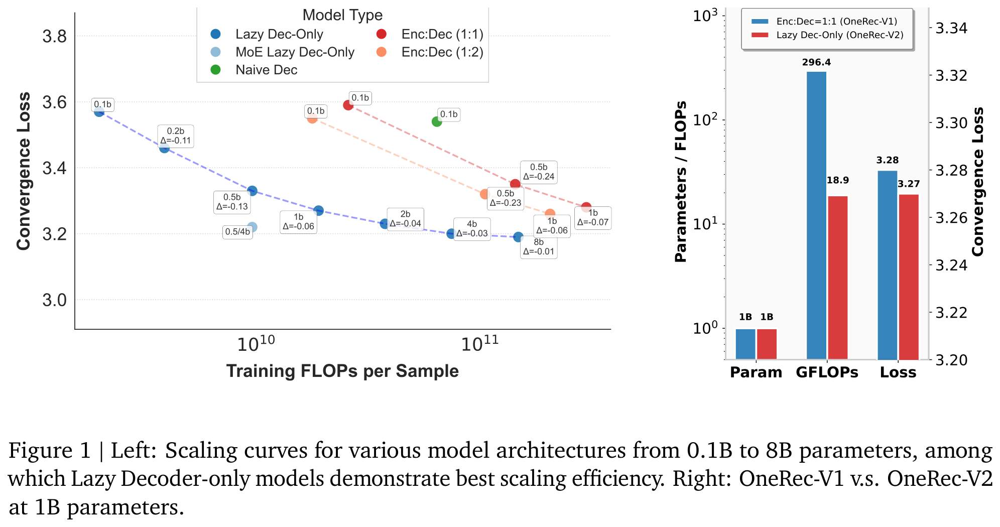 

2.  基于真实世界用户交互的偏好对齐：一种由用户反馈驱动的框架，包含 (i) 时长感知奖励塑形（Duration-Aware Reward Shaping），用于缓解视频时长偏差；(ii) 自适应比率截断（Adaptive Ratio Clipping），用于稳定策略优化，有效利用真实世界反馈以更好地对齐用户偏好，从而显著提升App驻留时长（App Stay Time）。

在Kuaishou/Kuaishou Lite上进行的大规模A/B测试验证了OneRec-V2的有效性，在多目标推荐指标间实现平衡且无此消彼长现象（seesaw effects）的同时，App驻留时长提升了0.467%/0.741%。该工作推进了生成式推荐系统的可扩展性及其与真实用户反馈的对齐能力，标志着端到端推荐系统发展的重要一步。

 

# 1 引言

生成式AI已在众多领域引发范式变革。尽管传统级联推荐架构经历了持续演进，但仍受限于若干根本性瓶颈：其固有的多阶段设计导致计算资源碎片化以及优化目标不一致。生成式推荐通过将推荐任务重新定义为端到端的序列生成问题，转变了这一范式。这种统一的框架能够直接优化最终目标，实现较高的模型FLOPs利用率（Model FLOPs Utilization, MFU），并促进推荐系统与大型基础模型社区之间的深度融合。

尽管OneRec-V1在工业部署中已展现出显著成效，但其可扩展性与性能仍存在进一步提升的空间：

(1) 编码器-解码器架构中计算资源分配效率低下。OneRec-V1采用编码器-解码器框架，其中用户历史交互序列由编码器处理，并通过交叉注意力机制供解码器使用。尽管OneRec-V1的解码器参数量多于编码器，但计算负载主要集中于编码器，因其需处理较长的用户交互序列，而解码器的输入则显著更短。如第**section 2.1**节所示，在OneRec-V1上下文长度为 $`512`$ 的情况下，上下文编码消耗了总FLOPs的97.66%，而解码器的目标item生成仅占2.34%。这种不成比例的资源分配带来了可扩展性挑战，因为绝大多数计算预算被用于序列编码，而非生成推荐决策的关键生成过程。在相同计算预算下，这种不平衡的资源分布可能限制模型向更大架构有效扩展的潜力。

(2) 仅依赖奖励模型的强化学习存在局限性。尽管OneRec-V1已验证基于奖励模型的强化学习在策略优化中的有效性，但该方法面临两个内在挑战。首先，**采样效率有限**：依赖奖励模型的方法需要额外的计算资源用于在线生成与打分，这限制了仅能对少量用户采样以近似全局行为。其次，存在**潜在的奖励作弊（reward hacking）**问题，即策略可能学会利用奖励模型中的特定模式或偏见，而这些并不能转化为实际性能的提升。引入真实用户反馈来解决这些问题，有望更好对齐策略与用户偏好，从而带来更优的结果。此外，OneRec的大规模部署为通过真实用户交互数据实现策略优化的持续反馈闭环提供了关键机会。在本研究中，作者提出OneRec-V2，该论文通过引入惰性解码器架构以及基于真实用户交互的偏好对齐机制，解决了上述根本性局限。如图**figure 2**所示，该论文的主要贡献如下：  

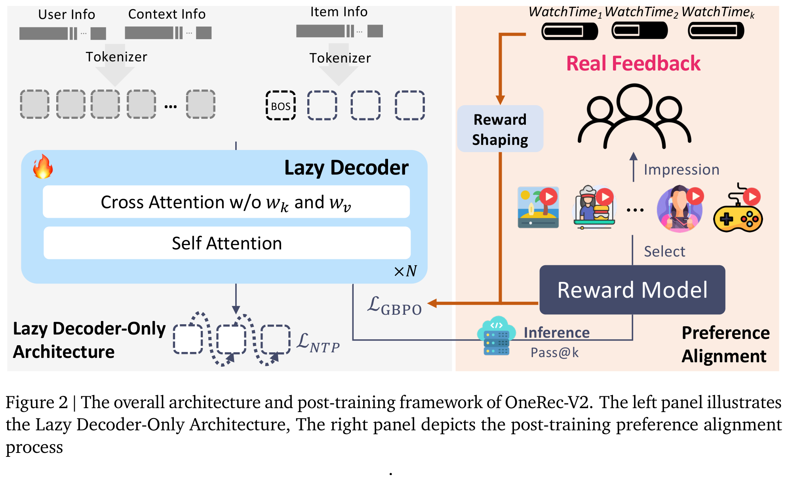 

- **惰性纯解码器架构（Lazy Decoder-Only Architecture）**。作者提出一种简化的纯解码器架构，消除了传统编码器-解码器设计中的计算瓶颈。通过移除编码器组件并简化交叉注意力机制（消除K/V投影层），该惰性解码器在相同计算预算下实现了计算需求减少94%、实际训练资源减少90%，同时支持模型参数规模扩大16倍（从0.5B增至8B）。如图**figure 1**所示，该架构不仅使纯解码器Transformer在工业级推荐系统中变得实用且高效，还展现出在模型规模与FLOPs方面的强大扩展能力，为生成式推荐领域的未来模型发展提供了重要指导。

- 基于真实用户交互的偏好对齐。该论文提出了一种全面的后训练框架，直接利用真实世界中的用户反馈信号，以解决生成式推荐系统中奖励建模的根本性挑战。（i）**时长感知的奖励塑形**（Duration-Aware Reward Shaping），通过考虑视频长度的变化，缓解原始观看时长信号中固有的偏差，确保奖励信号能够准确反映内容质量而非仅仅是播放时长；以及（ii）**自适应比例裁剪**（Adaptive Ratio Clipping），在策略优化过程中有效降低训练方差，同时保留收敛保证。实验表明，在App停留时长（APP Stay Time）上取得了显著提升。值得注意的是，当引入OneRec自身推荐产生的流量分布模式时，在线性能进一步增强，表明模型优化与真实世界用户行为分布之间实现了更优的对齐。

在拥有4亿日活跃用户的快手/快手极速版APP上进行的大规模在线A/B测试表明，OneRec-V2相较于OneRec-V1实现了显著改进，在App停留时长上分别提升了0.467%和0.741%，并且在多个推荐目标之间实现了有效平衡，未出现目标之间的“跷跷板效应”（seesaw effects）。

在本文其余部分，首先详细阐述OneRec-V2的架构及预训练的实证结果（第**section 2**节）。接着介绍后训练方法（第**section 3**节），随后通过在线A/B测试进行全面评估（第**section 4**节）。最后，对该工作现有的局限性进行总结，并提出未来研究的潜在方向（第**section 5**节）。

# 2 懒惰解码器专用架构

在本节中，作者介绍了基于懒惰解码器（lazy decoder）的架构。第**section 2.1**节详细阐述了OneRec模型架构的演进路径与设计思路。在第**section 2.2**节中，提出了OneRec-V2所采用的懒惰解码器专用架构（lazy decoder-only architecture），该架构在显著降低计算复杂度和内存消耗的同时，实现了更低的生成任务损失。最后，在第**section 2.3**节中，通过全面的实证结果验证了该懒惰解码器专用设计的优越性，并探讨了生成式推荐系统的扩展规律（scaling laws）。

## 2.1 设计原则

自回归模型已成为现代自然语言处理中的主导范式，推动了诸如 GPT 和 LLaMA 等最先进的大语言模型（LLMs）的发展。这些模型展现出卓越的可扩展性，其成功源于简洁的设计理念：采用统一架构以自回归方式处理序列。结合大规模预训练能力，基于 Transformer 的自回归模型已成为生成式 AI 应用的事实标准。

为了将这类架构适配到推荐系统中，第一步是构建适用于自回归训练的 doc。传统上，推荐系统的训练样本按时间顺序组织的曝光序列进行组织。然而，当与标准的 Next Token Prediction 目标结合时，会产生冗余，如图 **figure 3**.a 所示。一种避免该冗余的方法是采用以用户为中心的数据组织方式，即每个训练样本包含一个用户的完整交互历史，如图 **figure 3**.b 所示。然而，这种方式存在时间数据泄露和流行度偏差的风险。已有大量研究致力于缓解这些问题。

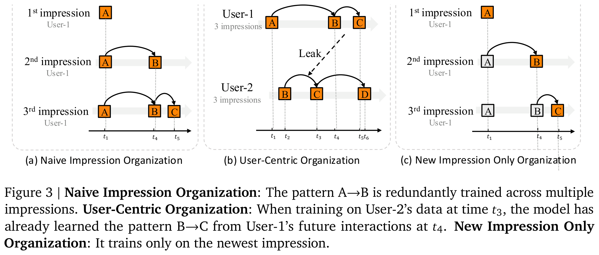 

为了解决上述问题，该论文提出按时间顺序组织数据，但仅对最新曝光的 item 计算训练损失，如图 **figure 3**.c 所示，其中灰色 item 在下一项 token 预测中被排除。由于先前曝光的 item 与最新曝光的 item 发挥的作用不同，作者在之前的 OneRec-V1 中选择了 Encoder-Decoder 架构。如表 **table 1** 所示，该论文对计算细节进行了初步分析。计算过程可分为两个不同类别：上下文编码和目标解码。

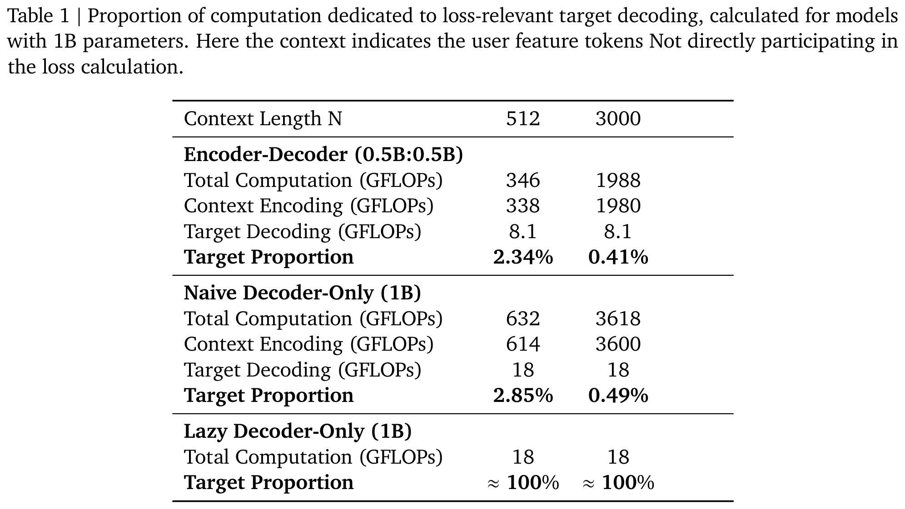 

定义 1. 上下文编码  指处理和转换用户上下文特征的计算操作，具体包括：(i) 编码器中执行的上下文变换操作，以及 (ii) 解码器中交叉注意力机制里的上下文投影操作。

定义 2. 目标解码  指在解码器中处理和转换目标 item 的语义 token 的计算操作，具体包括：(i) 自注意力机制，用于捕捉语义 token 之间的依赖关系；(ii) 前馈网络（FFN），用于执行非线性变换；(iii) 交叉注意力机制中的查询和输出变换。

根据表 **table 1**，与经典的 Decoder-Only 架构相比，在参数量相同的情况下，Encoder-Decoder 架构节省了近一半的计算量。然而，两种架构仍面临计算效率低下的问题：大多数计算资源被分配给了并不直接参与损失计算的 token。对于 OneRec-V1 中典型的上下文长度 $`N=512`$ ，仅有不到 3% 的总 FLOPs 实际参与损失计算，且随着上下文长度增长，这一比例变得越来越可忽略。详细的计算分析见附录 **appendix B**。为将计算资源集中到仅处理目标 item 的语义 token 上，从而支持更大型模型的高效扩展，该论文提出了 Lazy Decoder-Only 架构。

## 2.2 整体架构

在本节中，作者提出了一种新颖的架构，如图 **figure 4** 所示，该架构通过两个关键创新从根本上重新设计了生成式推荐系统。

 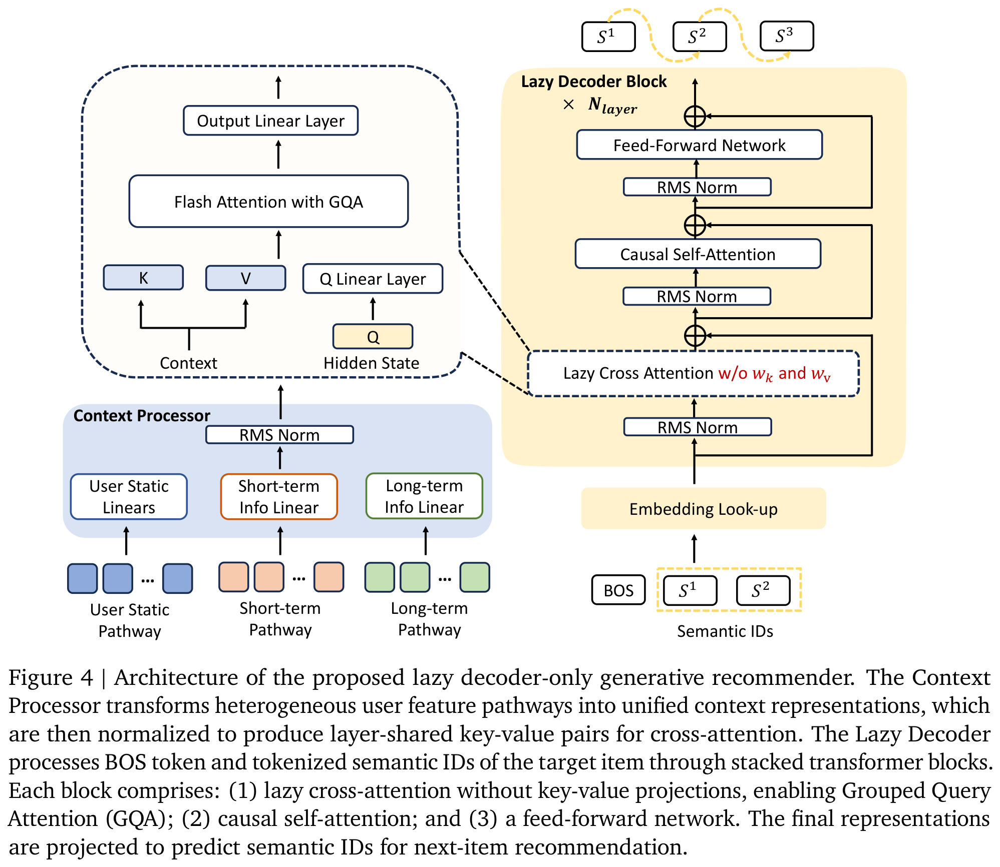 

 首先，该论文提出一种  lazy decoder-only 架构，既不同于传统的 encoder-decoder 模型，也不同于简单的 decoder-only 方法。该设计将上下文视为静态的条件信息，仅通过 cross-attention 进行访问，从而消除了冗余计算，同时保留了模型捕捉复杂用户-物品交互的能力。

 其次，作者引入了一种极其高效的 lazy cross-attention 机制，该机制无需 key-value 投影。结合 Grouped Query Attention (GQA)，该设计显著降低了内存占用，使得对大规模用户历史的高效处理成为可能。

 

### 2.2.1 Context Processor

为了有效整合异构且多模态的用户行为信号，作者设计了一个统一模块，称为  Context Processor ，以实现与下游基于 attention 的 decoder 块的无缝集成。

 具体而言，用户画像和行为等异构输入被拼接为一个统一的序列，即 context。context 中的每个 item 都被处理为相同的维度：  

$$
d_{\text{context}} = S_{\text{kv}}\cdot L_{\text{kv}} \cdot G_{\text{kv}} \cdot d_{\text{head}},
$$

其中   $`d_{\text{head}}`$ 表示 attention head 的维度，   $`G_{\text{kv}}`$ 表示 key-value head 的组数，   $`S_{\text{kv}}`$ 表示 key-value 分割系数，   $`L_{\text{kv}}`$ 表示 key-value 层数。

context 表示被转换为针对 attention 机制的层特定 key-value 对。作者沿特征维度对 context 张量进行划分，生成   $`L_{\text{kv}}`$ 组 key-value 对：

 

$$
\text{Context} = [\mathbf{C}_0, \mathbf{C}_1, \ldots, \mathbf{C}_{S_{\text{kv}} \cdot L_{\text{kv}} - 1}],
$$

其中   $`\mathbf{C}_{S_{\text{kv}} \cdot L_{\text{kv}} - 1} \in \mathbb{R}^{G_{\text{kv}} \cdot d_{\text{head}}}`$ 。此处为简化起见，忽略序列维度。

对于每一层   $`l \in \{0, 1, \ldots, L_{\text{kv}}-1\}`$ ，计算归一化的 key-value 对：  

$$
\mathbf{k}_l = \text{RMSNorm}_{k,l}(\mathbf{C}_{l \cdot S_{\text{kv}}}),
$$

$$
\mathbf{v}_l = \begin{cases} \text{RMSNorm}_{v,l}(\mathbf{C}_{l \cdot S_{\text{kv}} + 1}), & \text{if } S_{\text{kv}} = 2 \text{ (separated key-value)} \\ \mathbf{k}_l, & \text{if } S_{\text{kv}} = 1 \text{ (shared representation)}. \end{cases}
$$

Context Processor 的最终输出为   $`\{(\mathbf{k}_0, \mathbf{v}_0), \ldots, (\mathbf{k}_{L_{\text{kv}}-1}, \mathbf{v}_{L_{\text{kv}}-1})\}`$ 。

### 2.2.2 Lazy Decoder Block

**Tokenizer**：对于每个目标 item，该论文采用一个语义 tokenizer，生成 3 个语义 ID 以捕捉 item 的多维度特征，方法如 Onerec-V1 所述。在训练过程中，使用前 2 个 ID 并在序列前添加一个 beginning-of-sequence（BOS）token 构成输入序列。这些 token 索引通过 embedding 表映射，得到初始的隐藏表示：

$$
\mathbf{h}^{(0)} = \text{Embed}([\text{BOS}, s^1, s^2]) \in \mathbb{R}^{3 \times d_{\text{model}}}.
$$

**Block Structure**：Lazy Decoder 由 $`N_{\text{layer}}`$ 个堆叠的 Transformer 块组成，每个块包含三个主要组件：交叉注意力（cross-attention）、自注意力（self-attention）和前馈网络（feed-forward）模块。对于第 $`l`$ 层，其变换定义如下：

$$
\begin{align}\mathbf{h}_{\text{cross}}^{(l)} &= \mathbf{h}^{(l-1)} + \text{CrossAttn}\left(\text{RMSNorm}(\mathbf{h}^{(l-1)}), \mathbf{k}_{l_{\text{kv}}}, \mathbf{v}_{l_{\text{kv}}}\right), \\ \mathbf{h}_{\text{self}}^{(l)} &= \mathbf{h}_{\text{cross}}^{(l)} + \text{SelfAttn}\left(\text{RMSNorm}(\mathbf{h}_{\text{cross}}^{(l)})\right), \\ \mathbf{h}^{(l)} &= \mathbf{h}_{\text{self}}^{(l)} + \text{FFN}^{(l)}\left(\text{RMSNorm}(\mathbf{h}_{\text{self}}^{(l)})\right),\end{align}
$$

其中 RMSNorm 表示均方根归一化（root mean square layer normalization），用于提升训练稳定性。

为了在保持计算效率的同时增强模型容量，作者采用了一种混合架构，即在较深的层中用 Mixture-of-Experts（MoE）模块替代密集的前馈网络。借鉴 DeepSeek-V3 的设计，采用了一种无需辅助损失（auxiliary-loss-free）的负载均衡策略，以确保专家模块的高效利用。

**Lazy Cross-Attention: KV-Sharing**：为了提升参数和计算效率，多个 Lazy Decoder 块共享来自上下文处理器（context processor）的同一组键值对（key-value pairs）。对于当前层 $`l`$ ，确定对应的键值索引：

$$
l_{\text{kv}} = \left\lfloor \frac{l \cdot L_{\text{kv}}}{N_{\text{layer}}} \right\rfloor,
$$

其中 $`N_{\text{layer}}`$ 是 Lazy Decoder Block 的总层数。该设计确保了连续的若干层共享相同的上下文表示 $`(\mathbf{k}_{l_{\text{kv}}}, \mathbf{v}_{l_{\text{kv}}})`$ ，其中 $`\mathbf{k}_{l_{\text{kv}}}, \mathbf{v}_{l_{\text{kv}}} \in \mathbb{R}^{(N_s + T_{\text{short}} + T_{\text{long}}) \times G_{\text{kv}} \times d_{\text{head}}}`$ 。

为进一步提升参数效率，作者采用统一的键值表示，即对所有层均有 $`\mathbf{v}_{l} = \mathbf{k}_{l}`$ ，该设计基于观察：绑定键值投影（tied key-value projections）可在减少模型内存占用的同时保持相近的性能。

**Lazy Cross-Attention: Grouped Query Attention**：查询（query）投影保持 $`H_q = d_{\text{model}} / d_{\text{head}}`$ 个注意力头，而键值对（key-value pairs）仅使用 $`G_{\text{kv}}`$ 个头组（head groups），通常 $`G_{\text{kv}} < H_q`$ 。该设计显著降低了上下文表示的内存占用以及注意力计算过程中的内存访问需求，从而支持更长上下文和更大批量的高效扩展。

**Output Layer**：最后一个 Decoder 块的最终隐藏表示经过位置特定的 RMSNorm 和线性层（Linear layer），生成对每个语义 ID 的预测。在训练过程中，模型被优化以最大化目标 item 的语义 ID $`[s^1, s^2, s^3]`$ 的似然。

## 2.3 经验结果

为了验证懒惰式decoder-only架构的有效性，作者进行了多维度的全面经验评估。该论文系统地将所提出的方法与经典架构进行了比较，研究了关键架构创新的影响，并探讨了稠密和稀疏模型变体的扩展特性。所有实验均使用来自快手2025年8月10日至14日的曝光数据进行流式训练，采用相同的采样比例和一致的全局批量大小。除非另有说明，否则设置 $`L_{\text{kv}} = 1`$ ， $`S_{\text{kv}} = 1`$ ， $`d_{\text{head}} = d_\text{model} / N_\text{head}`$ ， $`G_{\text{kv}} = N_\text{head}`$ 且 $`(N_s+T_{\text{short}}+T_{\text{long}})\approx 512`$ 。对于线上部署，采用一个10亿参数的模型，并将长期用户行为序列长度扩展至 $`(N_s+T_{\text{short}}+T_{\text{long}})\approx 3000`$ 。

### 2.3.1 架构比较

该论文比较了三种用于生成式推荐的架构范式：编码器-解码器架构（OneRec-V1）、朴素的decoder-only架构以及所提出的懒惰式decoder-only架构。对于每种模型，评估其在三个语义token上的平均生成损失：

$$
\mathcal{L}_{\text{Gen}} = -\frac{1}{3} \sum_{i=1}^{3} \log p(s^i | \text{BOS}, s^{<i}, \text{Context}),
$$

其中 $`s^i`$ 表示目标item的第 $`i`$ 个语义ID， $`\text{BOS}`$ 表示句子起始token， $`\text{context}`$ 是上下文处理器的输出，包含用户静态特征和行为特征。该损失与OneRec-V1不同，因为作者使用三个token的平均值，而V1使用它们的总和。

表 **表2** 和 图 **图5** 展示了不同模型规模下的计算需求和收敛性能。尽管所需的FLOPs显著更少且激活内存更低，该论文提出的懒惰式decoder-only架构在损失方面仍能达到与传统方法相当的水平。

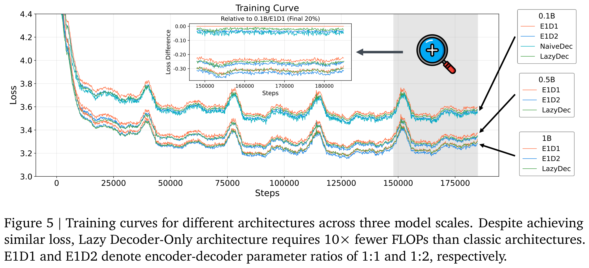 

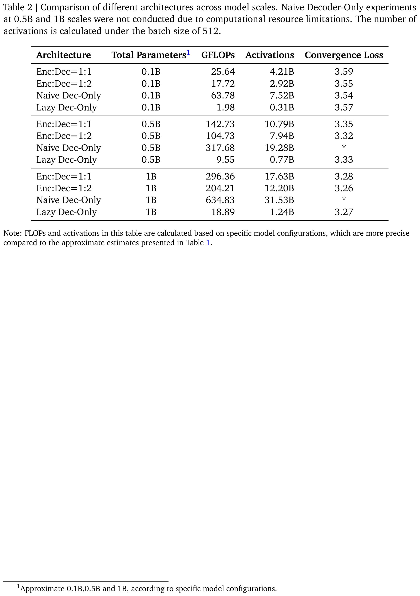

### 2.3.2 Key-Value共享

该论文的上下文处理器引入了两个关键参数，以灵活控制整体上下文维度： $`L_{\text{kv}}`$ 和 $`S_{\text{kv}}`$ 。参数 $`L_{\text{kv}}`$ 决定了跨层的不同上下文表示数量，每 $`N_{\text{layer}} / L_{\text{kv}}`$ 个连续的decoder块共享相同的key-value对。参数 $`S_{\text{kv}}`$ 进一步控制key和value是否共享相同的表示（ $`S_{\text{kv}} = 1`$ ）或维持独立的投影（ $`S_{\text{kv}} = 2`$ ）。该设计在生成任务上保持可比性能的同时，降低了计算成本和激活内存。作者在一个10亿参数的稠密懒惰式decoder模型上进行了消融实验，该模型具有 $`N_{\text{layer}} = 18`$ ，以研究这些设计选择的影响。

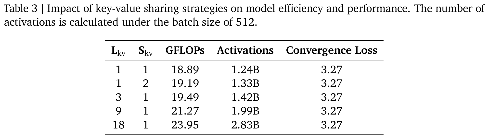

图 **图10a** 表明，激进的key-value共享在整个训练过程中仍保持有竞争力的损失，验证了该论文高效的上下文处理策略。

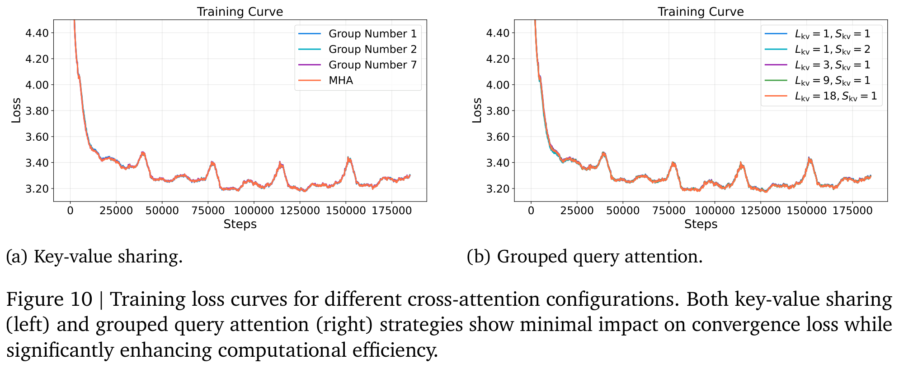

### 2.3.3 分组查询注意力（Grouped Query Attention）

分组查询注意力（Grouped Query Attention, GQA）在多个查询头之间共享键-值头。在该论文的懒惰解码器（lazy decoder）架构中，这一优化减少了激活内存以及交叉注意力操作中的内存访问瓶颈，从而在对模型质量影响最小的前提下提升了训练吞吐量。作者研究了在具有14个注意力头的10亿参数密集型懒惰解码器模型上，键-值头分组数 $`G_{\text{kv}} \in \{1, 2, 7\}`$ 变化所带来的影响。

表4和图10b的结果表明，采用不同分组数的GQA在显著降低内存需求的同时，性能几乎与全注意力机制相当。

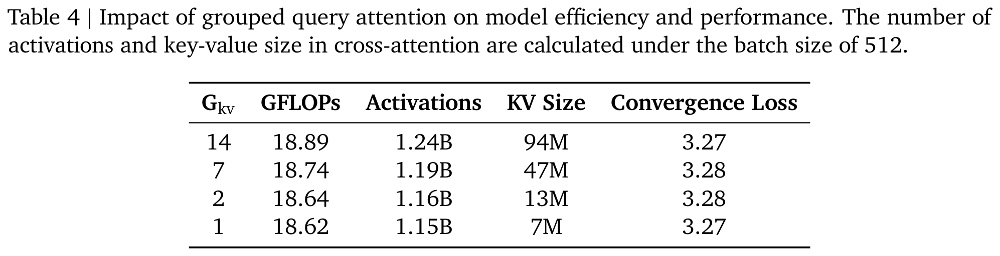 

### 2.3.4 模型扩展（Model Scaling）

该论文对懒惰解码器-only架构进行了全面的扩展实验，研究了密集型和稀疏型两种配置，以理解不同模型规模下的计算-性能权衡。

**密集模型扩展**：作者探索了从0.1B到8B参数的密集型懒惰解码器模型的扩展特性。表5展示了每种模型配置的架构超参数及其收敛性能。

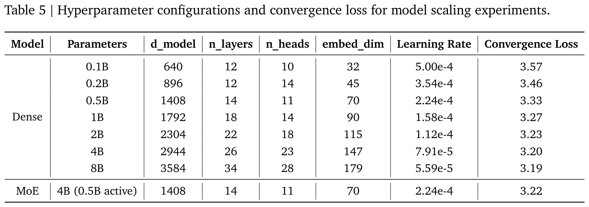 

**稀疏专家混合模型（Sparse Mixture-of-Experts）**：为了实现更高效的扩展，作者研究了一种专家混合模型（Mixture-of-Experts, MoE）变体，该变体将密集的前馈网络替换为稀疏的专家路由机制。该MoE配置使用53个路由专家和1个共享专家，总参数量为4B（每个token激活0.5B参数）。模型对每个token采用top-3专家路由策略，MoE中间层尺寸为1408。该稀疏模型保持与0.5B密集模型相同的基线架构，仅将前两个懒惰解码器块之后的前馈层替换为MoE层。

**结果与分析**：图6展示了不同模型配置下的训练动态。实验揭示了懒惰解码器架构在推荐系统中的扩展行为的若干关键洞察。作者还展示了随着训练预算增加，不同规模模型的损失下降情况，详见图11。

 

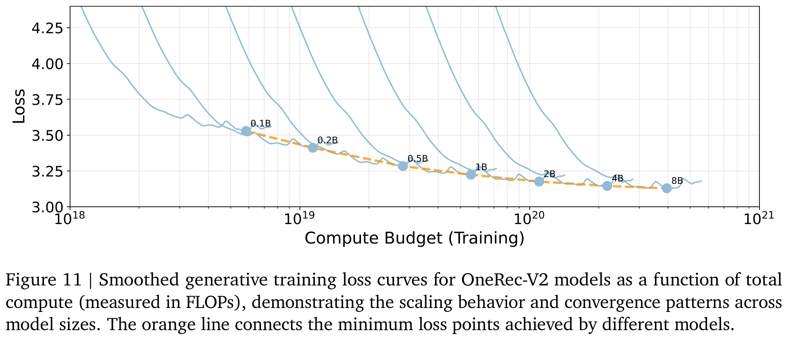 

收敛损失随模型规模增大而持续改善，从0.1B模型的3.57下降至8B模型的3.19。最大的提升出现在十亿参数以下的区间，从0.1B扩展到1B参数时损失降低了0.3。边际增益逐渐减小，例如4B模型相较于2B模型仅进一步降低0.03的损失，表明超过2B参数的扩展仍具挑战性。

采用4B总参数（激活0.5B）的MoE变体实现了3.22的收敛损失，优于2B密集模型，同时其计算开销与0.5B密集基线模型相当。该配置相较于0.5B密集模型实现了0.11的损失降低，证明了稀疏架构在推荐任务中的有效性。

这些结果表明，该论文提出的懒惰解码器架构能够有效扩展，其中MoE变体在工业级推荐系统部署中展现出尤为理想的权衡，因为计算效率直接影响服务成本与延迟。

# 3 基于真实用户交互的偏好对齐

在本节中，作者介绍了 OneRec-V2 的后训练阶段。监督微调阶段与 OneRec-V1 相同，使用流式曝光数据进行在线 $`\mathcal{L}_{Gen}`$ 损失训练，该损失函数与预训练阶段所使用的损失一致。其主要目的是捕捉用户的实时兴趣变化，同时防止模型偏离预训练模型过远。在 OneRec-V1 中，强化学习（RL）阶段完全基于奖励模型。而在 OneRec-V2 中，作者引入了以用户反馈信号作为奖励的强化学习方法。

## 3.1 基于用户反馈信号的强化学习

基于用户反馈定义奖励可以避免奖励作弊（reward hacking）问题，且不需要额外的模型计算开销。然而，该方法仍然面临如何结合多个目标以及正样本稀疏等挑战。在短视频推荐场景中，每个视频的播放时长是最密集的反馈信号，并且与最重要的线上指标（如 APP 停留时长和 LT7（7日留存））高度相关。因此，作者设计了一种简单但有效的基于播放时长的奖励机制。

### 3.1.1 时长感知的奖励塑形

尽管视频播放时长是衡量用户满意度的有用指标，但它本质上受到视频时长本身的影响而产生偏差。为了解决这一偏差，作者提出了一种时长感知的奖励塑形机制，如图 **figure 7** 所示。该方法通过将播放时长与用户历史上具有相似时长的视频进行比较来进行归一化。由于视频时长服从长尾分布，作者采用对数策略将历史视频划分为不同的桶（buckets）。这种方法将时长分组到指数扩展的区间中，从而产生更平衡且有意义的对比群体。映射由函数 $`\mathcal{F}(d)`$ 给出，该函数将一个时长为 $`d`$ 的视频分配到一个离散的桶索引 $`b \in B`$ 。形式上，桶划分函数定义如下：

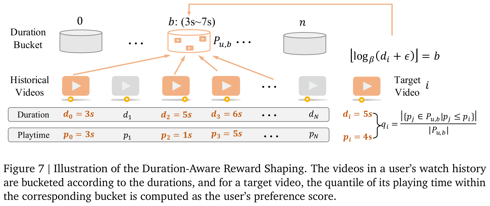 

$$
\mathcal{F}(d) = \lfloor \log_{\beta}(d + \epsilon) \rfloor
$$

其中 $`\beta`$ 是可配置的对数底数，用于控制桶的粒度， $`\epsilon`$ 是一个很小的常数（例如 $`10^{-6}`$ ），用于在处理极短时长时保证数值稳定性。

设 $`H_u = \{(d_k, p_k)\}_{k=1}^N`$ 表示用户 $`u`$ 的历史交互序列，其中 $`d_k`$ 为视频时长， $`p_k`$ 为观测到的播放时长。对于每个时长桶 $`b`$ ，定义播放时长的经验分布为：

$$
P_{u,b} = \{p_j \mid (d_j, p_j) \in H_u, \mathcal{F}(d_j) = b\}.
$$

给定一个目标视频 $`i`$ ，其时长为 $`d_i`$ ，播放时长为 $`p_i`$ ，首先确定其所属桶 $`b = \mathcal{F}(d_i)`$ 。然后，时长归一化的参与度得分计算为 $`p_i`$ 在用户历史分布 $`P_{u,b}`$ 中的经验百分位秩：

$$
q_i = \frac{|\{p_j \in P_{u, b} \mid p_j \le p_i\}|}{|P_{u, b}|}.
$$

作者基于该得分选择最有价值的样本作为正样本。在一个 batch 中，将 $`q_i`$ 按降序排列后，取其 25% 分位数（即前四分之一）作为 $`\tau_{b}`$ 。对于具有显式负反馈（如“不喜欢”操作， $`neg_i = 1`$ ）的样本，设置 $`A_i = -1`$ 。其余所有样本均被过滤掉，这等价于设置 $`A_i = 0`$ 。需要注意的是，作者直接赋予优势值（advantage values）而未进行归一化，因为该论文对正负样本的定义已足够严格，进一步的归一化可能引入优化不一致性，从而降低性能。形式化定义如下：

$$
A_i = \begin{cases} +1, & q_i > \tau_B \text{ and } neg_i = 0, \\ -1, & neg_i = 1, \\ 0, & \text{otherwise}. \end{cases}
$$

该策略有效筛选出高质量的正例样本，同时融合了直接的负反馈信号，从而生成更准确的用户偏好信号。

### 3.1.2 强化学习

**Gradient-Bounded Policy Optimization** ：强化学习的有效性和稳定性近年来在大语言模型（LLM）社区中成为主要研究焦点。一个关键挑战是在提升探索能力以改善性能的同时，维持梯度的稳定性。在本节中，作者提出了新方法 GBPO（Gradient-Bounded Policy Optimization）。

 
$$
\mathcal{J}_{GBPO}(\theta) = -\mathbb{E}_{u\sim P(U),\{o_i\}_{i=1}^G\sim\pi_{\theta_{old}}}\left[\frac1G\sum_{i=1}^G\frac{\pi_{\theta}(o_i|u)}{\pi_{\theta_{old}}'(o_i|u)}\cdot A_i\right],
$$

$$
\pi_{\theta_{old}}'(o_i|u)= \begin{cases} \text{max}(\pi_{\theta_{old}}, sg(\pi_{\theta})),&A_i\geq0, \\[6pt] \text{max}(\pi_{\theta_{old}}, 1-sg(\pi_{\theta})),&A_i< 0. \\
\end{cases}
$$

从公式可以看出，GBPO 移除了对比例项的裁剪操作，并对 $`\pi_{\theta_{old}}`$ 引入了动态边界。总体而言，GBPO 具有两个主要优势：

- 全样本利用：保留所有样本的梯度，鼓励模型进行更广泛的探索。

- 梯度有界稳定化：通过二元交叉熵（BCE, Binary Cross-Entropy）损失的梯度对强化学习的梯度进行边界约束，增强强化学习训练的稳定性。

**现有基于裁剪的方法** ：在详细介绍 GBPO 之前，该论文首先简要回顾了现有的用于大语言模型的强化学习方法。GRPO/PPO 通过裁剪操作丢弃策略比率过大或过小的样本，防止训练过程过于激进。DAPO 通过放宽上界裁剪来放松样本限制，特别是纳入更多低概率或高熵的 token，从而在提高强化学习性能的同时增加输出多样性。这些研究表明，放宽裁剪约束以包含更多样本可以促进更广泛的探索并提升性能。

然而，这些方法并未对梯度稳定性提供完整且全面的考虑。特别是对于负样本，策略比率缺乏上界，容易导致梯度爆炸，从而引起模型性能崩溃。Dual-clip 对负样本的策略比率应用了上界截断，虽然提高了稳定性，但丢弃了过多的负样本，导致收敛速度变慢。在 OneRec-V1 中，作者提出了早期裁剪 GRPO（ECPO），该方法对负样本的梯度上界进行截断，从而在保留更多样本的同时增强训练稳定性。

 
$$
\mathcal{J}_{ECPO}(\theta) = -\mathbb{E}_{u\sim P(U),\{o_i\}_{i=1}^G\sim\pi_{\theta_{old}}}\left[\frac1G\sum_{i=1}^G\text{min}\left(\frac{\pi_{\theta}(o_i|u)}{\pi_{\theta_{old}}'(o_i|u)}A_i,\text{clip}\left(\frac{\pi_{\theta}(o_i|u)}{\pi_{\theta_{old}}'(o_i|u)},1-\epsilon,1+\epsilon\right)A_i\right)\right],
$$

$$
\pi_{\theta_{old}}'(o_i|u)=\text{max}\left(\frac{\text{sg}(\pi_\theta(o_i|u))}{1+\epsilon+\delta},\pi_{\theta_{old}}(o_i|u)\right), \quad\delta>0.
$$

**梯度分析** ：曝光样本包括由 OneRec 生成的样本以及来自传统流水线的样本。对于由 OneRec 生成的曝光样本，使用曝光时刻的生成概率作为 $`\pi_{old}`$ 。而对于来自传统流水线的样本，由于流水线复杂性，无法获得其生成概率；因此，该论文将 $`\pi_{old}`$ 简化为 OneRec 模型当前的生成概率，即 $`\pi_{old} = \mathrm{sg}(\pi_{\theta})`$ 。对于这些样本，策略比率恒为 $`1`$ 。在传统的强化学习方法中，比率等于 $`1`$ 的样本被认为是训练稳定的样本，不会被截断。然而实际上，这类样本仍可能因负样本引发梯度爆炸，如图8所示。从梯度角度看，对于这些样本中的特定 token $`i`$ ，有

 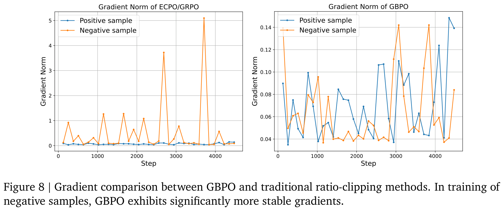 

$$
\mathcal{J}_{ECPO}^i(\theta)= -A_i \cdot \frac{\pi_{\theta}}{sg(\pi_\theta)},
$$

$$
\frac{\partial \mathcal{J}_{ECPO}^i(\theta)}{\partial \theta} = - A_i\cdot\frac{1}{\pi_\theta} \frac{\partial \pi_\theta}{\partial \theta},
$$

这表明当前token概率 $`\pi_\theta`$ 越小，梯度越大。对于正样本而言，概率越小意味着提升空间越大，因此具有较大的梯度是合理的。然而，对于负样本，概率越小意味着进一步抑制的空间越有限；如果此时梯度过大，容易导致模型过拟合甚至崩溃。这一现象说明传统的剪裁方法无法完全解决强化学习梯度不稳定的问题，因为当比值为 $`1`$ 时仍无法避免梯度爆炸。在BCE损失中，虽然同样对负样本施加了惩罚，但其梯度相比强化学习损失要稳定得多。

$$
\mathcal{L}_{BCE}(y, p_\theta) = - \left[ y \cdot \log(p_\theta) + (1-y) \cdot \log(1-p_\theta) \right],
$$

$$
\frac{\partial \mathcal{L}_{BCE}}{\partial \theta}= \begin{cases} -\dfrac{1}{p_\theta}\dfrac{\partial p_\theta}{\partial \theta}, & y=1,\\[6pt] \dfrac{1}{1-p_\theta}\dfrac{\partial p_\theta}{\partial \theta}, & y=0. \end{cases}
$$

对于负样本，模型当前的概率越小，抑制该样本时的梯度也越小，从而使得模型更加稳定。基于这一观察，该论文提出了 GBPO 方法，利用BCE损失中更为稳定的梯度来约束强化学习的梯度。图 **图9** 展示了不同方法之间的差异。

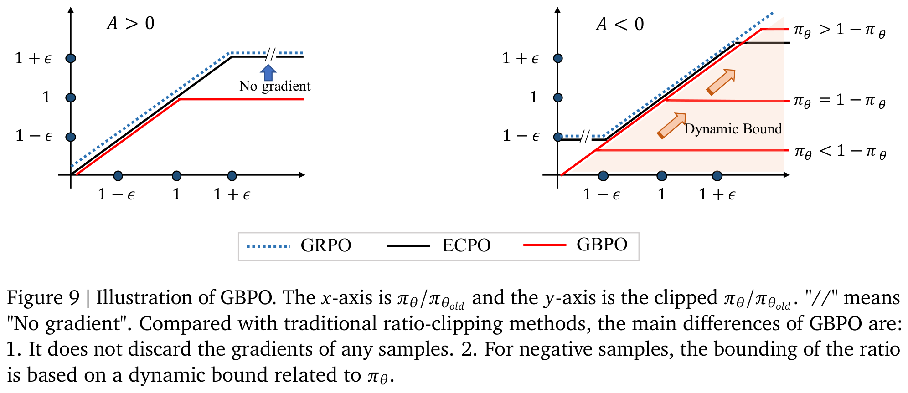

### 3.1.3 实验

**实验设置**：在本节中，该论文通过实验验证所定义的用户反馈信号的有效性。为了实现快速验证，本节中的所有实验均在0.5b模型、上下文长度为512的设置下进行。基线为OneRec-V1。在OneRec-V1的实验设置中，实验组所分配的线上流量仅占总流量的极小部分，因此训练样本几乎全部来源于传统推荐流水线。在大语言模型（LLM）领域，已有研究表明，使用模型自生成样本进行训练可带来自我提升效果。目前OneRec已承接25%的总流量，具备充足的数据来在该场景下验证这一假设。因此，作者设计了两个实验组进行对比：

- 不使用OneRec样本（w/o OneRec Samples）：仅使用传统推荐流水线生成的样本进行强化学习，样本来源与OneRec-V1保持一致。

- 使用OneRec样本（w/ OneRec Samples）：引入由OneRec流水线生成的样本，其中包括当前模型实验组自生成的样本。换言之，该设置引入了on-policy强化学习。

如前所述，用于强化学习的正样本定义为按时长感知奖励得分排序后排名前25%的视频，负样本则由显式负反馈（例如“不喜欢”操作）识别得出。需要注意的是，两个实验组的训练样本总量基本保持一致。强化学习损失函数采用GBPO（公式 **equation 11**）。所有结果展示于表 **table 6**。

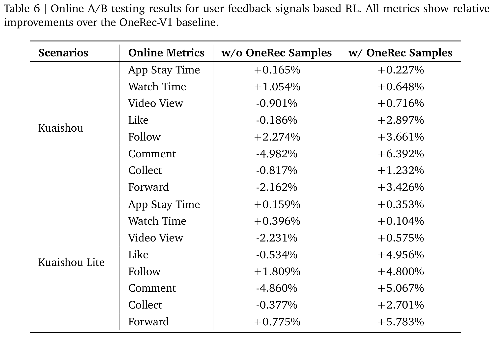

**结果分析**：从表 **table 6** 可得出以下观察结果。当仅使用传统流水线样本时，即与OneRec-V1的样本来源相同，引入基于用户反馈的强化学习显著提升了与观看时长相关的指标，如App停留时长和观看时长，但部分其他指标如视频播放量出现下降。这表明该论文提出的时长感知奖励确实与App停留时长高度相关。在引入OneRec流水线生成的样本后，几乎所有指标均显著提升，尤其是视频播放量由负转正。这证明基于用户反馈的强化学习实现了自我迭代优化，充分挖掘用户反馈信号以增强用户体验。

## 3.2 用户反馈信号与奖励模型
### 3.2.1 奖励模型的局限性

在本节中，该论文将OneRec-V1中依赖奖励模型的强化学习，与基于用户反馈信号驱动的强化学习进行对比。尽管OneRec-V1通过大量实验验证了强化学习的有效性，但其性能受限于采样概率较低。由于资源限制，on-policy roll-outs只能在一小部分用户（1%）上进行。此外，奖励模型容易受到reward hacking的影响。用户反馈信号直接反映了真实用户的偏好，从而缓解了reward hacking的风险。然而，在OneRec全面部署之前，无法获取大规模真实用户对生成样本的反馈数据。随着OneRec的全面上线，这些信号现在可以被更有效地利用，以实现更精准的自我迭代优化。在前一节中，该论文已验证了所提的时长感知反馈信号的有效性。接下来，作者将比较用户反馈信号与奖励模型的性能表现。

### 3.2.2 实验

**实验设置**：设置了三组实验进行对比，分别称为 Reward Model、User Feedback Signals 和 Hybrid。模型设置与 **子小节 3.1.3** 中相同。评估指标也与之前实验一致，包括基于时长的指标和基于交互的指标。其中 App stay time 是最重要的指标，其余指标作为用户体验的参考值。表 **表7** 中展示的结果表示各组相对于 OneRec-V1 的相对性能。

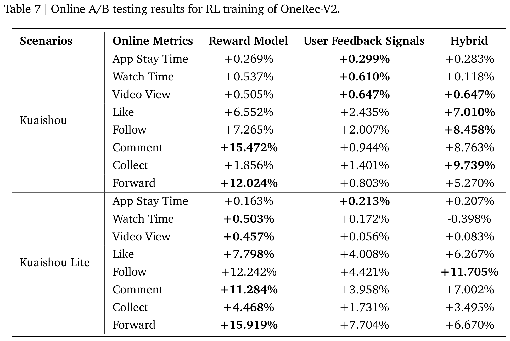 

- Reward Model：引入基于奖励模型的强化学习，与 OneRec-V1 的主要区别在于预训练生成模型的架构。OneRec-V1 使用 Encoder-Decoder 架构，而 OneRec-V2 采用了所提出的 Lazy Decoder 架构。

- User Feedback Signals：引入基于用户反馈的强化学习，并融合自生成样本，该设置与上一节中的 "w/ OneRec Samples" 设置相同。

- Hybrid：同时引入奖励模型和用户反馈信号，两类样本相互独立：前者是通过模型自身 rollout 采样得到的样本，后者是此前已曝光给用户的样本。

**结果分析**：从表 **表7** 中，可以总结出以下观察。

- 在基于奖励模型的设置下，OneRec-V2 明显优于 OneRec-V1，进一步验证了 Lazy Decoder 架构所带来的优势。

- 无论是基于奖励模型还是用户反馈，强化学习均在时长类和交互类指标上带来了双重收益。然而，奖励模型更倾向于提升交互类指标，而真实用户反馈更倾向于增加 App stay time。这是因为奖励模型输出的奖励是多个推荐目标的融合，而基于用户反馈定义的奖励主要基于视频播放时长计算得出。这也表明不同的奖励定义会导致模型优化方向的差异，这与 OneRec-V1 中的结论一致。

- 当将两者结合（Hybrid）时，尽管在时长和交互指标上的具体增益不如各自单独使用时高，但性能损失极小，且 App stay time 与交互类指标之间的平衡性得到了改善。这是因为两种策略所带来的增益存在部分重叠。虽然结合使用无法实现理想的叠加效果，但二者能够形成互补。这也凸显了多样化奖励信号的重要性。该论文后续将对奖励信号的多样性与准确性展开进一步研究。

# 4 在线A/B测试

作者将OneRec-V2部署在快手的两个主要短视频场景中：快手主站信息流和快手极速版信息流，这两个场景代表了平台最高流量的环境，服务于4亿日活跃用户。评估通过5%流量的实验组进行，观察周期为一周。所使用的模型为参数量1B、上下文长度3000、beam size为512的版本。在线推理阶段，系统采用L20 GPU，实现了36ms的延迟和62%的MFU（Model FLOPs Utilization）。为降低系统复杂度，该版本仅引入了用户反馈信号。主要评估指标为App停留时长（衡量用户总体停留时长）和LT7（7日用户留存率）。如表 **表8** 所示，OneRec-V2在两个平台上均取得了显著改进。此外，OneRec-V2在所有用户交互指标上均表现出显著提升，包括点赞、关注、评论及其他互动行为，展示了其在引导多任务推荐系统达成更均衡平衡方面的有效性，同时有效缓解了不同优化目标之间的seesaw效应。

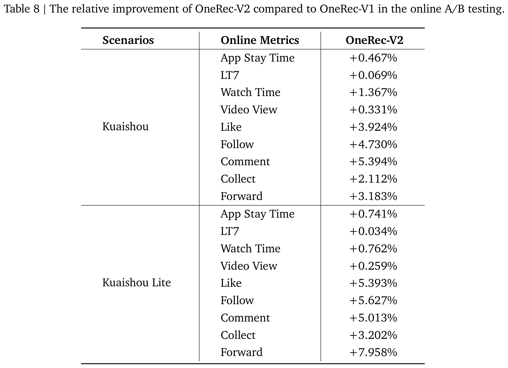

# 5 结论、局限性与未来方向

该论文提出了OneRec-V2，在OneRec-V1的基础上进行了延伸。深入探讨了其扩展性与奖励系统设计。在扩展性方面，作者发现尽管OneRec-V1模型在解码器中使用MoE引入了大量参数，但由于序列长度差异，上下文编码过程消耗了大部分计算资源，限制了进一步的可扩展性与性能提升。因此，作者重新思考了模型架构，提出了一种lazy decoder-only架构，将计算延迟至解码阶段，从而支持模型进一步扩展（目前可扩展至8B参数量）。此外，作者开发了一种有效利用真实用户反馈对齐用户偏好的方法。与V1仅依赖奖励模型进行对齐不同，新方法引入了真实用户反馈信号，并通过创新设计建立了短期观看时长与长期满意度之间的关联。同时，借助GBPO实现了高度稳定的训练。严格的A/B实验验证了该框架的有效性。然而，该系统仍有改进空间。例如：

- 扩展性：尽管观察到模型从0.1B扩展到8B时损失持续下降，但下降趋势并未严格遵循scaling laws。这表明模型扩展仍需进一步探索，后续将在数据组织、模型架构和预训练方法等方面持续投入研究。

- 奖励系统：作者新引入了真实用户反馈到奖励系统中，已被证明有效。但当前方案是通过规则建立短期回报与长期回报之间的联系，而非让模型直接优化其长期价值。未来将在这一方向优化，使模型能够实现面向长期价值的自我强化。

除在快手平台的视频推荐中实现盈利外，OneRec-V2还部署于多个业务场景，带来了显著收益。作者认为，该系统可通过更多研究者与工程师的迭代、验证与优化得到进一步提升。
