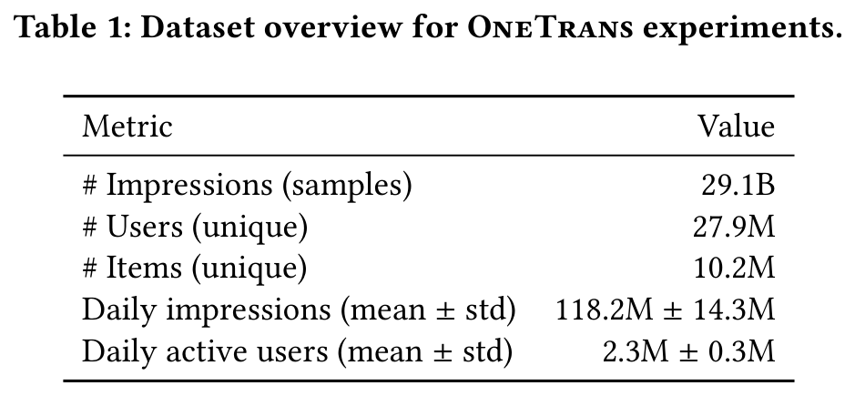
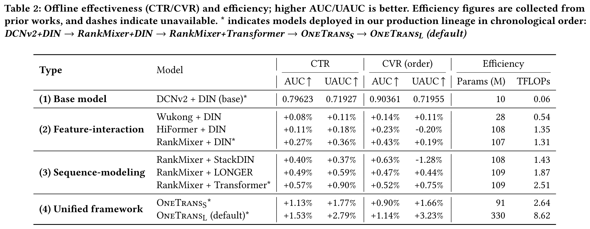
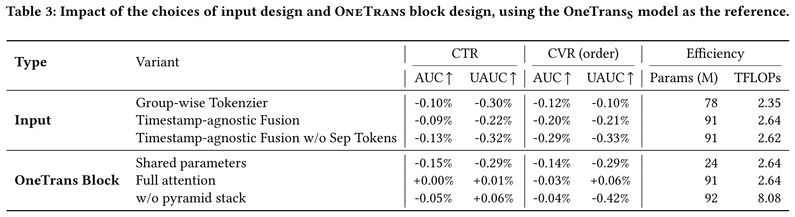
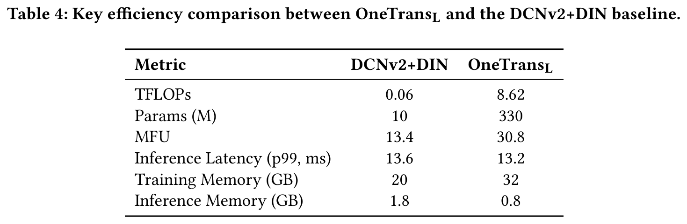
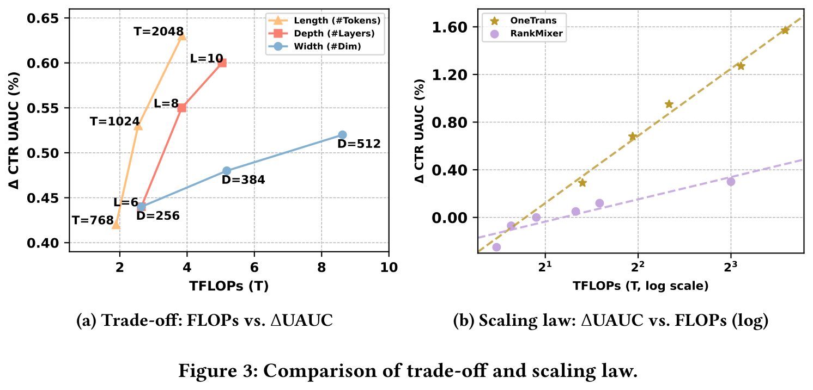
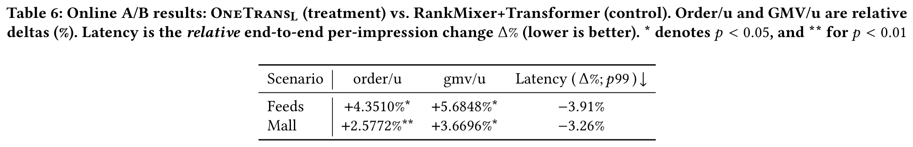

# OneTrans：工业推荐中使用一个Transformer统一特征交互与序列建模

# 摘要
在推荐系统中，扩大特征交互模块（例如 Wukong、RankMixer）或用户行为序列模块（例如 LONGER）已取得显著成功。然而，这些研究通常分别进行，不仅阻碍了双向信息交换，还限制了统一优化与规模化扩展。该论文提出 OneTrans，一种统一的 Transformer 主干网络，能够同时执行用户行为序列建模与特征交互。OneTrans 采用统一的分词器（tokenizer），将序列型和非序列型属性转换为单一的 token 序列。堆叠的 OneTrans 模块在相似的序列 token 上共享参数，同时为非序列 token 分配特定的参数。通过因果注意力机制和跨请求的 KV 缓存，OneTrans 支持中间表示的预计算与缓存，显著降低了训练和推理过程中的计算开销。在工业规模数据集上的实验结果表明，OneTrans 在参数增加时能够高效扩展，持续优于强基线模型，并在在线 A/B 测试中实现每用户 GMV 提升 5.68%。

# 1 引言
推荐系统（RecSys）在电子商务、流媒体和社会网络等各种信息服务中发挥着基础性作用。工业级RecSys通常采用级联排序架构：首先，召回阶段从十亿规模的语料库中筛选出数百个候选；然后，排序阶段——通常包括粗排序和精排序——对每个候选进行打分，并返回 top- $`k`$ 项。

该论文聚焦于排序阶段。在排序方面，主流方法迭代两个独立模块：（a）序列建模，即使用局部注意力或Transformer编码器将用户多行为序列编码为候选感知的表示；（b）特征交互，即通过分解机制、显式交叉网络或对特征组的注意力，学习非序列特征（例如用户画像、物品画像和上下文）之间的高阶交叉。

如图**figure 1**（a）所示，这些方法通常将用户行为编码为压缩的序列表示，然后将其与非序列特征拼接，并通过特征交互模块学习高阶交互；该论文将这种设计称为“先编码后交互”（encode-then-interaction）流程。

大语言模型（LLMs）的成功表明，扩大模型规模（例如参数量、训练数据）能够带来可预测的性能提升，这激发了在RecSys领域内进行类似探索的研究。在特征交互方面，Wukong通过堆叠Factorization Machine模块并引入线性压缩来捕获高阶特征交互，并建立了缩放定律；而RankMixer则通过硬件友好的token混合机制和token-specific的前馈网络（FFNs）实现了良好的可扩展性。

在序列建模方面，LONGER将因果Transformer应用于长用户历史，并表明扩大模型深度和宽度可带来单调性能提升。

尽管在实践中有效，但将序列建模与特征交互作为独立模块分离的做法引入了两个主要限制。

首先，“先编码后交互”流程限制了双向信息流动，限制了静态/上下文特征对序列表示的塑造能力。

其次，模块分离导致执行过程碎片化并增加延迟，而单一的Transformer风格主干网络则可以复用LLM的成熟优化技术（如KV缓存、内存高效注意力和混合精度），从而实现更有效的扩展。

该论文提出OneTrans，一种创新的架构范式，采用统一的Transformer主干网络，同时完成用户行为序列建模与特征交互。

如图**figure 1**（b）所示，OneTrans在统一主干中实现了双向信息交换。它采用统一的tokenizer，将**序列特征**（多样化的用户行为序列）和**非序列特征**（静态的用户/物品及上下文特征）统一转换为单一的token序列，随后由堆叠的OneTrans块金字塔进行处理，这是一种为工业级RecSys定制的Transformer变体。

为了适应RecSys中多样化的token来源（不同于LLM中仅处理文本token），每个OneTrans块采用类似于HiFormer的**混合参数化**（mixed parameterization）策略：所有**序列token**（来自序列特征）共享一组Q/K/V和FFN权重，而每个**非序列token**（来自非序列特征）则分配**token-specific参数**，以保留其独特语义。

与传统的“先编码后交互”框架不同，OneTrans通过统一的因果Transformer主干，消除了序列与非序列特征之间的架构壁垒。

这一设计使RecSys的扩展方式与LLM实践保持一致：整个模型可通过调整主干网络的深度和宽度进行扩展，同时无缝继承成熟的LLM优化技术，如FlashAttention和混合精度训练。

特别地，跨候选和跨请求的KV缓存将具有 $`C`$ 个候选的会话的时间复杂度从 $`O(C)`$ 降低至 $`O(1)`$ ，使得大规模OneTrans的部署成为可能。

总之，该论文的主要贡献有四点：

（1）统一框架。作者提出了OneTrans，一种用于排序的单一Transformer主干网络，配备统一的tokenizer，将序列与非序列特征编码为单一token序列，并通过统一的Transformer块联合执行序列建模与特征交互。

（2）面向推荐系统的定制化设计。为弥合LLM与RecSys任务之间的差距，OneTrans引入了**混合参数化**机制，为多样的非序列token分配token-specific参数，同时在所有序列token之间共享参数。

（3）高效的训练与服务。作者通过**金字塔策略**（逐步剪枝序列token）和**跨请求KV缓存**（跨候选重用用户侧计算）提升效率。此外，还采用了LLM中的优化技术，如FlashAttention、混合精度训练和半精度推理，进一步降低内存与计算开销。

（4）可扩展性与部署。OneTrans在增大模型规模时展现出接近对数线性的性能增益，为真实生产数据中的缩放定律提供了证据。在线部署时，它在关键业务KPI上实现了统计显著的提升，同时保持了生产级的延迟。

# 2 相关工作

早期的 RecSys 如 DIN 及其会话感知变体（DSIN）使用局部注意力机制来学习基于候选物品的用户历史行为摘要，但会将行为压缩为每个候选物品对应的固定长度向量，限制了长距离依赖的建模能力。

自注意力方法如 SASRec、BERT4Rec 和 BST 通过让每个位置能够关注整个历史序列，消除了这一瓶颈，并通过双向掩码机制提升了样本效率。

近年来，随着推荐系统中 Scaling laws 的探索日益增多，LONGER 通过采用高效的注意力机制和对服务友好的设计，将序列建模推向工业级规模，致力于处理超长的行为序列。

然而，在主流的推荐流程中，这些序列编码器通常仍与特征交互模块相互独立，导致特征融合发生在后期，而非与静态上下文特征进行联合优化。

在特征交互方面，早期的 RecSys 依赖于人工设计的交叉特征或自动的乘法交互层。

经典模型如 Wide & Deep、FM/DeepFM 和 DCN/DCNv2 提供了高效但低阶或有界阶数的特征交互。然而，正如近期的 Scaling 研究所指出的，一旦模型堆叠了足够多的交叉层，继续增加层数将不再带来提升：模型性能趋于饱和，无法持续改善。

为了克服预设交叉形式的刚性，基于注意力的方法能够自动学习高阶交互。

AutoInt 能够学习任意阶的关系，而 HiFormer 引入了组特定的投影机制，以更好地捕捉异构且非对称的交互模式。

随着特征交互模块的规模化应用不断扩展，大规模系统如 Wukong 通过堆叠具有线性压缩的 FM 风格交互块实现了可预测的性能增益，

而 RankMixer 在严格的延迟预算下，通过并行 token mixing 和稀疏 MoE 结构实现了良好的扩展性。

然而，这些交互模块通常仍遵循“交互范式”，即将交互推至单独阶段，阻碍了与用户序列建模的统一优化。

迄今为止，推荐系统的发展在很大程度上沿着两个独立的方向演进：序列建模与特征交互。

InterFormer 尝试通过一种基于摘要的双向交叉架构来弥合这一鸿沟，使两个组件之间能够进行信号互换。然而，该方法仍将它们作为独立模块保留，且交叉架构引入了额外的结构复杂性和执行碎片化问题。在缺乏统一主干网络支持联合建模与优化的情况下，将整个系统作为一个整体进行扩展仍然具有挑战性。

# 3 方法论

在详细介绍该论文的方法之前，作者首先简要描述任务设定。在工业级级联推荐系统中，每次召回阶段会为用户 $`u`$ 返回一个候选集（通常包含数百个候选 item）。排序模型随后对每个候选 item $`i`$ 预测一个分数：

$$
\hat{y}_{u,i} = f\left(i \,\big|\, \mathcal{NS},\mathcal{S};\Theta\right)
$$

其中 $`\mathcal{NS}`$ 是从用户、候选 item 和上下文派生的一组非序列特征； $`\mathcal{S}`$ 是用户的历史行为序列集合； $`\Theta`$ 为可训练参数。常见的任务预测包括点击率（CTR）和点击后的转化率（CVR）。

$$
\begin{aligned} \text{CTR}_{u,i}&=P~\big(\text{click}=1\,\big|\,\mathcal{NS},\mathcal{S};\Theta\big),\\ \text{CVR}_{u,i}&=P~\big(\text{conv}=1\,\big|\,\text{click}=1,\mathcal{NS},\mathcal{S};\Theta\big). \end{aligned}
$$

## 3.1 OneTransFramework 概述
如图 **figure 2** (a) 所示，OneTrans 采用一个统一的 tokenizer，将序列特征 $`\mathcal{S}`$ 映射为 S-tokens，非序列特征 $`\mathcal{NS}`$ 映射为 NS-tokens。随后，一个金字塔堆叠的 Transformer 在单个计算图中联合处理这一统一的 token 序列。

该论文将初始 token 序列表示为

$$
\mathbf{X}^{(0)} = \big[ \text{S-tokens} \,;\, \text{NS-tokens} \big] \in \mathbb{R}^{(L_{\text{S}} + L_{\text{NS}}) \times d}.
$$

该 token 序列通过拼接 $`L_{\mathrm{S}}`$ 个 S-tokens 和 $`L_{\mathrm{NS}}`$ 个 NS-tokens 构成，所有 token 的维度均为 $`d`$ 。需要注意的是，S-tokens 中插入了可学习的 [SEP] tokens，用于分隔不同类型用户行为序列的边界。

如图 **figure 2** (b) 所示，每个 OneTrans 模块通过以下方式逐步优化 token 状态：

$$
\begin{align}\mathbf{Z}^{(n)} &= \mathrm{MixedMHA}\!\left(\mathrm{Norm}\big(\mathbf{X}^{(n-1)}\big)\right) + \mathbf{X}^{(n-1)}, \\ \mathbf{X}^{(n)} &= \mathrm{MixedFFN}\!\left(\mathrm{Norm}\big(\mathbf{Z}^{(n)}\big)\right) + \mathbf{Z}^{(n)}.\end{align}
$$

其中， $`\mathrm{MixedMHA}`$ （Mixed Multi-Head Attention）和 $`\mathrm{MixedFFN}`$ （Mixed Feed-Forward Network）采用了混合参数化策略（见图 **figure 2** (c)），在注意力和前馈网络层中对序列 token 共享参数，同时为非序列 token 分配独立的参数。

一个统一的因果掩码施加了自回归约束，限制每个位置只能关注其之前的 token。具体而言，NS-tokens 被允许关注 S-tokens 的整个历史，从而实现全面的跨 token 交互。通过在 S-tokens 上应用金字塔式尾部截断并堆叠此类模块，模型逐步将紧凑的高阶信息提炼到 NS-tokens 中。最终的 token 状态随后传递给任务特定的预测头。

通过将非序列特征与序列特征统一为一个 token 序列，并使用因果 Transformer 进行建模，OneTrans 突破了传统的“先编码后交互”流程。这种统一设计自然地实现了：(i) 每个行为序列内部的序列内交互，(ii) 多个序列之间的跨序列交互，(iii) 项目、用户与上下文特征之间的多源特征交互，以及 (iv) 序列与特征之间的交互，所有这些均在单一 Transformer 堆栈中完成。

这种统一的建模方式使得作者能够无缝继承成熟的 LLM 工程优化技术，包括 KV 缓存和内存高效的 attention 机制，从而显著降低推理延迟。该论文认为，这种统一建模方式非常适合在单一且可扩展的架构下应对多序列和跨域推荐挑战。接下来将详细介绍设计细节。

## 3.2 特征与分词
为了构建初始 token 序列 $`\mathbf{X}^{(0)}`$ ，OneTrans 首先应用一个特征预处理流程，将所有原始特征输入映射为嵌入向量。这些嵌入随后被划分为 (i) 多行为序列子集，以及 (ii) 表示用户、项目或上下文特征的非序列子集。对每个子集分别应用独立的 tokenizer。

### 3.2.1 非序列化分词
非序列化特征 $`\mathcal{NS}`$ 包含数值型输入（例如价格、CTR）和类别型输入（例如用户 ID、商品类目）。所有特征均经过分桶或独热编码后进行嵌入。由于工业系统通常涉及数百个特征且重要性各异，因此存在两种控制非序列 token 数量（记为 $`L_{NS}`$ ）的方式：

组别分词器（与 RankMixer 对齐）。

特征被手动划分为语义组 $`\{ \mathbf{g}_1,\dots, \mathbf{g}_{L_{NS}} \}`$ 。每个组内特征拼接后通过一个组专用的 MLP 处理：

$$
\text{NS-tokens} = \big[\,\text{MLP}_1(\text{concat}(\mathbf{g}_1)),\dots, \text{MLP}_{L_{NS}}(\text{concat}(\mathbf{g}_{L_{NS}}))\,\big].
$$

自动分割分词器（Auto-Split Tokenizer）。

另一种方法是将所有特征拼接后通过单个 MLP 进行一次投影，再将其分割：

$$
\text{NS-tokens} = \text{split}\Big(\text{MLP}(\text{concat}(\mathcal{NS})),\,L_{NS}\Big).
$$

相比组别分词器，自动分割分词器通过使用单一密集投影减少了内核启动开销。该论文将通过实验评估这两种选择。

最终，非序列化分词生成 $`L_{NS}`$ 个非序列 token，每个 token 的维度为 $`d`$ 。

### 3.2.2 序列化分词
OneTrans 接受多行为序列作为输入：

$$
\mathcal{S} = \{ \mathbf{S}_1, \dots, \mathbf{S}_n \}, \quad \mathbf{S}_i = \big[ \mathbf{e}_{i1}, \dots, \mathbf{e}_{iL_i} \big].
$$

每个序列 $`\mathbf{S}_i`$ 由 $`L_i`$ 个事件 embedding $`\mathbf{e}`$ 构成，该 embedding 通过将 item ID 与其对应的辅助信息（如商品类目、价格）拼接而成。

多行为序列在原始维度上可能存在差异。因此，对于每个序列 $`\mathbf{S}_i`$ ，使用一个共享的投影 $`\mathrm{MLP}_i`$ 将其所有事件 $`\mathbf{e}_{ij}`$ 映射到统一的维度 $`d`$ ：

$$
\tilde{\mathbf{S}}_i = \big[\, \mathrm{MLP}_i(\mathbf{e}_{i1}), \dots, \mathrm{MLP}_i(\mathbf{e}_{iL_i}) \,\big] \in \mathbb{R}^{L_i \times d}.
$$

对齐后的序列 $`\tilde{\mathbf{S}}_i`$ 通过以下两种规则之一合并为单一 token 序列：1）时间戳感知：按时间交错所有事件，并插入序列类型指示符；2）时间戳无关：按照事件影响力拼接序列，例如购买 → 加购 → 点击，并在序列之间插入可学习的 [SEP] token。后一种方式将用户意图更高的行为置于序列前端。

消融实验结果表明，当时间戳可用时，时间戳感知规则优于按影响力排序的替代方案。

形式化地，有：

$$
\text{S-Tokens} = \mathrm{Merge}\big(\tilde{\mathbf{S}}_1, \dots, \tilde{\mathbf{S}}_n\big) \in \mathbb{R}^{L_S \times d}, \quad L_S = \sum_{i=1}^n L_i + L_\text{SEP}.
$$

## 3.3 OneTransBlock
如图 **figure 2** (b) 所示，每个 OneTrans 模块是一个应用于归一化 token 序列的预归一化因果 Transformer，序列顺序为： $`L_S`$ 个顺序的 S-token，后接 $`L_{NS}`$ 个非顺序的 NS-token。

受异构特征组研究的启发，该论文对 Transformer 做出轻量级修改，以支持混合参数机制，参见图 **figure 2** (c)。具体而言，同质的 S-token 共享一组参数；而 NS-token 因来源/语义不同具有异构性，因此分配 token 级别的特定参数。

与大语言模型输入不同，推荐系统中的 token 序列混合了顺序 S-token 和多样化的 NS-token，二者在数值范围和统计特性上差异显著。后归一化结构可能因这些差异引发注意力坍塌和训练不稳定。为避免此问题，该论文对所有 token 应用 RMSNorm 作为预归一化方法，以统一不同 token 类型的尺度并稳定优化过程。

### 3.3.1 混合（共享/Token-specific）因果注意力
OneTrans 采用标准的多头注意力（MHA）并配合因果注意力掩码；唯一的改动在于 Q/K/V 的参数化方式。令 $`\mathbf{x}_i\in\mathbb{R}^{d}`$ 表示第 $`i`$ 个 token。

为计算 Q/K/V，作者对 S-token（ $`i\le L_S`$ ）使用共享投影，对 $`L_{NS}`$ 个 NS-token（ $`i > L_S`$ ）使用 token-specific 投影：

$$
\big(\mathbf{q}_i, \mathbf{k}_i, \mathbf{v}_i\big) \;=\; \big(\mathbf{W}^{Q}_i \mathbf{x}_i , \;\mathbf{W}^{K}_i \mathbf{x}_i , \; \mathbf{W}^{V}_i \mathbf{x}_i \big),
$$

其中 $`\mathbf{W}^{\Psi}_i`$ （ $`\Psi \in \{Q,K,V\}`$ ）遵循混合参数化策略：

$$
\mathbf{W}^{\Psi}_i \;=\; \begin{cases} \mathbf{W}^{\Psi}_{\mathrm{S}}, & i \le L_S \quad (\text{shared for S-tokens}),\\[1.5mm] \mathbf{W}^{\Psi}_{\mathrm{NS},i}, & i > L_S \quad (\text{token-specific for NS-tokens}). \end{cases}
$$

注意力机制使用标准因果掩码，NS-token 位于 S-token 之后。这带来了以下影响：

(1) S侧。每个 S-token 仅关注更早的 S 位置。对于时间戳感知序列，每个事件均以其历史为条件；对于时间戳无关序列（按意图排序，例如购买 $`\rightarrow`$ 加购 $`\rightarrow`$ 点击/曝光），因果掩码允许高意图信号影响并过滤后续低意图行为。

(2) NS侧。每个 NS-token 可关注整个 S 历史，实质上是对序列证据的目标注意力聚合，并可关注前面的 NS-token，从而增加 token 级交互多样性。

(3) 金字塔支持。在 S 和 NS 两侧，因果掩码逐步将信息集中到靠后的位置，自然支持逐层剪枝 token 的金字塔调度策略，具体将在后文详述。

### 3.3.2 混合（共享/Token-specific）前馈网络
类似地，前馈网络也采用相同的参数化策略：NS-token 使用 token-specific FFN，S-token 使用共享 FFN，

$$
\mathrm{MixedFFN}(\mathbf{x}_i) = \mathbf{W}^{2}_i \, \phi(\mathbf{W}^{1}_i \mathbf{x}_i).
$$

此处 $`\mathbf{W}^{1}_i`$ 和 $`\mathbf{W}^{2}_i`$ 遵循公式 **Eqn 12** 的混合参数化策略，即当 $`i\le L_S`$ 时共享，当 $`i>L_S`$ 时为 token-specific。

综上所述，相对于标准因果 Transformer，该论文仅改变了参数化方式：NS-token 使用 token-specific 的 QKV 与 FFN；S-token 共享一组参数。单一因果掩码将整个序列关联起来，使 NS-token 能聚合全部行为历史，同时保持高效、类似 Transformer 的计算方式。

## 3.4 金字塔堆叠
如第 **section 3.3** 节所述，因果掩码将信息逐步集中到靠后的位置。

利用这种近因结构，作者采用金字塔调度策略：在每一 OneTrans 块层中，仅有一部分最近的 S-token 发出查询，而键（keys）和值（values）仍基于完整序列计算；查询集合随网络深度增加而缩小。

令 $`\mathbf{X}=\{\mathbf{x}_i\}_{i=1}^{L}`$ 表示输入 token 列表， $`\mathcal{Q}=\{L{-}L'{+}1,\dots,L\}`$ 表示长度为 $`L'\le L`$ 的尾部索引集合。

沿用公式 **Eqn 12**，作者对查询进行如下修改，仅对 $`i\in\mathcal{Q}`$ 执行：

$$
\begin{align}\mathbf{q}_i \;=\; \mathbf{W}^{Q}_i\,\mathbf{x}_i, \qquad i\in\mathcal{Q},\end{align}
$$

而键和值仍照常在整个序列 $`\{1,\dots,L\}`$ 上计算。

注意力计算后，仅保留 $`i\in\mathcal{Q}`$ 对应的输出，将 token 长度缩减至 $`L'`$ ，从而在各层之间形成金字塔结构。

该设计带来两个优势：

(i) 渐进式蒸馏：长行为历史被逐步压缩到少量尾部查询中，使模型聚焦于最具信息量的事件，并将信息整合至 NS-token 中；以及

(ii) 计算效率：注意力计算成本变为 $`O\big(LL'd\big)`$ ，FFN 的计算量与 $`L'`$ 呈线性关系。缩小查询集可直接减少 FLOPs 与激活内存。

### 3.5.1 跨请求 KV 缓存
在工业级推荐系统（RecSys）中，来自同一请求的样本在训练和推理阶段均为连续处理：它们的 S-token 在不同候选 item 之间保持一致，而 NS-token 则随候选 item 不同而变化。利用这一结构特性，该论文将广泛采用的 KV Caching 技术集成到 OneTrans 中，形成统一的两阶段范式。

阶段 I（S-side，每请求一次）。使用因果掩码处理所有 S-token，并缓存其 key/value 对以及注意力输出。该阶段每请求仅执行一次。

阶段 II（NS-side，每个候选 item 执行一次）。对每个候选 item，计算其 NS-token，并对其与缓存的 S-side key/value 执行交叉注意力，随后通过特定 token 的 FFN 层。特别地，候选 item 特有的序列（例如 SIM）通过池化预先聚合为 NS-token，因为它们无法复用共享的 S-side 缓存。

KV Caching 在多个候选 item 之间摊销了 S-side 的计算量，使每个候选 item 的计算负担更轻，并消除了冗余计算，从而带来显著的吞吐量提升。

由于用户行为序列是仅追加（append-only）的，该论文进一步将 KV Caching 扩展到跨请求场景：每个新请求复用前序缓存，并仅计算新增行为带来的增量 key/value。这将每次请求的序列计算复杂度从 $`O(L)`$ 降低至 $`O(\Delta L)`$ ，其中 $`\Delta L`$ 表示自上次请求以来新增的行为数量。

### 3.5.2 统一的 LLM 优化
该论文采用 FlashAttention-2 技术，通过分块（tiling）与核融合（kernel fusion）减少注意力机制的 I/O 开销以及原始注意力的二次级激活内存占用，从而在训练和推理阶段均实现更低的内存使用和更高的吞吐量。

为进一步缓解内存压力，该论文结合使用混合精度训练（BF16/FP16）与激活重计算（activation recomputation），即在前向传播中丢弃部分激活值，并在反向传播时重新计算。该组合以少量额外计算代价换取显著的内存节省，使得在不改变模型结构的前提下支持更大的 batch size 和更深的模型。

# 4 实验
通过离线评估与在线测试，该论文旨在回答以下研究问题（RQs）：

RQ1：统一架构 vs. 先编码后交互。在计算量相当的情况下，单个 Transformer 堆栈是否能持续带来性能提升？

RQ2：哪些设计选择至关重要？该论文对输入层（如 tokenizer、序列融合）和 OneTrans 模块（如参数共享、注意力类型、金字塔堆叠）进行消融实验，以评估不同设计选择对性能与效率的影响。

RQ3：系统效率。金字塔堆叠、跨请求 KV Caching、FlashAttention-2 以及混合精度结合重计算，是否在相同的 OneTrans 图结构下减少 FLOPs/内存占用与延迟？

RQ4：扩展规律。当扩大长度（token 序列长度）、宽度（ $`d_{\text{model}}`$ ）、深度（层数）时，损失/性能是否表现出预期的对数线性趋势？

RQ5：在线 A/B 测试。在满足生产环境延迟约束的前提下，部署 OneTrans 是否能在线上显著提升关键业务指标（如订单数/用户、GMV/用户）？

## 4.1 实验设置

### 4.1.1 数据集
为进行离线评估，该论文在一个大规模工业级排序场景中评估 OneTrans，使用符合严格隐私合规要求的生产日志数据（所有个人身份信息均已匿名化并哈希处理）。数据按时间顺序划分，所有特征在曝光时刻快照记录，以防止时间泄露并确保线上线下一致性。标签（如点击和下单）在与生产环境对齐的固定时间窗口内聚合。表 **table 1** 总结了数据集统计信息。

### 4.1.2 任务与评估指标
该论文评估了如公式~( **Eqn 2** )所定义的两个二分类排序任务：CTR 和 CVR。性能通过 AUC 和 UAUC（按曝光加权的用户级别 AUC）进行衡量。

下一批次评估。数据按时间顺序处理。对于每个 mini-batch，先以评估模式记录预测结果，然后在同一 batch 上进行训练。每日的 AUC 和 UAUC 基于当天所有预测结果计算，并最终在天数上进行宏平均。

效率指标。报告 Params（模型参数，不包括稀疏 embedding）和 TFLOPs（在 batch size 为 2048 时的训练计算量，单位为 TFLOPs）。

### 4.1.3 基线模型
作者构建了使用相同特征并匹配计算预算的业界标准模型组合作为基线。在“先编码后交互”范式下，从广泛使用的线上基线 DCNv2+DIN 出发，逐步增强特征交互模块：DCNv2   $`\rightarrow`$ Wukong $`\rightarrow`$ HiFormer $`\rightarrow`$ RankMixer。在固定 RankMixer 的情况下，再改变序列建模模块：StackDIN   $`\rightarrow`$ Transformer $`\rightarrow`$ LONGER。

### 4.1.4 超参数设置
报告两种设置：OneTrans-S 使用 6 个堆叠的 OneTrans block，宽度 $`d{=}256`$ ， $`H{=}4`$ 个注意力头，目标参数量约为 100M。

OneTrans-L 扩展至 8 层，宽度 $`d{=}384`$ （仍保持 $`H{=}4`$ ）。

输入通过统一 tokenizer 处理：多行为序列以时间戳感知的方式融合，而非序列特征则通过 Auto-Split 进行 tokenize。金字塔调度将 token 数量从 1190 线性减少至 12。

优化与基础设施。采用双优化器策略，无权重衰减：稀疏 embedding 使用 Adagrad（ $`\beta_1{=}0.1`$ ， $`\beta_2{=}1.0`$ ）优化，稠密参数使用 RMSPropV2（学习率 $`{=}0.005`$ ，动量 $`{=}0.99999`$ ）。

训练时每 GPU 的 batch size 设为 2048，对稠密层和稀疏层分别设置梯度裁剪阈值为 90 和 120，以确保优化稳定性。在线推理时，采用每 GPU batch size 为 100 的较小批量，以平衡吞吐量与延迟。

训练在 16 张 H100 GPU 上使用数据并行的 all-reduce 方式进行。

## 4.2 RQ1：性能评估
作者以 DCNv2+DIN 为比较基准，这是该场景下的上线前基线模型（见表 **table 2**）。在“先编码后交互”范式下，独立扩展任一组件均有益处：升级特征交互模块（DCNv2   $`\rightarrow`$ Wukong   $`\rightarrow`$ HiFormer   $`\rightarrow`$ RankMixer）或序列建模模块（StackDIN   $`\rightarrow`$ Transformer   $`\rightarrow`$ LONGER）均可持续提升 CTR AUC/UAUC 和 CVR AUC。在该系统中，上述指标提升超过 $`+0.1\%`$ 被视为有意义，而提升超过 $`+0.3\%`$ 通常对应在线 A/B 测试中的统计显著效果。然而，由于每个用户的样本量较小且波动性更高，CVR UAUC 的结果需谨慎对待。

 

转向统一建模设计后，OneTrans-S 相较基线提升了 $`+1.13\%/+1.77\%`$ （CTR AUC/UAUC）和 $`+0.90\%/+1.66\%`$ （CVR AUC/UAUC）。

在相近的参数规模下，其表现也优于 RankMixer+Transformer，同时训练 FLOPs 相近（2.64T vs. 2.51T），证明了统一建模的优势。

进一步扩展后，OneTrans-L 实现了最佳整体提升，达到 $`+1.53\%/+2.79\%`$ （CTR AUC/UAUC）和 $`+1.14\%/+3.23\%`$ （CVR AUC/UAUC），显示出随着模型容量增长，性能提升具有可预测性。

综上所述，将序列建模与特征交互统一到单个 Transformer 中，相比独立扩展任一组件，能带来更可靠且计算效率更高的性能提升。

## 4.3 RQ2：通过消融研究分析设计选择
该论文对提出的 OneTrans S 模型进行了消融研究，以量化关键设计选择的贡献。完整的结果汇总于表 **table 3** 中。评估了以下变体：

  

 输入变体：i) 将 Auto-Split Tokenizer 替换为 Group-wise Tokenizer（第1行）；ii) 使用与时间戳无关的融合策略，而非时间戳感知的序列融合（第2行）；iii) 在时间戳感知的序列融合中移除 [SEP] tokens（第3行）；

 OneTrans 模块变体：i) 在所有 token 上共享单组 Q/K/V 和 FFN 参数，而不是为 NS-tokens 分配独立参数（第4行）；ii) 将因果注意力替换为全注意力（第5行）；iii) 通过在所有层保留完整 token 序列来禁用金字塔堆叠结构（第6行）。

综上所述，消融实验表明：

1) Auto-Split Tokenizer 相较于手动将非序列特征分组为 token 具有明显优势，表明允许模型自动构建非序列 token 比依赖人工定义的特征分组更有效；

2) 时间戳感知融合在存在时间戳时优于基于意图的排序，说明应优先考虑时间顺序而非事件影响；

3) 在时间戳无关融合下，可学习的 [SEP] tokens 有助于模型区分不同序列；

4) 为 NS-tokens 分配 token 特定参数相较于在所有 token 上共享一组参数带来了明显提升，证明通过个性化投影建模非序列特征能够实现更好的特征区分能力；

5) 因果注意力与全注意力取得相似的结果，表明在此设定中允许 token 关注未来位置并非关键。值得注意的是，全注意力禁止使用诸如 KV 缓存等标准优化技术；

6) 在每一层保留完整的 token 列表并未带来收益：OneTrans 能有效将信息汇总到少量尾部 token 中，因此金字塔结构可以安全地剪枝查询以节省计算开销。

## 4.4 RQ3：系统效率
为了量化第 **section 3.5** 节中的优化，该论文在未优化的 OneTrans S 基线模型上进行消融实验，并在表 **table 5** 中报告训练/推理指标。

  

未优化的 OneTrans S 的训练运行时间为 407 ms，峰值训练内存为 53.13 GB；p99 推理延迟为 54.00 ms，推理内存为 1.70 GB，其中 p99 表示第 99 百分位（尾部）延迟——这是高可用在线服务的标准 SLO 指标。

这些差异反映了不同的运行条件：离线训练使用较大的每设备 batch，而在线推理则将微 batch 分布到多个机器上以保证稳定性。如表中所示，

1)  Pyramid stack 通过将长行为历史压缩为紧凑的查询集，带来了显著节省（训练时间减少 $`-28.7\%`$ ，训练内存减少 $`-42.6\%`$ ，推理延迟减少 $`-8.4\%`$ ，推理内存减少 $`-6.9\%`$ ）；

2)  Cross-request KV caching 消除了序列端的冗余计算，在训练和推理阶段均使运行时间和延迟降低约 $`{\sim}30\%`$ ，内存减少约 $`{\sim}50\%`$ ；

3)  FlashAttention 主要对训练阶段有益，使运行时间减少约 $`{\sim}50\%`$ ，激活内存减少约 $`{\sim}58\%`$ 。推理阶段的提升较为有限（延迟和内存分别改善约 $`{\sim}11`$ -- $`12\%`$ ），因为在更大 batch 和反向传播下，注意力机制主导了训练成本；

4)  Mixed precision with recomputation 带来了最大的推理端收益：p99 延迟改善约 $`{\sim}69\%`$ ，推理内存减少约 $`{\sim}30\%`$ ，因为推理可以端到端运行在低精度模式下。相比之下，训练过程必须保留全精度的优化器状态和梯度累加器；即便如此，训练运行时间和内存仍分别提升了约 $`\sim`$ 32% 和 $`\sim`$ 49%。

这些结果表明，LLM 优化技术在大规模推荐系统中具有显著有效性。在 OneTrans S 上完成消融实验的基础上，作者进一步扩展至 OneTrans L，并证明通过这些技术，OneTrans L 能够保持与更小得多的 DCNv2+DIN 基线模型相当的在线效率（见表 **table 4**）。这再次表明，将推荐系统重构为统一的 Transformer 主干结构，使得 LLM 优化技术得以无缝采用，从而实现了传统“先编码后交互”架构此前无法达到的有效扩展能力。

 

## 4.5 RQ4：缩放律验证
 
作者从三个维度探究 OneTrans 的缩放律：（1）长度（input token sequence length）、（2）深度（number of stacked blocks）、（3）宽度（hidden-state dimensionality）。

如图 **figure 3** (a) 所示，增加长度带来了最大的性能增益，因为它引入了更多的行为证据。

在深度与宽度之间，可以观察到明显的权衡：增加深度通常比单纯扩大宽度带来更大的性能提升，因为更深的网络结构能够提取更高阶的交互特征和更丰富的抽象表示。

然而，更深的模型也会增加串行计算量，而增加宽度更容易实现并行化。因此，在深度与宽度之间的选择应根据目标硬件预算，在性能收益与系统效率之间取得平衡。

作者进一步通过联合扩大宽度和深度的方式分析 OneTrans 的缩放律行为，并作为对比，将 RankMixer+Transformer 基线模型的 RankMixer 部分扩展至 1B 参数量级；随后在对数尺度下绘制 $`\Delta`$ UAUC 与训练 FLOPs 的关系。

如图 **figure 3** (b) 所示，OneTrans 与 RankMixer 均表现出清晰的对数线性趋势，但 OneTrans 的斜率更陡峭，原因可能是 RankMixer 中心化的扩展方式缺乏统一主干结构，其基于 MoE 的扩展主要集中在 FFN 隐藏维度的加宽。

综合来看，这些结果表明 OneTrans 在参数和计算方面更具效率，为工业部署提供了更优的性能-计算权衡。

## 4.6 RQ5: Online A/B Tests
该论文在两个大规模工业场景中评估了 OneTrans 的商业影响：(i) Feeds（首页信息流），以及 (ii) Mall（包含 Feeds 及其他子场景的整体设置）。流量在用户/账户级别通过哈希和用户级随机化进行划分。控制组和实验组模型均使用过去 1.5 年的生产数据进行训练和部署，以确保公平比较。

先前的线上基线模型 RankMixer+Transformer 作为 控制组（ $`\approx 100`$ M 神经网络参数），未使用序列 KV 缓存。 实验组部署了 OneTrans L，并应用了第 **section 3.5** 节中描述的服务优化。

作者报告了用户级别的 order/u 和 gmv/u 的相对变化（ $`\Delta\%`$ ），相对于 RankMixer+Transformer 控制组，并提供双侧 95% 置信区间（用户级分层自举），以及端到端延迟——衡量标准为 p99 每次曝光从请求到达至响应发出的时间的相对变化（ $`\Delta\%`$ ；越低越好）。如表 **table 6** 所示，OneTrans L 实现了一致的增益：在 Feeds 中， $`+4.3510\%`$ order/u， $`+5.6848\%`$ gmv/u，和 $`-3.91\%`$ 延迟；在 Mall 中， $`+2.5772\%`$ order/u， $`+3.6696\%`$ gmv/u，和 $`-3.26\%`$ 延迟——表明该统一建模框架在提升业务指标的同时，相较于强大的非统一基线降低了服务时间。

 

作者进一步观察到用户 Active Days 提升了 $`+0.7478\%`$ ，以及冷启动商品的 order/u 显著提升了 $`+13.59\%`$ ，突显了所提出模型的强大泛化能力。

# 5 结论
该论文提出了 OneTrans，一种用于个性化排序的统一 Transformer 主干网络，用以替代传统的 encode–then–interaction 架构。

一个统一的 tokenizer 将序列型和非序列型属性转换为单一的 token 序列，一个统一的 Transformer 块通过共享参数处理同质（序列）token，并通过特定于 token 的参数处理异质（非序列）token，从而联合执行序列建模和特征交互。

为了使该统一架构在大规模场景下高效运行，作者采用了金字塔式调度策略，逐步剪枝序列 token，并引入跨请求 KV 缓存以重用用户侧计算；该设计还受益于类似 LLM 的系统优化（例如 FlashAttention、混合精度）。

在大规模评估中，OneTrans 随着宽度和深度的增加表现出近似对数线性的性能提升，在保持生产级延迟的同时，实现了统计显著的业务提升。

作者认为，这种统一设计为推荐系统的大规模扩展提供了一种实用路径，并可复用推动近期 LLM 进展的系统优化技术。
